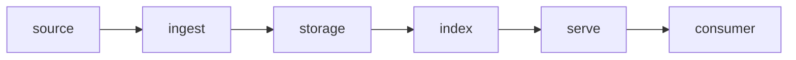

# <场景名>

!!! tip "一句话场景"
    <输入是什么 / 输出是什么 / 中间穿了哪几层>。

## 场景输入与输出

- **输入**：<数据源、事件、用户请求…>
- **输出**：<报表、查询结果、检索结果…>
- **SLO**：<延迟 / 吞吐 / 新鲜度 / 成本>

## 架构总览

## 数据流拆解

1. **Ingest**：<数据如何进入湖>
2. **Storage**：<以什么格式 / 表结构落表>
3. **Index/Compute**：<索引或计算如何构建与刷新>
4. **Serve**：<在线路径的协议、延迟预算>

## 各节点推荐技术

| 节点 | 推荐选择 | 备选 | 取舍 |
| --- | --- | --- | --- |
| <节点 A> | | | |
| <节点 B> | | | |

## 失败模式与兜底

- <1–3 条：常见失败场景及处理>

## 参考实现

- <内部 / 开源的参考代码、架构图、博客>

## 相关

- <链到 related concepts / systems>
