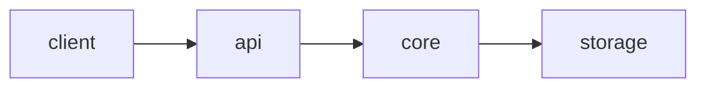

# <系统名>

!!! tip "一句话定位"
    <它是什么 / 它解决了什么 / 它和最接近的同类有什么不同。>

## 它解决什么

<200 字内的问题陈述；不要复制官网首页。>

## 架构一览

<用一段话解释图上节点的职责和关键协议。>

## 关键模块

| 模块 | 职责 | 关键实现点 |
| --- | --- | --- |
| <模块 A> | <一句话> | <值得注意的实现选择> |
| <模块 B> | <一句话> | <同上> |

## 和同类对比（谁更适合什么场景）

<链到 `compare/` 下的对比页；这里只给一两句精炼结论。>

## 在我们场景里的用法

<团队实际的集成方式、为什么选它、现在用到哪些特性。>

## 陷阱与坑

- <1–3 条已知的踩坑点，引用 Issue / 讨论>

## 延伸阅读

- <官方 spec / 关键论文 / 深度博客>
