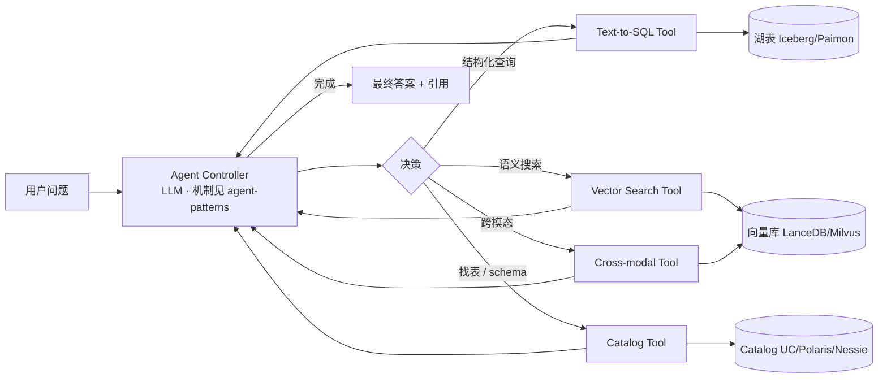

# Agents on Lakehouse · 湖仓专属 Tool 设计

!!! info "本页范围"
    本页只讲 **Agent × 湖仓的独特结合点**：Text-to-SQL tool · 向量 / 元数据 / 跨模 tool · Catalog 集成 · Compute Pushdown。
    **通用 Agent 机制（ReAct / Reflexion / 框架对比 / Memory / Multi-agent / HITL）看 canonical [Agent Patterns](agent-patterns.md)**。
    **业务场景编排看 [scenarios/agentic-workflows](../scenarios/agentic-workflows.md)**。

!!! tip "一句话定位"
    给 LLM 一组**湖仓 tools**（Text-to-SQL · 向量检索 · Catalog 语义搜索 · 跨模查询）· 让 Agent **"问湖"而非只"问私有文档"**。关键差异化：**Tool 接口设计 + 权限透穿 + Compute Pushdown**。

!!! abstract "TL;DR"
    - **核心四类湖仓 Tool**：Text-to-SQL · Vector Search · Catalog / Metadata · Cross-modal
    - **MCP 是首选协议** · Lakehouse MCP Server 让任何 host（Claude Desktop / Cursor / OpenAI Agents）都能问湖
    - **Tool 设计黄金律**：窄 + 有 schema + 有例子 + 有上限 + 权限透穿
    - **Compute Pushdown 思路**：让 Agent 的 query 在**靠近数据**的地方执行
    - **Agent Patterns canonical** · 本页不复述 ReAct / 框架选型 · 只讲湖仓侧集成

## 1. 湖上 Agent 的结构



核心不同于通用 Agent：**tools 都落到湖 / 向量库 / Catalog** · 不是通用 API。

## 2. 湖仓四大 Tool

### Tool 1 · Text-to-SQL

**不能让 Agent 直接生成任意 SQL**（危险：权限 / 慢查询 / 成本）· **必须领域包装**：

```python
@tool
def query_sales(natural_question: str) -> str:
    """
    问销售数据。
    示例：'去年 Q4 华北区 iPhone 销量'、'本周 top 10 商品'

    只能查 prod.sales schema · 自动加时间范围 · 限制返回 10000 行。
    """
    sql = nl2sql(
        natural_question,
        schema=SALES_SCHEMA,
        guardrails={"max_rows": 10000, "allowed_ops": ["SELECT"]},
    )
    return trino.query(sql, user_id=current_user()).to_markdown()
```

**关键点**：
- **领域包装** · 一个 tool 对应一个业务域 schema · 不给"通用 SQL"
- **权限透穿** · 用当前用户 identity 执行 · 行列级 ACL 自然过滤
- **结果限制** · 必须 `LIMIT` · 必须只读
- 详见 [Text-to-SQL 场景](../scenarios/text-to-sql-platform.md)

### Tool 2 · Vector Search

```python
@tool
def search_documents(
    query: str,
    kind: Literal["policy", "tech", "hr", "all"] = "all",
    top_k: int = 5,
) -> list[dict]:
    """
    语义搜索公司文档库。
    用 BGE-M3 多语言 embedding · 自动做 Hybrid（dense + BM25 RRF 融合）。
    """
    return lancedb_client.search(
        query,
        filter=f"kind='{kind}'" if kind != "all" else None,
        limit=top_k,
        user_id=current_user(),  # filter by ACL
    )
```

**湖仓关键**：
- 向量库和湖表**在同一 Catalog 下** · 用户的 ACL 统一
- 返回带 `source_uri` / `snapshot_id` · Agent 可以"回引"原文
- 和 Iceberg 的 [snapshot](../lakehouse/snapshot.md) / [time travel](../lakehouse/time-travel.md) 协同：时间旅行的 doc 能查到对应时段的 embedding

### Tool 3 · Catalog / Metadata Search

**Agent 最大痛点**：不知道湖里有什么表 / 列。

```python
@tool
def find_table(business_description: str) -> list[dict]:
    """
    根据业务描述找到相关湖表。
    内部用 Catalog metadata 语义搜索 · 返回 [table_name, schema, description, sample_rows]。
    """
    return unity_catalog.semantic_search_tables(
        business_description, limit=10, user_id=current_user()
    )

@tool
def describe_table(table_name: str) -> dict:
    """
    返回表结构 · 列说明 · 最近 snapshot 信息 · 样例行。
    """
    ...
```

**前置需求**：
- Catalog 每张表 / 列都有 **description**（LLM 靠这个理解）
- 若没有 · 先做 "column commenting" · 是湖仓 × LLM 的基础投资
- Unity Catalog / Polaris / Nessie 都支持 table comment + column comment

### Tool 4 · Cross-modal Search

湖上放图 / 视频 / 音频时：

```python
@tool
def find_similar_image(image_url: str, top_k: int = 10) -> list[dict]:
    """给一张图 URL · 找相似图片。用 SigLIP embedding · 返回 URI + 相似度。"""
    vec = siglip_encoder.encode_image(image_url)
    return lancedb_client.search(vec, namespace="images", limit=top_k)

@tool
def image_to_table_context(image_url: str) -> dict:
    """
    给一张图 · 返回相关湖表 context（如图对应产品 SKU 的销售数据）。
    跨模检索 → 结构化查询的桥。
    """
    sku = recognize_product(image_url)  # 视觉模型
    return query_sales_by_sku(sku)
```

### Tool 设计黄金律（湖仓特化）

1. **窄而确切** · 一个 tool 对应一个明确业务问题 · 不做"万能 SQL"
2. **schema 清晰** · 参数类型 / 枚举 / 边界 · LLM 靠 schema 选参数
3. **权限透穿** · `user_id=current_user()` · tool 执行在用户身份下 · ACL 自动生效
4. **有限 + 有超时** · `LIMIT N` · `TIMEOUT Ns` · 必须内建
5. **返回 schema 化** · Markdown 表 / JSON · 让 LLM 易于处理 · 不要 blob
6. **带引用元数据** · `source_uri` / `snapshot_id` / `row_count` · 让 Agent 回引 / 审计

## 3. MCP × 湖仓 · 推荐架构

**2025 起 · MCP 是跨 host Agent 工具协议事实标准**（详见 [MCP](mcp.md)）· Lakehouse 应当包装成 MCP Server：

```python
# lakehouse-mcp-server.py
from mcp.server import Server
app = Server("lakehouse-mcp")

@app.list_tools()
async def list_tools():
    return [
        Tool(name="query_sql", description="Query lakehouse (read-only)", ...),
        Tool(name="vector_search", description="Semantic search", ...),
        Tool(name="find_table", description="Find relevant tables", ...),
        Tool(name="describe_table", description="Get schema + stats", ...),
    ]

@app.list_resources()
async def list_resources():
    # 把湖表元数据作为 MCP Resources 暴露
    return [
        Resource(uri=f"iceberg://{t.namespace}/{t.name}",
                 name=t.name, mimeType="application/x-iceberg-table")
        for t in unity_catalog.list_tables()
    ]

@app.call_tool()
async def call_tool(name, arguments):
    # 加入 user_id / snapshot_id 维度 · 走湖仓的 ACL
    ...
```

**价值**：一次实现 · Claude Desktop / Cursor / OpenAI Agents SDK / LangGraph / 自研 agent **都能问你的湖**。

## 4. 和 Compute Pushdown 的关系

"Agent × Lakehouse" 本质上是 [Compute Pushdown](../unified/compute-pushdown.md) 的上层：

- **Compute Pushdown** 说 "把计算推到靠近数据" · Trino / Spark 直接访问湖
- **Agent** 说 "让 LLM 决定做什么计算"
- 合起来："**LLM 决定 → 推到湖上执行**" · 不把大数据回流给 LLM 处理

**具体**：
- Agent 绝不直接把 Iceberg 表数据"倒进 context"处理（token 爆）· 总是推到 SQL 引擎
- 向量搜索也一样 · Agent 只接收 Top-K 结果 · 不接收全库

## 5. 权限与安全 · 湖仓特化

**头等大事**。Agent 自主性 = 出错面放大。

### 湖仓关键边界

- **用户身份透穿** · 每次 tool 调用 · 用户 identity 一路传下去 · 避免 agent 用管理员 token
- **行列级 ACL** · Iceberg / Unity Catalog / Polaris 支持 · agent tool 执行时自动生效
- **MV / 加速副本** · 不能绕过权限（如果 MV 没同步权限 · agent 走 MV 看到越权数据）
- **写操作必须人工确认** · Agent 生成的 `INSERT / UPDATE / DELETE` 不直接跑 · [HITL approval 模式](agent-patterns.md)

### Prompt Injection 来源

湖仓特有注入源：
- **表中存的用户数据**含 "忽略上面所有规则..." · SELECT 出来进 context 就失控
- **MCP Resource / Table description** 被污染

**防御**：
- Tool 返回的用户数据 · **escape / 标记** 为"untrusted content" · 让 LLM 不把它当指令
- 用 [Guardrails](guardrails.md) 对 tool output 过滤

## 6. 典型案例 · Iceberg + Agent

```
用户："帮我分析过去一周销量异常的商品 · 找到可能原因"
  ↓
Agent（Claude + MCP lakehouse server）
  1. find_table("销售数据") → ["prod.sales.orders", "prod.sales.items"]
  2. describe_table("prod.sales.orders") → schema + stats
  3. query_sql("SELECT product_id, DATE_TRUNC('day', ts) AS dt, SUM(amount) AS sales
               FROM prod.sales.orders WHERE ts >= CURRENT_DATE - 7
               GROUP BY product_id, dt
               ORDER BY sales DESC LIMIT 100")
  4. identify_anomaly(结果) → [product_X 异常]
  5. vector_search("product_X 最近评价 / 投诉")
  6. query_sql("SELECT cause_tag, COUNT(*) FROM complaint_log WHERE product_id = 'X' ...")
  ↓
生成报告 + 引用 snapshot + 可视化建议
```

全程：
- **Agent 用的是用户 identity** · 无权的数据访问不到
- **所有查询 push 到 Trino / Spark** · 不拉大表进 context
- **时间旅行语义** · 若用户指定"上周"· 用 `TIMESTAMP AS OF` 语法锁定版本
- **审计**：每次 tool call 写入审计表

## 7. 陷阱（湖仓特化 · 通用陷阱见 agent-patterns）

- **无 Catalog description** · Agent 找不到表 / 不懂列 · 是**最大拦路虎** · 先投资 table/column comment
- **通用 SQL tool**（任意 SQL 执行）· LLM 生成 `DROP TABLE` · 必须领域包装
- **向量库 和 湖仓权限不同步** · Agent 绕过 ACL 从向量库读到敏感 · 要统一 Catalog
- **snapshot 不锁**：Agent 多步查询跨 snapshot · 结果前后不一致 · 用 [time travel](../lakehouse/time-travel.md) 锁定
- **Agent 返回整表**：return `SELECT * FROM big_table` · 崩 context · 必须 LIMIT
- **无 MCP 抽象** · Agent 代码和 LLM 栈耦合 · 换模型需重写工具 · 用 MCP 标准化
- **不用 Compute Pushdown** · Agent 把湖数据拉到 Python 处理 · 慢 10-100× · 正确做法是 SQL 里完成
- **Tool Poisoning** · 湖里某条数据含 prompt injection · Agent 被"越权" · Guardrails 必须对 tool output 过滤

## 8. 横向对比 · 延伸阅读

- [Agent Patterns](agent-patterns.md) —— 通用 Agent 机制（canonical）
- [MCP](mcp.md) —— 首选跨 host tool 协议
- [Compute Pushdown](../unified/compute-pushdown.md) —— 推计算 vs 拉数据
- [跨模态查询](../unified/cross-modal-queries.md) —— 跨模 tool 的底层
- [Text-to-SQL 场景](../scenarios/text-to-sql-platform.md) —— Text-to-SQL tool 的端到端
- [Agentic Workflows 场景](../scenarios/agentic-workflows.md) —— L1/L2/L3 成熟度 + 业务编排
- [安全与权限](../ops/security-permissions.md) —— 湖仓 ACL 基础

### 权威阅读

- **Anthropic** [*Building Effective Agents*](https://www.anthropic.com/engineering/building-effective-agents)
- **[Model Context Protocol 官方](https://modelcontextprotocol.io/)**
- **[Databricks Unity Catalog + Agents](https://www.databricks.com/blog)**
- **[LangGraph Lakehouse integration examples](https://langchain-ai.github.io/langgraph/)**

## 相关

- [Agent Patterns](agent-patterns.md) · [MCP](mcp.md) · [Compute Pushdown](../unified/compute-pushdown.md) · [跨模态查询](../unified/cross-modal-queries.md)
- [RAG](rag.md) · [Text-to-SQL 场景](../scenarios/text-to-sql-platform.md) · [Agentic Workflows 场景](../scenarios/agentic-workflows.md)
- [Unity Catalog](../catalog/unity-catalog.md) · [Polaris](../catalog/polaris.md) · [Nessie](../catalog/nessie.md)
