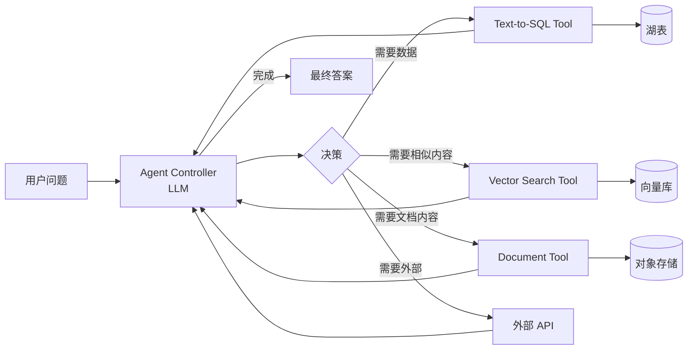

# Agents on Lakehouse

!!! tip "一句话理解"
    给 LLM 一组**工具**（检索 / SQL / 向量查询 / 外部 API），让它**自主决定**调用顺序完成任务。把湖仓能力作为 Agent 的 tool box 暴露出来，就得到"能问湖的 AI"。

!!! abstract "TL;DR"
    - Agent = **LLM + 一组 tools + 一个控制循环**
    - 湖上 Agent 的核心 tool：**Text-to-SQL、向量检索、文件访问、Catalog 查询**
    - **Tool 的接口设计**决定 Agent 质量：好的 tool 自带 schema、例子、边界
    - **评估难度 > RAG**：多步骤、中间步可错、最终目标可多样
    - 安全 / 权限 / 成本**必须先想好**再上线

## 典型 Agent 架构



## 湖上 Agent 的几个典型 Tool

### 1. Text-to-SQL

```python
@tool
def query_sales(natural_question: str) -> str:
    """
    问销售数据。示例：'去年 Q4 华北区域的 iPhone 销量'
    只能查 sales 表。
    """
    sql = nl2sql(natural_question, schema=SALES_SCHEMA)
    return spark.sql(sql).to_markdown()
```

Agent 不直接生成任意 SQL（危险），而是**包装成领域工具**。

### 2. Vector Search

```python
@tool
def search_documents(query: str, kind: str = "all", top_k: int = 5) -> list[dict]:
    """
    语义搜索公司文档库。
    kind: 'policy' | 'tech' | 'all'
    """
    return lancedb.search(query, filter=f"kind='{kind}'", limit=top_k)
```

### 3. Catalog / Metadata Query

```python
@tool
def find_table(description: str) -> list[str]:
    """
    根据业务描述找到可能相关的湖表。
    """
    return catalog.semantic_search_tables(description, limit=10)
```

### 4. Cross-modal

```python
@tool
def find_similar_image(image_url: str, top_k: int = 10) -> list[str]:
    """给一张图 URL，找相似图片"""
    vec = encode_image(image_url)
    return lancedb.search(vec, limit=top_k)
```

## Tool 设计的几条原则

1. **名字 + docstring 要直接描述"什么时候用"** —— LLM 选工具靠这个
2. **参数要有类型 + 例子** —— schema 越清楚越准确
3. **返回值要有 schema** —— Markdown 表格 / JSON 结构化，让 LLM 能进一步处理
4. **越窄越好** —— 一个 tool 只做一件事；不要"通用 SQL"
5. **有边界 / 有限制** —— 每次调用耗资源的 tool 要内置 limit

## Agent 控制循环

### ReAct（Reason + Act）

经典模式：

```
Thought: 我需要先查销售数据
Action: query_sales("去年 Q4 华北 iPhone 销量")
Observation: [表格结果]
Thought: 数据有了，现在计算增长率
Action: query_sales("去年 Q3 华北 iPhone 销量")
Observation: [表格结果]
Thought: 我可以算增长率了
Action: finish
Answer: 增长 23%
```

### Plan-and-Execute

先让 LLM 列出**全部步骤计划**，再逐步执行。适合复杂任务。

### Function Calling（现代）

OpenAI / Claude 的 function calling = structured tool use，不再靠纯文本解析。**生产推荐这条**。

## 和 Compute Pushdown 的关系

"Agents on Lakehouse" 本质就是 [Compute Pushdown](../unified/compute-pushdown.md) 的上层应用：

- Compute Pushdown 说 "把计算推到靠近数据的地方"
- Agent 说 "把决策也交给 LLM"
- 合起来："LLM 在湖边自己决定要做哪些计算"

## 评估难度

Agent 评估比 RAG 难：

- 多步骤，中间可错
- 最终成功有多条路径
- 调用哪些 tool、调用顺序、效率都是维度

**可落地的评估**：

- **Task success rate**：最终结果对不对（可能要人工）
- **Tool call accuracy**：每一步调用的 tool 是否合理
- **Step efficiency**：平均多少步完成
- **Cost per task**：LLM token + tool 执行资源

## 安全 / 权限

**头等大事**。Agent 有自主性 = 出错面放大。

- **Tool 权限分级**：读 vs 写 vs 破坏性；后两者必须人工确认
- **查询超时限制** + **结果大小限制** 防止扫大表
- **沙箱执行**：Agent 生成的代码 / SQL 不直接跑生产
- **Prompt injection 防御**：工具返回的数据可能含"忽略上述规则…"之类 —— 输出要 escape
- **Audit 日志**：Agent 每次调用 tool 都记

## 陷阱

- **Tool 太多** —— LLM 选不准（通常 < 10 个工具）
- **Tool 名字重复 / 模糊** —— 选择错乱
- **不限步数** —— 无限循环 $10/次
- **没限制结果规模** —— `SELECT *` 刷屏
- **权限透传到 LLM** —— 一个用户的 Agent 查到另一个用户的数据

## 相关

- [RAG](rag.md)
- [Compute Pushdown](../unified/compute-pushdown.md)
- [跨模态查询](../unified/cross-modal-queries.md)
- [安全与权限](../ops/security-permissions.md)

## 延伸阅读

- *ReAct: Synergizing Reasoning and Acting in Language Models*（2022）
- LangChain Agents: <https://python.langchain.com/docs/modules/agents/>
- LlamaIndex Agents: <https://docs.llamaindex.ai/en/stable/module_guides/deploying/agents/>
- Anthropic *Computer Use* / *Tool Use* 文档
