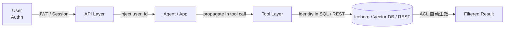

# AI App Authorization · 权限 · 租户 · Identity 流转

!!! tip "一句话定位"
    **AI 应用的高代价事故 · 多数不是"模型说错话" · 而是"权限没做透"**——Agent tool 拿到不该拿的凭据 · RAG 召回跨越了 ACL · Cache / Log 串租户 · Agent 用管理员身份跑。[Guardrails](guardrails.md) 管的是**模型侧输入输出** · **本页管"谁能访问什么"**——AI app 的**授权模型**。

!!! abstract "TL;DR"
    - **真实事故分布**：模型越权 < 工具越权 < **ACL 不透穿 > tenant 数据串**
    - **4 类权限面**：**Tool ACL**（Agent 能调什么）· **Data ACL**（RAG / SQL 看什么）· **Cache 隔离**（Semantic Cache · Prompt Cache）· **Log / Eval 隔离**（trace 数据租户边界）
    - **核心原则**：**Identity 一路透穿 · 不在 LLM 前终止**——user_id → API → Agent → Tool → 数据
    - **反原则**：Agent 用 **shared credential** 跑 · ACL 在 prompt 里声明 · Cache key 不含 user
    - **实现依赖**：Unity Catalog / Polaris / Iceberg 行列级 ACL + MCP 用户上下文传递 + 应用层 middleware
    - **和 [Guardrails](guardrails.md) 分工**：Guardrails 防模型乱说 · **Authorization** 防 **访问越权**

!!! warning "边界"
    - **Guardrails**（Prompt Injection / PII / Moderation）→ [guardrails](guardrails.md)
    - **湖仓表格式的 ACL 机制**（Iceberg 行列级 / UC 权限模型）→ [catalog/](../catalog/index.md)
    - **Agent × 湖仓 tool 权限透穿**（一个场景应用）→ [agents-on-lakehouse](agents-on-lakehouse.md)
    - **本页专注**：AI app 视角的**授权契约 + 租户隔离 + identity 流转**

## 1. 业务痛点 · AI app 的高代价事故

### 典型事故类型

| 事故 | 频率 | 损失 | 根因 |
|---|---|---|---|
| Agent 用 admin token 跑 · 被 prompt injection 诱导删库 | 🔥🔥 | 极高 | 无最小权限 · 无 HITL |
| RAG 召回别人的文档（ACL 没透穿）| 🔥🔥🔥 | 高（GDPR / 合规）| 向量库没按 user 过滤 |
| Semantic Cache 跨用户命中 · 返回别人的 PII | 🔥 | 高 | Cache key 不含 user |
| Logs / Eval 数据跨租户串 · 被竞品看到 | 🔥 | 高（信任崩塌）| 多租户表共用 · 未按 tenant 分区 |
| Agent tool 权限过大（read_only 但挂了 write API）| 🔥🔥 | 中高 | tool schema 声明和实际不符 |

**结论**：生产 AI 应用中 · **授权问题比模型输出问题高代价**。但关注度远不如 Moderation / Injection。

### 为何比传统 App 更难

- **Identity 链路加长**：user → API → **LLM / Agent**（规划）→ Tool → 数据
- LLM 是**不可信的中介**：prompt injection 后 LLM 可能"自发"调到不该的 tool
- **Memory / Cache 是共享层**：跨会话 · 跨用户 · 跨租户 · 稍不注意就泄
- **Log / Trace 含 prompt + response**：天然含 PII · 保留期长 · 跨团队可见

## 2. 四大权限面

### 面 1 · Tool ACL（Agent 能调什么）

Agent 有一组 tools · **不是每个 user 都能调所有 tool**。

```python
# 错：Agent 固定工具集 · 所有 user 一样
tools = [query_sales, delete_records, send_email]

# 对：按 user 权限过滤
def get_tools_for_user(user_id):
    perms = get_permissions(user_id)
    all_tools = {
        "query_sales": query_sales,
        "delete_records": delete_records,   # 只有 admin 给
        "send_email": send_email,
    }
    return [t for name, t in all_tools.items() if perms.can_use(name)]
```

**实施**：
- Tool 声明层带 `required_permissions: ["sales.read"]`
- Agent 组装前过滤 · LLM 看到的 tool list 已是"user 能用的子集"
- **MCP 2025-11 spec** 开始讨论 tool 权限声明（仍在演进 · 2026-Q2 未 stable）

### 面 2 · Data ACL（RAG / SQL 看什么）

**最容易漏**：

```python
# 错：RAG 无 user filter
def retrieve(query):
    return vector_db.search(query, top_k=10)  # ❌ 全库搜

# 对：带 user filter
def retrieve(query, user_id):
    return vector_db.search(
        query,
        top_k=10,
        filter=user_acl_filter(user_id),  # 行级过滤
    )
```

**湖仓侧实施**：
- **Iceberg 行级 / 列级 ACL**（通过 Unity Catalog / Polaris / Lake Formation）
- Query 在 user identity 下执行 · ACL 在引擎层自动生效
- **向量库**：Metadata filter 按 user / tenant · 不是应用层过滤

**错误模式**：
- "加个 WHERE 就行" —— 如果 LLM 生成的 SQL 能绕过 WHERE · 权限没意义
- 必须**执行层过滤** · 不依赖 LLM 写对

### 面 3 · Cache 隔离（Semantic / Prompt）

[Semantic Cache](semantic-cache.md) 按 query embedding 命中 · **不注意会跨用户串**：

```python
# 错：cache key 只有 query
cache_key = hash(query)  # user_A 的 PII 可能被 user_B 查到

# 对：cache key 含 user + tenant
cache_key = hash(f"{tenant_id}:{user_id}:{query}")
# 或按 ACL 维度
cache_key = hash(f"{acl_version}:{query}")  # ACL 变则 cache 失效
```

**Prompt Caching**（系统级 KV cache · Anthropic / OpenAI）：
- **Provider 层**隔离 · 按 account 不跨租户
- 但**内部 team 之间**·要确保 team-key 隔离

### 面 4 · Log / Eval 数据隔离

```python
# Trace 表含 prompt + response
CREATE TABLE llm_traces (
    trace_id ...,
    tenant_id ...,      # 必须有 · 用于过滤
    user_id ...,        # 必须有（脱敏）
    prompt TEXT,        # 可能含 PII
    response TEXT,      # 可能含 PII
    ...
)
```

- **按 tenant 分区或分表** · 查询时强制 filter
- **Eval 数据（golden set）** 同样风险 · 一个 team 的评估集不能被另一个 team 看
- 保留期策略：**14-30 天** 通常 · 合规场景按规范更短或更长

## 3. Identity 流转 · 核心原则

**链条**：`user_identity → api layer → agent / app → tool / data access`

**原则**：**身份不在任何一层被替换 · 直到最底层的数据 query**。



### 反模式（最常见）

❌ **Agent 跑 with admin credential** · 说"我信任 LLM 会按 user 要求行事"
- LLM 被 prompt injection 就越权
- 审计追溯不到谁

❌ **Identity 在 LLM prompt 里声明**
- `"You are acting on behalf of user_42, restrict to their data"`
- LLM **可能忽略** · 不是硬约束

❌ **Service account 调 LLM · 没用户维度**
- 所有 API call 看起来都是 service 在调 · cost 无法归因

### 正模式

✅ **Identity 以 technical identifier 传递**（JWT claim · STS credential · impersonation token）
- 每个 tool call 带 user principal
- SQL 执行用 user 身份（Trino · Spark 支持）
- 向量库 query 带 user metadata filter

✅ **Credential Vending**（类似 [Polaris](../catalog/polaris.md) 机制）
- Agent 获取**短期 scoped credential**（15min TTL）
- 不持有长期密钥
- 权限最小 · 审计每次发放

✅ **Agent Sandbox 执行**
- 写操作走 **HITL approval**（见 [agent-patterns](agent-patterns.md)）
- 审计每个 tool call（谁 · 何时 · 什么 tool · 什么参数 · 返回什么）

## 4. Multi-Tenant 模式

SaaS AI app 几乎必须 multi-tenant。**三种隔离级别**：

| 级别 | 做法 | 优 | 劣 |
|---|---|---|---|
| **Row-level isolation**（同表按 tenant_id 过滤） | 所有表加 tenant_id · query 强制 WHERE | 成本低 · 管理方便 | 风险：漏写 WHERE 就串 |
| **Schema-level**（每 tenant 一个 schema / namespace） | Iceberg namespace 按 tenant · Vector collection 按 tenant | 物理隔离强 · 配额独立 | schema 膨胀（1000 tenants = 1000 schemas） |
| **Database / Cluster-level**（专用资源） | 大 tenant 独立 DB / 集群 | 最强隔离 · 独立 SLA | 成本高 · 运维重 |

**典型组合**：
- 默认 row-level
- 重要客户升到 schema-level
- Enterprise 大客户走 cluster-level

### 注意力点

- **Vector collection 按 tenant**：Milvus / LanceDB 的 collection 是天然隔离边界
- **Agent memory 按 tenant**：Letta / ReMe 的 memory store 要分 tenant
- **Log / Eval 按 tenant**：前面讲的

## 5. 实施参考

### 湖仓侧

- [Unity Catalog](../catalog/unity-catalog.md) · 多层 RBAC · 行列级
- [Polaris](../catalog/polaris.md) · Credential Vending · 短期 token
- [Nessie](../catalog/nessie.md) · Git-like 分支 + 权限
- [Iceberg](../lakehouse/iceberg.md) · 行列级（通过 Catalog 实施）

### Agent / LLM 侧

```python
# 典型 middleware 模式
class AuthMiddleware:
    def before_agent_run(self, user_id, tools_requested):
        # 过滤 user 无权的 tool
        return [t for t in tools_requested if self.can_use(user_id, t)]

    def before_tool_call(self, user_id, tool_name, args):
        # 注入 user context · 记录 audit
        args["__user_context"] = user_id
        self.audit_log(user_id, tool_name, args)
        return args

    def after_tool_call(self, user_id, tool_name, result):
        # PII 脱敏 / 敏感信息审查
        return sanitize(result, user_id)
```

### MCP 权限（2026 仍演进）

MCP 2025-11 spec 有 `roots` / `tools` 权限声明 · 但**生态落地参差**：
- Server 声明 `required_scopes`
- Host 根据 user 授予对应 scope
- 实现差异大 · 2026-Q2 未标准化

## 6. 陷阱与反模式

- **Agent with admin creds** · 极危险 · 必须最小权限
- **ACL 在 prompt 里声明** · 非硬约束 · LLM 可忽略
- **RAG 不做 metadata filter** · 召回跨 user · GDPR 事故
- **Semantic Cache 不含 user 在 key 里** · 跨用户串
- **Agent tool schema 和实际实现不符** · 声明 `read_only` 实则 write · 灾难
- **Log / trace 不按 tenant 分区** · 一次 SQL 跨租户查（或被查）
- **Credential 长期化** · Agent 持有长期 key · 被泄等于失去一切
- **没有 audit log** · 事故追溯不到
- **HITL 不强制** · 写操作 bypass · 高风险
- **Credential Vending 没有 scope limit** · 短期 token 实际权限过大

## 7. 相关

- [Guardrails](guardrails.md) —— 模型侧防护 · 和本页互补
- [Agents on Lakehouse](agents-on-lakehouse.md) —— 湖仓 Agent 权限的应用面
- [Agent Patterns](agent-patterns.md) —— HITL approval 模式
- [Semantic Cache](semantic-cache.md) —— Cache 隔离机制
- [LLM Observability](llm-observability.md) —— audit log 落地
- [Unity Catalog](../catalog/unity-catalog.md) · [Polaris](../catalog/polaris.md) · [Nessie](../catalog/nessie.md)
- [安全与权限](../ops/security-permissions.md) —— 湖仓基础 ACL
- [ops/compliance §4]((../ops/compliance.md) —— 法规层（EU AI Act 等）

## 延伸阅读

- **[OWASP LLM Top 10](https://owasp.org/www-project-top-10-for-large-language-model-applications/)** —— LLM 安全全景
- **[Databricks Unity Catalog · Data Governance](https://www.databricks.com/product/unity-catalog)**
- **[Apache Polaris · Credential Vending](https://polaris.apache.org/)**
- **[AWS Lake Formation](https://aws.amazon.com/lake-formation/)** —— 行列级 ACL 参考
- **Anthropic** [Agent safety best practices](https://www.anthropic.com/engineering/building-effective-agents)
