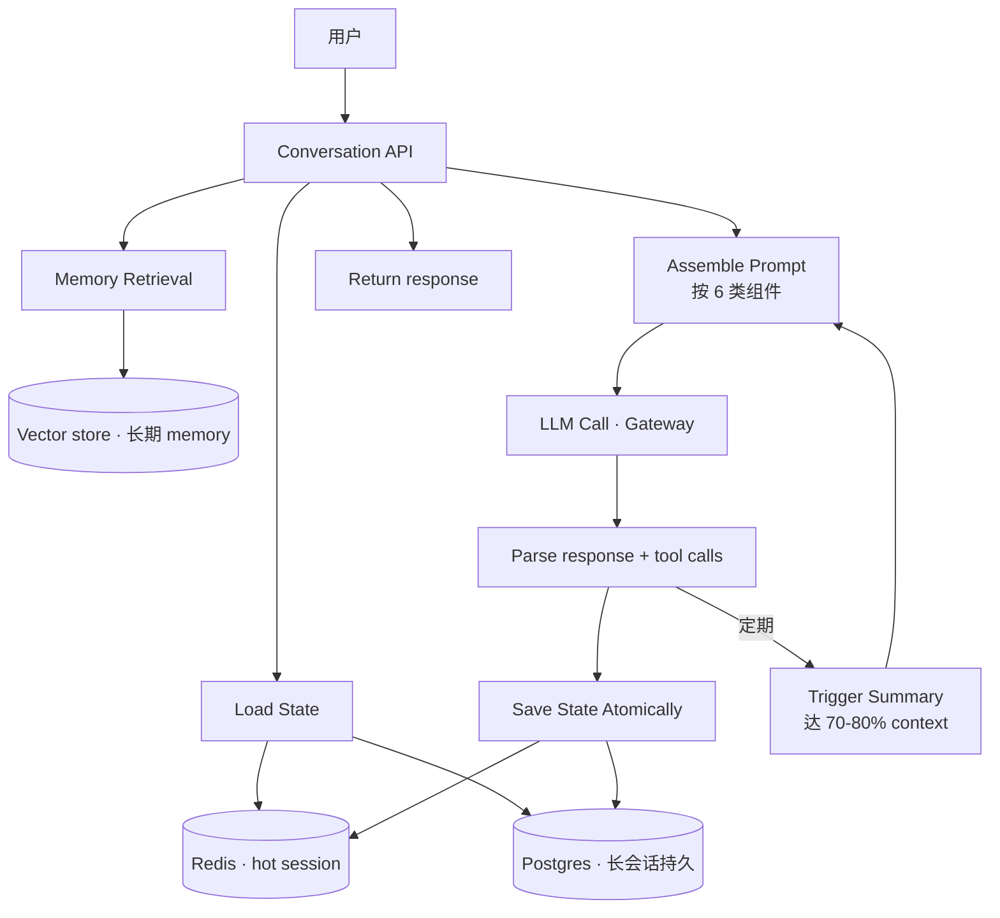

# Conversation Lifecycle · 会话状态与多轮对话工程

!!! tip "一句话定位"
    **LLM 天然无状态 · 每次请求都从零开始**。多轮对话是工程"**骗出来的**"——把历史消息 / 工具结果 / 用户上下文 / 记忆检索 拼成新 prompt · 每轮重来一次。问题是：历史越长越贵越慢越遗忘重点。本页讲**会话生命周期契约**：state 怎么存 · history 怎么裁 · 何时总结 / 检索 / 丢弃 · short-term 和 long-term memory 的分工。

!!! abstract "TL;DR"
    - **会话状态 ≠ LLM 状态**：LLM 无状态 · 状态全在你的应用层
    - **6 类消息组件**：system prompt · 历史对话 · tool 结果 · 检索 context · 用户画像 · scratchpad
    - **3 种 history 策略**：**Full**（短对话）· **Sliding Window**（保最近 N 轮）· **Summary + Recent**（超长会话主流）
    - **2026 Memory 分层**：LIGHT 框架经典分层 · episodic（长期 · 全对话检索）+ working（近期完整）+ scratchpad（推理笔记）
    - **Letta / ReMe 框架**：OS 风格分层 memory · 主 context 作 RAM · 外部存储作 disk
    - **工程要点**：Prompt Caching 命中率 · 裁剪触发点（70-80% context capacity）· 中断恢复 · checkpoint
    - **和 [Agent Patterns](agent-patterns.md) Memory 分工**：Agent Memory 讲"**Agent 要不要记住**" · 本页讲"**会话怎么组织**"

!!! warning "边界"
    - **Agent 的 Memory 机制**（Short/Long/Episodic/Procedural 四类）→ [Agent Patterns §3 Memory](agent-patterns.md)
    - **Prompt 模板版本化**（存哪 · 谁改 · 评估）→ [Prompt 管理](prompt-management.md)
    - **Prompt Caching**（KV cache 级缓存）→ [Semantic Cache](semantic-cache.md)
    - **本页专注**：**会话级 state 组装** + **多轮 prompt 组装** + **长对话 history 管理**

## 1. 业务痛点 · LLM 无状态的现实

### 朴素实现的崩溃

```python
# 朴素 · 只发当前消息
for user_msg in user_inputs:
    reply = llm.chat([{"role": "user", "content": user_msg}])
```

- LLM **每次都从零开始** · 不知道"刚刚你说的"
- 体验：用户问 "它（上轮提到的某产品）多少钱" → LLM 不知道"它"是啥

### 真实多轮 · 状态全在你这边

```python
history = []  # 你的责任 · 不是 LLM 的
for user_msg in user_inputs:
    history.append({"role": "user", "content": user_msg})
    reply = llm.chat([system_msg] + history)
    history.append({"role": "assistant", "content": reply})
```

**问题马上来**：
- 10 轮后 · history 可能 5000 tokens · 成本累加
- 50 轮后 · history 超 context · 报错或丢信息
- 100 轮后 · 即使装得下 · **"Lost in the Middle"** · LLM 忽略中间信息
- 一天后回来继续 · 状态在哪？Redis？数据库？如何恢复？

这些都是**会话生命周期工程**要回答的问题。

## 2. 会话状态构成

**6 类组件 · 每次 LLM 调用时组装**：

```
┌──────────────────────────────────┐
│ 1. System Prompt（角色 · 禁令 · 工具声明）│
├──────────────────────────────────┤
│ 2. Few-shot / 业务规则示例（可选）  │
├──────────────────────────────────┤
│ 3. 长期 Memory 检索结果（用户偏好 / 历史结论）│
├──────────────────────────────────┤
│ 4. 近期 History（最近 N 轮 user/assistant）│
├──────────────────────────────────┤
│ 5. Tool Results（当轮检索到的 docs · SQL 结果 · API 返回）│
├──────────────────────────────────┤
│ 6. User Query（当前一问）           │
└──────────────────────────────────┘
```

每个组件有**不同的生命周期 · 不同的存放 · 不同的剪裁策略**：

| 组件 | 生命周期 | 典型存放 | 每轮重取？ |
|---|---|---|---|
| System Prompt | 版本化 · 部署级 | Git / Prompt Registry | ❌ 不变 |
| Few-shot | 版本化 | Git / Prompt Registry | ❌ 不变 |
| 长期 Memory | 持久 | Vector store / KV DB | ✅ 检索 |
| History | 会话级 | Redis / Postgres | ✅ 全部或裁剪 |
| Tool Results | 当轮 | In-memory | ✅ 新生成 |
| User Query | 一次性 | — | ✅ |

## 3. History 裁剪 · 三种策略

### 策略 A · Full History（完整历史）

```python
messages = system + full_history + [{"role": "user", "content": query}]
```

- **优**：最全 · LLM 看得见一切
- **劣**：tokens 爆 · 成本高 · 长对话超 context
- **适用**：短对话（< 20 轮）· 不差钱场景

### 策略 B · Sliding Window（滑动窗口）

```python
WINDOW = 10  # 最近 10 轮
messages = system + history[-WINDOW*2:] + [user_query]
```

- **优**：tokens 稳定 · 成本可预测
- **劣**：远程信息丢失 · 用户说过的约束被遗忘
- **适用**：短上下文相关（问答 / 客服）· 长程依赖弱

### 策略 C · Summary + Recent（总结 + 近期）· 主流

```
[summary of early conversation (LLM-generated)]
+
[last N turns in full fidelity]
+
[current query]
```

- **触发点**（常用启发）：达到 **70-80% context capacity** 时 · LLM 生成前 M 轮的 summary · 用 summary 替代 M 轮 · 保留最近 N 轮全文
- **优**：兼顾长短期 · tokens 可控
- **劣**：summary 有损 · summary 质量依赖 LLM
- **适用**：长对话应用（教练 / 研究助手 / 长工单）· **2026 主流路径**

### 策略 D · 混合（Summary + Retrieval + Recent）· LIGHT 框架

```
[relevant past conversations retrieved by vector similarity]  ← Episodic memory
+
[summary of mid-session]
+
[last N turns full]
+
[current query]
```

- **LIGHT 框架**（学术 / 2025+）：三层记忆 · episodic（长期检索）+ working（近期完整）+ scratchpad（推理笔记）
- **优**：远程语义相关的片段也能拉回来 · 不靠粗糙 summary
- **劣**：实现复杂 · 需要向量化所有历史
- **适用**：高级会话 agent · 重度生产应用

## 4. 2026 Memory 框架

实现策略 C / D 的几个框架：

| 框架 | 层级架构 | 特色 | 开源 |
|---|---|---|---|
| **LangChain Memory** | ConversationBufferMemory · SummaryMemory · EntityMemory · KnowledgeGraphMemory | 4 种 memory 类型 · 每种单独选择 | ✅ |
| **LangGraph Checkpointing** | State 自动持久化 · time travel 支持 | 恢复 / 回放友好 | ✅ |
| **Letta（原 MemGPT）** | OS 分层：main context（RAM）+ archival（Disk）· LLM 自己决定 paging | "无限"context 感 · 主流实现 | ✅ |
| **ReMe** | 自动压缩 / 召回 / 持久化旧会话 | 轻量 · 透明集成 | ✅ |
| **Mem0** | User-centric memory · 跨会话学习用户偏好 | 个人助手场景 | ✅ |
| **Zep** | 长期 memory + 知识图谱 | 商业 + 开源版 | 部分 |

### 选型

- **简单应用**：LangChain ConversationSummaryMemory 足够
- **需要 checkpoint / 可回放**：LangGraph Checkpointing
- **长对话 · 要"无限记忆"感**：Letta
- **用户级 memory**（助手记住"我是 vegetarian"）：Mem0 / Zep
- **自己造**：基础 Redis + LLM summary + 向量库足以起步

## 5. 多轮对话工程要点

### Prompt Caching 命中率（关键省钱）

**System prompt / 工具声明放最前** · 这部分**每轮完全相同** · 命中 [Anthropic / OpenAI Prompt Caching](semantic-cache.md)：

```
┌─ [可缓存前缀]
│  System prompt
│  Tool schemas
│  Few-shot examples
│  长期 memory（本次不变）
├─ [每轮变]
│  近期 History
│  Tool results
│  User query
└─
```

- Anthropic 2024-08 Prompt Caching · 命中**减 90% input token**
- 设计 prompt 时**稳定内容放前 · 动态内容放后** · 命中率飙升

### Context 容量规划

```
模型 context = 200k tokens（Claude / GPT-4）
预算分配：
  system + tools + few-shot    ~5k
  长期 memory 检索              ~3k
  近期 history                  ~20k
  当轮 tool results / context   ~10k (RAG 时更大)
  user query                    ~1k
  LLM response 预留             ~4k
  ─────────────────
  共计                          ~43k（留 80% 头空间）
```

到 **70-80%** 触发 history 压缩 / summary。

### 中断恢复 / Checkpoint

生产场景：
- 用户对话到一半关机 · 第二天回来要接上
- Agent 长任务跑到一半挂了 · 要 resume

**解法**：每轮对话后**原子持久化**完整 state：

```python
# LangGraph 自带
from langgraph.checkpoint.postgres import PostgresSaver

checkpointer = PostgresSaver(...)
graph = workflow.compile(checkpointer=checkpointer)

# 每次 invoke 自动存 · 用 thread_id 恢复
config = {"configurable": {"thread_id": "user-42"}}
result = graph.invoke(state, config=config)
```

**自建**：Redis / Postgres + 版本化 state schema · 关键是**schema migration**（state schema 变了 · 旧会话怎么办）。

### 用户画像 / User State

- 独立于 conversation · 跨会话持久
- 存：偏好（语言 / 详细度 / 领域）· 历史重要事实 · 权限 / 租户
- 组装 prompt 时注入相关部分
- **Mem0 / Zep** 是这个场景的专用框架

## 6. 典型生产架构



## 7. 陷阱与反模式

- **把 history 全塞 prompt** · 长对话必崩 · 必须裁剪或总结
- **只用 Sliding Window** · 用户说"记住我叫 Alice"几轮后就忘 · 需要 summary 或 user profile
- **Summary 质量不监控** · 用小模型总结丢关键信息 · 下游回答错 · 关键信息丢失需告警
- **System prompt 放 history 里** · 不享受 Prompt Caching · 每轮都重算
- **User state 和 conversation state 混存** · 跨租户泄漏风险 · 一定分开
- **无 thread_id / session_id** · 多用户并发搞混 · 必须唯一标识
- **不做 schema migration** · state 结构改了 · 旧会话 deserialize 崩
- **裁剪触发点固定**（如"20 轮后"）· 不看 token 实际占比 · 触发过早或过晚 · 应按 token 百分比
- **Memory 无限堆** · 长期 memory 越长召回质量反降 · 必须淘汰 / 压缩
- **Checkpoint 不原子**：存了 user message 没存 assistant reply · 恢复时重复回答
- **LLM 自己 summarize 没做 eval** · summary 越来越偏 · 定期抽查
- **把 scratchpad / 推理笔记也 persist** · 浪费存储 · scratchpad 是当轮的

## 8. 和其他章节分工

| 主题 | 章节 |
|---|---|
| 会话 lifecycle · history 裁剪 · state 组装 | **本页** canonical |
| Agent Memory 四类（Short/Long/Episodic/Procedural）| [Agent Patterns §3](agent-patterns.md) |
| Prompt 版本 · 模板管理 · DSPy | [Prompt 管理](prompt-management.md) |
| Prompt Caching（KV 级）· Semantic Cache | [Semantic Cache](semantic-cache.md) |
| LLM context window 限制 · 工程影响 | [LLM Inference · Long Context 段](llm-inference.md) |
| 评估 session 质量 | [RAG 评估](rag-evaluation.md) + 自定义 |

## 9. 延伸阅读

- **[LangChain Memory 概念](https://docs.langchain.com/oss/python/concepts/memory)**
- **[LangGraph Checkpointing](https://langchain-ai.github.io/langgraph/concepts/persistence/)**
- **[Letta (MemGPT)](https://www.letta.com/)** · **[GitHub](https://github.com/letta-ai/letta)**
- **[ReMe · AgentScope Memory Kit](https://github.com/agentscope-ai/ReMe)**
- **[Mem0](https://github.com/mem0ai/mem0)** · **[Zep](https://www.getzep.com/)**
- **[A Survey on LLM Multi-turn Dialogue Systems (2025)](https://dl.acm.org/doi/full/10.1145/3771090)**
- **[*Lost in the Middle* (Liu et al., 2023)](https://arxiv.org/abs/2307.03172)**
- **Redis AI** [Context Window Overflow in 2026 博客](https://redis.io/blog/context-window-overflow/)

## 相关

- [Agent Patterns](agent-patterns.md) · [Prompt 管理](prompt-management.md) · [Semantic Cache](semantic-cache.md) · [LLM Inference](llm-inference.md) · [RAG](rag.md) · [LLM Observability](llm-observability.md)
