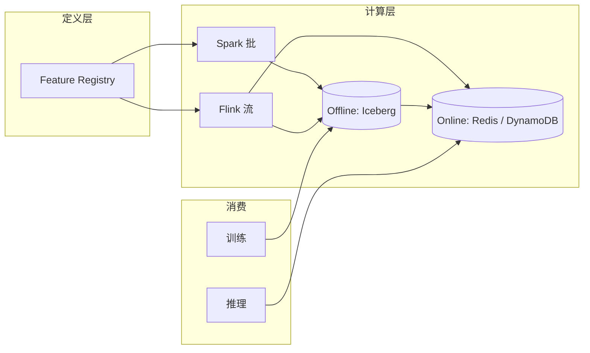

# Feature Store（特征存储）

!!! tip "一句话理解"
    把**机器学习特征作为一等资产管理**：同一份特征定义**同时**服务"离线训练"和"在线推理"，解决了"训练时对、上线后漂"的头号老病。

## 它解决什么

ML 系统最经典的痛点：**训练特征和线上特征不一致（train-serve skew）**。

- 离线 SQL 写的特征在 Hive 跑出来的值
- 线上系统用 Java 重写一版，实时算
- 两条路逻辑看似一样，结果几周后开始漂移
- 模型效果悄悄退化，很难归因

Feature Store 的主张：**特征只定义一次，平台负责让它离线可批计算、在线可低延迟读，且严格对齐**。

## 核心能力

1. **特征注册** —— `feature` 是一等对象（名字、类型、owner、TTL、计算逻辑）
2. **离线存储** —— 通常就是湖表（Iceberg / Delta / Paimon），批训练直接拉
3. **在线存储** —— KV 存储（Redis / DynamoDB / Cassandra），推理时毫秒级查
4. **Point-in-Time Correct Join** —— 训练样本拉特征时按事件时刻取值，避免"用未来特征预测过去"
5. **特征流水线**：批算 → 同步到在线；流算 → 双写
6. **特征共享 / 复用** —— 团队 A 造的特征团队 B 能用

## 典型架构

## 和湖仓的关系

现代 Feature Store 几乎都把**离线层就放在湖表**上：

- Paimon / Iceberg 做 offline feature 事实表
- Flink CDC + Paimon 做流式特征
- 训练框架直接读 Parquet / Iceberg

Feature Store 本身成为"定义 + 协调"层，不必自己造存储。这也是 **Feast** 和 **Tecton** 的主流路线。

## 主流实现

- **Feast**（OSS）—— 最轻量，定义 + Python SDK + 多种在线 store 适配器，湖上常见选择
- **Tecton**（商业）—— Feast 作者公司；完整端到端、强事件时间 Point-in-Time
- **Databricks Feature Store** —— 绑定 Databricks，和 Unity Catalog / Delta 深度集成
- **SageMaker Feature Store** —— AWS 原生

## 在多模场景下的扩展

多模系统也需要 Feature Store 的思维，只是"特征"变宽：

- 传统 ML 特征：`user_click_count_7d`
- 多模特征：`user_last_image_embedding`、`user_preferred_topic_vec`
- 这些向量特征依然需要**离线 + 在线**一致、**Point-in-Time 可回放**

湖上 Iceberg 明细 + Lance 向量 + 在线 KV 三件套，是"多模 Feature Store"的自然形态。

## 陷阱与坑

- **不 Point-in-Time 的 Join** —— 训练集泄露未来信息，是排名第一的"上线大跌"元凶
- **在线 / 离线特征代码两份** —— 用 SDK 定义一份、平台负责双发
- **特征 TTL 管理**：在线 store 没 TTL 就内存爆
- **无 owner / 无注册** —— 一年后没人知道某个特征是谁的、什么含义

## 相关

- [湖表](../lakehouse/lake-table.md) —— 离线层通常直接是它
- [RAG](rag.md) —— RAG 的检索也可以看作一种"特征查询"

## 延伸阅读

- Feast docs: <https://docs.feast.dev/>
- *Online Feature Storage at Scale* (Uber 系列博客)
- *The Data-centric AI: Feature Stores* (Tecton 白皮书)
