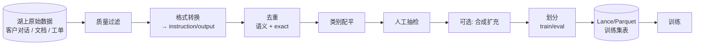

# 微调数据准备（Fine-tuning Data）

!!! tip "一句话理解"
    开源 LLM 要"为我所用"得微调（SFT / DPO / RLHF）。微调成败 80% 在**数据**——**从湖上收集 → 清洗 → 配平 → 配对 / 打分 → 导出**的流水线，才是主战场。

!!! abstract "TL;DR"
    - 数据规模：SFT 典型 **1k-100k 条**；DPO **10k-100k pair**；规模 ≠ 质量
    - **合成数据 + 人工标注混合**是主流
    - 质量优先于数量：500 条精标 > 50k 噪声
    - **评估集必须独立**（不能和训练集交叉）
    - 湖仓是天然的数据源 + 版本化存储

## 三种主流微调

| 方式 | 数据形式 | 用例 |
| --- | --- | --- |
| **SFT**（监督微调） | `(instruction, output)` pair | 领域问答 / 指令遵循 |
| **DPO / PPO**（偏好对齐） | `(instruction, chosen, rejected)` triplet | 对齐人类偏好 |
| **Continued Pretraining** | 纯文本 | 注入领域知识（医药 / 法律） |

## 数据流水线



## 一、数据源

湖上哪些表可作为微调数据：

- **用户对话日志**（客服、assistant） → SFT 首选
- **人工客服的高质量回答** → 天然监督信号
- **FAQ / KB** → 种子问答对
- **工单 / 投诉** → 领域特定问题
- **模型历史输出 + 人工修正** → DPO 偏好数据

湖表的 [Schema Evolution](../lakehouse/schema-evolution.md) 和 [Time Travel](../lakehouse/time-travel.md) 让"冻结某时刻数据" = 微调集的天然版本。

## 二、质量过滤

核心动作：

- **长度过滤**：过短 / 过长的 instruction / output
- **重复模式过滤**：复读机式回答
- **低质标志**（包含"抱歉我是 AI"等客服套话） → 二分类过滤器或简单规则
- **语言纯度**：混了其他语言的条目视场景决定
- **注入 / 越狱样本**：坚决剔除

## 三、去重

两级：

- **Exact dedup**：字符串完全相同
- **Near dedup**：MinHash / SimHash / embedding 相似度

**语义相近的条目**如果保留多条，训练时可能过拟合到某种问法。典型阈值：cosine > 0.9 视为同类。

## 四、格式化

### SFT 标准格式

```json
{
  "instruction": "如何取消订单？",
  "input": "",
  "output": "您可以通过…步骤取消订单。"
}
```

或多轮：

```json
{
  "messages": [
    {"role": "system", "content": "你是客服助手"},
    {"role": "user", "content": "如何取消订单？"},
    {"role": "assistant", "content": "您可以…"}
  ]
}
```

### DPO 偏好对

```json
{
  "prompt": "如何取消订单？",
  "chosen": "清晰步骤化回答",
  "rejected": "含糊不清 / 错误的回答"
}
```

**chosen/rejected 的对齐信号**来自：
- 人工 A/B 标注
- 模型多次采样 + 人工选优
- 规则评估高低分

## 五、合成数据

规模不够时用强模型（GPT-4 / Claude）生成：

- **Self-Instruct**：从少量种子 instruction 扩增
- **Evol-Instruct**：让模型把简单 instruction 变难
- **Persona-based**：不同人设生成多样化问题

**注意**：合成数据要人工抽检，不然模型学到 "GPT-4 味儿"。

## 六、配平

不同类别的样本数**不能差太多**：

- 同类 > 50% 会让模型偏向
- 欠采样大类 或 过采样小类
- 或按类别 loss 加权

## 七、独立评估集

**最大坑**：评估集和训练集泄漏。必须：

- **时间切分**（训练用 2025 年，评估用 2026 年）
- **来源切分**（某类对话只进评估）
- **去重到评估集** hard check（评估集每条不在训练集 near-dedup 范围内）

## 八、输出到湖

最终训练集回写湖表：

```sql
CREATE TABLE finetune_v1 (
  id               STRING,
  dataset_version  STRING,     -- 如 'sft-customer-v1-2026-04'
  task_type        STRING,     -- 'sft' / 'dpo'
  messages         STRING,     -- JSON
  source           STRING,     -- 'human' / 'synthetic' / 'logs'
  quality_score    FLOAT,
  lang             STRING,
  tags             ARRAY<STRING>
) USING lance                    -- 随机访问友好
PARTITIONED BY (dataset_version);
```

训练作业直接读 Lance，**天然 shuffle 友好**。训练结束在 [Model Registry](../ml-infra/model-registry.md) 记 `training_dataset_id`。

## 九、GDPR / 隐私

**用户对话进微调集 = 合规雷区**：

- 必须匿名化（PII 检测 + 脱敏）
- 必须得到用户授权
- 用户要求删除时，训练集也要删
- 已经训出的模型涉及该用户 → 是否需要 "unlearning"

这部分和 [安全与权限](../ops/security-permissions.md)、[数据治理](../ops/data-governance.md) 紧密联动。

## 规模参考

- SFT：**1k 高质量** 即可开始 feel；5k-50k 进入舒适区
- DPO：10k pair 起
- Continued Pretraining：**1B+ token** 才有明显效果

**高质量小数据 > 低质量大数据**。团队第一轮别贪规模，先把质量做好。

## 陷阱

- **只有正面样本** → 模型不知道什么不该答
- **评估集泄漏** → 乐观指标、上线崩
- **合成数据没过人工** → 学到垃圾
- **不记 dataset_version** → 一年后不知道模型 fine-tune 了啥
- **分词器不一致** → 和 base model 词表冲突

## 相关

- [离线训练数据流水线](../scenarios/offline-training-pipeline.md)
- [Model Registry](../ml-infra/model-registry.md)
- [训练编排](../ml-infra/training-orchestration.md)
- [Lance Format](../foundations/lance-format.md)

## 延伸阅读

- *Self-Instruct: Aligning Language Models with Self-Generated Instructions* (2022)
- *Training Language Models to Follow Instructions*（OpenAI InstructGPT paper）
- *DPO: Direct Preference Optimization*（NeurIPS 2023）
- LLaMA-Factory: <https://github.com/hiyouga/LLaMA-Factory>
