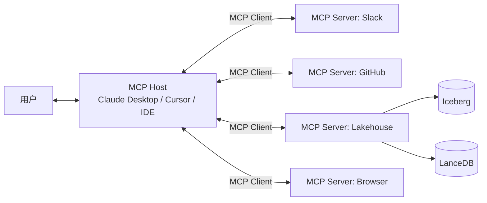

# MCP · Model Context Protocol

!!! tip "一句话理解"
    **Anthropic 2024 年 11 月发布的 LLM 与工具 / 数据源连接的"开放协议"**。把"每个 LLM 应用各自适配每种工具"的 N×M 复杂度降到 N+M。被形容为 **"AI 世界的 USB-C"**。2025 年上半年快速成为 Agent 生态的事实标准。

!!! abstract "TL;DR"
    - **目标**：LLM / Agent 与任意 Tool / 数据源的标准化通信
    - **三层抽象**：**Resources**（资源）· **Tools**（工具）· **Prompts**（模板）
    - **传输**：**stdio**（本地进程）· **SSE**（远程 HTTP）
    - **实现语言**：TypeScript · Python · Java SDK（官方）
    - **谁在用**：Claude Desktop · Cursor · Windsurf · 大多数 Agent 框架都在接
    - **对湖仓意义**：**把湖仓的表 / 索引 / 模型通过 MCP 暴露给 Agent**，实现"数据为中心的 Agent 工作流"

## 1. 业务痛点 · MCP 出现前的 Tool 生态混乱

### 痛点 1 · N × M 集成地狱

假设你要让 LLM 使用：
- Slack / GitHub / Linear / Notion
- 公司内部 API（CRM / HR / 财务）
- 数据库（Postgres / Snowflake / Iceberg）
- 文件系统、浏览器、Git...

```
3 个 LLM (Claude / GPT / Gemini)
  ×
20 个工具
=
60 个适配层
```

每家 LLM 框架各自实现 **function calling** schema，完全不兼容：
- OpenAI 的 `tools` + JSON Schema
- Anthropic 的 `tools` 略有差异
- Google 的 function_declarations
- 开源模型五花八门

### 痛点 2 · Agent 框架各立山头

LangChain / LlamaIndex / AutoGen / CrewAI / LangGraph 各自一套 Tool 定义。**换个框架 = 重写所有工具**。

### 痛点 3 · 标准缺失的代价

- 企业想让 Claude + GPT + 自研模型都能访问"内部 CRM"→ 写 3 套适配
- 开源工具想被所有 LLM 用 → 维护 3+ 套 SDK
- 用户从 Claude Desktop 换到 Cursor → 失去所有 Tool 配置

**这是 2020s 的 SOAP vs REST 重演**。

## 2. MCP 的核心思想

### 命名致敬 · 对标 LSP

MCP 的设计明显借鉴 **LSP (Language Server Protocol)**——2016 微软定义的"编辑器 ↔ 语言服务器"通信协议。LSP 成功的原因：

- 一次实现 Language Server，所有 IDE 都能用（ts-server 在 VSCode / Vim / Emacs 通吃）
- 一次实现 IDE，所有语言都能接

MCP 把这个思想搬到**LLM ↔ Tool/Data**：

- 一次实现 MCP Server，所有 MCP Client 都能用
- 一次实现 MCP Client（LLM app），所有 MCP Server 都能接

### 角色定义



| 角色 | 定义 |
|---|---|
| **Host** | LLM App（Claude Desktop / Cursor / IDE 插件） |
| **Client** | Host 内嵌的 MCP 客户端 |
| **Server** | 提供 Resources / Tools / Prompts 的服务 |

## 3. 协议核心

### 三大能力

**1. Resources（资源）**

只读数据，LLM 可以"看"：
- 文件 / 数据库表 / API 响应
- URI 寻址
- 支持增量更新通知

```json
{
  "method": "resources/list",
  "params": {}
}
// → [{"uri": "iceberg://db/orders", "name": "orders table"}]

{
  "method": "resources/read",
  "params": {"uri": "iceberg://db/orders"}
}
// → table schema + recent snapshot info
```

**2. Tools（工具）**

带副作用的操作，LLM 可以"做"：
- 查询 SQL / 调 API / 写文件
- JSON Schema 定义参数

```json
{
  "method": "tools/list",
  "params": {}
}
// → [{"name": "query_lakehouse", "inputSchema": {...}}]

{
  "method": "tools/call",
  "params": {
    "name": "query_lakehouse",
    "arguments": {"sql": "SELECT ..."}
  }
}
```

**3. Prompts（模板）**

Server 向 Client 提供的 Prompt 模板：
- 参数化（如 "summarize_table(table_name)"）
- 用户在 UI 可选择

```json
{
  "method": "prompts/get",
  "params": {"name": "summarize_table", "arguments": {"table_name": "orders"}}
}
```

### 传输（Transport）

| 传输 | 场景 |
|---|---|
| **stdio** | 本地进程（Claude Desktop 启动子进程） |
| **SSE (Server-Sent Events) HTTP** | 远程 / 云部署 |
| **WebSocket**（规划中） | 双向 streaming |

### 消息格式

基于 **JSON-RPC 2.0**：

```json
{
  "jsonrpc": "2.0",
  "id": 1,
  "method": "tools/call",
  "params": {"name": "query_sql", "arguments": {"sql": "SELECT..."}}
}
```

## 4. 对湖仓 / 数据基础设施的意义

### 场景 A · Lakehouse MCP Server

暴露湖仓能力给任何 LLM：

```python
from mcp.server import Server, NotificationOptions
from mcp.server.stdio import stdio_server

app = Server("lakehouse-mcp")

@app.list_resources()
async def list_resources():
    catalog = get_iceberg_catalog()
    return [
        Resource(uri=f"iceberg://{t.namespace}/{t.name}",
                 name=t.name, mimeType="application/x-iceberg-table")
        for t in catalog.list_tables()
    ]

@app.list_tools()
async def list_tools():
    return [
        Tool(name="query_sql",
             description="Run SQL on lakehouse (read-only)",
             inputSchema={
               "type": "object",
               "properties": {"sql": {"type": "string"}},
               "required": ["sql"]
             }),
        Tool(name="vector_search",
             description="Semantic search on docs",
             inputSchema={...}),
    ]

@app.call_tool()
async def call_tool(name, arguments):
    if name == "query_sql":
        result = trino_client.query(arguments["sql"])
        return [TextContent(type="text", text=format_table(result))]
    # ...
```

### 场景 B · Agent 调用湖仓做数据分析

```
用户："帮我分析过去一周销量异常的商品"
  ↓
Agent (Claude) with MCP Client
  ↓
→ query_sql("SELECT product_id, daily_sales FROM sales WHERE ts >= ...")
→ vector_search("similar abnormal sales patterns")
→ query_sql("SELECT details FROM products WHERE id IN (...)")
  ↓
生成报告 + 可视化
```

### 场景 C · Text-to-SQL + 动态 Schema

MCP Server 把表 schema、列描述、示例查询都作为 Resources 暴露，Agent 按需获取 → 大幅减少"猜列名"错误。

## 5. 工程细节

### 一个最小 Python MCP Server

```python
# server.py
import asyncio
from mcp.server import Server
from mcp.server.stdio import stdio_server
from mcp.types import Tool, TextContent

app = Server("hello-mcp")

@app.list_tools()
async def list_tools():
    return [Tool(
        name="hello",
        description="Greet someone",
        inputSchema={"type": "object",
                     "properties": {"name": {"type": "string"}},
                     "required": ["name"]}
    )]

@app.call_tool()
async def call_tool(name, arguments):
    if name == "hello":
        return [TextContent(type="text",
                            text=f"Hello, {arguments['name']}!")]

async def main():
    async with stdio_server() as (read_stream, write_stream):
        await app.run(read_stream, write_stream, app.create_initialization_options())

asyncio.run(main())
```

Claude Desktop 的 `claude_desktop_config.json`：

```json
{
  "mcpServers": {
    "hello": {
      "command": "python",
      "args": ["/path/to/server.py"]
    }
  }
}
```

### 生产部署模式

| 模式 | 场景 |
|---|---|
| **Local stdio** | 桌面 LLM 应用、个人工具 |
| **SSE HTTP** | 企业内部共享 MCP Server |
| **Cloud-hosted MCP** | 多租户 SaaS |
| **Gateway 统一入口** | 多 MCP Server 聚合 + 认证 + 审计 |

### 安全考量（重要）

- **最小权限原则**：Server 只暴露必要的 resources / tools
- **用户确认**：Tools 默认要求 Host 提示用户确认（敏感操作）
- **审计日志**：所有 tool calls 写日志
- **Tool Poisoning 攻击**：恶意 Server 提供带 prompt injection 的工具描述——Host 必须 sandbox
- **Credential 管理**：Server 不暴露长期 credential，用短期 token

## 6. 生态现状（2025）

### 官方 + 社区 MCP Server

- **Filesystem / Git / GitHub / GitLab**
- **PostgreSQL / SQLite / Google Drive**
- **Slack / Linear / Jira**
- **Puppeteer / Browser / Sequential Thinking**
- **Cloudflare / Brave Search / Perplexity**
- **Anthropic 官方目录**：[modelcontextprotocol/servers](https://github.com/modelcontextprotocol/servers)

### 采用的 Host

| Host | 状态 |
|---|---|
| **Claude Desktop** | 原生支持 |
| **Cursor** | 2024.12 集成 |
| **Windsurf (Codeium)** | 集成 |
| **Zed Editor** | 集成 |
| **Open WebUI** | 集成 |
| **LangChain** | 适配层 |
| **ChatGPT** | 尚未（OpenAI 有自己的 GPTs）|

### 对比其他"Tool 协议"

| | MCP | OpenAI Function Calling | LangChain Tool |
|---|---|---|---|
| 协议标准化 | ✅ 开放协议 | ❌ OpenAI 专有 | ❌ 框架内部 |
| 跨 LLM | ✅ | ❌ | 部分 |
| 远程服务器 | ✅ | ❌ (需自己做) | ❌ |
| 资源（非 tool）| ✅ | ❌ | ❌ |
| 用户体验 | 标准化 | 框架定义 | 框架定义 |

## 6.5. 现实检视 · 2026 视角

MCP 在 2024.11 发布后生态推进很快，但工程落地有几点**需要清醒看待**：

### 争议与不确定

- **"USB-C of AI" 的比喻还在验证**：目前 MCP 主要优势是**消除客户端层集成**，但 server 端的通用性仍然有限——多数 server 仍是"为 Claude Desktop 单场景写的"而非真正跨 host 通吃
- **ChatGPT / OpenAI 并未采纳**：OpenAI 继续走 GPTs / Custom Tools 路线，大模型 host 层尚未完全统一
- **企业采用曲线**：直接上生产的比例不高；多数还在 POC / 内部工具层。**真正"把企业 API 通过 MCP 给 LLM"**的大规模案例，到 2026.04 仍是少数
- **安全边界**：prompt injection + tool poisoning 这两类攻击对 MCP server 是天然风险，至今**没有成熟的 host 侧 sandbox 标准**

### 已验证的有价值的场景

- 个人生产力（Cursor / Claude Desktop + 本地工具）—— **这是 MCP 最成熟的场景**
- 内部工具集成（团队给自己 Agent 搭 MCP 接业务 API）—— 主流正在做
- 代码辅助（VSCode / IDE 插件）—— 被大量采用

### 暂时别 over-invest 的方向

- **把所有业务 API 全包装成 MCP server**：多数业务逻辑不适合 LLM 直接调用
- **替换自有 function calling 架构**：如果已有 OpenAI / LangChain 栈在稳定运行，迁移收益边际
- **相信"协议完整性解决 agent 可靠性"**：agent 可靠性问题 90% 来自 LLM 规划 / 理解能力，不是 tool 协议

### 结论

MCP **是方向**，也是 2024-2025 年 AI infra 最重要的协议进展之一。但**当前成熟度仅适合**：
- 内部工具 / 生产力场景优先
- 企业业务场景先 POC
- 大规模替换已有 function calling 请再等一轮迭代

## 7. 陷阱与反模式

- **把 MCP 当万能适配层**：复杂业务逻辑还是应该在 Server 内处理、别全暴露给 LLM
- **Tool 太多太杂**：Agent context 爆炸；分组 / 分 Server
- **无审计**：Agent 误操作无法追溯 → 必须日志
- **权限过大**：Server 用管理员 credential 跑 → 任何 LLM 都能破坏
- **同步调用做长任务**：MCP 不是 job queue，长任务要异步 + resources 轮询
- **工具描述随便写**：LLM 靠描述理解能力；写清楚、给例子
- **不做 prompt injection 防护**：恶意文档 / 数据可能诱导 LLM 调用破坏性工具

## 8. 横向对比 · 延伸阅读

- [Agentic Workflows 场景](../scenarios/agentic-workflows.md) —— Agent 的业务应用
- [Agents on Lakehouse](agents-on-lakehouse.md) —— 团队视角
- [RAG](rag.md) —— RAG 是 Agent 的核心能力之一

### 权威阅读

- **[MCP 官方网站](https://modelcontextprotocol.io/)**
- **[Anthropic MCP 发布博客 (2024.11)](https://www.anthropic.com/news/model-context-protocol)**
- **[MCP 规范](https://spec.modelcontextprotocol.io/)**
- **[modelcontextprotocol/servers (GitHub)](https://github.com/modelcontextprotocol/servers)** —— 官方 + 社区 Server 集合
- **[Cursor MCP 集成](https://docs.cursor.com/mcp)**
- [Simon Willison 对 MCP 的解读](https://simonwillison.net/)（持续更新的博客）
- LSP 对 MCP 的启发：[Language Server Protocol 规范](https://microsoft.github.io/language-server-protocol/)

## 相关

- [Agentic Workflows](../scenarios/agentic-workflows.md)
- [Agents on Lakehouse](agents-on-lakehouse.md)
- [RAG](rag.md)
- [业务场景全景](../scenarios/business-scenarios.md)
