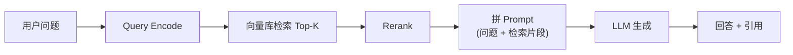

# RAG（Retrieval-Augmented Generation）

!!! tip "一句话理解"
    把"语料库中最相关的片段"作为上下文塞给 LLM，让模型**基于检索到的事实回答**而非只靠参数里的记忆。对抗幻觉、让知识可更新的最主流范式。

## 它是什么

RAG 是一种**在生成时先检索、再生成**的架构。标准流程：

关键变量：

- **语料分块（chunking）** —— 多长一段 / 重叠多少 / 沿段落还是定长
- **Embedding 模型** —— 决定语义向量质量
- **检索策略** —— 稠密 / 稀疏 / [Hybrid](../retrieval/hybrid-search.md) / 多路召回
- **Rerank** —— cross-encoder 精排
- **Prompt 模板** —— 如何告诉 LLM "只基于以下材料"
- **引用回写** —— 把源片段链到答案里，支持人工核查

## 为什么它和湖仓强相关

企业真正的知识资产在数据湖里：日志、文档、代码库、issue、客户记录、图像、音频。让 RAG 真正发挥价值的条件是：

1. **语料来源要全** —— 湖仓是唯一能汇聚所有原始数据的地方
2. **Embedding 要可刷新** —— 数据在变、模型在变，都需要批量重新 embedding
3. **检索要可过滤** —— "只在 2025 年之后的内部文档里查" → 需要结构化 metadata

因此 RAG 和湖仓 + 向量库的一体化天然契合，也是我们 [一体化架构](../unified/index.md) 的首要场景。

## 常见陷阱

- **检索召回不足 → 幻觉更严重**：如果检索没拿到，LLM 反而会"编"。Recall 比 Precision 更关键
- **Chunk 太大** → Prompt token 炸、语义稀释；**太小** → 语义残缺
- **Embedding 模型和查询侧不匹配** —— 比如库侧用 BGE-large，查询侧临时换小模型
- **没有 Rerank 直接扔给 LLM** —— 小模型受前后顺序影响大，Top-20 无序 ≠ Top-5 精排
- **缺引用/溯源** —— 合规场景下无法上线

## 进阶变体

- **HyDE（Hypothetical Document Embeddings）** —— 先让 LLM 假设答案，拿假设答案去检索
- **Multi-hop RAG** —— 先检索、推理、再次检索
- **Graph RAG** —— 结合知识图谱（Microsoft GraphRAG）
- **Self-RAG / Adaptive RAG** —— 让模型自己决定要不要检索

## 相关

- [向量数据库](../retrieval/vector-database.md)
- [Hybrid Search](../retrieval/hybrid-search.md)
- 场景页：[RAG on Lake](../scenarios/rag-on-lake.md)

## 延伸阅读

- *Retrieval-Augmented Generation for Knowledge-Intensive NLP Tasks* (Lewis et al., NeurIPS 2020)
- *From RAG to Riches*: <https://arxiv.org/abs/2312.10997>
- Microsoft GraphRAG: <https://github.com/microsoft/graphrag>
