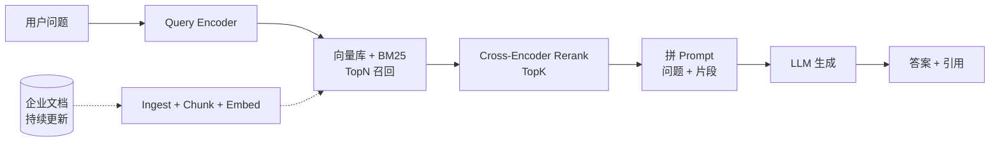

# RAG · 检索增强生成

!!! tip "一句话理解"
    **在生成前先检索**把"语料库中最相关的片段"作为上下文塞给 LLM。对抗幻觉、让知识可更新、让企业私有数据可问答的**最主流范式**。2025 年工业 RAG = **Hybrid 召回 + Rerank + Contextual 压缩 + LLM + 引用回写**。

!!! abstract "TL;DR"
    - **核心命题**：LLM 知识截止 + 私有数据 + 实时更新 → 检索 + 生成
    - **为什么不直接微调**：私有数据每天变、微调成本高、易忘记
    - **工业管线**：**chunk → embed → Hybrid 检索 → Rerank → Prompt → LLM → 引用**
    - **评估必做**：**RAGAS**（faithfulness / relevancy / context precision / context recall）
    - **2025 前沿**：Contextual Retrieval（Anthropic）· CRAG · Self-RAG · Agentic RAG
    - **不加 Rerank 是 RAG 第一大死因**；其次是 chunk 策略

## 1. 业务痛点 · LLM 为什么不够用

### 纯 LLM 的三个天花板

| 局限 | 症状 |
|---|---|
| **知识截止** | "我不知道 2024 年后的事" |
| **私有数据盲区** | 问不了公司内部文档、代码库 |
| **幻觉** | 瞎编事实、引用不存在的论文 |
| **不可追溯** | "为什么这么回答？"说不清 |

### 微调替代不了 RAG

|  | 微调（SFT / LoRA） | RAG |
|---|---|---|
| 适合场景 | 改变**风格、语气、格式** | **事实、知识、数据** |
| 成本 | GPU / 训练数据 / 时间 | 向量库 + LLM 调用 |
| 更新成本 | 每次新数据要重训 | 增量写向量库 |
| 可审计 | 黑盒 | **可引用** |
| 混合使用 | 都要 | 都要 |

**结论**：微调调"模型说话方式"，RAG 解"给模型什么信息"——**两者互补不替代**。

### 工业典型场景

| 场景 | RAG 价值 |
|---|---|
| 企业客服 / 工单 | 答案准确率从 30% → 85% |
| 代码助手 | 了解私有代码库 |
| 合规 / 法务 | 强制引用、零幻觉 |
| 研究辅助 | 快速翻遍论文库 |
| 运维诊断 | 从历史故障 + 文档找线索 |

## 2. 原理深度 · RAG 工作机制

### 基础管线（Vanilla RAG）



### 三阶段拆解

**阶段 1 · 索引（离线）**
```
文档 → 解析 → Chunk → Embedding → 向量库 / 全文索引
```

**阶段 2 · 检索（在线）**
```
Query → Embed / Tokenize → Hybrid 召回 → Rerank → TopK
```

**阶段 3 · 生成（在线）**
```
Prompt 模板 + TopK Chunks + Query → LLM → 引用式答案
```

### 为什么"对抗幻觉"

LLM **在给定上下文后的输出分布会被锚定**——token 级别概率大幅向 context 中的事实倾斜。

但**光给 context 不够**，还要：
- **Prompt 强制要求"只基于引用"**
- **答案里显式带引用编号**
- **无引用时拒答**（"资料中没找到"）

这三件都做到，幻觉率能从 15-30% 降到 < 3%。

## 3. 关键机制

### 机制 1 · Chunk 策略

Chunk 决定召回上限：

| 策略 | 适合 | 优 | 劣 |
|---|---|---|---|
| **定长切分** | 纯文本、快速起步 | 简单 | 切断语义 |
| **结构感知** | Markdown / HTML / 代码 | 尊重标题层级 | 实现复杂 |
| **语义切分** | 长散文 / PDF | 语义聚合 | 耗时、需额外模型 |
| **Contextual Chunking** | 每 chunk 加背景描述 | Anthropic 新范式、+35% recall | 需 LLM 预处理 |

推荐默认：**结构感知 + 长度约束（200-800 tokens）+ 10% overlap**。

### 机制 2 · Embedding 选型

详见 [Embedding 模型横比](../compare/embedding-models.md)。实务：
- 私有 + 中文 → **BGE-large-zh / multilingual**
- 多语 → **E5-multilingual / Cohere embed-multilingual**
- 快速起步 → **OpenAI text-embedding-3**
- 代码 → **Voyage AI code** 或 **CodeBERT**

### 机制 3 · Hybrid 检索

纯向量不够。工业标配 = **BM25 + Dense + RRF 融合**。

详见 [Hybrid Search](../retrieval/hybrid-search.md)。

### 机制 4 · Rerank

**差异化关键**。bge-reranker / Cohere Rerank 3 / Jina Reranker v2。

召回 50-100 → Rerank → Top 5-10。NDCG 提升 5-10 个点。

详见 [Rerank](../retrieval/rerank.md)。

### 机制 5 · Prompt 构造

经典模板：

```
你是 XXX 的内部助手。请**仅基于下面的参考资料**回答问题。
若资料不足，请回答"资料中没有找到相关信息"。
每个答案必须带引用编号 [n]。

# 参考资料
[1] {chunks[0].title} ({chunks[0].url})
{chunks[0].content}

[2] {chunks[1].title}
{chunks[1].content}

# 问题
{user_query}

# 你的回答（使用引用格式 [n]）
```

**关键技巧**：
- 最相关 chunk **放 prompt 最后**（"Lost in the Middle"现象）
- 压缩 context（LLMLingua / Contextual Compression）省 token
- 引用编号在 prompt 里明确，LLM 更愿意写引用

### 机制 6 · 引用与溯源

产品化上必须做：
- 每个答案带引用编号（[1], [2]）
- 点击引用 → 跳转原文位置
- 便于**人工核查**，审计场景刚需

## 4. 工程细节 · 2024-2025 高级范式

### Contextual Retrieval（Anthropic 2024）

**给每个 chunk 前置补充"这个 chunk 在整份文档中的背景描述"**（用 LLM 预处理），embed 整体。

```
原 chunk: "M 参数默认 16"
     ↓
Contextual Chunk:
"《HNSW 调优指南》的"参数详解"章节：HNSW 算法中的 M 参数默认 16，
 控制图的邻居数。M 参数默认 16。"
```

**效果**：BEIR 平均 recall 提升 35%（Anthropic 2024 报告）。

### CRAG (Corrective RAG)

```
检索 → 对检索质量打分
         ↓
    低质量 → 触发 Web 搜索 / 其他 fallback
    高质量 → 直接用
    中等 → 过滤 + 重检索
```

### Self-RAG

模型**自己决定**：
- 是否需要检索（有些问题不需要）
- 检索到的片段是否相关
- 生成的答案是否 grounded

### Agentic RAG

- 把 RAG 当成 Agent 的一个 **Tool**
- Agent 可以决定 **多轮检索**（多 hop reasoning）
- 结合其他工具（SQL / 代码执行 / API）

详见 [Agentic Workflows](../scenarios/agentic-workflows.md)。

## 5. 性能数字 · 评估指标

### 离线评估

| 指标 | 工具 | 典型基线 |
|---|---|---|
| **Retrieval Recall@10** | BEIR / 自建 | 0.60-0.80 |
| **NDCG@10** | BEIR | 0.50-0.65 |
| **Faithfulness**（答案忠于 context） | RAGAS / TruLens | > 0.90 |
| **Answer Relevance** | RAGAS | > 0.85 |
| **Context Precision** | RAGAS | > 0.80 |

### 在线评估

- **用户点赞 / 点踩率**（生产必收集）
- **Follow-up 率**（问了又问 = 没答好）
- **解决率**（客服场景）
- **平均引用数**（太少 = 幻觉风险）

### 延迟分解

```
用户输入 → 答案 p95 < 1.5s 的打法：
  50ms  Query embedding
  150ms Hybrid retrieve
  100ms Rerank
  400ms Prompt + LLM 首 token
 1200ms LLM 流式完成
  100ms 日志落表 (async)
  ───────
 1.5s
```

## 6. 代码示例

### 最小 LlamaIndex RAG

```python
from llama_index.core import VectorStoreIndex, SimpleDirectoryReader

docs = SimpleDirectoryReader("data/").load_data()
index = VectorStoreIndex.from_documents(docs)

query_engine = index.as_query_engine(similarity_top_k=10)
response = query_engine.query("HNSW 的 M 参数如何调优？")
print(response)
print(response.source_nodes)  # 引用
```

### LanceDB + BGE Embedding + bge-reranker Hybrid

```python
import lancedb
from FlagEmbedding import FlagModel, FlagReranker

embed_model = FlagModel('BAAI/bge-large-zh')
reranker    = FlagReranker('BAAI/bge-reranker-large')

db = lancedb.connect("s3://lake/lancedb")
table = db.open_table("docs")

def rag_answer(query: str) -> str:
    # 1. Hybrid 召回
    q_vec = embed_model.encode(query)
    candidates = (table.search(q_vec, query_type="hybrid")
                       .text(query)
                       .limit(50)
                       .to_list())

    # 2. Rerank
    pairs = [[query, c["content"]] for c in candidates]
    scores = reranker.compute_score(pairs)
    top_k = sorted(zip(candidates, scores), key=lambda x: -x[1])[:10]

    # 3. LLM
    context = "\n\n".join(
        f"[{i+1}] {c['title']} ({c['url']})\n{c['content']}"
        for i, (c, _) in enumerate(top_k)
    )
    prompt = f"""仅基于以下资料回答，每段答案带引用 [n]。
# 资料
{context}
# 问题
{query}
# 答案
"""
    return llm.generate(prompt)
```

### RAGAS 评估

```python
from ragas import evaluate
from ragas.metrics import faithfulness, answer_relevancy, context_precision, context_recall

ds = Dataset.from_dict({
    "question": [...],
    "answer": [...],
    "contexts": [...],
    "ground_truth": [...],
})

result = evaluate(ds, metrics=[faithfulness, answer_relevancy, context_precision, context_recall])
print(result)
```

## 7. 陷阱与反模式

- **不加 Rerank**：RAG 效果失败 #1 原因
- **定长 512 tokens 切分走天下**：代码 / 表格 / PDF 效果崩
- **Embedding 和 query 侧不一致**：库用 BGE 查用 OpenAI → 分布不同
- **没做 Evaluation**：改一版就上线 → 盲飞；**RAGAS 是最低配**
- **幻觉不管**：LLM 会编事实 → 强制引用 + 引用不足拒答
- **权限在 Prompt 里**：一定被绕过 → 向量库侧 metadata filter
- **Context 塞满**：Token 预算爆、"Lost in the Middle"、成本高
- **一次检索打天下**：复杂问题要多跳检索（Agentic / CRAG / Self-RAG）
- **没有降级**：向量库挂了全站挂 → BM25 / 规则兜底
- **成本失控**：LLM 调用没限流 / 没缓存 → 每月 $ 炸
- **Chunk 不带元信息**：丢了 source / url / tag → 无法引用、无法过滤

## 8. 横向对比 · 延伸阅读

- [RAG on Lake 场景](../scenarios/rag-on-lake.md) —— 工程管线细节
- [RAG 评估](rag-evaluation.md) —— 独立一页
- [60 分钟 RAG on Iceberg tutorial](../tutorials/rag-on-iceberg.md)
- [Agentic Workflows](../scenarios/agentic-workflows.md) —— RAG 的进化

### 权威阅读

- **[Lewis et al., *Retrieval-Augmented Generation for Knowledge-Intensive NLP Tasks* (NeurIPS 2020)](https://arxiv.org/abs/2005.11401)** —— 原论文
- **[Anthropic Contextual Retrieval (2024)](https://www.anthropic.com/news/contextual-retrieval)**
- **[*Lost in the Middle* (Liu et al., 2023)](https://arxiv.org/abs/2307.03172)**
- **[RAGAS paper (Es et al., 2023)](https://arxiv.org/abs/2309.15217)**
- **[CRAG (Yan et al., 2024)](https://arxiv.org/abs/2401.15884)** · **[Self-RAG (Asai et al., 2023)](https://arxiv.org/abs/2310.11511)**
- **[LlamaIndex](https://github.com/run-llama/llama_index)** · **[LangChain](https://github.com/langchain-ai/langchain)** · **[Haystack](https://github.com/deepset-ai/haystack)**

## 相关

- [向量数据库](../retrieval/vector-database.md) · [Hybrid Search](../retrieval/hybrid-search.md) · [Rerank](../retrieval/rerank.md) · [Embedding](../retrieval/embedding.md)
- [RAG on Lake 场景](../scenarios/rag-on-lake.md) · [Agentic Workflows](../scenarios/agentic-workflows.md)
- [Feature Store](feature-store.md) —— RAG 的姊妹基础设施
