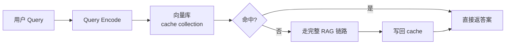

# Semantic Cache（语义缓存）

!!! tip "一句话理解"
    **"语义相近的请求返回相同答案"**的缓存。传统缓存按 key 精确命中；语义缓存按 embedding 距离命中。主要用来**降低 LLM 调用成本和延迟**。

## 为什么需要

RAG / LLM 服务的成本与延迟主要来自两处：

1. **LLM 推理**（大头）
2. **向量检索 + rerank**（小头）

线上用户问题有**高度语义重复**："如何安装 X / X 怎么装 / 请教 X 安装步骤"其实是同一个问题。传统 key 缓存完全命中不了。

**语义缓存**：把问题 embedding 一下，查缓存里有没有距离 < 阈值的条目；命中就直接返答案，节省整条 LLM 链路。

## 两种形态

### 精确语义缓存（保守）

- 阈值严格（cosine > 0.95），几乎同义才命中
- 适合**低错误容忍**场景
- 典型节省：10%–30% 请求

### 模糊语义缓存（激进）

- 阈值放宽（cosine > 0.85）
- 更高命中率但可能把"意思相近但答案应该不同"的 query 当相同
- 适合客服 FAQ 这类**答案本就泛化**的场景
- 典型节省：30%–60% 请求

## 工程实现

缓存层通常用：

- **Redis** +  RediSearch 向量字段 —— 低延迟、易运维
- **LanceDB** 嵌入式 —— 简单部署
- **Milvus** —— 如已在跑，复用即可

## 命中阈值怎么定

**不能凭感觉**。流程：

1. 线下跑一批真实问答对
2. 人工标注"语义相同 / 部分相同 / 不同"
3. 画 recall / precision vs 阈值曲线
4. 选业务可接受的 FP 率对应的阈值

典型落点：cosine **0.90–0.95**。

## 带过期与失效

内容会变、模型会变。缓存不是永久的：

- **TTL**：按条目 N 天自动过期
- **版本失效**：Embedding 模型换了整批作废
- **内容 hash 关联**：如果答案来自某个文档，文档 hash 变了同步作废
- **LRU / LFU**：有容量上限时按热度淘汰

## 陷阱

- **把"意图不同但词相近"当相同** —— "学校怎么走" vs "学校怎么申请"
- **时间敏感类问题** —— "今天天气"绝不能缓存
- **个性化 query 泄漏** —— 带用户 ID 的缓存条目不能跨用户命中
- **阈值漂移** —— 模型升级后阈值要重新校准

## 监控

- 命中率（按 query 类型分桶）
- 命中后的用户满意度（错误命中会导致投诉）
- 节省的 LLM token 数 / 成本
- 缓存大小 / 淘汰率

## 相关

- [RAG](rag.md)
- [Embedding](../retrieval/embedding.md)
- [向量数据库](../retrieval/vector-database.md)

## 延伸阅读

- *GPTCache*（开源语义缓存项目）: <https://github.com/zilliztech/GPTCache>
- *LangChain Semantic Cache* 文档
