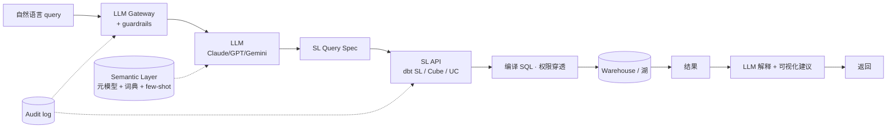

# BI × LLM · 2026 BI 的根本变革

!!! tip "一句话定位"
    2026 BI 最大转折 · **LLM 成为 BI 入口**。不是"替代 BI 工具"· 是"业务人用自然语言访问指标中台"。关键在**语义层作为 LLM 的知识抓手** · 不是让 LLM 直写 SQL。

!!! info "和其他页的边界"
    - **本页** · BI 视角 · 机制和产品全景 · LLM 如何改变 BI 交互
    - **[semantic-layer](semantic-layer.md)** · §10 "LLM × Semantic Layer" 讲原理细节
    - **[scenarios/text-to-sql-platform.md](../scenarios/text-to-sql-platform.md)** · Text-to-SQL 作为独立平台的场景编排
    - **[ai-workloads/mcp.md](../ai-workloads/mcp.md)** · MCP 协议本身 · 本页引用

!!! abstract "TL;DR"
    - **四大能力**：Text-to-Query · Auto-Insight · Auto-Viz · Natural Narrative
    - **核心抽象**：LLM → 语义层查询（不直写 SQL）→ SL 编译成 SQL → 执行
    - **2026 产品领跑**：**Databricks AI/BI Genie（2025-06-12 GA · 4000+ accounts）** · **Snowflake Cortex Analyst**（Public Preview · 广泛采用）· **Tableau GPT / Pulse（GA）** · **dbt SL + MCP** · **Cube AI**
    - **落地关键**：语义层质量 · Few-shot 持续维护 · Feedback loop · 权限穿透
    - **现实**：**"不会 100% 准确 · 要可审查 + 可纠错"** · 别承诺取代分析师

## 1. 为什么 2026 是转折点

### 1.1 三大推动力

1. **LLM 推理质量跃升** · GPT-4.5 / Claude 3.5+ / Gemini 2 对 schema / SQL 理解显著改善 · BIRD benchmark 从 2023 的 55% 上升到 2025+ 的 80%+
2. **语义层成熟** · dbt SL / Cube 2024 生产可用 · 给 LLM 提供**稳定的业务抽象**
3. **MCP 协议**（Anthropic 2024 开放）· **统一 LLM 访问企业数据的接口** · dbt / Cube / Databricks 等陆续提供 MCP server

### 1.2 历史试错

- **2019-2022 · 关键词搜索式 BI**（ThoughtSpot 等）· 限于"结构化搜索" · LLM 之前天花板低
- **2023 · 直接 Text-to-SQL** · 基于 GPT-3.5 · Schema 理解弱 · **踩坑**：幻觉、权限漏、列名不对
- **2024+ · 语义层为中介** · LLM 不直接写 SQL · 写"语义层查询" · 稳定性飞跃
- **2025-2026 · MCP 协议统一** · 多 LLM + 多 SL + 多 BI 工具的正交组合

## 2. 四大能力

### 2.1 Text-to-Query · 自然语言查询

**不是 Text-to-SQL**（直接生成 SQL）· 而是 **Text-to-SemanticLayerQuery**（生成语义层调用）。

```
用户："上周华北区 iPhone 销量对比上上周"
  ↓ LLM
{
  metric: "gmv",
  dimensions: ["region", "product_name"],
  filters: [
    {dimension: "product_name", op: "like", value: "iPhone%"},
    {dimension: "region", value: "华北"}
  ],
  time_range: "last_week vs prev_week",
  compare: "week_over_week"
}
  ↓ Semantic Layer
SELECT ... FROM ... GROUP BY ...
```

**产品实现**：
- **Databricks Genie** · Unity Catalog metadata + instructions 做 LLM 理解
- **Snowflake Cortex Analyst** · Semantic Model YAML + REST API · LLM 生成 SM query
- **dbt SL + MCP** · LLM 通过 MCP 调用 dbt SL 的 GraphQL / JDBC · 返回 metric + dimension 结果
- **Cube AI** · Cube Schema + LLM · 生成 Cube query

### 2.2 Auto-Insight · 自动洞察

给定数据集 + 业务目标 · LLM 自动发现：
- **异常点**（突升/突降/离群）
- **趋势变化**（增长率拐点）
- **维度差异**（某地区显著高/低）
- **关联**（指标 A 变化伴随指标 B 变化）

**产品**：
- **Tableau Pulse** · 个性化 metric digest
- **ThoughtSpot Spotter** · 自动异常检测 + 归因
- **Power BI Copilot** · 自然语言解释指标波动

**注意**：**不是真正"理解"** · 是统计 + LLM 解释 · 仍需人 validate。

### 2.3 Auto-Viz · 图表自动生成

LLM 根据数据形状和问题语义**自动选图表类型** + 生成 spec。

- 时间序列 → line chart
- 对比 → bar chart
- 分布 → histogram
- 地理 → map
- 关联 → scatter

**生成**：Vega-Lite / ECharts / Recharts spec · 前端直接渲染。

**产品**：几乎所有 BI + LLM 产品都做。

### 2.4 Natural Narrative · 自然语言叙述

生成**数据解释文字**：
- "本周 GMV 1.2 亿 · 环比 +15% · 主要来自华北 iPhone 销量增长"
- 代替枯燥数字 · 让业务阅读更快
- **风险**：LLM 幻觉 · 叙述和数据脱节 · **必须在数据层面 double-check**

## 3. 架构模式

### 3.1 LLM × SL 标准架构



**关键组件**：

- **LLM Gateway**（详见 [llm-gateway](../ai-workloads/llm-gateway.md)）· 多模型路由 · 限流 · guardrails
- **Semantic Layer**（详见 [semantic-layer](semantic-layer.md)）· metric/dimension 定义 · 业务词典
- **MCP Server** · 标准化 LLM 访问 SL 的接口（dbt MCP / Cube MCP）
- **权限穿透** · user identity 带到 SL 执行 · 行级/列级安全生效
- **Audit Log** · 每次 Q + SL query + SQL + result 全链路记录

### 3.2 架构选型

**路径 A · 商业集成栈**（Databricks / Snowflake）
- Unity Catalog / Snowflake Native 直接提供 LLM + SL + BI 一体
- 优势：零集成 · 开箱即用
- 劣势：厂商锁定

**路径 B · dbt SL + MCP + 前端**
- dbt SL 是语义层 · dbt MCP server 作为 LLM 接口
- 前端：Hex · Mode · 自研
- 优势：开放 · 可多 LLM / 多前端
- 劣势：需要自己搭 · MCP 生态仍在扩

**路径 C · Cube + LLM 自拼**
- Cube 做 SL + REST/GraphQL · LLM 通过 Cube API 调用
- 优势：最灵活
- 劣势：LLM prompt + Cube schema 要自己工程化

**路径 D · 纯 Text-to-SQL（不推荐）**
- 没有语义层 · LLM 直接对 warehouse schema 写 SQL
- 见 [Text-to-SQL 平台](../scenarios/text-to-sql-platform.md) 的陷阱
- **只在小规模 schema + 低准确性要求时用**

## 4. 产品矩阵（2026-Q2）

| 产品 | 定位 | 状态 | 核心能力 | 生态 |
|---|---|---|---|---|
| **Databricks AI/BI Genie** | Unity Catalog 一体化 BI+LLM | **GA 2025-06-12** · 4000+ accounts | Genie Space · Deep Research 预览 | Databricks 栈 |
| **Snowflake Cortex Analyst** | Semantic Model + LLM | Public Preview · 9100+ accounts 用 Cortex | SM YAML · REST API | Snowflake 栈 |
| **Tableau GPT + Pulse** | 前端 + LLM | **GA** | NLQ · Auto-viz · Narrative | Tableau 生态 |
| **ThoughtSpot Sage / Spotter** | 搜索式 BI + LLM 升级 | **GA** | Spotter · 自动归因 | 独立生态 |
| **dbt Semantic Layer + MCP** | 开放 SL + MCP server | 2025 发布 · 2026 集成度提升 | dbt SL GraphQL · MCP 接入 | 多前端 |
| **Cube AI** | Cube schema + LLM | 成熟 | NL → Cube query · 嵌入式 | 多前端 |
| **Power BI Copilot** | Microsoft BI + Copilot | GA | NLQ · DAX 生成 | Microsoft 栈 |
| **Sisense AI / Qlik Answers** | 传统 BI + LLM 加 | GA | NLQ · 有限 | 对应生态 |

## 5. 落地的 5 个关键环节

### 5.1 语义层质量是天花板

LLM 的表现由**语义层能多详细描述业务**决定。

**必做**：
- 每 metric 加 `description`（业务定义 · 不是 SQL 注释）
- 每 dimension 加 `synonyms`（"区域/地区/region/location" 都映射同一 dim）
- 关键 metric 加 `sample_queries`（few-shot）
- `filter` / `default_time_range` 预编业务口径（"本周"、"YTD"）

**反面**：语义层字段名糊弄 · `gmv / amount / sales` 都存在 · LLM 不知该用哪个。

### 5.2 Few-shot 持续维护

- 收集真实业务 query → SL query 的对应样本
- 作为 LLM 的 context · 精度提升显著（+10-20%）
- **版本化管理** · 把 few-shot 当代码 · PR 改

### 5.3 Feedback Loop

- 用户点"这个对 / 这个错"
- 错了的 query 进入 review 队列 · 人工修改语义层或 few-shot
- **每月盘点 Top 失败类型** · 针对性改进

### 5.4 权限穿透

- 用户 identity 一路从 gateway 到 SL 到 warehouse
- SL 层的行级/列级安全自动生效
- **绝不在 LLM prompt 里让 LLM 自己判断权限** · 绕过风险极高

### 5.5 输出可审可纠

- 每个答案展示：**生成的 SL query + 最终 SQL + 结果 + 解释**
- 业务可以看"LLM 怎么理解我的问题" · 不对则反馈
- **不透明的"魔法黑盒"是信任杀手**

## 6. 评估 · BI × LLM 的 SLO

常规 BI SLO（延迟 · 新鲜度）之外 · LLM 引入**新维度**：

| 指标 | 定义 | 目标（典型）|
|---|---|---|
| **Accuracy @ 1** | 一次生成正确率 | 65-80% |
| **Accuracy @ 3** | 3 候选里有对的 | 85-95% |
| **User Acceptance Rate** | 用户采纳答案比例 | 70%+ |
| **Clarification Rate** | LLM 反问澄清比例 | 10-20% 健康 |
| **Cost per Query** | 每 query LLM token 成本 | $0.01-0.1 |
| **Audit Completeness** | Q+SQL+result 完整记录 | 100% |
| **Permission Leak Rate** | 越权返回的 query | 0（硬指标）|

**评估方法**：
- Golden Set（100-1000 业务真实 query + 正确答案）· 回归
- A/B 测试 · 新语义层 / 新 few-shot / 新 LLM 版本
- 用户 feedback 长期跟踪

详见 [评估通用方法](../retrieval/evaluation.md) · 检索评估和 LLM 评估有交叠。

## 7. 陷阱

- **跳过语义层 · LLM 直接写 SQL** · 2026 绝大多数失败案例的根因 · 幻觉 · 权限漏 · 口径乱
- **语义层糊弄就上 LLM** · metric description 一行 · synonyms 空 · LLM 效果和野生 Text-to-SQL 无差别
- **承诺"取代分析师"** · 期望管理失败 · LLM 做**重复性 ad-hoc 查询解放**才是卖点
- **Accuracy 追求 100%** · 不可能 · **改为"可审查 + 可纠错"**
- **没有 clarification** · LLM 不确定时硬编 · 给出错答案
- **一次性上线 · 没 feedback loop** · 两个月后语义层和业务漂移 · 答案越来越离谱
- **Cache 太激进** · 不同用户权限不同 · 同 query 答案必须不同
- **Token 成本失控** · 每 dashboard 每 refresh 调 LLM · 月账单飞
- **模型升级无 regression test** · LLM 升级后某类 query 对准率跌 · Golden Set 能catch
- **审计不完整** · 业务投诉"数字不对"但查不到哪条 query · 审计必须全链路

## 8. 未来方向（2026-2027）

- **多轮对话式 BI** · "帮我看华北销量"→"再对比华南"→"为什么跌"· 对话 state 管理
- **Agentic BI** · LLM 自主调工具链 · Deep Research 风格的多步分析 · Databricks Genie Deep Research 已 preview
- **语义层自动生成** · LLM 从 warehouse schema + 业务文档自动生成语义层草稿 · 加速冷启动
- **跨语义层联邦** · 多业务线多 SL · LLM 跨 SL 查询 · schema federation 问题
- **本地 LLM + 敏感数据** · 小模型 fine-tune + on-prem 部署 · 金融/医疗场景

## 9. 相关

- [语义层](semantic-layer.md) · SL 机制 · 本页上游
- [OLAP 建模](olap-modeling.md) · 建模是 SL 的基石
- [物化视图](materialized-view.md) · LLM × BI 查询也受 MV 加速
- [仪表盘 SLO](dashboard-slo.md) · SLO 框架扩展到 LLM
- [Text-to-SQL 平台](../scenarios/text-to-sql-platform.md) · 端到端场景
- [MCP](../ai-workloads/mcp.md) · LLM 访问企业数据的标准协议
- [RAG](../ai-workloads/rag.md) · SL schema 本身可以走 RAG 检索
- [LLM Gateway](../ai-workloads/llm-gateway.md) · 模型路由 · 限流 · guardrails
- [BI on Lake 场景](../scenarios/bi-on-lake.md) · 端到端 BI 组合

## 10. 延伸阅读

- **[Databricks AI/BI Genie · GA 博客](https://www.databricks.com/blog/aibi-genie-now-generally-available)**
- **[Snowflake Cortex Analyst 文档](https://docs.snowflake.com/en/user-guide/snowflake-cortex/cortex-analyst)**
- **[dbt MCP server](https://github.com/dbt-labs/dbt-mcp)**
- **[MCP Protocol Spec](https://spec.modelcontextprotocol.io/)**
- **[Tableau Pulse](https://www.tableau.com/products/pulse)**
- **[Cube AI](https://cube.dev/docs/product/ai)**
- **[BIRD benchmark](https://bird-bench.github.io/)** · Text-to-SQL 工业评估
- **[Spider benchmark](https://yale-lily.github.io/spider)** · Text-to-SQL 学术评估
- **[*Ask Me Anything: A simple strategy for prompting language models*](https://arxiv.org/abs/2210.02441)** · 多步 prompt 技巧
