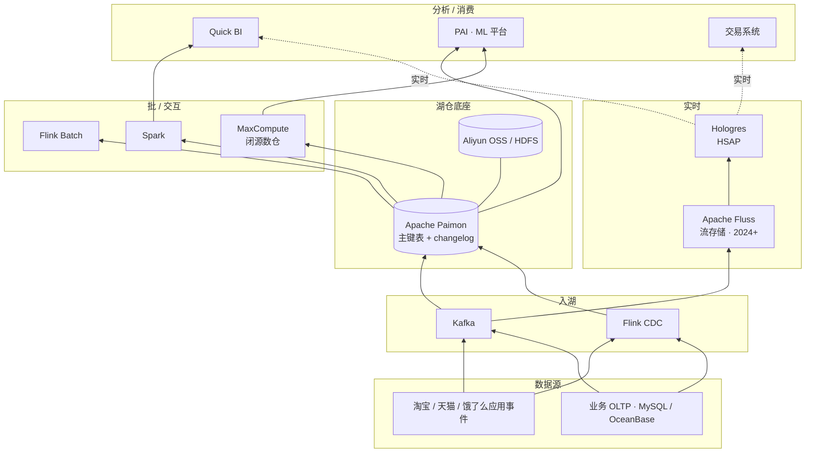

# 案例 · 阿里巴巴数据平台（Paimon 诞生地）

!!! info "本页性质 · reference · 非机制 canonical"
    基于阿里云官方博客 · Flink Forward 演讲 · Apache Paimon 社区内容整理。机制深挖见 [lakehouse/paimon](../lakehouse/paimon.md) · [lakehouse/streaming-upsert-cdc](../lakehouse/streaming-upsert-cdc.md)。

!!! success "对应场景 · 配对阅读"
    本案例 = **阿里巴巴全栈视角**（Paimon 诞生地 · 电商规模）。**场景切面**在 scenarios/：
    - [scenarios/cdp-segmentation](../scenarios/cdp-segmentation.md) §工业案例 · 阿里电商 CDP
    - [scenarios/real-time-lakehouse](../scenarios/real-time-lakehouse.md) §工业案例 · Paimon + Flink CDC
    - [scenarios/recommender-systems](../scenarios/recommender-systems.md) §工业案例 · 阿里电商推荐
    - [scenarios/multimodal-search-pipeline](../scenarios/multimodal-search-pipeline.md) §工业案例 · 阿里图搜图

!!! abstract "TL;DR"
    - **身份**：**Apache Paimon 诞生地** · 中国工业界最有影响力的数据平台之一 · **Flink 生态的主导者**
    - **核心技术贡献**：**Apache Paimon**（2022 从 Flink Table Store 独立 · 2024 ASF TLP）· **Apache Flink 持续贡献**（阿里是 Flink 最大贡献方之一）· **Apache Celeborn**（Shuffle Service）· **Apache Fluss**（流存储 · 2024 孵化）
    - **业务栈**：**MaxCompute**（闭源云数仓 · 类 BigQuery）· **Hologres**（HSAP 混合分析 + 交易）· **Aliyun EMR**（托管开源栈）· 多条业务线
    - **独特价值**：**流式湖仓的工业最大规模实践** · Paimon + Flink CDC 组合代表了**Hudi 思想的现代化延续**（但开放度远超 Hudi）
    - **2024-2026 演进**：Paimon 2024 Apache TLP · Paimon × Iceberg 互操作探索 · Fluss 2024 发布（流存储新思路）· Hologres 向量能力 2024+ GA
    - **最值得资深工程师看的**：§8 深度技术取舍（Paimon vs Hudi 的"2 代差" · Flink CDC 的流批一体 · Hologres HSAP 架构）· §9 真实踩坑（MaxCompute 闭源 vs 开源路线冲突）

## 1. 为什么这个案例值得学

阿里巴巴数据平台的独特性：
- **中国工业界数据基础设施的代表**（读者主要是中国团队 · 参考价值最直接）
- **Paimon 作 Hudi 精神继承 + Flink 生态现代化** · 是 2022-2026 最重要的 OSS 湖表新项目
- **流式湖仓的最大规模工业实践** —— 阿里双 11 / 淘宝业务把流式湖仓推到极限（百万级 QPS · 毫秒级一致性）
- **开源 + 商业双栈并存**：MaxCompute 闭源 / Hologres 闭源 / Paimon + Flink + EMR 开源路径并存

**资深读者关注点**：
- **Paimon 的设计哲学**（§5.1）和 Hudi / Iceberg 的深度对比（§8.1）
- **Flink CDC + Paimon 流批一体架构**（§5.2 · 和 Netflix 批为主 / Uber 流为主的第三条路）
- **Hologres HSAP**（§5.3 · 对标 Snowflake Unistore 但更成功的实践）
- **阿里的中国工业影响力**（§10 启示 · 国内团队可直接借鉴）

## 2. 历史背景

阿里巴巴 2003 年起步 · 数据平台伴随淘宝 / 天猫业务爆发演进。

**关键阶段**：

| 年份 | 阶段 | 关键事件 |
|---|---|---|
| 2003-2009 | Oracle 时代 | 单机数据库为主 |
| 2009 | "去 IOE"战略 | 开始自研 / 开源路径（对抗 Oracle / IBM / EMC） |
| 2011 | **MaxCompute**（原 ODPS）| 自研离线大数据平台 · 对标 BigQuery |
| 2015+ | 拥抱 Hadoop / Spark 开源 | 开始大规模开源消费 |
| 2015+ | **Flink** 大规模采用和贡献 | Ververica 收购 · 阿里成 Flink 最大贡献方 |
| 2019 | **Hologres** 发布 | HSAP 实时分析 + OLTP 混合 |
| 2021 | Flink Table Store 项目启动 | Paimon 前身 |
| 2022-03 | **Paimon 独立开源**（从 Flink）| 流式湖表新贡献 |
| 2024 | **Paimon 升 Apache Top-Level Project** | 中国主导的 OSS 湖表第一次登顶 |
| 2024 | **Apache Fluss** 捐孵化 | 流存储新思路 |
| 2024+ | Hologres 向量能力 GA | 对标云原生检索 |
| 2025+ | Paimon × Iceberg 互操作探索 | 生态共存 |

## 3. 核心架构（2026 现代形态 · 聚焦流式湖仓）



## 4. 8 维坐标系

| 维度 | 阿里巴巴 |
|---|---|
| **主场景** | 电商交易 · 推荐 · 广告 · 搜索 · 物流 · 金融风控 · **超大规模 + 实时要求高** |
| **表格式** | **Apache Paimon**（开源路线主导）· MaxCompute 内部格式（闭源路线） |
| **Catalog** | 阿里云 DMS · 各平台自有 |
| **存储** | Aliyun OSS · HDFS |
| **向量层** | **Hologres 向量能力**（2024+ GA）· ProxiMA（自研 ANN）· OpenSearch 向量引擎 |
| **检索** | 多路召回 + 精排 · 电商 / 搜索场景深度工业化 |
| **主引擎** | **Flink**（流主力）· MaxCompute（离线批）· Spark（开源批）· Hologres（交互） |
| **独特做法** | **流式湖仓 Paimon + Flink CDC 工业化** · Hudi 思想的 Flink 生态现代化实现 |

## 5. 关键技术组件 · 深度

### 5.1 Apache Paimon · 流式湖表的 Flink 生态现代化

**Paimon 历史**：
- 2021 作为 Flink 子项目（Flink Table Store）启动
- 2022-03 独立开源为 Apache Paimon
- 2024 升 Apache Top-Level Project

**Paimon 核心设计**（vs Hudi / Iceberg）：
- **LSM-tree 存储**（vs Iceberg Parquet 文件式）· 适合流式 upsert 场景
- **原生主键表 + 追加表双形态**
- **Changelog Producer**（自动产 CDC · 下游消费增量）
- **深度 Flink 集成**（vs Hudi 更偏 Spark · Iceberg 中立）
- **Paimon Catalog**（Hive / Filesystem / 自有 Catalog 多种后端）

**技术代际定位**：
- Hudi（2016）· 第一代流式湖表 · Spark 生态主导
- Iceberg（2017）· 开放协议 · 多引擎中立 · 偏批
- **Paimon（2022）· 第三代 · LSM-tree + Flink 原生 + 流批一体**

详见 [lakehouse/paimon](../lakehouse/paimon.md)。

### 5.2 Flink CDC · 流批一体架构核心

**Flink CDC 是阿里在 Flink 生态的重要开源贡献**：
- CDC source（MySQL · PostgreSQL · MongoDB · Oracle 等）原生集成
- 和 Paimon 配对：**OLTP → Flink CDC → Paimon → 下游消费**
- 支持 schema evolution · 初始化快照 + 增量
- 2024+ Flink CDC 3.x 成熟 · 成为 CDC 事实标准

**Paimon + Flink CDC 的组合架构**：
```
OLTP（MySQL / OceanBase）
   ↓ Flink CDC
Paimon 主键表（实时 upsert）
   ↓ Changelog Producer
下游（Flink / Spark / 离线）
```

这是**流式湖仓的现代答案**——相比 Uber 时代的 Hudi + Spark 组合 · Paimon + Flink CDC 更轻量 · 更标准化。

### 5.3 Hologres · HSAP 混合分析 + 交易

**Hologres（2019）是阿里云的 HSAP（Hybrid Serving / Analytics Processing）产品**：
- **同一系统支持 OLAP（分析）+ OLTP（少量事务）**
- 对标 **Snowflake Unistore（2022）** · 但 Hologres 起步早 · 实际落地成熟度高
- 阿里内部大量使用（双 11 实时大屏 · 商家后台 · 广告投放）

**Hologres 2024 向量能力 GA**：
- 原生向量列
- ANN 索引（HNSW · IVF-PQ）
- 和 SQL / 分析能力原生集成
- 对标 pgvector 但针对大规模分析

**关键差异化**（vs Snowflake Unistore）：
- Hologres 有深度的**实时物化视图**（在 OLAP 上做分钟级物化）
- HSAP **已有大规模客户验证**（双 11 阿里内部 · 外部商家实际用）
- Unistore 接受度低（详见 [案例 · Snowflake §9.2](snowflake.md)）· Hologres 接受度相对好

### 5.4 MaxCompute · 闭源云数仓

阿里巴巴最早的大数据平台（2011 前身 ODPS）：
- **对标 BigQuery** · 云原生 SQL 数仓
- 闭源 · 只在阿里云上可用
- 数据量 EB 级
- 阿里内部绝大多数离线数据在 MaxCompute

**和 Paimon 的关系**：
- 历史上 MaxCompute **封闭** · Paimon / Flink / Spark **开放**
- 2023+ MaxCompute 开始支持 Paimon / Iceberg 外部表
- 长期是"**两条栈并存**"· 不是"MaxCompute 取代"

### 5.5 Apache Fluss · 流存储新思路（2024 捐孵化）

**Fluss**（2024 阿里捐 Apache 进入孵化）：
- **流原生存储**（非 Kafka 范式）
- 为分析工作负载优化（和 Kafka 为流处理优化不同）
- 内部在淘宝 / 天猫业务使用
- **和 Paimon 配合**：Fluss 作实时接入层 · Paimon 作湖仓持久化

**Fluss 的战略意图**：
- 不是 Kafka 替代
- 解决"**实时分析查询**"这个 Kafka 弱的场景
- 类似 Pinot / Druid 的实时能力但存储统一

### 5.6 Apache Celeborn · Shuffle Service（2022 阿里捐 Apache）

Spark shuffle 优化服务：
- 替代 Spark 原生 shuffle
- 性能显著提升（2-5× `[来源未验证]`）
- 2022 捐赠 Apache · 2023 进入 TLP

**意义**：是阿里**持续向开源贡献核心基础设施**的代表。

### 5.7 ProxiMA · 自研 ANN（内部）

阿里内部自研向量检索引擎：
- 大规模 ANN（亿级 + 向量）
- 和阿里各推荐 / 搜索业务深度集成
- 部分能力进入开源 OpenSearch 向量引擎

### 5.8 PAI · ML 平台

阿里云 PAI（Platform of AI）· 对标 SageMaker / Vertex AI：
- 覆盖训练 / 推理 / 微调 / 模型市场
- 2024+ 重点支持 LLM 微调（类似 Databricks Mosaic AI）
- 内外部客户都有

## 6. 2024-2026 关键演进

| 时间 | 事件 | 意义 |
|---|---|---|
| 2022 | Paimon 独立开源 | Hudi 思想的现代化 |
| 2022 | Celeborn 捐 Apache | Shuffle Service 开源 |
| 2023 | MaxCompute 支持外部 Iceberg / Paimon | 闭源走向开放 |
| 2024 | **Paimon 升 Apache TLP** | 中国主导 OSS 湖表登顶 |
| 2024 | **Fluss 捐孵化** | 流存储新思路 |
| 2024 | Hologres 向量能力 GA | 对抗云原生检索产品 |
| 2024+ | PAI 深度支持 LLM 微调 | 追 Mosaic AI |
| 2025+ | Paimon × Iceberg 互操作探索 | 生态共存（类似 UniForm 思路） |

## 7. 规模数字

!!! warning "以下为量级参考 · `[来源未验证 · 示意性 · 阿里云官方博客 / Flink Forward 演讲 / 双 11 战报披露]`"

| 维度 | 量级 |
|---|---|
| MaxCompute 数据量 | **EB 级** |
| 双 11 峰值 TPS | 数十万级订单 / 秒 |
| 实时大屏 QPS | **数百万** |
| Flink 作业规模 | 数十万 job |
| Paimon 内部表数 | 数万级（大规模业务场景） |

## 8. 深度技术取舍 · 资深读者核心价值

### 8.1 取舍 · Paimon vs Hudi vs Iceberg（Flink 场景下的第三条路）

**三大开源湖表在阿里的实际选择**：

**Paimon 的工业优势**：
- **LSM-tree 存储** · 流式 upsert 性能显著优于 Hudi MoR / Iceberg v2 Delete Files
- **Flink 原生**（阿里是 Flink 最大贡献方 · 栈深度集成）
- **Changelog Producer** 原生 · CDC 下游消费零额外工作
- **社区年轻** · 架构负担小

**Hudi 的局限**（在阿里场景下）：
- Spark 生态中心 · Flink 集成不够深
- 技术包袱（2016+ 的设计 · 难改）
- 社区主要是 Uber 主导 · 贡献方窄

**Iceberg 的局限**（在阿里场景下）：
- 设计偏批 · 流式 upsert 表现不如 Paimon
- Delete Files 的 v2 方案在极高写入吞吐下瓶颈
- 生态广但"什么都不特别强"

**阿里的实际选择**：
- **新项目 · 流式场景** → Paimon 主选
- **开放互操作需求** → Iceberg 外部表（MaxCompute 支持）
- **Hudi 几乎不用**（没有历史包袱理由选它）

**资深启示**：**湖表选择是场景决定的** · 流式重 + Flink 生态 → Paimon · 多引擎开放 → Iceberg · 在 Spark 历史栈上 + 强 upsert → Hudi。不是"哪个更好" · 而是"哪个场景合适"。

### 8.2 取舍 · 开源 vs 闭源双栈策略

阿里同时运营开源栈（Paimon + Flink + EMR）和闭源栈（MaxCompute + Hologres）：

**闭源栈的价值**：
- 深度优化 · 性能极致
- 商业化收入（阿里云产品）
- 和阿里云底座一体

**开源栈的价值**：
- 生态影响力
- 人才吸引
- 客户可选多云

**2024-2026 趋势 · 闭源逐步开放**：
- MaxCompute 支持外部 Iceberg / Paimon
- 客户可以"**闭源计算 + 开放存储**"
- 类似 Snowflake 的策略

**资深启示**：**闭源到开放是商业数据厂商的共同演进方向**（Snowflake 支持 Iceberg · Databricks UniForm · MaxCompute 支持 Paimon）· 这是客户"**避免 lock-in**" 压力下的必然选择。

### 8.3 取舍 · HSAP（Hologres）vs 分离栈

Hologres 走 **HSAP**（一套系统 OLAP + 轻量 OLTP）路径 · 而不是"**OLAP 和 OLTP 独立栈**"。

**HSAP 的优势**（在阿里场景下）：
- 实时大屏同时需要读（分析）和写（指标更新）· 一套系统简化架构
- 双 11 实时大屏 / 商家后台的实际需求支持 HSAP

**HSAP 的代价**：
- **不是通用答案** · 工作负载严重不匹配时痛苦
- Hologres 在纯 OLTP 场景不如 OceanBase · 在纯 OLAP 不如 ClickHouse

**对比 Snowflake Unistore**（见 [案例 · Snowflake §9.2](snowflake.md)）：
- Snowflake Unistore 接受度低（客户不信混合系统）
- Hologres 接受度好（内部规模大 · 信任更快建立）

**资深启示**：HSAP 在**有具体业务驱动**（如双 11）的团队里能成功 · 单纯产品化推广到外部客户更难。**架构选择和业务场景强相关**。

### 8.4 取舍 · Flink 全链路 vs 混合栈

阿里是全球 **Flink 最深度的用户** · 几乎所有流场景都用 Flink：
- Flink CDC（CDC）
- Flink SQL（流 SQL）
- Flink Table Store → Paimon（流式表）
- Flink ML（机器学习）

**Flink 全链路的优势**：
- 栈内一致性高
- 阿里内部学习曲线统一
- 和 Flink 社区贡献形成正反馈

**代价**：
- Flink 复杂度高 · 中小团队难驾驭
- 非 Flink 生态的新技术采用慢（如 Arrow Flight · DuckDB 等）

**资深启示**：**选择主流技术栈 + 深度钻研**比"什么新都跟"更能建立长期优势。阿里 15 年 Flink 投入积累的工程能力 · 是**规模和时间构建的护城河**。

## 9. 真实失败 / 踩坑

### 9.1 MaxCompute 闭源 vs 开源路线早期冲突

2010-2018 年 · 阿里内部**MaxCompute 是主流**· 开源 Spark / Flink 是辅助。这导致：
- 不同团队用不同栈 · 互不兼容
- 数据在 MaxCompute 和开源栈之间**大量 ETL**
- 维护成本高

**2018+ 逐步演进**（向开源开放）· 2023 后 MaxCompute 支持 Iceberg / Paimon 外部表 · 减少 ETL 负担。

**教训**：**闭源 + 开源并存要有明确边界**。不能让"两条栈互相隔离"· 要让它们**能读彼此**。

### 9.2 Hudi vs Paimon 的社区分裂

2022 年 Paimon 独立时 · **Hudi 社区有一定不满**（认为阿里应贡献给 Hudi 而不是新做一个）。这个故事说明：
- **开源贡献的战略选择是公司级决定**
- 社区"应该合作"的呼声 vs 公司"独立创新"的现实
- 最终结果：Paimon 和 Hudi **长期并存** · 各自占据不同生态位

**教训**：**开源社区不是一团和气**· 竞争和分裂是常态。对公司而言 · **"贡献什么"和"独立什么"是战略选择** · 需要理由充分。

### 9.3 ProxiMA 自研 ANN 的推广限制

阿里内部 ProxiMA 技术成熟 · 但**未大规模开源**。这让外部开发者接触不到。

**教训**：**"自研但不开源"在今天的生态压力下越来越难维持**。头部互联网公司的 ANN 引擎如果不开源 · 会**逐渐被开源生态边缘化**（Milvus / Qdrant 等）。

### 9.4 Hologres 向量能力追赶晚

Hologres 2024 年才 GA 向量能力 · 而 Milvus / Qdrant 2021+ 就成熟。这让 Hologres 在"**向量检索**"维度上落后。

**教训**：**产品线扩展要跟上趋势**。Hologres 成立时（2019）向量不是主流 · 但 2022+ LLM 爆发后立刻成为刚需 · 2024 补课对用户而言已**晚了一代**。

## 10. 对团队的启示

!!! warning "以下为观点提炼 · 非客观事实"

### 启示 1 · Paimon 在 Flink 重度场景有独特适配性

**对做流式场景 / Flink 重度使用的中国团队 · 可考虑**：
- Paimon 在流式 upsert + Flink 生态深度集成上有明显优势
- Flink CDC + Paimon + 下游组合成熟可靠（阿里大规模验证）
- 社区活跃 · 中文材料丰富

**是否"最优"取决于场景** · 详细战略决策去 [compare/iceberg-vs-paimon-vs-hudi-vs-delta](../compare/iceberg-vs-paimon-vs-hudi-vs-delta.md) · [unified/index §5 团队路线主张](../unified/index.md)。

**明显不适用**：
- 纯批场景（Iceberg 更合适）
- 跨引擎开放生态优先（Iceberg 生态更广）

### 启示 2 · 流批一体关注存储层 · 不强求引擎统一

Paimon 案例的事实观察：**同一张表既流消费又批扫描** · 存储一致即可 · **引擎不必一致**（流用 Flink + Paimon · 批用 Spark + Paimon）。

## 11. 技术博客 / 论文（权威来源）

- **[Apache Paimon 官方文档](https://paimon.apache.org/)** —— 主入口
- **[Flink Forward Asia 演讲](https://www.flink-forward.org/)** —— 阿里 Flink 团队年度公开分享
- **[阿里云数据库 / 大数据 / AI 官方博客](https://developer.aliyun.com/)**
- **[Hologres 白皮书](https://www.alibabacloud.com/product/hologres)**
- **[*Hologres: A Cloud-Native Service for HSAP*](https://vldb.org/pvldb/vol13/p3272-zhao.pdf)**（VLDB 2020 · Hologres 原始论文）
- **[Apache Fluss 发布博客](https://fluss.apache.org/)**（2024）
- **[Apache Celeborn 项目主页](https://celeborn.apache.org/)**
- **[Apache Paimon 2024 TLP 晋升公告](https://paimon.apache.org/)**
- **[字节 ByConity 开源项目](https://github.com/ByConity/ByConity)**（国内另一重要案例 · 非本页主题）

## 12. 相关章节

- [Paimon](../lakehouse/paimon.md) —— Paimon 机制 canonical
- [Hudi](../lakehouse/hudi.md) · [Iceberg](../lakehouse/iceberg.md) —— 对照表格式
- [Streaming Upsert / CDC](../lakehouse/streaming-upsert-cdc.md) —— 流式 upsert 机制
- [Flink](../query-engines/flink.md) —— Flink 引擎
- [案例 · Uber](uber.md) —— Hudi 诞生地对比（Paimon 的前辈）
- [Iceberg vs Paimon vs Hudi vs Delta](../compare/iceberg-vs-paimon-vs-hudi-vs-delta.md)
- [Modern Data Stack](../frontier/modern-data-stack.md)
- [Vendor Landscape](../frontier/vendor-landscape.md)
