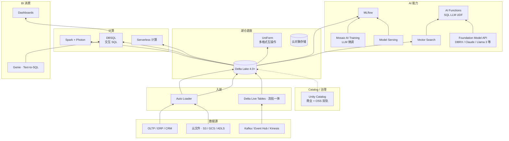

# 案例 · Databricks 数据平台

!!! info "本页性质 · reference · 非机制 canonical"
    基于 Databricks 博客 · 官方文档 · 公开 keynote 整理。机制深挖见 [lakehouse/delta-lake](../lakehouse/delta-lake.md) · [catalog/unity-catalog](../catalog/unity-catalog.md) · [query-engines/compute-pushdown](../query-engines/compute-pushdown.md)。本页讲"**产品演化 · 取舍 · 教训 · 启示**"。

!!! success "对应场景 · 配对阅读"
    本案例 = **Databricks 商业平台全栈**。**场景切面**（Databricks 在具体业务场景的做法）在 scenarios/：
    - [scenarios/bi-on-lake](../scenarios/bi-on-lake.md) §工业案例 · DBSQL + Photon + Genie
    - [scenarios/rag-on-lake](../scenarios/rag-on-lake.md) §工业案例 · Vector Search + AI Functions
    - [scenarios/agentic-workflows](../scenarios/agentic-workflows.md) §工业案例 · Genie Agents
    - [scenarios/text-to-sql-platform](../scenarios/text-to-sql-platform.md) §工业案例 · Genie
    - [scenarios/multimodal-search-pipeline](../scenarios/multimodal-search-pipeline.md) §工业案例 · Vector Search 多模

!!! abstract "TL;DR"
    - **身份**：**工业界最典型的"BI + AI 一体化平台"代表** · 2024-2026 市值千亿级美元
    - **技术哲学**：**"Lakehouse 架构"**（2020 提出 · Delta Lake 作基础）+ **"AI-native 数据平台"**（2023 收购 MosaicML 整合）
    - **核心技术栈演进**：Spark（2013）→ Delta Lake（2019）→ Photon（2020）→ Unity Catalog（2021）→ **MosaicML 收购整合（2023）**→ AI Functions · Vector Search · Foundation Model API（2024+）
    - **2024-2026 里程碑**：DBRX 开源 LLM（2024）· UniForm（2024 Delta 多格式兼容 Iceberg/Hudi）· Unity Catalog OSS 捐 LF AI（2024）· Lakehouse AI 整合产品化
    - **最值得资深工程师看的**：§8 深度技术取舍（Delta vs Iceberg 的"UniForm 赌注" · UC 商业 vs OSS 的双轨策略 · MosaicML 整合中的组织挑战）· §9 真实踩坑（Delta vs Iceberg 生态战 · UC OSS 2024 上路慢）

## 1. 为什么这个案例值得学

Databricks 是**工业数据平台领域 2020-2026 阶段最重要的一家**：
- **Lakehouse 架构**是 Databricks 2020 年提出的范式 · 今天整个行业共识
- **一体化平台**（BI + AI 一套）是本 wiki 核心主张的现实对照（见 [unified/index](../unified/index.md)）
- **商业 + 开源双轨**策略（Delta OSS + Databricks 商业 · UC OSS + 商业）的复杂度管理

**资深读者关注点**：
- **"Delta 生态 vs Iceberg 生态"的商业战争**（§8.1 · 2023-2024 最激烈 · UniForm 是 Databricks 的回应）
- **UC 商业版 vs UC OSS 的双轨**（§8.2 · 决定 UC 能否成为跨 Databricks 的行业标准）
- **MosaicML 整合**（§8.3 · 2023 年最重要的 AI 并购之一 · 2024-2026 产品化挑战）

## 2. 历史背景

Databricks 2013 年成立 · 最初身份是"**Spark 商业化公司**"（由 Spark 原始作者 Matei Zaharia 等创立）。

**关键战略演进**：

| 年份 | 事件 | 战略意义 |
|---|---|---|
| 2013 | Databricks 成立 · Spark 商业化 | Spark 托管平台 |
| 2019 | **Delta Lake 开源** | 从"计算公司"转"存储 + 计算"公司 |
| 2020 | 提出 **Lakehouse 架构** 概念 | 概念领导权 |
| 2020 | Photon 向量化引擎 | 追 Snowflake 性能 |
| 2021 | **Unity Catalog** 发布 | 从"平台"转"治理 + 平台" |
| 2022 | DBSQL 对标 Snowflake | BI 侧扩展 |
| 2023 | **收购 MosaicML $1.3B** | All-in AI |
| 2023 | 推 Lakehouse AI | BI + AI 一体化定位 |
| 2024 | DBRX 开源 132B MoE LLM | 技术品牌建设 |
| 2024 | **UniForm**（Delta 多格式互操作 · 读 Iceberg/Hudi）| 对抗 Iceberg 生态压力 |
| 2024 | UC OSS 捐 LF AI & Data Foundation | 争取行业标准地位 |
| 2025+ | AI Functions + Foundation Model API 深度整合 | SQL LLM UDF 生态战 |

## 3. 核心架构（2026 现代形态）

## 4. 8 维坐标系

| 维度 | Databricks |
|---|---|
| **主场景** | **通用数据 + AI 平台**（BI + ML + LLM 应用一套） |
| **表格式** | **Delta Lake 4.0+**（自家主推）+ **UniForm**（2024+ 读 Iceberg / Hudi） |
| **Catalog** | **Unity Catalog**（商业 + OSS）· **多模资产最全**（Table / Model / Volume / Function / Vector Index） |
| **存储** | 云对象存储（S3 / GCS / ADLS 跨云） |
| **向量层** | **Vector Search**（托管 · Delta 一等公民） |
| **检索** | Vector Search + Hybrid + Reranker 内建 · 接 Model Serving |
| **主引擎** | **Spark + Photon**（向量化 C++ 引擎）· **DBSQL**（交互 SQL） |
| **独特做法** | **"Catalog 作为治理平面"** · 行列级 + Tag 策略 + 血缘跨 BI/ML · 一体化程度业界最深 |

## 5. 关键技术组件 · 深度

### 5.1 Delta Lake · 湖表格式

Databricks 2019 开源的湖表格式。主要特性和 Iceberg 高度重合：
- Snapshot + Transaction log（_delta_log/ 目录）
- Schema Evolution
- Time Travel（`VERSION AS OF` / `TIMESTAMP AS OF`）
- Change Data Feed（CDF）· 2021+

**Delta 4.0（2024+）关键新特性**：
- **Variant 类型**（半结构化 · 对标 Iceberg v3）
- **Identity column**（生成列自增）
- **Row Tracking**（类似 Iceberg v3 row lineage）

详见 [lakehouse/delta-lake](../lakehouse/delta-lake.md)。

### 5.2 UniForm · 2024 多格式互操作

**2024 年 Databricks 对"Iceberg 生态压力"的战略回应**：
- UniForm 让一张 Delta 表**同时被 Iceberg / Hudi 引擎读取**
- 底层数据不动 · 只是暴露 Iceberg / Hudi 的 metadata 视图
- 不是双写 · 是"**一份数据 · 多格式 API**"

**意义**：客户可以"**写 Delta · 读 Iceberg**" · 从而绕过"不得不选一个格式"的困境。对 Iceberg 生态是软抵抗 · 对客户是双保险。

### 5.3 Unity Catalog · 治理平面

**本 wiki [catalog/strategy](../catalog/strategy.md) 的核心参考对象**。

**多模资产一等公民**（行业最完整）：
- Table（Delta / Iceberg / Hudi · 通过 UniForm）
- Volume（文件 · 图/视/音 / 模型 artifact）
- Model（MLflow 模型 · 带 alias）
- Function（UDF · 包括 AI Functions）
- **Vector Index**
- External Location（外部挂载）

**治理能力**：
- 行列级 RBAC
- Tag 策略（`PII` tag 自动 mask）
- 列级血缘（跨 Spark / DBSQL / Python）
- 完整审计

**2024 Unity Catalog OSS 捐 LF AI & Data Foundation** · 争夺行业标准地位（对抗 Polaris / Nessie）。详见 [catalog/unity-catalog](../catalog/unity-catalog.md) · [catalog/strategy](../catalog/strategy.md)。

### 5.4 Photon · 向量化执行引擎

- C++ 重写 Spark 执行层（2020+ 商业版）
- **对标 Snowflake 向量化性能**
- SIMD / 列批 / 编译技术
- 仅在商业版（不开源）· 这是 Databricks 商业护城河之一

### 5.5 Vector Search（2024+）· 向量检索托管

- Delta 表一等向量索引
- HNSW + Hybrid + Reranker
- 和 UC 权限一套
- **2024-2026 快速演进** · 对标 Pinecone / Weaviate / Qdrant

### 5.6 AI Functions · SQL LLM UDF

Databricks 2024+ 推 SQL 里调 LLM / embedding / 分类的函数族（`ai_classify` · `ai_embed` · `ai_generate_text` 等）· 对标 Snowflake Cortex。

**本页不展开 API 细节**（代码示例和产品用法 canonical 在 [query-engines/compute-pushdown](../query-engines/compute-pushdown.md) §4.4）。**本页关注商业意图**：
- SQL LLM UDF 是 Databricks vs Snowflake 2024-2026 产品线趋同的代表
- 两家都赌"SQL 里调 LLM"是 BI 侧 AI 化的主要入口
- 背后是 Foundation Model API（§5.7）的商业护城河

### 5.7 Foundation Model API · LLM Serving

**托管多家 LLM**（DBRX · Llama 3/4 · Claude 代理 · Mistral · etc）· pay-per-token。
- 和 Unity Catalog 权限一套
- AI Functions 后端
- 支持自托管（customer Foundation Models）

### 5.8 MosaicML Integration（2023 收购 → 2024-2026 整合）

2023 年 $1.3B 收购 MosaicML。产品化成 **Mosaic AI**：
- **Mosaic AI Training**（LLM 微调）· 详见 [ml-infra/fine-tuning-data](../ml-infra/fine-tuning-data.md)
- **Mosaic AI Vector Search**（前期的独立产品 · 2024+ 合并到 Databricks Vector Search）
- **Mosaic Foundation Models**（预训练 / 微调基础）
- **DBRX**（2024 开源 132B MoE LLM · 技术品牌）

### 5.9 DBSQL · 对标 Snowflake 的交互 SQL

2022+ 推出 · 是 Databricks 扩展 BI 侧的产品：
- 对标 Snowflake 交互 SQL
- Photon 加速
- 和 UC 深度集成
- **成为 Databricks 商业化的重要支柱之一**

### 5.10 Genie · Text-to-SQL（2024+）

UC 上的 **Text-to-SQL 产品** · 集成 AI Functions。详见 [scenarios/text-to-sql-platform](../scenarios/text-to-sql-platform.md)。

## 6. 2024-2026 关键演进

| 时间 | 事件 | 意义 |
|---|---|---|
| 2023 | MosaicML $1.3B 收购 | All-in AI · 改变 Databricks 战略重心 |
| 2024 | **DBRX 开源**（132B MoE）| 技术品牌 + 竞争 Llama / Mistral |
| 2024 | **UniForm**（Delta 读 Iceberg / Hudi）| 对 Iceberg 生态的战略回应 |
| 2024 | **UC OSS 捐 LF AI**（0.4.1+）| 争夺行业 Catalog 标准 |
| 2024 | AI Functions 大量 GA · Vector Search 深化 | SQL LLM UDF 生态抢占 |
| 2024+ | Mosaic AI Training 整合 | Fine-tuning 产品化 |
| 2025 | Genie Text-to-SQL | BI 侧 AI 化 |
| 2025+ | Lakehouse Monitoring 整合 | BI + ML 监控一体 |

## 7. 规模数字

!!! warning "以下为量级参考 · `[来源未验证 · 示意性 · 多数为 Databricks 官方 blog / keynote 披露]`"

| 维度 | 量级 |
|---|---|
| 客户数 | 10000+ |
| 市值 | 千亿美元级 |
| 每日处理数据 | EB 级（全客户合计） |
| DBRX 模型规模 | 132B 总参数 · 36B active（MoE） |
| Unity Catalog OSS 贡献方 | 20+ 公司 |

## 8. 深度技术取舍 · 资深读者核心价值

### 8.1 取舍 · Delta vs Iceberg · UniForm 的"软投降 or 软主权"

2023-2024 年**湖表格式战争**达到高潮 · Databricks Delta vs Iceberg 社区的竞争激烈：

**Iceberg 的生态优势**：
- Netflix / Apple / LinkedIn / Snowflake / AWS 都支持
- 多引擎生态广（Spark / Trino / Flink / Rust）
- 2024 vendor landscape 倾向 Iceberg

**Databricks 的回应 · UniForm**（2024）：
- **"Delta 内 · 但读 Iceberg / Hudi"**
- 客户写 Delta · 其他引擎按 Iceberg 读
- **战略**：既保 Delta 控制权 · 又开放互操作 · 不被"只能选 Iceberg"绑架

**这是软投降还是软主权**：
- **乐观看**：Databricks 放弃"Delta 独占" · 拥抱互操作 · 客户是赢家
- **怀疑看**：UniForm 在复杂 schema evolution 下有 bug · 实际效果有争议（2024 年多次公开报告）· Databricks 仍坚持 Delta 为 primary

**资深启示**：在湖表格式选择上 · **UniForm 给 Databricks 客户一个不必迁移的选项** · 但**长期 Iceberg 仍占优**。Databricks 的策略是"**保 primary + 兼容 secondary**" · 不是"全部改用 Iceberg"。

### 8.2 取舍 · Unity Catalog 商业 vs OSS 的双轨

UC 商业版（2021+）和 UC OSS（2024 捐 LF AI）是**双轨策略**：

**商业版**：
- 能力最完整（所有治理特性）
- 深度绑定 Databricks 商业平台
- 客户 lock-in

**OSS 版（0.4.1）**：
- 基础功能 + 简化治理
- 开源 · 任何人可部署
- 能争夺行业 Catalog 标准地位

**权衡**：
- **风险**：OSS 太强会蚕食商业版价值
- **机会**：OSS 弱则无法对抗 Polaris / Nessie · Catalog 标准权丢给别家

**Databricks 的选择**：OSS 能力**故意保留基础层** · 高级治理留商业版。这让 OSS "能用但不完美" · 商业升级路径明确。

**资深启示**：**商业开源的双轨设计是精细游戏** · OSS 特性释放节奏直接决定市场格局。

### 8.3 取舍 · MosaicML 整合的组织挑战

2023 年 MosaicML $1.3B 收购后 · 2024-2026 整合挑战：
- MosaicML 原有产品线（预训练 · 微调 · Vector Search）**和 Databricks 原有产品重合**
- 如何合并不伤害客户：
  - Vector Search 独立产品 → 合并到 Databricks Vector Search（2024）
  - Training 能力 → 成为 Mosaic AI Training
  - 品牌 → Mosaic AI 作 umbrella

**整合典型问题**：
- 文化冲突（MosaicML 研究导向 · Databricks 产品导向）
- 客户路径切换（原 MosaicML 客户要迁到 Databricks 平台）
- 开源策略调整（DBRX 开源是整合成果）

**资深启示**：**AI 公司收购 AI 公司**（非平台收购）的整合是 2023-2026 整个行业的共同挑战（参考 Microsoft + Inflection · NVIDIA + Run:ai）。

### 8.4 取舍 · "Lakehouse"叙事 vs 传统数据湖/数仓

Databricks 2020 提出 **Lakehouse 架构**（一篇 [CIDR 2021 论文](https://www.databricks.com/wp-content/uploads/2020/12/cidr_lakehouse.pdf) + 一系列博客）· 声称：**湖的灵活性 + 仓的性能**。

**对 Snowflake 的商业竞争**：
- Snowflake 走"**数仓 + 对接湖**"路径（Polaris 2026 TLP 是反应）
- Databricks 走"**湖 + 上扩数仓**"路径

**2024-2026 观察**：
- 两家在**产品上都 converging**（Snowflake 加 Iceberg 原生 · Databricks 加 DBSQL）
- **客户选择**：看主业务（BI 重 → Snowflake · AI 重 → Databricks · 多半混用）

**资深启示**：**架构概念词（Lakehouse）有商业价值** · 能定义话语权 · 但实际产品能力 converging 的趋势下 · 最终选择看细节。

## 9. 真实失败 / 踩坑

### 9.1 Delta 生态局限（2020-2023）

Delta Lake 2019 开源但**长期被视为"Databricks 的开源"**：
- 其他厂商（Snowflake / AWS / Google）更愿意支持 Iceberg
- 多引擎支持进展慢（Trino 支持 Iceberg 早于 Delta）
- 2023 年 Iceberg 事实上领先

**教训**：**仅靠一家公司主导的开源产品很难成行业标准** · UniForm（2024）是 Databricks 对这一教训的响应。

### 9.2 Unity Catalog OSS 上路慢（2021-2024）

UC 商业版 2021 发布 · 但 **OSS 版拖到 2024 才捐 LF AI**。3 年窗口里：
- Polaris（Snowflake 捐 Apache）抢占 Iceberg Catalog 心智
- Nessie 在 Git-flow 场景站稳
- Gravitino（字节系）进入
- UC OSS 发布时已经不是"第一玩家"

**教训**：**开源时机不能等"产品完美"** · 晚开源的代价是让其他人建立标准。

### 9.3 UniForm 复杂 schema 下 bug 

2024 年客户社区多次报告 UniForm 在复杂 schema evolution 场景的不一致：
- 嵌套类型更改
- 分区演化和 Iceberg 投影的对齐
- 部分操作后 Iceberg 读不出

**教训**：**多格式互操作的复杂度远超技术宣传** · UniForm 不是"无痛兼容"· 生产使用需要详细测试。

### 9.4 MosaicML 整合阶段性产品线混乱

2023-2024 年整合初期：
- Vector Search 有 Databricks Vector Search + Mosaic Vector Search 两个
- Training 产品有 Databricks ML Training + Mosaic Training
- 客户和销售团队都困惑"该选哪个"

2024 年统一成 Mosaic AI 品牌后好转。**教训**：**大型 AI 收购整合期**（1-2 年）产品线混乱是常态 · 客户应关注**统一后的长期形态**。

## 10. 对团队的启示

!!! warning "以下为观点提炼 · 非客观事实 · 选 2-3 条记住即可"
    启示较多（5 条）· 不必全读全用。战略决策 canonical 在 [unified/index §5 团队路线主张](../unified/index.md) · [catalog/strategy](../catalog/strategy.md) · [compare/](../compare/index.md) · 本页启示是**可参考的观察** · 不是建议照搬。

### 启示 1 · 一体化平台价值真实但锁定代价高

Databricks 的一体化平台（BI + ML + LLM）确实好用 · 但**代价是极度 lock-in**（Delta + UC + Photon 都是商业）。

**对中国团队**：
- 有预算 + 合规可接受云厂商 → Databricks / Snowflake 一体化栈可以考虑
- 自主可控需求 → 开源栈（Iceberg + Unity Catalog OSS + Spark + MLflow）更安全

### 启示 2 · UniForm 思路启示本团队的多格式并存

UniForm 证明"**一份数据 · 多格式读**"技术可行。对本团队的启示：
- 如果长期战略是 Iceberg · **可以容忍短期 Delta 写 + Iceberg 读**（UniForm）
- 多格式并存比"一刀切迁移"经济

但要**实测 UniForm 在自己场景的稳定性** · 不要盲信营销。

### 启示 3 · SQL LLM UDF 是下一代竞争焦点

AI Functions + Cortex + BigQuery ML 都在推 "SQL 里调 LLM" 范式。本团队应：
- 关注 [query-engines/compute-pushdown](../query-engines/compute-pushdown.md)
- 评估开源路径（Spark + Ray + vLLM 组合）
- 不要被 "商业 SQL LLM 函数" 锁定

### 启示 4 · Catalog 是生态战的关键

UC OSS 捐 LF AI 不是"开源美德" · 是**抢行业 Catalog 标准**。本团队 Catalog 选型不要只看技术 · 要看**谁背后社区最可能成标准**（见 [catalog/strategy](../catalog/strategy.md)）。

### 启示 5 · 商业开源产品的节奏看清

Databricks OSS 开放的节奏是"**基础层开源 · 高级特性留商业**"。对类似策略：
- **客户**：评估 OSS 能否满足 80% 需求 · 高级特性是否必需
- **开源消费者**：理解"社区版本永远比商业慢一步"是结构性的 · 不是 bug

## 11. 技术博客 / 论文（权威来源）

- **[*Lakehouse: A New Generation of Open Platforms*](https://www.databricks.com/wp-content/uploads/2020/12/cidr_lakehouse.pdf)**（CIDR 2021 · Databricks 提出 Lakehouse）
- **[*Delta Lake: High-Performance ACID Table Storage*](https://databricks.com/wp-content/uploads/2020/08/p975-armbrust.pdf)**（VLDB 2020）
- **[Databricks Engineering Blog](https://www.databricks.com/blog/engineering)** —— 持续更新
- **[DBRX 开源公告](https://www.databricks.com/blog/introducing-dbrx-new-state-art-open-llm)** （2024）
- **[UniForm 发布](https://www.databricks.com/blog/)**（2024）
- **[Unity Catalog OSS 捐 LF AI](https://www.databricks.com/blog/)**（2024）
- **[Mosaic AI Training 产品页](https://www.databricks.com/product/machine-learning/mosaic-ai)**

## 12. 相关章节

- [Delta Lake](../lakehouse/delta-lake.md) —— Delta 机制 canonical
- [Unity Catalog](../catalog/unity-catalog.md) · [Catalog 策略](../catalog/strategy.md) —— UC 深挖
- [Compute Pushdown](../query-engines/compute-pushdown.md) —— AI Functions / SQL LLM UDF
- [Lake + Vector 融合架构](../unified/lake-plus-vector.md) —— 一体化架构视角
- [LLM Fine-tuning](../ml-infra/fine-tuning-data.md) —— Mosaic AI Training
- [MLOps 生命周期](../ml-infra/mlops-lifecycle.md) —— Lakehouse AI 机制层
- [案例 · Snowflake](snowflake.md) —— 竞争对手对比
- [案例 · Netflix · LinkedIn · Uber](studies.md) —— 同代案例
- [Iceberg vs Paimon vs Hudi vs Delta](../compare/iceberg-vs-paimon-vs-hudi-vs-delta.md)
- [Vendor Landscape](../frontier/vendor-landscape.md) —— 厂商选型全景
