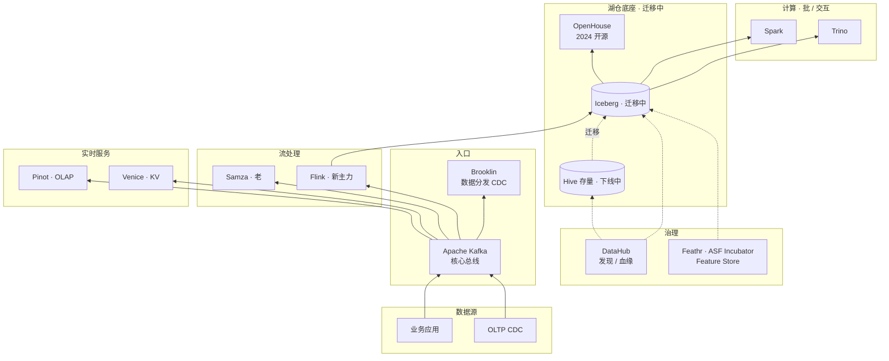

# 案例 · LinkedIn 数据平台

!!! info "本页性质 · reference · 非机制 canonical"
    基于 LinkedIn 公开博客 / 论文 / 技术分享。机制深挖见对应技术栈章（[pipelines/kafka-ingestion](../pipelines/kafka-ingestion.md) · [compare/streaming-engines](../compare/streaming-engines.md) · [ml-infra/feature-store](../ml-infra/feature-store.md) 等）· 本页讲"**历史 · 规模 · 取舍 · 教训 · 启示**"。

!!! abstract "TL;DR"
    - **身份**：**开源界的重型卡车** · Kafka / Pinot / Samza / Venice / DataHub / Feathr / **OpenHouse** 全家桶诞生地
    - **2024 重大事件**：**OpenHouse 开源**（基于 Iceberg 的 OSS 湖仓管理层）+ **Feathr 捐 Apache**（2024 入 Incubator）+ **从 Hive 迁 Iceberg 大规模进行**
    - **设计哲学**：**"分离关注点 · 每个系统专门做好一件事"** —— 和 Netflix 自治哲学一脉相承 · 但更产品化
    - **规模量级**（`[来源未验证 · LinkedIn Engineering Blog 多次披露 · 具体数字年份差异大]`）：10 亿+ 用户 · 每日数百 PB 事件 · Kafka 集群 7000+ broker · Pinot 200k+ QPS · Venice 百万级 QPS
    - **最有价值启示**：**"先做对一件事再做对下一件"** · 单品开源 + 生态参与的长期主义 · 商业化友好（Kafka → Confluent · DataHub → Acryl Data）
    - **最值得资深工程师看的**：§5.7 OpenHouse 架构（2024 最新）· §9 深度技术取舍（Samza vs Flink / Venice vs Cassandra / Iceberg 迁移顺序）

## 1. 为什么这个案例值得学

LinkedIn 的独特性：**工业界最成功的"单品开源 + 商业化培育"案例库**：
- Kafka（2010）→ Confluent（2014 估值百亿美元）
- Pinot（2014）→ StarTree（2022+ 商业化）
- DataHub（2019）→ Acryl Data（2022+ 商业化）
- 每一个单品都**在自己领域成为事实标准或领头**

**资深读者关注点**：
- LinkedIn 是怎么**把内部工具培育成开源 + 商业化成功**的（§11 启示 1-3）
- LinkedIn 2024 的**数据平台现代化大迁移**（Hive → Iceberg · Azkaban → 现代 scheduler · OpenHouse 新层）

## 2. 历史背景 · Kafka 之前

2005-2010 年 LinkedIn 的核心痛点：
- 各业务（profile / message / newsfeed / jobs）都要**同步数据**给其他系统
- 每增加一个消费方 → 生产方代码改一次
- 数据不一致 · 各系统各算

**Jay Kreps 团队 2010 年提出** ："**Log 作为统一抽象**" —— 后来成为 Kafka 的设计哲学 · 也写进了业界最著名的一篇工程博客 [*The Log: What every software engineer should know about real-time data's unifying abstraction*](https://engineering.linkedin.com/distributed-systems/log-what-every-software-engineer-should-know-about-real-time-datas-unifying)（2013）。

Kafka 作为"**生产方只写一次 · 消费方自行订阅**"的数据总线 · 解决了 N × M 的问题。后来所有的其他 LinkedIn 系统（Samza / Venice / Pinot 实时路径）都**基于 Kafka 构建**。

## 3. 核心架构（2024-2026 现代形态）

## 4. 8 维坐标系

| 维度 | LinkedIn |
|---|---|
| **主场景** | 岗位 / 人 / 内容**多模检索 + 推荐** + 实时 OLAP（面向外部用户的 dashboard） + Feature Store 重度 |
| **表格式** | **Iceberg**（2023+ 迁移中）· Hive（存量下线中） |
| **Catalog** | 内部（DataHub 做发现 / 血缘）· 2024+ **OpenHouse** 作 Iceberg 管理层 |
| **存储** | HDFS + 对象存储（AWS / 自建）|
| **向量层** | 自研 · 和推荐 / 搜索深度耦合（非独立通用向量库） |
| **检索** | **Dense + 结构化特征 + Learning-to-rank** · 是工业界标杆 |
| **主引擎** | Spark（批）· Trino（交互 · 2024+ 替 Presto）· Flink（流）· 自研 Serving |
| **独特做法** | **单品开源 → 商业化生态培育** 路径 · 7+ 个毕业的 Apache TLP |

## 5. 关键技术组件 · 深度

### 5.1 Kafka（2010）· 分布式日志平台

LinkedIn 最著名的发明。后来 Confluent（2014）商业化 · 成为分布式日志事实标准。

- 设计哲学：**"Log 作为统一抽象"** —— 生产方追加只读 log · 消费方订阅按 offset
- 现代规模：LinkedIn 内部 Kafka 集群 **7000+ broker · 每日数百 PB 事件** `[来源未验证 · 量级参考]`
- 2024+ 演进：KRaft mode（弃 ZooKeeper）· Tiered Storage · Kafka 4.0

详见 [pipelines/kafka-ingestion](../pipelines/kafka-ingestion.md) · [compare/streaming-engines](../compare/streaming-engines.md)。

### 5.2 Apache Pinot（2014 · 2018 毕业）· 实时 OLAP

**给面向外部用户的大屏**用（p99 < 100ms）：
- **Segment 模型**（不可变分段）
- 实时 + 离线 ingestion 双路
- **StarTree Index**（多维预聚合 · Pinot 独特创新）
- 多租户强

规模：200k+ QPS · 10+ trillion 事件 / 月 `[来源未验证 · 量级参考]`

2022+ StarTree Inc 商业化 · 成为 Apache Pinot 主要商业支持方。

详见 [compare/olap-accelerator-comparison](../compare/olap-accelerator-comparison.md)。

### 5.3 Venice（2019 · 开源）· 分布式 KV · Feature Store 在线 store

为 ML 模型特征服务设计：

- **Read-optimized**（写走 Kafka push）
- 从 Hadoop 批量加载 + 实时 Kafka 增量
- **Feature Store 的在线 store** 实现
- ms 级 p99 · 百万级 QPS

**资深洞察**：Venice 的设计回答了"**ML 推理需要什么样的 KV**"这个工业问题 —— 答案不是通用 KV（Cassandra / DynamoDB）· 而是"**批量加载为主 + 实时增量 + 读优化**"的专用 KV。这个范式被后来的 Tecton Online Store 继承。

### 5.4 DataHub（2019）· 数据发现 + 血缘

**现代开源 Data Catalog 的领头产品之一**：
- 统一 Catalog 多源头（DB / 湖表 / ML 模型 / Notebook）
- 列级血缘（跨 Spark / Trino / dbt）
- 质量 / 文档 / 所有权
- 2022+ Acryl Data 商业化（DataHub Cloud）

和 Amundsen（Lyft）· OpenMetadata 并列为三大开源 Catalog / 元数据发现工具。

### 5.5 Feathr（2022 → **2024 捐 Apache**）· Feature Store

**2024 年 Feathr 捐赠给 Apache 基金会 · 进入 Apache Incubator** · 这是 2024 LinkedIn 数据栈的重要事件。

- 对接 Spark + Azure + Redis
- 支持流 + 批 + 图特征
- 声明式 DSL（类似 Feast 但语法不同）

详见 [compare/feature-store-comparison](../compare/feature-store-comparison.md) · [ml-infra/feature-store](../ml-infra/feature-store.md)。

### 5.6 Samza（2013）→ Flink（2022+ 主力）

Samza 是 LinkedIn 早期的流处理引擎 · Kafka 原生 · **本地 state + Kafka-log-as-WAL** 思想早于 Flink。

**但 2020+ 起 LinkedIn 主流迁向 Flink** · Samza 维护进入"只修不新"状态。这是 LinkedIn **敢承认自研不一定最优**的例子。

### 5.7 OpenHouse · 2024 开源 · **LinkedIn 2024 最重要的数据平台贡献**

**[OpenHouse](https://github.com/linkedin/openhouse)** 是 LinkedIn 2024 开源的 **湖仓管理层**：

- **基于 Apache Iceberg** · 扩展 table management API
- 提供：表注册 / Schema 生命周期 / 分区管理 / 统计维护 / TTL policy / GDPR 删除
- 定位："**Iceberg 之上的运维控制平面**" —— 不是另一个 Catalog · 是 Catalog 之上的 table 运维层

**为什么 OpenHouse 重要**：
- 解决了"有了 Iceberg 表 · 但谁来 compact · 谁来 expire snapshot · 谁来执行 GDPR 删除"的**运维空白**
- 这些能力以前散在 Airflow DAG / 自建脚本里 · OpenHouse 提供统一管理

**和 Netflix Metacat 对比**：
- Metacat = Catalog 联邦（元数据发现）
- OpenHouse = **Iceberg 运维控制平面**（table lifecycle）
- 两者层次不同 · 可以并存

### 5.8 Iceberg 迁移（2023-2026 进行时）

LinkedIn 自 2023 年启动 Hive → Iceberg 大规模迁移。**这是 LinkedIn 2024 最大的工程项目之一**：
- 存量百 PB 级 Hive 表
- 业务团队几千人
- 迁移窗口 2-3 年

**策略参考 Netflix** · "一张表试点 · 双写 · 流量切换 · 下线"的渐进方式。

## 6. 2024-2026 关键演进

| 时间 | 事件 | 意义 |
|---|---|---|
| 2023 | Iceberg 迁移启动 | 湖表从 Hive 全面现代化 |
| 2024 | **OpenHouse 开源** | Iceberg 之上的运维控制平面 |
| 2024 | **Feathr 捐 Apache**（Incubator）| Feature Store 走社区化路径 |
| 2024 | Samza 维护降级 · Flink 主力 | 承认自研不一定最优 |
| 2024+ | Trino 替代 Presto 生态对齐 | 统一 SQL 引擎 |
| 2025+ | Venice 继续演进 · 更多 OSS 贡献 | KV Feature Store 标准化 |

## 7. 规模数字

!!! warning "以下为量级参考 · `[来源未验证 · 示意性 · LinkedIn Engineering Blog 各次披露差异大]`"

| 维度 | 量级 |
|---|---|
| 用户 | 10 亿+ |
| 日事件 | 数百 PB |
| Kafka 集群 broker | 7000+ |
| Pinot 查询 QPS | 200k+ |
| Venice 请求 QPS | 百万级 |
| Hadoop 集群节点 | 10000+ |

## 8. 深度技术取舍 · 资深读者核心价值

### 8.1 取舍 · "单品专精 vs 大一统平台"

LinkedIn 的明确选择：**每个子领域深度专精一个系统**（Kafka 专流 · Pinot 专 OLAP · Venice 专 KV · DataHub 专治理）· **不追求 Databricks 式的"一套系统统一全部"**。

**权衡**：
- 专精：每个系统可以做到行业最强 · 可开源 · 可商业化
- 大一统：开发者体验好 · 但每个子能力只能做到"及格"

**LinkedIn 选专精的代价**：
- 系统之间集成复杂（7-8 个系统各有边界）
- 开发者需要理解多套 API
- 平台团队要维护多套 infrastructure

**但回报**：每个系统都成为行业标杆 · **商业化估值千亿级**（Confluent + StarTree + Acryl Data 合计）。

### 8.2 取舍 · Samza → Flink 的"敢迁移"决心

LinkedIn 2010 年代坚持 Samza 作流处理主力 —— 但 2020+ Flink 社区更强 · Samza 特性追不上。

**2022-2024 迁移 Samza → Flink**。这需要巨大决心：
- Samza 是自己发明的系统 · 迁移意味着承认"别家的更好"
- 内部几千个 Samza job 要重写
- Kafka-native 特性要重新实现

**这种"敢迁移"是工业界的稀缺品质**。相比之下很多公司宁愿"内部 fork 续命"也不承认自家系统落后。

### 8.3 取舍 · Venice vs 通用 KV（Cassandra / DynamoDB）

LinkedIn 2019 开源 Venice 时 · 业界已有 Cassandra · DynamoDB · 为什么重造轮子？

**Venice 的差异化**：
- **写路径走 Kafka push**（不是客户端直写）· 解决了"写 QPS 失控"的问题
- **批量加载 + 实时增量**一等支持（通用 KV 往往把 bulk load 当次要功能）
- **read-optimized 存储**（对 ML feature 读负载极致优化）

**资深洞察**：当你的负载**有强特定模式**（如 ML Feature Store 的"99% 读 + 周期性批更新 + 流增量"）· 专用系统**可以明显优于通用系统**。通用性 vs 专业性的取舍是工业软件永恒主题。

### 8.4 取舍 · OpenHouse vs Iceberg Catalog + 自建脚本

2024 年很多公司做 Iceberg 运维靠"Catalog（Polaris/UC/HMS）+ Airflow 自建脚本"。LinkedIn 开源 OpenHouse 的理由：
- 自建脚本在**每家重复造** · 跨公司不能复用
- Table lifecycle policy（TTL / GDPR / Compaction）需要**一等抽象** · 不是一堆脚本
- 开放这一层让 Iceberg 生态更完整

**OpenHouse 是否会取代 Catalog**：不会。它是 Catalog 之上的控制平面 · Catalog 依然必需（见 [catalog/strategy](../catalog/strategy.md)）。

## 9. 真实失败 / 踩坑

### 9.1 Azkaban → 未能跟上现代 scheduler

Azkaban 是 LinkedIn 2012 自研的 scheduler · 早于 Airflow。但 2020+ 随着 Airflow / Dagster / Prefect 演进 · Azkaban 特性明显落后。**LinkedIn 内部逐步切到 Airflow + 自研 · Azkaban 仍在用但维护降级**。

**教训**：**调度系统是长期投入** · 如果你不准备持续 3+ 人年投入 · 就别自研 · 用 Airflow / Dagster 省事。

### 9.2 不要把 LinkedIn 全栈照搬

LinkedIn 10 亿用户 · 你可能 100 万。**很多 LinkedIn 内部系统是过度工程**（对小规模场景）：
- Venice 对应 ≤ 10 万 QPS 场景可以直接用 Redis · 不需要上 Venice
- Pinot 对应内部大屏（< 100 用户）可以用 ClickHouse / Druid · 不需要 Pinot

**教训**：工业案例要**按规模打折** · 不要直接复制。

### 9.3 Hive 迁 Iceberg 的低估

LinkedIn 初期 Iceberg 迁移计划是"18 个月完成" · 实际 2023-2026 进行中（已经 3 年+）。大规模 Hive → Iceberg 迁移的**隐性成本**：
- 业务团队教育（几千人）
- 下游 SQL / 工具链适配
- 双写期双运维成本

**教训**：**大规模表格式迁移 = 组织工程 · 不是技术工程** · 时间估算 × 2 起步。

## 10. 对团队的启示

!!! warning "以下为观点提炼 · 非客观事实 · 选 2-3 条记住即可"
    启示较多（5 条）· 不必全读全用。战略决策 canonical 在 [unified/index §5 团队路线主张](../unified/index.md) · [catalog/strategy](../catalog/strategy.md) · [compare/](../compare/index.md) · 本页启示是**可参考的观察** · 不是建议照搬。

### 启示 1 · "先开源一个单品"

LinkedIn 的方式：**每个子领域开源一个 SOTA 级产品**。对应中国互联网大厂：**"先做对一件事"**（字节 CloudWeGo / 阿里 Paimon 都是好例子）· 而不是"ByteLake + ByteFlow + ByteXXX 全家桶"。

### 启示 2 · 工具链"接口标准化 · 实现各家"

LinkedIn 各个产品的协作靠 **Kafka 作为公共消息总线**。加组件只要接 Kafka。这比"强制用一套平台"灵活得多。

### 启示 3 · 商业化友好的开源

Kafka → Confluent · DataHub → Acryl · Pinot → StarTree。LinkedIn 公司**主动支持商业化**（不是阻止）· 让**开源生态真正活下来**。

**对中国团队**：开源不要追求"控制" · 让社区和商业公司有成长空间 · 回报是持续的人才和技术外部性。

### 启示 4 · 组织架构对齐

LinkedIn 有**独立平台组** · 不是各业务自建。数据工程师可以在**一套标准栈上快速迭代**。但平台组**不强制** · 给业务选择权（Samza → Flink 的自然迁移就是这种文化）。

### 启示 5 · 敢承认自研不是最优

Samza → Flink 是 2024 LinkedIn 展现的**稀缺品质**。工业界太多"自家系统绑死死撑"的案例 · LinkedIn 敢于**让更好的社区产品取代自研** · 是长期主义的体现。

## 11. 技术博客 / 论文（权威来源）

- **[LinkedIn Engineering Blog](https://engineering.linkedin.com/)** —— 数据类文章长期高质量
- **[*The Log: What every software engineer should know*](https://engineering.linkedin.com/distributed-systems/log-what-every-software-engineer-should-know-about-real-time-datas-unifying)**（Jay Kreps）—— 行业经典
- **[Pinot 设计文档](https://docs.pinot.apache.org/)**
- **[Venice 论文 + 博客](https://engineering.linkedin.com/)**（2019）
- **[DataHub 博客](https://blog.datahubproject.io/)**
- **[OpenHouse 开源公告](https://engineering.linkedin.com/)**（2024）
- **[Feathr 捐 Apache 公告](https://engineering.linkedin.com/)**（2024）
- *Designing Data-Intensive Applications*（Kleppmann · 前 LinkedIn 工程师）—— **行业必读**
- *Streaming Systems*（Tyler Akidau）
- *Kafka: The Definitive Guide*（2nd ed., 2021）

## 12. 相关章节

- [Kafka 到湖](../pipelines/kafka-ingestion.md) —— Kafka 作数据总线
- [流处理引擎对比](../compare/streaming-engines.md) —— Samza / Flink 对比
- [OLAP 加速副本对比](../compare/olap-accelerator-comparison.md) —— Pinot 对比
- [Feature Store 横比](../compare/feature-store-comparison.md) —— Feathr 对比
- [catalog/](../catalog/index.md) —— DataHub 在 catalog 生态
- [案例 · Netflix](netflix.md) · [案例 · Uber](uber.md) —— 同代案例
- [案例综述](studies.md) · [Modern Data Stack](../frontier/modern-data-stack.md)
