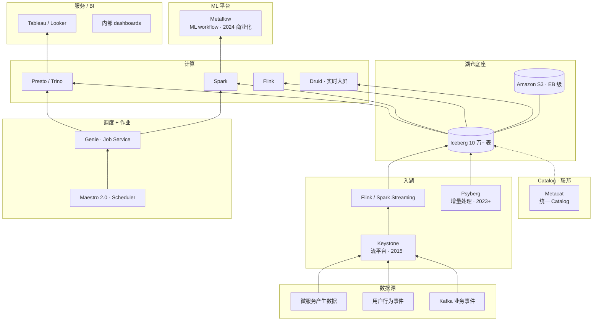

# 案例 · Netflix 数据平台

!!! info "本页性质 · reference · 非机制 canonical"
    本页基于 Netflix 公开博客 / 论文 / 技术分享整理 · 按统一 12 节坐标系拆解 · **不复述机制原理**（机制见 [lakehouse/iceberg](../lakehouse/iceberg.md) 等技术栈 canonical）· 本页只讲"**历史 · 规模 · 取舍 · 教训 · 启示**"。数字和具体实现以各公司最新公开材料为准 · 本页有**时效性** · 按 ADR 0007 SOP 定期复检。

!!! success "对应场景 · 配对阅读"
    本案例 = **Netflix 全栈视角**。**场景切面**在 scenarios/：
    - [scenarios/bi-on-lake](../scenarios/bi-on-lake.md) §工业案例 · Netflix Iceberg + Trino BI
    - [scenarios/offline-training-pipeline](../scenarios/offline-training-pipeline.md) §工业案例 · Netflix Metaflow

!!! abstract "TL;DR"
    - **身份**：Apache Iceberg **诞生地**（2017 Ryan Blue）· 2026 仍是 Iceberg v3 spec 演进的核心贡献方（和 Apple / LinkedIn / Databricks 共推）
    - **规模量级**（来源：Netflix Tech Blog 系列文章 · 2023-2024 各次披露 · `[具体数字依年份公开程度差异大]`）：**10 万+** Iceberg 表 · **EB 级** S3 · **3M+** Presto 查询 / 日 · 10 万+ Spark 作业 / 日
    - **技术栈关键**：Iceberg + S3 + Metacat（Catalog 联邦）+ Genie（Job Service）+ Maestro（Scheduler）+ Metaflow（ML Platform）+ Keystone（流）+ Psyberg（2023 增量处理）
    - **最有价值教训**：**"从一张小表试点"开始的迁移哲学** · **"Self-Service 工具 > 集中化服务"的平台理念** · 开源贡献即招聘广告
    - **2026 关键演进**：Metaflow 2024 商业化（Outerbounds 公司）· Maestro 2.0 · Psyberg 增量处理 · Iceberg v3 spec 共建（row lineage · deletion vector · multi-table transaction · Geo 类型）
    - **最值得资深工程师看的**：§9 深度技术取舍（Presto/Trino 主键 · HMS → Iceberg 迁移 · Catalog 联邦 vs 统一）· §10 真实失败（3 个公开承认的弯路）

## 1. 为什么这个案例值得学

Netflix 不是"规模最大"（LinkedIn / Uber / 阿里数据量都可以和它比）· 但它是**工程方法论影响最深远**的一家：
- **Iceberg 从 Netflix 一家的内部项目 · 演化成整个行业的湖表标准**（2021 起 · Iceberg v2 后所有主流厂商都支持）
- **"Self-Service 工具优先"的平台哲学**影响了 Meta / Uber / Databricks 的 ML 平台设计
- **开源即权威 + 招聘广告**策略被整个湾区大厂复制

**资深读者关注点**：Iceberg 是**怎么从内部实验演化成行业标准的** · 背后的治理和社区策略（§9 会深挖）。

## 2. 历史背景 · 2012-2017 Hive 时代的困境

Netflix 早期数据栈（2012-2016）：
- 存储：HDFS（后来 S3）
- Catalog：Hive Metastore
- 引擎：Pig · MapReduce · Spark · Presto（2015 内部部署）

**到 2016 遇到的系统性痛点**：
- HMS 单点 + 百万分区 → 查询 planning 分钟级
- Schema 演化手工乱改 → 历史数据错位
- 并发写同一分区 → 数据损坏
- 跨 region S3 → rename 不原子（S3 PutObject 非 atomic 且 consistency 弱）
- **用户抱怨**：分析师一个简单查询要等 30 分钟

### 2017-2018 · Iceberg 诞生

**Ryan Blue** 团队（Netflix 当时的 data engineering lead）提出：**把表 ACID 从 HMS 迁到对象存储 + metadata 文件**。

核心创新：
- Manifest 索引文件（让 planning 秒级）
- **Snapshot 原子提交**（对象存储 CAS 上做 ACID）
- 列 ID（schema evolution 不破坏历史数据）
- Hidden partitioning（用户查询不用关心分区列表达式）

2018 贡献给 Apache。到 2021-2022 年 Iceberg v2 成熟 · 多引擎生态爆发。

**关键决策**：Netflix **没有私有化这个方案** · 第一天就是开源。这和 Uber 的 Hudi / Databricks 的 Delta 形成鲜明对比（后两者初期都相对内部化）。

## 3. 核心架构（现代形态）

## 4. 8 维坐标系

| 维度 | Netflix |
|---|---|
| **主场景** | 大规模批分析 + 流处理 + ML 训练 + Studio 制作端数据 |
| **表格式** | **Iceberg**（诞生地 · v1/v2/v3 持续共建） |
| **Catalog** | **Metacat**（联邦 HMS / Iceberg / RDS / ES）· 2023+ 向 Iceberg REST 演进 |
| **存储** | Amazon S3（EB 级）· 少量本地 NVMe cache |
| **向量层** | 独立专用系统 · 非一等公民 |
| **检索** | 业务场景内（推荐 / 搜索不走通用湖仓栈） |
| **主引擎** | **Presto / Trino**（交互主力 · 自建 fork）· Spark（批）· Flink（流）· Druid（实时大屏） |
| **独特做法** | **表格式即开放协议** · 从 day 1 就是多引擎中立（不绑任何一家） |

## 5. 关键技术组件 · 深度

### 5.1 Metacat · 联邦 Catalog（不是统一 Catalog）

开源：[Netflix/metacat](https://github.com/Netflix/metacat)

**设计哲学的特别之处**：Metacat 不是"统一 Catalog"（像 Unity Catalog 那种一元化）· 而是**联邦**——Hive / Iceberg / RDS / Elasticsearch 各自 metastore 保留 · Metacat 作上层统一 API。

- 元数据统一查询 API（跨 store 搜索表）
- 血缘追溯（列级 · 跨引擎）
- 商业组件：没有商业化 · 纯内部工具 · 社区接受度不如 DataHub / Amundsen

**资深洞察**：Metacat 的联邦思路后来被 Apache Gravitino（2023+）继承并泛化到"联邦多 Catalog"。Netflix 自己 2024+ 也在考虑向 **Iceberg REST Catalog 标准迁移** · Metacat 可能长期演化为 REST Catalog 的联邦层。

### 5.2 Genie · Job Service

[Netflix/genie](https://github.com/Netflix/genie)

- 提交 Spark / Hive / Presto / Pig 作业的**统一 API**
- 资源路由（按集群负载 / 权限 / 版本）
- 作业历史追溯（元数据完整）

**为什么有价值**：Genie 把"作业提交"从客户端机器抽离到统一服务 · 这样升级 Spark / Presto 集群时客户端**零感知**。这个范式 2024+ 被 Databricks Jobs / Databricks Connect 和其他托管平台广泛采用。

### 5.3 Maestro · Scheduler · 2022 开源

替代 Airflow 的内部 scheduler · 2022 开源 · **2024 Maestro 2.0**：
- **资产为中心**（Asset-oriented · 和 Dagster 思想接近）
- 每日作业十万级
- 内部数据血缘深度集成（Metacat + Genie）

**资深洞察**：Maestro 2.0 是"**workflow DAG + asset graph**"的混合设计 · 既能描述作业依赖（像 Airflow）· 又能描述数据资产依赖（像 Dagster）。这种混合范式 2025+ 逐渐成为新 scheduler 的主流方向。

### 5.4 Metaflow · ML Platform · 2019 开源 · 2024 商业化

[metaflow.org](https://metaflow.org/) · Netflix 开源的 ML workflow 工具。

- Python-first · 无 DSL
- 自动版本化（run / artifact / param / metric）
- 云 / 本地统一（本地开发 → 云端生产零改）
- **2024 年 Outerbounds 公司**（由 Metaflow 创始人创立）成立 · 提供商业托管 Metaflow

**对比 MLflow**：Metaflow 更偏"pipeline 原生 + Notebook 友好" · MLflow 更偏"实验追踪 + model registry"。Netflix 内部实际两者并用（Metaflow 作 pipeline · MLflow 作 Registry）。

详见 [ml-infra/mlops-lifecycle](../ml-infra/mlops-lifecycle.md) 和 [ml-infra/experiment-tracking](../ml-infra/experiment-tracking.md)。

### 5.5 Psyberg · 2023 增量处理新方案

Netflix 2023 公开的**增量批处理框架**：
- 解决"处理过去 30 天数据·只想算新增变更的行"问题
- 基于 Iceberg Incremental Scan + Hudi-like CDC 思路
- 目前未开源 · 内部主力

**技术洞察**：Psyberg 的出现标志着 Netflix 从"批扫全表 + 流式 ETL 分离"转向"**增量批**（ingestion-time incremental batch）的三态模型"。这对湖仓未来方向有启示。

## 6. 2024-2026 关键演进

| 时间 | 事件 | 意义 |
|---|---|---|
| 2023 | Psyberg 增量处理公开 | 湖仓三态（批/流/增量批）三位一体 |
| 2023 | Maestro 2.0 | asset + workflow 混合范式 |
| 2024 | Metaflow 商业化（Outerbounds）| OSS → 商业化的成功路径 |
| 2024 | Iceberg v3 RFC 活跃参与（row lineage · deletion vector · multi-table tx · geo type）| Netflix 仍是 spec 关键贡献方 |
| 2025 | Keystone → 基于 Flink 现代化 | 流平台现代化 |
| 2025+ | 向 Iceberg REST Catalog 标准迁移讨论 | Metacat 长期定位 |

## 7. 规模数字

!!! warning "以下为量级参考 · `[来源未验证 · 示意性 · 依 Netflix Tech Blog 各次披露差异大]`"
    具体数字因年份 / 公开程度不同有较大差异 · 读者应理解为"**量级**" · 不作为基准。

| 维度 | 量级 |
|---|---|
| Iceberg 表总数 | **10 万+** |
| 最大单表 | **PB 级** |
| S3 总量 | **EB 级** |
| 每日新增数据 | **PB 级** |
| 每日查询（Presto）| **3M+** |
| Spark 作业 / 日 | 10 万+ |
| Schema Evolution 频率 | **日常操作** |
| Time Travel 使用 | **常规 debug 工具** |

### Iceberg 使用的典型模式

- **主键升级**：业务库 schema 变更 → Iceberg 表 alter column → **零停机**
- **大表重构**：改分区策略 · **不改历史数据**（hidden partitioning 让这成为可能）
- **批 + 流并存**：同一张表批作业夜间重写 / 流作业持续追加 · 靠 snapshot isolation 不冲突
- **审计与回滚**：生产事故后 `CALL rollback_to_snapshot` · 毫秒级回滚

## 8. 深度技术取舍 · 资深读者核心价值

### 8.1 取舍 · Presto / Trino 主路径 vs Spark SQL 主路径

Netflix 选择 **Presto / Trino** 作交互查询主路径（而非 Spark SQL）· 2026 仍如此。

**权衡维度**：
- Trino：交互延迟低（秒-十秒级）· 但批处理弱
- Spark SQL：批处理强（小时级）· 但交互延迟不稳定

**Netflix 的取舍**：
- 交互 / 探索性查询（分析师 · 日常几万次）→ Trino
- 批 ETL · ML 训练数据准备 → Spark
- **两套并存 · 不追求"一个引擎统一"**

**对比其他家**：Databricks 试图用 DBSQL / Photon 把两条路线合并 · Netflix 明确不走这条路（认为两种负载本质不同）。

### 8.2 取舍 · 联邦 Catalog（Metacat）vs 统一 Catalog（UC / Polaris）

Netflix **坚持联邦** · 不追求统一 Catalog。

**理由**：
- 存量 HMS / RDS / ES 数据量太大 · 迁到统一 Catalog 成本不划算
- 业务系统多样 · 强统一会降低各业务灵活性
- 开放的 Iceberg REST + Metacat 外层 = 可以**渐进迁移**

**代价**：
- 治理（权限 / 血缘 / 审计）不如统一 Catalog 干净
- 跨 store 查询复杂度高

**对资深读者启示**：联邦 vs 统一是**组织 vs 工程效率的 tradeoff** · 不存在哪个绝对更好。Netflix 规模大组织分布 → 联邦合适。中小团队通常反过来（统一 Catalog 一次做对更经济）。

### 8.3 取舍 · Keystone 流平台 vs 业务自建 Flink

Keystone 是 Netflix 2015 年起的流平台 · 作"公司统一的流式处理入口"。但**业务团队实际用 Keystone 的比例一直不高** · 很多团队直接用自己的 Flink 集群。

**为什么 Keystone 没有成为"强制标准"**：
- 早期 Keystone 技术栈（Samza-based 等）限制大
- 业务团队对流处理的需求差异大（有些只需 Kafka 订阅 · 有些需要复杂 window）
- Netflix 文化尊重团队自治

**2025 Keystone 现代化（Flink-based）** 后 · 更多团队开始采用 · 但"不强制"的文化保留。

**资深洞察**：平台产品和业务团队的关系——**"给工具不给规定"** 往往比"强制 adoption" 更健康。

## 9. 真实失败 / 踩坑（工业案例最稀缺的信号）

Netflix 公开承认过的弯路：

### 9.1 早期 Kafka 入湖方案多轮失败

2014-2017 年多次尝试"Kafka → HDFS / S3 入湖"方案：
- Camus（LinkedIn 开源）不满足一致性要求 → 自建
- 自建方案两代都未达 SLA
- 最终 2018+ 收敛到 **Iceberg + Flink CDC** 路径 · 才稳定

**教训**：不要低估 streaming ingestion 的**正确性要求**（exactly-once + schema evolution + backfill）· 自建路径往往 3 年起步。

### 9.2 Druid → 自研 OLAP 尝试失败

2018 年左右尝试**用 Pinot 精神自研 OLAP**（替代 Druid）· 项目进行约 1.5 年后放弃 · 回到 Druid。

**教训**：OLAP 存储引擎是**高投入项目**（十几人年起步）· 除非有**极度差异化需求** · 不要重造轮子。

### 9.3 自研 Scheduler（Maestro）花 3 年迭代

Maestro 早期 2019-2020 版本相当不成熟 · 业务团队抗拒使用。直到 2022 Maestro 2.0 公开开源时才真正稳定。

**教训**：**平台产品 3 年起步是常态** · 不要期望"半年做一个成熟工具"。

## 10. 对团队的启示

!!! warning "以下为观点提炼 · 非客观事实 · 选 2-3 条记住即可"
    启示较多（5 条）· 不必全读全用。战略决策 canonical 在 [unified/index §5 团队路线主张](../unified/index.md) · [catalog/strategy](../catalog/strategy.md) · [compare/](../compare/index.md) · 本页启示是**可参考的观察** · 不是建议照搬。

    这些启示是**本 wiki 对 Netflix 经验的主观解读** · 未必适用所有团队。不同规模 / 文化 / 组织结构需要各自调整。

### 启示 1 · "从一张小表开始"的迁移哲学

Netflix 不是一天切到 Iceberg。**2017 年第一张 Iceberg 表只有几 GB** · 然后逐步迁移 3+ 年。

- **对中小团队**：别一次性推 PB 级迁 · **先挑一张痛点表**（如"最近 schema 演化出事过的"）试点
- **对大团队**：迁移是组织工程 · 不是技术工程 · 花在"业务团队教育 + 工具链成熟"的时间远超代码

### 启示 2 · 治理先于技术

Metacat 的意义不在技术 · **在"全公司一个 Catalog"的组织共识**。没有这个共识 · 工具再好也乱。

### 启示 3 · 开源贡献即招聘广告

Netflix 开源 Iceberg / Metaflow / Maestro 不是纯公益 · 是**建立技术权威 → 吸引顶尖工程师**。这个策略后来被 Uber / LinkedIn / 字节 / 阿里都复制。

### 启示 4 · Self-Service > 集中化服务

Genie / Maestro / Metaflow 本质都是 **"让数据工程师自己来"**。中心团队做**平台**（提供工具 + golden path）· 不做**服务台**（代业务执行）。

### 启示 5 · 持续开源生态投入

Iceberg spec 持续演进（v1 → v2 → v3）靠 Netflix + Apple + LinkedIn + Databricks 持续投入。**中国团队消费开源 + 贡献开源是长期策略** · 参与 Iceberg / Paimon / Spark / Flink 社区不是成本 · 是**投资**。

## 11. 技术博客 / 论文（权威来源）

- **[Iceberg 系列博客](https://netflixtechblog.com/tagged/iceberg)** —— 从原理到迁移故事
- **[*Iceberg: A Modern Table Format for Big Data*](https://www.cidrdb.org/cidr2020/papers/p5-armbrust-cidr20.pdf)**（CIDR 2020 · Iceberg 原始论文）
- **[Metacat](https://netflixtechblog.com/metacat-making-big-data-discoverable-and-meaningful-at-netflix-56fb36a53520)**
- **[Metaflow 开源博客](https://netflixtechblog.com/open-sourcing-metaflow-a-human-centric-framework-for-data-science-fa72e04a5d9)**
- **[Psyberg: Incremental Processing @ Netflix](https://netflixtechblog.com/)**（2023）
- **[Maestro 开源博客](https://netflixtechblog.com/)**（2022）
- **[Keystone Evolution](https://netflixtechblog.com/evolution-of-the-netflix-data-pipeline-da246ca36905)**
- **[Studio Data Engineering 系列](https://netflixtechblog.com/)** —— Netflix 制作端数据
- **[Data Mesh Platform Philosophy](https://netflixtechblog.com/)**（搜索 data mesh）

## 12. 相关章节

- [Iceberg](../lakehouse/iceberg.md) —— Netflix 创造的协议 canonical
- [Catalog 策略](../catalog/strategy.md) —— Metacat 联邦 vs 统一 Catalog 对比
- [MLOps 生命周期](../ml-infra/mlops-lifecycle.md) · [Experiment Tracking](../ml-infra/experiment-tracking.md) —— Metaflow 的机制面
- [Iceberg v3 预览](../lakehouse/iceberg-v3.md) —— Netflix 参与的 spec 演进
- [案例 · LinkedIn](linkedin.md) · [案例 · Uber](uber.md) —— 同代案例对比
- [案例综述](studies.md) —— 7 家横比矩阵
- [三代数据系统演进史](../data-systems-evolution.md) —— 历史背景
