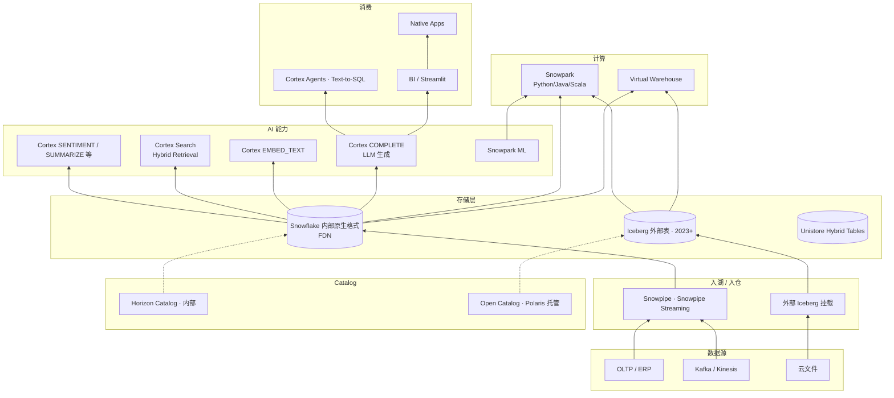

# 案例 · Snowflake 数据平台

!!! info "本页性质 · reference · 非机制 canonical"
    基于 Snowflake 博客 · 产品文档 · keynote 整理。机制深挖见 [catalog/polaris](../catalog/polaris.md) · [catalog/strategy](../catalog/strategy.md) · [query-engines/compute-pushdown](../query-engines/compute-pushdown.md)。

!!! success "对应场景 · 配对阅读"
    本案例 = **Snowflake 商业平台全栈**。**场景切面**在 scenarios/：
    - [scenarios/bi-on-lake](../scenarios/bi-on-lake.md) §工业案例 · Snowflake Data Cloud
    - [scenarios/rag-on-lake](../scenarios/rag-on-lake.md) §工业案例 · Cortex RAG（数据不出栈）
    - [scenarios/agentic-workflows](../scenarios/agentic-workflows.md) §工业案例 · Cortex Agents
    - [scenarios/text-to-sql-platform](../scenarios/text-to-sql-platform.md) §工业案例 · Cortex Analyst

!!! abstract "TL;DR"
    - **身份**：**云数仓一体化时代的开创者** · 2026 市值千亿级 · 和 Databricks 构成工业一体化平台"双雄"
    - **核心技术差异化**：**"SQL 为中心"的数仓 + AI 内嵌** · Cortex 让 SQL 直接调 LLM 成为这家公司最独特的产品定位
    - **2024-2026 关键演进**：**Polaris 2024 开源 + 2026-02 Apache TLP**（Snowflake 第一次主动开源关键 Catalog）· **Cortex AI 全家桶 GA**（EMBED / COMPLETE / SEARCH / SENTIMENT 等 SQL 函数）· **Horizon Catalog** 内部版本
    - **战略焦点**：从"封闭 SQL 数仓"转向"开放表格式（Iceberg）+ 封闭计算引擎"的混合模式
    - **最值得资深工程师看的**：§8 深度技术取舍（SQL LLM UDF 范式先驱 · Open Catalog 战略意图 · 对抗 Databricks 的姿态）· §9 历史踩坑（对 ML 起步晚 · 2023 年才发力）

## 1. 为什么这个案例值得学

Snowflake 的独特性：
- **"SQL 即 AI 接口"的工业先驱** —— Cortex 的 `SNOWFLAKE.CORTEX.COMPLETE()` / `EMBED_TEXT()` 是行业内**最早的 SQL LLM UDF 一等实现**（2024 GA · 早于 Databricks AI Functions 和 BigQuery ML.GENERATE_TEXT）
- **Polaris**（2024 开源 · 2026 Apache TLP）**是 Iceberg 时代第一个主要商业厂商贡献的 Catalog**
- **和 Databricks 的商业竞争**在 2024-2026 年达到最激烈 · 产品线**高度趋同**（双方都加 Iceberg + AI + Text-to-SQL）

**资深读者关注点**：
- SQL LLM UDF 的**产品设计哲学**（§5.2 和 §8.1）
- **Polaris 的战略意图**（开放 Catalog 生态但保计算引擎封闭 · §8.2）
- "**SQL 为中心**" vs Databricks "**Notebook + Spark 为中心**"的路线对比（§8.3）

## 2. 历史背景

Snowflake 2012 年创立 · 创立背景：
- **云原生 SQL 数仓**（对标 Redshift / BigQuery · 但架构更先进）
- **存算分离**（2012 就实现 · 领先业界 5-10 年）
- **时间旅行 / 克隆**（"Zero Copy Clone"是 Snowflake 发明）

**关键战略演进**：

| 年份 | 事件 | 战略意义 |
|---|---|---|
| 2012 | 成立 · 云原生存算分离 SQL 数仓 | 架构领先 |
| 2014 | 产品发布 · Virtual Warehouse 模型 | 商业成功 |
| 2020 | IPO · 股价爆发 | 资本肯定 |
| 2022 | **Snowpark**（Python/Java/Scala DataFrame）| 从"只 SQL"向"多语言"扩展 |
| 2022 | **Unistore · Hybrid Tables** | OLTP + OLAP 混合尝试 |
| 2023 | **Snowpark ML** | ML 能力补强（落后于 Databricks） |
| 2023 | **Iceberg 原生支持** | 从"封闭存储"转开放表格式 |
| 2024 | **Cortex AI 全家桶 GA**（COMPLETE / EMBED / SEARCH / SENTIMENT 等 SQL 函数） | **SQL LLM UDF 工业先驱** |
| 2024 | **Polaris 开源** + Snowflake Open Catalog 托管 | 争夺 Iceberg Catalog 标准 |
| 2024+ | **Native Apps Framework** | 数据产品市场 |
| 2026-02 | Polaris 进入 Apache Top-Level Project | 开源生态地位巩固 |
| 2026+ | Cortex Agents · Horizon Catalog 深化 | AI + 治理一体化 |

## 3. 核心架构（2026 现代形态）

## 4. 8 维坐标系

| 维度 | Snowflake |
|---|---|
| **主场景** | **云数仓 + AI 内嵌** · 商业分析主导 · 逐步扩 ML / LLM |
| **表格式** | 内部原生 FDN + **Iceberg 原生支持**（2023+ 双轨） |
| **Catalog** | **Open Catalog（Polaris 托管）** + Horizon Catalog（内部）· 2024+ 开源策略 |
| **存储** | 对象存储（S3 / GCS / ADLS）· Snowflake 管理 |
| **向量层** | **Cortex Search**（向量原生 + Hybrid · 2024）· 表内原生向量列 |
| **检索** | Cortex Search（Dense + Hybrid + Reranker 内建） |
| **主引擎** | **Snowflake SQL 引擎 + Virtual Warehouse** · Snowpark 多语言 |
| **独特做法** | **"SQL 里直接调 LLM"** —— `CORTEX.COMPLETE()` / `CORTEX.EMBED_TEXT()` 一等函数（行业先驱） |

## 5. 关键技术组件 · 深度

### 5.1 Virtual Warehouse · 存算分离的早期典范

Snowflake **2012 年就实现了存算分离** · 领先业界 5-10 年：
- 存储层：对象存储（S3 等）· FDN 格式
- 计算层：Virtual Warehouse（独立计算集群）
- **可独立 scale · 可独立付费**
- 多个 VW 可同时访问同一份数据（不同负载隔离）

这个架构后来被**整个行业复刻**（Databricks / BigQuery / Redshift / 国内 Hologres）。

### 5.2 Cortex · SQL LLM UDF 工业先驱

**2024 年 Cortex AI 全家桶 GA** · 主要函数族：`CORTEX.COMPLETE`（LLM 生成）· `EMBED_TEXT`（embedding）· `SENTIMENT` · `SUMMARIZE` · `TRANSLATE` · `CLASSIFY` 等。

**本页不展开 API 细节和代码示例**（产品用法 canonical 在 [query-engines/compute-pushdown §4.4](../query-engines/compute-pushdown.md)）。**本页关注商业/架构意义**：

- **工业先驱地位**：Cortex 2024 GA **早于** Databricks AI Functions / BigQuery ML.GENERATE_TEXT · 是 SQL LLM UDF 产品化第一家
- **产品定位**："数据不出 Snowflake" 让 Cortex 成为合规场景首选
- **LLM 后端选择的商业取舍**：支持 Mistral / Llama / Snowflake Arctic · **不支持** OpenAI GPT / Anthropic Claude（见 §8.3）

**支持的后端 LLM**（2024-2026）：
- Snowflake 托管：`mistral-large` · `mixtral-8x7b` · `llama3-70b` · `snowflake-arctic`（2024 Snowflake 开源的 480B MoE）
- 客户自托管（Cortex Container Services）

**SQL LLM UDF 的产品意义**：
- **数据不出 Snowflake**（合规友好）
- **无需单独 LLM 服务**（简化架构）
- **和 SQL 其他能力自然组合**（JOIN / GROUP BY / 窗口函数 后接 LLM）

详见 [query-engines/compute-pushdown](../query-engines/compute-pushdown.md)。

### 5.3 Cortex Search · 向量检索

**2024 年 GA** · 原生向量索引 + Hybrid Search + Reranker：
- Dense（embedding）+ Sparse（BM25）+ Reranker 三段式
- 和 SQL 表一等集成（索引作为 table option）
- 对标 Databricks Vector Search

### 5.4 Polaris · 开源 Catalog（2024+ Apache TLP 2026-02）

**Snowflake 2024 年捐给 Apache 的 Iceberg REST Catalog**：
- **纯净 Iceberg REST + RBAC**
- 不含多模资产支持（Vector / Model 不在 Polaris 范围）
- **2026-02 晋升 Apache Top-Level Project**

**Snowflake Open Catalog** 是 Polaris 的商业托管版。

**战略意图**：
- 阻止 Unity Catalog 成为单一标准
- 保留 Snowflake 在 Iceberg 生态中的位置（不被 Databricks UC 垄断）
- 客户可以**"Snowflake 计算 + Polaris 开放 Catalog + 任何引擎"**的组合

详见 [catalog/polaris](../catalog/polaris.md) · [catalog/strategy](../catalog/strategy.md)。

### 5.5 Iceberg 原生支持（2023+）

Snowflake 2023 年**原生支持 Iceberg 外部表**：
- 可以直接读写 Iceberg（不必导入 Snowflake 内部格式）
- 和 Snowflake 计算引擎性能接近内部格式
- 客户获得开放性 + Snowflake 获得"不被 Iceberg 生态排除"

**意义**：2023 年前 Snowflake 是"封闭数据格式" · 2023 后变成"**封闭计算 + 开放格式**"的混合模式。

### 5.6 Snowpark · 多语言 DataFrame（2022+）

**Python / Java / Scala DataFrame API**（类似 Spark DataFrame）：
- 代码**推到 Snowflake 服务端执行**（不是 client 执行）
- 让非 SQL 用户也能用 Snowflake
- **对抗 Databricks Spark 文化**的产品

### 5.7 Snowpark ML · Snowflake 补 ML 能力（2023）

**Snowpark ML**（2023 发布）补 ML 能力：
- ML 训练（scikit-learn / XGBoost / PyTorch 集成）
- Model Registry（Snowpark ML Model Registry）
- Feature Store（2024+）

**定位**：Snowflake 的 ML 产品**起步晚 Databricks 多年** · 2023-2026 追赶期。

### 5.8 Native Apps Framework · 2024+

允许第三方在 Snowflake 上**发布数据应用**：
- 客户订阅 Native App · 数据不出 Snowflake
- 类似 AppStore 模式
- 战略：让 Snowflake 成为"**数据产品市场**"

### 5.9 Horizon Catalog · 内部治理

Snowflake 内部原生 Catalog · 负责：
- 权限（RBAC + row/column）
- Tag 策略
- 列级血缘
- 数据质量

**和 Polaris 的关系**：
- Horizon 治 Snowflake 内部表（FDN + Iceberg 外部表）
- Polaris 是独立开源 · 可被 Snowflake 和其他引擎共用

### 5.10 Snowflake Arctic · 开源 LLM（2024）

2024 年 Snowflake 开源 480B MoE LLM 叫 **Arctic**：
- 和 Databricks DBRX 对标（132B MoE）
- 目的：技术品牌建设 + 背后 Cortex 的底座能力

## 6. 2024-2026 关键演进

| 时间 | 事件 | 意义 |
|---|---|---|
| 2023 | Iceberg 原生支持 | 从封闭走向开放格式 |
| 2023 | Snowpark ML GA | 补 ML 能力（追 Databricks） |
| 2024 | **Cortex AI 全家桶 GA** | SQL LLM UDF 工业先驱 |
| 2024 | **Polaris 开源** | 争夺 Iceberg Catalog 标准 |
| 2024 | Arctic 480B MoE 开源 | LLM 技术品牌 |
| 2024 | Native Apps Framework | 数据产品市场 |
| 2024+ | Cortex Search GA | 向量检索 + Hybrid 内建 |
| 2025 | Cortex Agents · Text-to-SQL | AI 应用层 |
| 2026-02 | **Polaris 进入 Apache TLP** | 开源生态地位巩固 |
| 2026+ | Horizon Catalog 深化 · 和 Polaris 协同 | 治理一体化 |

## 7. 规模数字

!!! warning "以下为量级参考 · `[来源未验证 · 示意性 · Snowflake 财报 + blog 披露]`"

| 维度 | 量级 |
|---|---|
| 客户数 | 10000+ |
| 市值 | 千亿美元级 |
| 每日查询 | 数十亿级（全客户合计） |
| Arctic 模型规模 | 480B 总参数 · 17B active（MoE） |
| Polaris Apache 贡献方 | 10+ 公司 |

## 8. 深度技术取舍 · 资深读者核心价值

### 8.1 取舍 · "SQL 为中心" vs "Notebook + Spark 为中心"

Snowflake 和 Databricks 的**最根本路线差异**：

| 维度 | Snowflake | Databricks |
|---|---|---|
| 主入口 | SQL | Notebook + Python |
| 用户画像 | 数据分析师 · 数据工程师 · BI | 数据科学家 · ML 工程师 |
| AI 集成 | **SQL 函数**（CORTEX.COMPLETE 等） | **Notebook + API**（AI Functions + MLflow） |
| ML 平台 | Snowpark ML（追赶期） | MLflow + Mosaic AI（成熟） |
| 主业务 | **商业分析 + 报表**扩 AI | **ML + LLM 平台**扩 BI |

**路线取舍的深层逻辑**：
- Snowflake 赌"**SQL 语法足够表达 AI 能力**"
- Databricks 赌"**Python / Notebook 才能做复杂 ML**"

**2024-2026 实际观察**：
- **简单 AI 场景**（分类 / 摘要 / embedding）SQL LLM UDF 胜出 · Snowflake 体验更好
- **复杂 AI 场景**（fine-tuning · 多步 Agent · 复杂 pipeline）Python + Notebook 胜出 · Databricks 体验更好
- 两家在客户眼里**不是二选一** · 而是按场景选

**资深启示**：**路线之争没有唯一答案** · 最终市场会分化（不会一家赢家通吃）。

### 8.2 取舍 · Polaris 开源的战略

**表面看**：Snowflake 捐 Polaris 给 Apache 是"开源美德"。

**实际看**：
- **防御性**：如果 UC（Databricks 主导）成为 Iceberg 时代唯一 Catalog 标准 · Snowflake 客户需要 UC → 整个生态被 Databricks 控制
- **主动性**：提供"**Snowflake 计算 + 开放 Polaris Catalog + 任意引擎**"的组合 · 让客户不被 Databricks 绑死
- **合作性**：Iceberg 生态多厂商共建 · Polaris 是 Snowflake 在这个生态的贡献

**Polaris 的边界**：
- 纯 Iceberg REST + RBAC
- **不含多模资产**（Vector / Model / Volume / Function 不在 Polaris 范围内）—— 这和 UC "多模全包"形成鲜明对比
- 对 Snowflake 而言 · 多模资产治理**留在 Horizon** · Polaris 只管表

**资深启示**：**开源战略是产品线的延伸** · Polaris"为什么开源什么 / 为什么不开源什么"的选择 · 直接反映 Snowflake 的商业护城河设计。

### 8.3 取舍 · Cortex 的模型选择

Cortex 支持的 LLM **不是所有主流模型**：
- 支持：Mistral · Llama 3/4 · Snowflake Arctic · 部分第三方
- **不支持**：OpenAI GPT · Anthropic Claude · Google Gemini（直接）

**为什么**：
- 合规（数据不出 Snowflake · 所以 LLM 必须在 Snowflake 能托管）
- 成本控制（只选能议价的 LLM）
- 避免对 OpenAI / Anthropic 的**单点依赖**

**客户体验**：
- **严肃合规客户**（金融 · 医疗）· 数据不出 Snowflake 是刚需 · Cortex 合适
- **追求最强 LLM**（如 Claude 4.X）· 要额外接 Claude · Cortex 不是唯一入口

### 8.4 取舍 · Iceberg 外部表 vs 内部 FDN 格式

Snowflake 2023 年支持 Iceberg 外部表 · 但**仍然推荐客户用内部 FDN 格式**：

**内部 FDN 优势**：
- 和 Snowflake 引擎深度集成 · 性能最优
- 完整治理（Horizon）
- 支持 Hybrid Tables（Unistore）

**Iceberg 外部表优势**：
- 开放 · 可被其他引擎读
- 客户数据主权
- 避免 vendor lock-in

**Snowflake 的商业逻辑**：
- 内部 FDN 是商业护城河 · 不能不推
- Iceberg 支持是"**客户压力下的妥协**" · 但让客户有选择
- 多数客户**主要还是用 FDN** · Iceberg 是"政治正确"的选项

**资深启示**：商业厂商支持开放标准有**程度差异** · Snowflake 支持 Iceberg 但明显更推 FDN · 这和 Databricks 推 UniForm 保 Delta 相似。

## 9. 真实失败 / 踩坑

### 9.1 ML 起步晚 · 2023 年才发力

Snowflake 2012-2022 年主要聚焦 SQL 数仓 · **对 ML 投入不足**。2023 年 Snowpark ML 发布时 · Databricks MLflow 已经领先 5+ 年。

**后果**：
- 数据科学家客户**优先选 Databricks**
- Snowflake ML 客户规模明显落后
- 2024-2026 追赶期仍有差距

**教训**：**产品线扩展的时机决定商业地位**。Snowflake 意识到 ML 重要性晚了几年 · 追赶成本很高。

### 9.2 Unistore Hybrid Tables 接受度低

2022 年推出的 **Unistore Hybrid Tables**（OLTP + OLAP 混合）· 2024-2026 年**接受度明显低于预期**：
- 客户不相信 Snowflake 能同时做好 OLTP 和 OLAP
- OLTP 客户宁愿用专用数据库（PG / Oracle）
- 产品线定位模糊

**教训**：**进入相邻市场**（OLAP → OLTP）比想象中难 · 客户信任不能靠一个产品建立。

### 9.3 Native Apps 增长慢

2024 年推出 Native Apps Framework · 目标是"Snowflake 的 AppStore"。但 2024-2026 年**开发者生态增长缓慢**：
- 早期 App 以简单数据产品为主
- 缺少"必须在 Snowflake 上用"的高价值 App
- 和 Databricks / BigQuery 的类似尝试竞争

**教训**：**平台生态需要长期培育** · 一个 Framework 发布不代表生态自然形成。

### 9.4 Arctic LLM 影响力有限

2024 年开源的 Arctic（480B MoE）在技术上领先 · 但社区采用率明显低于 Llama / Mistral / DBRX：
- Snowflake 品牌偏"数仓" · 做 LLM 可信度不足
- Arctic 训练数据 / 对齐方法公开度不如开源社区期待
- 后续迭代节奏慢

**教训**：**开源 LLM 是长期社区投入** · 不是"发布一个模型就能建立技术品牌"。

## 10. 对团队的启示

!!! warning "以下为观点提炼 · 非客观事实 · 选 2-3 条记住即可"
    启示较多（5 条）· 不必全读全用。战略决策 canonical 在 [unified/index §5 团队路线主张](../unified/index.md) · [catalog/strategy](../catalog/strategy.md) · [compare/](../compare/index.md) · 本页启示是**可参考的观察** · 不是建议照搬。

### 启示 1 · SQL LLM UDF 是新范式 · 但有场景边界

Cortex 证明**"SQL 里调 LLM"在某些场景极度好用**（分类 / 摘要 / embedding 等批量任务）。

**对本团队**：
- 评估 Compute Pushdown 方向（详见 [query-engines/compute-pushdown](../query-engines/compute-pushdown.md)）
- 商业 SQL LLM UDF（Cortex / AI Functions / BigQuery ML）适合**合规严**的场景
- 开源替代：Spark + Ray + vLLM 组合 · 可以做等效但工程更复杂

### 启示 2 · 开放 Catalog 生态已形成

2024-2026 年 **Polaris + UC OSS + Gravitino + Nessie** 构成多头开放 Catalog 格局。本团队 Catalog 选型应：
- 选 Iceberg REST 兼容的开放 Catalog（Polaris · UC OSS · Gravitino）
- 不要依赖商业版独有特性（除非愿意承担 lock-in）
- 详见 [catalog/strategy](../catalog/strategy.md)

### 启示 3 · "SQL vs Notebook" 不是二选一

Snowflake vs Databricks 路线之争 · 对客户而言**不是二选一**：
- 简单 AI 场景 · SQL 函数方便
- 复杂 ML 场景 · Notebook + Python 必需

本团队应**两种能力都要有** · 不要强绑一条路线。

### 启示 4 · 商业开放程度要分辨

Snowflake 推 Iceberg 和 Polaris 不等于"全开放" —— 内部 FDN 和 Horizon 仍是商业护城河。类似 Databricks 的 Delta + UC。

**对客户**：理解"**开放部分 vs 锁定部分**"的分界 · 不要以为"支持 Iceberg = 不 lock-in"。

### 启示 5 · 跨云能力是重要差异化

Snowflake 2026 跨 AWS / Azure / GCP 部署 · 客户可以**不被单一云绑定**。这是对抗云厂商的差异化。本团队如果考虑云厂商的数据平台（Redshift / BigQuery / Azure Synapse）· 要对比跨云能力。

## 11. 技术博客 / 论文（权威来源）

- **[Snowflake Engineering Blog](https://www.snowflake.com/engineering-blog/)**
- **[*The Snowflake Elastic Data Warehouse*](https://dl.acm.org/doi/10.1145/2882903.2903741)**（SIGMOD 2016 · 原始论文）
- **[Cortex AI 产品文档](https://docs.snowflake.com/en/guides-overview-ai-features)**
- **[Polaris 开源公告](https://www.snowflake.com/blog/)**（2024）
- **[Polaris 进入 Apache TLP 公告](https://polaris.apache.org/)**（2026-02）
- **[Arctic 开源公告](https://www.snowflake.com/blog/arctic-open-efficient-foundation-language-models-snowflake/)**（2024）
- **[Iceberg Table 支持公告](https://www.snowflake.com/blog/)**（2023）

## 12. 相关章节

- [Polaris](../catalog/polaris.md) —— Polaris 机制 canonical
- [Catalog 策略](../catalog/strategy.md) —— Catalog 选型决策
- [Compute Pushdown](../query-engines/compute-pushdown.md) —— SQL LLM UDF 机制
- [ai-workloads/](../ai-workloads/index.md) —— LLM 应用层
- [Text-to-SQL 平台](../scenarios/text-to-sql-platform.md) —— Cortex Agents
- [案例 · Databricks](databricks.md) —— 最大竞争对手对比
- [Iceberg vs Paimon vs Hudi vs Delta](../compare/iceberg-vs-paimon-vs-hudi-vs-delta.md)
- [Vendor Landscape](../vendor-landscape.md) —— 厂商选型
