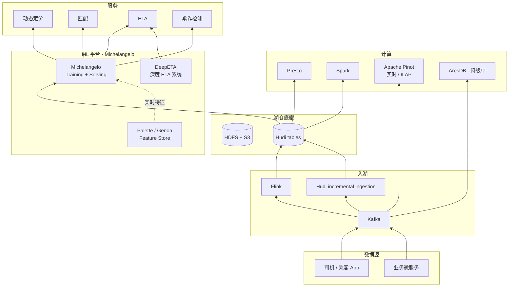

# 案例 · Uber 数据平台

!!! info "本页性质 · reference · 非机制 canonical"
    基于 Uber Engineering Blog / 开源项目 / 公开演讲整理。机制深挖见 [lakehouse/hudi](../lakehouse/hudi.md) · [ml-infra/mlops-lifecycle](../ml-infra/mlops-lifecycle.md) · [ml-infra/feature-store](../ml-infra/feature-store.md)。

!!! abstract "TL;DR"
    - **身份**：**实时 + ML 驱动的巨无霸** · 每分钟数千万 event · 每秒数百万 ML 决策
    - **核心开源贡献**：**Apache Hudi**（2019 TLP · 流式湖表先驱）· AthenaX（流 SQL）· Peloton（资源调度）· Jaeger（分布式 tracing）
    - **ML 平台**：**Michelangelo**（2017）是**工业级 MLOps 鼻祖** · Feature Store 产品早期叫 Palette · 2024+ 演进名为 Genoa
    - **数据规模**（`[来源未验证 · 量级参考 · 依 Uber Engineering Blog 各次披露差异大]`）：EB 级 HDFS · 每日数 PB · 数十万 Spark 作业 / 日 · 数十亿在线 ML 决策 / 日 · 5000+ active models
    - **核心哲学**：**"实时是一等公民 · 批是特例"** · **"先做一个极致 ML 场景 · 再抽象平台"**
    - **2024-2026 演进**：DeepETA 深度学习 ETA（2022-2024 演进）· Feature Store Genoa 重构 · Hudi vs Iceberg 选型辩论内部进行（业界压力）
    - **最值得资深工程师看的**：§8 深度技术取舍（Hudi vs Iceberg · Michelangelo 复杂度演进 · AresDB → Pinot 的失败）· §9 3 个公开踩坑

## 1. 为什么这个案例值得学

Uber 的独特性：
- **业务天生 ML-first**（动态定价 / ETA / 匹配都是实时 ML）· 数据平台被业务需求倒逼设计
- **Michelangelo 定义了"什么是 ML 平台"** · 2017 年 Uber 的 [*Meet Michelangelo*](https://www.uber.com/blog/michelangelo-machine-learning-platform/) 博客是 MLOps 领域最被引用的工业文章之一
- **Hudi 和 Iceberg 之争的另一极** —— 不同技术取舍的活案例

**资深读者关注点**：
- Michelangelo **7 年演进**的复杂度管理（§5.2 和 §8.2）
- Hudi vs Iceberg 在 Uber 场景下的**深度取舍**（§8.1）
- "**先做一个极致 ML 场景**"的 MLOps 平台化路径（§10 启示 1）

## 2. 历史背景 · ML 驱动的数据平台

Uber 核心业务（2012+）：
- **乘客-司机匹配**（sub-second 决策）
- **动态定价**（实时 ML）
- **ETA 预测**（ms 级）
- **欺诈检测**（实时 + 图）
- **运力调度**

**这些全部依赖实时数据**。Uber 早期（2014-2016）的数据栈痛点：
- HDFS 批处理 CDC 入湖太慢（MapReduce 每小时一批）
- Schema 演化破数据
- 重复和 upsert 失控
- 业务要求**分钟级**数据新鲜度

→ 催生 Hudi（2016 起内部开发 · 2019 ASF TLP）
→ 催生 Michelangelo（2016 起 · 2017 博客公开）

## 3. 核心架构（现代形态）

## 4. 8 维坐标系

| 维度 | Uber |
|---|---|
| **主场景** | 订单 · 行程 · 定价 · 风控 · ETA · **实时 + ML 驱动** |
| **表格式** | **Hudi**（2016 诞生 · 2019 ASF TLP）· 内部仍主力 · Iceberg 迁移辩论中 |
| **Catalog** | HMS → 现代 Catalog 迁移中 |
| **存储** | HDFS（主）+ S3（扩展） |
| **向量层** | ML 平台内嵌（非独立通用向量库） |
| **检索** | 通过 Feature Store（Palette / Genoa） |
| **主引擎** | Spark（批 / ML）· Flink（流）· Presto（交互）· Pinot（实时 OLAP） |
| **独特做法** | **流式湖表 Hudi 工程化** + **Michelangelo MLOps 平台化** 两条工业典范 |

## 5. 关键技术组件 · 深度

### 5.1 Apache Hudi（2016 内部 · 2019 ASF TLP）

**Uber 对湖仓领域最大的贡献**：

- **CoW（Copy-on-Write）**：写时重写整个文件 · 读快写慢 · 适合读多
- **MoR（Merge-on-Read）**：写 delta log 文件 · 读时合并 · 写快读相对慢 · 适合写密集
- **主键 Upsert**（这是 Hudi 最早的杀手锏 · 后来 Iceberg 也加了 Delete Files）
- **增量消费**（`hudi_incremental_read` 让下游只读新变化）
- **时间旅行**（早于 Iceberg）
- **Bulk Insert / Upsert / Delete** 原语

### 5.2 Michelangelo · ML Platform（2017+）

**工业级 MLOps 的鼻祖**。2017 Uber 博客 [*Meet Michelangelo*](https://www.uber.com/blog/michelangelo-machine-learning-platform/) 让业界第一次看到"完整 ML 平台"是什么样子。

**核心 6 组件**：
1. **Data Management** —— 离线 + 在线 Feature Store
2. **Training** —— Spark + 自研训练框架
3. **Evaluation** —— 离线指标 + A/B
4. **Deployment** —— 在线推理服务
5. **Monitoring** —— Drift + 业务指标
6. **Serving** —— 低延迟 inference（sub-10ms）

**7 年演进**：
- 2017 v1 发布 · 核心是 GBDT + 简单 DNN
- 2019 v2 · 增加 PyTorch / TF 支持
- 2022 v3 · **Michelangelo Palette**（Feature Store 独立为子产品）
- 2024+ v4 · **Feature Store 重构为 Genoa** · 流式特征强化

**核心卖点**：**训推一致性**（train / serve 特征完全相同）—— 这是 Michelangelo 的核心创新 · 后来被所有 Feature Store 产品继承。

详见 [ml-infra/mlops-lifecycle](../ml-infra/mlops-lifecycle.md) · [ml-infra/feature-store](../ml-infra/feature-store.md)。

### 5.3 Palette → Genoa · Feature Store 演进

- **Palette**（2022）· Michelangelo v3 的 Feature Store 子产品
  - 第一次把 Feature Store 作为 Michelangelo 的一等公民
  - 流批一体特征
- **Genoa**（2024+）· Palette 的重构版
  - 更深的流式特征支持（应对实时 ML 需求增长）
  - 更标准化的 schema / lineage

### 5.4 AresDB（2019 开源）· GPU 加速 OLAP

**GPU 加速的实时分析数据库** · Uber 2019 开源。

- Uber 实时大屏的核心
- GPU 列式扫描 + 查询
- 非常专业 · 非通用

**2024+ AresDB 维护降级** · 大部分场景被 Apache Pinot 替代。AresDB 是"专有技术维护成本高 · 最终输给通用开源"的典型案例（见 §9.1）。

### 5.5 DeepETA（2022-2024）· 深度学习 ETA

Uber 2022 公开 · 2024 演进：
- **用 Transformer 替代传统 GBDT 做 ETA 预测**
- 跨城市 / 跨时段一致性提升
- Michelangelo 的一个重要应用案例

对资深读者：DeepETA 是 Transformer 在**结构化时空预测**场景的工业落地代表（不是 NLP / CV 场景）。

### 5.6 AthenaX · 流 SQL

Uber 2017 开源的流 SQL 平台（基于 Flink）· **早于 Flink SQL 成熟**。
- 内部仍在用
- 和后来的 Flink SQL / ksqlDB 并列

### 5.7 Peloton · 资源调度

Uber 2017 开源 · 统一调度 batch + stateless workloads。和 Kubernetes + Yarn 定位接近。**2024 年维护降级** · Uber 内部更多用 Kubernetes。

## 6. 2024-2026 关键演进

| 时间 | 事件 | 意义 |
|---|---|---|
| 2022-2024 | DeepETA 深度学习 ETA 演进 | Transformer 结构化时空预测工业落地 |
| 2024 | Feature Store Palette → Genoa 重构 | Feature Store 深化 · 流式特征强化 |
| 2024+ | AresDB 降级 · Pinot 替代 | "通用开源 > 专有自研"经验教训 |
| 2024+ | Hudi vs Iceberg 选型辩论（内部）| 业界压力 + 湖仓多引擎趋势 |
| 2024+ | Peloton 降级 · K8s 主力 | 收敛到社区主流 |
| 2025+ | Michelangelo v4 持续演进 | MLOps 平台的 7 年稳定 |

## 7. 规模数字

!!! warning "以下为量级参考 · `[来源未验证 · 示意性 · 依 Uber Engineering Blog 各次披露差异大]`"

| 维度 | 量级 |
|---|---|
| 数据湖（HDFS / S3） | **EB 级** |
| 每日新数据 | **数 PB** |
| Kafka 集群 | 100+ clusters |
| Kafka 消息 / 日 | **万亿级** |
| Spark 作业 / 日 | 数十万 |
| Presto 查询 / 日 | **数百万** |
| 在线 ML 决策 / 日 | **数十亿** |
| ML 模型总数 | 5000+ active |

## 8. 深度技术取舍 · 资深读者核心价值

### 8.1 取舍 · Hudi vs Iceberg（Uber 场景下的深度视角）

Uber 发明了 Hudi · 但 2024+ 业界 Iceberg 生态更活跃 · Uber 内部是否该迁 Iceberg 是进行时辩论。

**Hudi 在 Uber 场景的优势**：
- **MoR 写密集场景**：Uber 订单表每秒几万次更新 · MoR 写快 · Iceberg v2 的 Delete Files 追不上
- **主键 Upsert 原生**：业务主键更新语义和 Hudi 天然对齐
- **Incremental Query 成熟**：下游消费只读新变更 · 比 Iceberg 的 changelog 支持更深

**Iceberg 在 2024+ 的优势**：
- **多引擎生态完整**（Spark / Trino / Flink / Python / Rust 全线）
- **社区更活跃**（贡献方更多元）
- **Iceberg v3 新特性**（row lineage · deletion vector · multi-table tx）追上 Hudi

**公开信号**（事实 · 2024-2026 来自 Uber Engineering Blog / 社区讨论）：
- Uber 仍在**大规模使用 Hudi**（尤其核心 OLTP 镜像表）· 未公告"全量迁移 Iceberg"
- 社区中 Uber 工程师提过"**多引擎开放需求**" · 是否启动迁移未正式确认

!!! warning "以下为作者推断 · 非 Uber 官方"
    基于上述公开信号 · 合理推断 Uber 短中期可能 Hudi + 部分 Iceberg 探索并存 · **但这是推断 · 不是事实** · 读者不应作生产决策依据。以 Uber 官方 blog 最新发布为准。

**资深启示**：**技术选择是场景决定的** · "哪个更好"没有绝对答案。Hudi 和 Iceberg 各自在不同场景有优势 · 可能长期并存。

### 8.2 取舍 · Michelangelo 的"复杂度管理"

Michelangelo 7 年演进积累的**功能复杂度**是平台工程最大挑战：
- v1（2017）：简单 · 好用 · 但能力有限
- v3（2022）：特性堆叠 · 上手曲线陡
- **2023 大清理**：砍掉不常用特性 · 简化 API

**Uber 内部公开的经验**：
- 平台特性超过**某个临界点**（Michelangelo 约 3-4 年积累）后 · **复杂度成为最大成本**
- 定期"**清理已有特性**"和"**增加新特性**"一样重要
- API 稳定性 > 特性数量

**对其他 ML 平台团队的启示**：每 2-3 年应计划一次"**特性瘦身**"· 否则平台会被自己的复杂度压垮。

### 8.3 取舍 · 实时为主 vs 批为主

Uber **设计时就把批当特例** · 实时是默认。**这和 Netflix / LinkedIn 完全相反**（后两者批为主）。

**Uber 的权衡**：
- 实时为主的代价：架构复杂 · 一致性处理难 · 运维成本高
- 批为主的代价：用户感知延迟 · 不能支持 sub-second 决策

**Uber 业务决定选实时**（ETA / 匹配都 sub-second）· 这个选择让 Hudi 必然诞生 · Michelangelo 必然需要 online store。

**资深启示**：**数据架构的核心选择是"默认是批还是流"** · 这决定后续所有技术栈方向 · 无法事后改变。

### 8.4 取舍 · AresDB 自研 vs Pinot 社区

AresDB 是 Uber 的特有自研（2019 开源）· 但 2024+ 被 Pinot 替代。**为什么自研输给社区**：
- AresDB 专有 GPU 架构 · 生态绑定窄
- Pinot 2020+ 社区活跃度爆发（StarTree Inc 2022 商业化）
- AresDB 维护人力瓶颈 · 比不过社区广度

**资深启示**：**社区活跃 > 技术先进**。通用开源产品的社区活力比自研系统的"技术优势"更持久。

## 9. 真实失败 / 踩坑

### 9.1 AresDB · 专有技术的维护陷阱

AresDB 技术上有**GPU 加速的独特价值** · 但**维护成本太高** · 最终逊于通用 Pinot。

**教训**：**技术先进不等于长期赢家** · 维护生态和社区活力比"技术 edge" 更决定长期命运。

### 9.2 Michelangelo 过度复杂化

Michelangelo 2019-2022 积累太多特性 · 导致 2023 要做"**大清理 + 简化**"。
- 80% 用户只用 20% 特性
- 但被少数用户要求的"长尾特性"堆积
- API 设计一致性受损

**教训**：**平台特性堆叠是慢性毒药** · 定期砍功能和加功能同样重要。

### 9.3 Hudi 推广挑战 vs Iceberg

Hudi 2019 年 ASF TLP 时领先 Iceberg 一年多 · 但 2021-2024 年 Iceberg 社区爆发式成长：
- 多引擎支持 Iceberg 更深
- 贡献方多元（Netflix + Apple + LinkedIn + Databricks + Snowflake）
- Hudi 社区相对窄（Uber 主导）

**2024 市场格局**：Iceberg 明显领先 · Hudi 仍强但市场份额被挤压。

**教训**：**开源项目的社区多元化比"领先一年"重要** · 单一公司主导的开源项目长期弱势。

### 9.4 Peloton 自研调度 vs K8s 主流

Uber 2017 开源 Peloton · 统一 batch + stateless workload 调度。但 K8s + 社区扩展（Volcano / YuniKorn）演进速度 Peloton 追不上。**Uber 内部 2024 年更多用 K8s** · Peloton 维护降级。

**教训**：和 AresDB 同类问题 · **社区活跃度是长期命脉**。

## 10. 对团队的启示

!!! warning "以下为观点提炼 · 非客观事实 · 选 2-3 条记住即可"
    启示较多（5 条）· 不必全读全用。战略决策 canonical 在 [unified/index §5 团队路线主张](../unified/index.md) · [catalog/strategy](../catalog/strategy.md) · [compare/](../compare/index.md) · 本页启示是**可参考的观察** · 不是建议照搬。

### 启示 1 · "先做一个极致 ML 场景"

Michelangelo 不是一开始就做平台——**先做对一个动态定价的 ML** · 再把经验提炼为平台。

**对中国团队**：不要上来就建"大而全的 ML 平台" · 业务吃不下 · 平台团队孤独。**先做一个具体场景打穿 · 再平台化**。

### 启示 2 · Feature Store 先于 Model Registry

Michelangelo 早期**先做 Feature Store**（离线在线一致）· 后做 Model Registry。顺序很重要 —— **Feature 是长期资产 · Model 每周重训**。

### 启示 3 · 实时 + 批共底座（Hudi 思想）

Hudi 思想：**同一张表既能流消费又能批查询**。不是"流表 vs 批表两套系统"。

**对中国团队**：**Apache Paimon** 是 Hudi 的精神继承 + Flink 生态现代化升级（详见 [案例 · 阿里巴巴](alibaba.md)）。

### 启示 4 · 基础设施要留 growth headroom

Uber 每 18 个月数据量翻倍（`[来源未验证 · 经验值]`）。基础设施设计要**留 3 年 growth 头寸** · 而不是"正好够用"。

### 启示 5 · 定期清理自建系统

AresDB / Peloton 教训：**自建系统要定期评估 vs 社区方案** · 不要被"已经投入了"的沉没成本绑死。敢于替换自研（像 LinkedIn Samza → Flink）是长期竞争力。

## 11. 技术博客 / 论文（权威来源）

- **[Uber Engineering Blog](https://www.uber.com/blog/engineering/)** —— 尤其搜 "Data" / "Michelangelo" / "Hudi"
- **[*Meet Michelangelo: Uber's Machine Learning Platform*（2017）](https://www.uber.com/blog/michelangelo-machine-learning-platform/)** —— MLOps 经典
- **[*Hudi: Unifying Storage and Serving for Batch and Near-Real-Time*](https://eng.uber.com/hoodie/)** —— Hudi 原始博客
- **[*DeepETA: How Uber Predicts Arrival Times*](https://www.uber.com/blog/deepeta-how-uber-predicts-arrival-times/)** —— DeepETA 技术细节
- **[*Scaling Machine Learning at Uber with Michelangelo*](https://www.uber.com/blog/)**（2019 Strata 演讲）
- Apache Hudi 社区博客 · [hudi.apache.org](https://hudi.apache.org/)

## 12. 相关章节

- [Hudi](../lakehouse/hudi.md) —— Hudi 机制 canonical
- [Paimon](../lakehouse/paimon.md) —— Hudi 的精神继承 + 阿里现代化版
- [Iceberg vs Paimon vs Hudi vs Delta](../compare/iceberg-vs-paimon-vs-hudi-vs-delta.md) —— 四大表格式对比
- [MLOps 生命周期](../ml-infra/mlops-lifecycle.md) · [Feature Store](../ml-infra/feature-store.md) —— Michelangelo 的机制层
- [推荐系统 / 场景](../scenarios/recommender-systems.md) —— Uber 匹配 / 推荐场景
- [案例 · Netflix](netflix.md) · [案例 · LinkedIn](linkedin.md) · [案例 · 阿里巴巴](alibaba.md) —— 同代案例
- [案例综述](studies.md)
