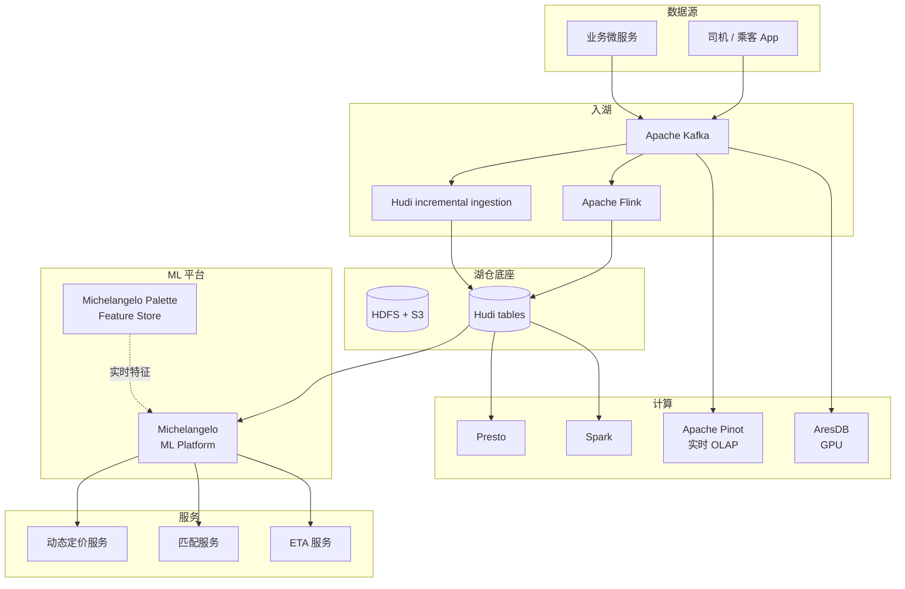

# 案例 · Uber 数据平台

!!! tip "一句话定位"
    **实时 + ML 驱动的巨无霸**——每分钟生成数千万 event、数百万实时 ML 预测。Uber 的数据栈是**"实时优先 + ML 第一公民"**的代表：**Apache Hudi**（原创）· **Michelangelo ML Platform** · **AresDB** · **Pinot** 广泛使用。**对团队最有价值的学习对象之一**。

!!! abstract "TL;DR"
    - **核心开源贡献**：**Apache Hudi**（湖表）· **AthenaX**（流 SQL）· **Peloton**（资源调度）
    - **ML 平台**：**Michelangelo**（2017）是工业级 MLOps 鼻祖
    - **数据规模**：EB 级 HDFS · 每日数 PB · 数十万 Spark 作业
    - **实时决定**：ETA 预测、乘客-司机匹配都 ms 级 ML
    - **核心启示**：**"先做一个 ML 场景极致，再抽象平台"**

## 1. 业务驱动的数据平台

Uber 的核心业务：
- **乘客-司机匹配**（sub-second 决策）
- **动态定价**（实时 ML）
- **ETA 预测**（ms 级）
- **欺诈检测**（实时 + 图）
- **运力调度**

这些都**强依赖实时数据**。数据平台被**业务需求**驱动设计。

## 2. Apache Hudi（2016-2019）

### 起因

Uber 早期数据痛：
- HDFS CDC 入湖太慢（MapReduce 每小时一批）
- Schema 演化破数据
- 重复和 upsert 失控
- 需要**分钟级**数据新鲜度

### 创新

Uber 团队设计 Hudi：
- **CoW + MoR** 两种表类型
- **主键 Upsert**
- **增量消费**
- **时间旅行**
- **Bulk Insert / Upsert / Delete 原语**

2019 毕业为 Apache 顶级项目。

### 现今对比

2024+ 市场格局：
- **Hudi**：Spark 生态 + upsert 场景强
- **Iceberg**：多引擎生态更广
- **Paimon**：流场景更强
- **Delta**：绑 Databricks

详见 [Iceberg vs Paimon vs Hudi vs Delta](../compare/iceberg-vs-paimon-vs-hudi-vs-delta.md)。

## 3. Michelangelo · ML 平台（2017+）

### 为什么重要

**工业级 MLOps 的鼻祖**。2017 Uber 博客《Meet Michelangelo》让业界第一次看到"完整 ML 平台"的样子。

### 核心组件

1. **Data Management** —— 离线 + 在线 Feature Store
2. **Training** —— Spark + 自研训练框架
3. **Evaluation** —— 离线指标 + A/B
4. **Deployment** —— 在线推理服务
5. **Monitoring** —— Drift + 业务指标

核心特征：
- **支持 GBDT 到 DL 全谱系**
- **统一训练 / 推理特征**（训推一致性是 Michelangelo 的核心卖点）
- **每日训练 5000+ 模型**

### 发展

- 2017 发布
- 2019 增加 PyTorch / TF 支持
- 2022 增加 **Michelangelo Palette**（Feature Store 独立产品）
- 2024 仍是 Uber 内部主力

### 对应内容

- [MLOps 生命周期](../ml-infra/mlops-lifecycle.md)
- [Feature Store](../ml-infra/feature-store.md) · [Feature Store 横比](../compare/feature-store-comparison.md)

## 4. AresDB（Uber 2019 开源）

**GPU 加速的实时分析数据库**。

- Uber 实时大屏的核心
- GPU 列式扫描 + 查询
- 非常专业，非通用场景

2024 年 Uber 内部已部分被 Apache Pinot 替代。

## 5. Uber 完整数据架构

## 6. Uber 的规模

| 维度 | 规模 |
|---|---|
| 数据湖（HDFS / S3）| **EB 级** |
| 每日新数据 | **数 PB** |
| Kafka 集群 | 100+ clusters |
| Kafka 消息/日 | **万亿级** |
| Spark 作业/日 | 数十万 |
| Presto 查询/日 | **数百万** |
| 在线 ML 决策/日 | **数十亿** |
| ML 模型总数 | 5000+ active |

## 7. 技术文化

### 文化 1 · "ML 不是项目、是基础设施"

Michelangelo 不是某个产品，而是**全公司 ML 工作的统一平台**。每个新 ML 想法都接入 Michelangelo，不另起炉灶。

### 文化 2 · "实时是一等公民"

Uber 设计时**不把批当主流**——实时是默认，批只是特例。Hudi 也是这个思想的产物。

### 文化 3 · "开源 + 生态参与"

Hudi / AthenaX / Peloton / Jaeger 等都开源。Uber 从不"把内部一把锁"。

## 8. 对中国团队的启示

### 启示 1 · 先做一个极致 ML 场景

Michelangelo 不是一开始就做平台——**先做对一个动态定价的 ML**，再把经验提炼为平台。

**错误做法**：上来就建"大而全的 ML 平台"，业务吃不下、平台团队孤独。

### 启示 2 · Feature Store 先于 Model Registry

Michelangelo 早期**先做 Feature Store**（离线在线一致），后做 Model Registry。顺序很重要——**Feature 是长期资产**，Model 每周重训。

### 启示 3 · 实时 + 批 共底座

Hudi 思想：**同一张表既能流消费又能批查询**。不是"流表 vs 批表两套系统"。

中国团队对应：**Paimon** 是 Hudi 的精神继承 + 现代化升级。

### 启示 4 · 规模成长要在组织里留 headroom

Uber 每 18 个月数据量翻倍。基础设施设计要**留 3 年 growth 头寸**。

### 启示 5 · 开源是人才招聘

Uber 开源策略让他们吸引顶尖工程师。这和 Netflix / LinkedIn 一致。

## 9. 教训 / 坑

- **AresDB 小众投入大**：专有技术维护成本高 → Pinot 慢慢取代
- **Michelangelo 复杂度**：后来团队简化了一次，把不常用特性砍掉
- **Hudi 推广挑战**：vs Iceberg 竞争激烈，2024 后 Iceberg 在**多引擎**场景胜出
- **实时为主批为辅**：批场景完整性相对弱（之后补强）

## 10. 技术博客（必读）

- **[Uber Engineering Blog](https://www.uber.com/blog/engineering/)** —— 尤其搜 "Data" / "Michelangelo"
- **[*Meet Michelangelo: Uber's Machine Learning Platform*（2017）](https://www.uber.com/blog/michelangelo-machine-learning-platform/)** —— 经典
- **[*Hudi: Unifying Storage and Serving for Batch and Near-Real-Time Analytics*](https://eng.uber.com/hoodie/)**
- **[*Building a Real-Time ETA Prediction System at Uber*](https://www.uber.com/blog/deepeta-how-uber-predicts-arrival-times/)**
- Apache Hudi 社区博客

## 11. 相关

- [案例 · Netflix](case-netflix.md) · [案例 · LinkedIn](case-linkedin.md)
- [Hudi](../lakehouse/hudi.md) · [Paimon](../lakehouse/paimon.md)（精神继承者）
- [MLOps 生命周期](../ml-infra/mlops-lifecycle.md) · [Feature Store](../ml-infra/feature-store.md)
- [推荐系统 / 场景](../scenarios/recommender-systems.md)
