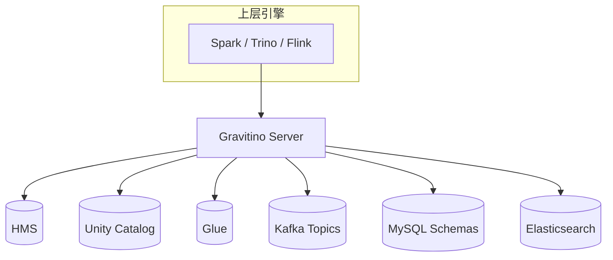

# Apache Gravitino

!!! tip "一句话定位"
    **多源元数据联邦**。不想重写已有 HMS/Unity/其他目录，又想对上层引擎统一接口——Gravitino 作为"元数据的元数据层"，把多个异构 Catalog 拼成一张视图。

## 它解决什么

大型组织常常是：

- BU A 在用 HMS + Hive
- BU B 在用 Unity Catalog + Delta
- BU C 在用 Glue + Iceberg
- 数据湖里还混着几套 MySQL / Kafka / Elasticsearch

想让一个 Spark 作业 `JOIN` 其中两个来源，或让治理团队统一看所有血缘，传统做法是**迁移**——代价太高。

Gravitino 提供另一条路：**不迁移，桥接**。

引擎只对 Gravitino 一条协议；Gravitino 向下接多种适配器。

## 架构与能力

- **Catalog 适配器**：HMS、Iceberg REST、Paimon、Kafka、JDBC、Hudi 等
- **统一命名空间**：`metalake.catalog.schema.table`
- **集中权限 / Tag / 血缘**：跨 Catalog 统一视图
- **Event-driven 同步**：元数据事件传播到下游（审计、治理）

## 和 Unity / Polaris 怎么区分

| 选手 | 核心定位 |
| --- | --- |
| **Unity Catalog** | 自己就是一套 Catalog + 治理平面 |
| **Polaris** | 纯净 Iceberg REST Catalog + 权限 |
| **Gravitino** | 把已有多个 Catalog 联邦起来 |

**它们不直接互斥**。常见组合：

- 一家新创建湖仓：选 Unity 或 Polaris
- 一家有存量多 Catalog 的：叠一层 Gravitino 统一接口
- 小场景单一 Catalog：直接 Iceberg REST Catalog 即可

## 什么时候选 Gravitino

- 已有 ≥ 2 个 Catalog 系统，迁移成本极高
- 治理团队需要一个**统一血缘 / 审计 / 权限策略**视图
- 正在做"数据网格"或"多云"架构

## 陷阱与坑

- **元数据一致性跨后端难**：底层 HMS 改了，Gravitino 是否同步看适配器实现
- **性能**：多一层 RPC，低延迟场景要评估
- **权限落地**：声明在 Gravitino 的权限最终要映射到底层 Catalog 的权限；不是所有后端都能 100% 表达

## 相关

- [Iceberg REST Catalog](iceberg-rest-catalog.md)
- [Unity Catalog](unity-catalog.md)
- [Polaris](polaris.md)
- [Catalog 全景对比](../compare/catalog-landscape.md)
- [统一 Catalog 策略](../unified/unified-catalog-strategy.md)

## 延伸阅读

- Apache Gravitino: <https://gravitino.apache.org/>
- *Federated Metadata for Data Mesh*（社区讨论）
