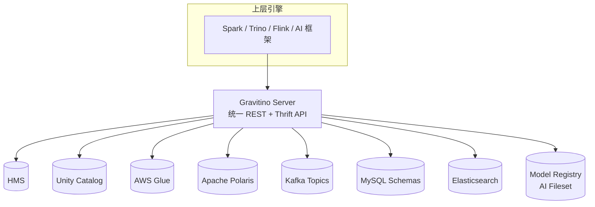

# Apache Gravitino · 多源元数据联邦

!!! warning "认知前置 · 联邦是"折中架构"不是"现代优选""
    Gravitino 市场定位容易被误读为"下一代多模 AI Catalog"——实际上**绝大多数上 Gravitino 的团队不是因为联邦是最佳答案，而是因为他们没法迁**：

    - 存量 HMS + 新建 Polaris / UC 并存 → 业务线迁移预算不够
    - 多云 / 多 BU · 各自已建 Catalog · 合并有组织阻力
    - 数据网格（Data Mesh）架构决定了多 Catalog 本身是目标

    **核心判断**：如果你**新起步**，从**功能覆盖和运维复杂度**看，单一 Catalog（Polaris / Nessie / UC / Glue）是首选 · 更简单、语义更干净。Gravitino 在**多 Catalog 已经共存**的现实约束下才作为联邦层引入——**它的价值不是"多 Catalog 是理想架构"，而是"迁不动的时候如何统一治理"**。

    AI / Fileset / Model 方向的差异化是**加分项**，不是主购买理由——对大多数团队，买 Gravitino 买的是**多 Catalog 联邦治理**。

!!! tip "一句话定位"
    **多源元数据联邦层**。不想重写已有 HMS / Unity / Glue / Polaris / Kafka / JDBC 等目录，又想对上层引擎暴露统一接口——Gravitino 当"元数据的元数据层"，把多个异构 Catalog 拼成一张视图。**2025-06-03 从 Apache 孵化毕业为 Top-Level Project**——2026 是少数"已毕业"的 Catalog 项目。

!!! abstract "TL;DR"
    - **定位**：联邦，不是新 Catalog——**桥接已有 Catalog 而不替换**
    - **出身时间线**：Datastrato 2023 起步 → 2024-03 进入 Apache 孵化 → **2025-06-03 毕业为 TLP** → 2025 内发布 1.0 / 1.1
    - **核心能力**：多 Catalog 适配器 + 统一命名空间 + 集中权限 / Tag / 血缘 + Event-driven 同步
    - **不做**：自己不存数据文件；不定义新表格式；不做 Catalog 实现本身
    - **和 Unity / Polaris 的关系**：**Gravitino 可以联邦 Unity 和 Polaris**——它们不互斥而是分层
    - **主要适配器**：HMS / Iceberg REST / Paimon / Kafka / JDBC (MySQL/PG) / Hudi / Fileset；AI 方向加 Model Management
    - **警示**：联邦不是免费午餐——**权限表达力 / 一致性 / 延迟** 在多源下有根本限制

## 它解决什么

大型组织常常是：

- BU A 在用 HMS + Hive
- BU B 在用 Unity Catalog + Delta
- BU C 在用 Glue + Iceberg 或自建 Polaris
- 数据湖里还混着几套 MySQL / Kafka / Elasticsearch

想让一个 Spark 作业 `JOIN` 其中两个来源，或让治理团队统一看所有血缘，传统做法是**迁移**——代价太高。

Gravitino 提供另一条路：**不迁移，桥接**。



引擎只对 Gravitino 一条协议；Gravitino 向下接多种适配器。

## 架构与能力

### 统一命名空间

`metalake.catalog.schema.table`——四级路径，`metalake` 是 Gravitino 的租户隔离层，一个 metalake 下可以挂多个异构 Catalog。

### 适配器支持（2026-Q2 主线）

| 类别 | 支持 | 用途 |
|---|---|---|
| **湖表 Catalog** | Iceberg REST / HMS / Glue / Polaris / Paimon / Hudi | 主战场 |
| **数据库** | MySQL / PostgreSQL / Doris / OceanBase（JDBC 系） | Federated SQL |
| **流** | Kafka Topics | 流元数据纳管 |
| **文件** | Fileset（对象存储里的"文件集合"作一等资产） | 非结构化 + ML 数据 |
| **AI** | Model Management（Gravitino 1.0 后强化方向） | 训练集/模型元数据 |

**未官方支持的常见源**：Snowflake native / BigQuery native 元数据需要走各自的 connector 插件或等社区扩展。

### 集中治理

- **权限 RBAC**：在 Gravitino 层声明 role → 映射到底层 Catalog 的权限（见下"固有限制"）
- **Tag 系统**：跨 Catalog 打标签；治理团队统一视图
- **血缘**：基于 Event 的血缘捕获（但完整度取决于适配器深度）
- **审计**：Gravitino 层统一日志所有元数据操作

### Event-driven 同步

Gravitino 本身是 **stateful cache + proxy**，不是透明代理：

- 对下 poll 各 Catalog 变更 or 订阅 event
- 对上提供一致视图（在同步窗口内）

## 联邦的"固有限制"· 生产踩坑指南

联邦不是魔法——三个层面有**物理级别的限制**：

### 限制 1 · 权限表达力不对等

不同底层 Catalog 的权限模型**能力不一**：

| 能力 | HMS | Glue | Polaris | Unity | Kafka | JDBC |
|---|---|---|---|---|---|---|
| 表级 RBAC | ✅ | ✅ | ✅ | ✅ | ❌（Topic 级） | 部分 |
| 列级 mask | ❌ | 部分 | ❌ | ✅ | ❌ | ❌ |
| 行级过滤 | ❌ | ❌ | ❌ | ✅ | ❌ | DB-specific |
| OAuth scope | ❌ | ❌ | ✅ | ✅ | ✅ | ❌ |

**结论**：Gravitino 的权限表达力受限于 **"最小公分母"**——所有后端都支持的权限能力（如表级 RBAC）能跨源统一；更细粒度的能力（列级 mask / 行级过滤）**只在支持的后端内生效**，跨源到不支持的 Catalog（如 HMS）就降级为表级或丢失。**"统一权限 only works within 能力兼容的 Catalog 子集"**。

### 限制 2 · 元数据一致性有同步延迟

- 底层 Catalog 的元数据变更 → 需要 **propagation** 到 Gravitino 才可见
- 通常是 **秒级到分钟级** · 具体看适配器（HMS poll / Unity webhook / etc）
- **不适合秒级 BI dashboard 依赖最新 schema**；治理 / ETL 调度够用

### 限制 3 · 跨 Catalog 事务没有保证

- Gravitino 不是事务协调器
- Spark join 两个后端的表 → 最多是"读一致性"（各读各 snapshot），写跨后端**不保证原子**
- 需要跨表事务走 **Nessie** 或应用层 saga

## 什么时候选 Gravitino

**适合**：

- 已有 ≥ 2 个 Catalog 系统，迁移成本极高
- 治理团队需要一个**统一血缘 / 审计 / Tag** 视图
- 正在做"数据网格 / Mesh"或"多云"架构
- AI 团队需要把 Fileset / Model 纳入元数据治理

**不适合**：

- 单 Catalog 小团队 · 多一层 proxy 纯负担
- 要求毫秒级元数据一致性的在线业务
- 跨后端强一致事务需求

**和其他 Catalog 的组合模式**：

```
单一栈：              Iceberg REST Catalog（Polaris / Nessie / REST 实现）
Databricks 生态：     Unity Catalog
Snowflake 生态：      Snowflake Open Catalog
多栈 + 治理统一：     Gravitino 叠在上面 · 可同时纳管 Unity + Polaris + HMS + Kafka
```

## 陷阱与坑

- **以为联邦等于迁移**：数据仍在原 Catalog，底层目录坏了 Gravitino 也救不了
- **权限策略落不到地**：声明了 Gravitino 层 policy 但底层 Catalog 不支持 → 实际没生效
- **性能**：多一层 RPC，**低延迟（< 100ms）的元数据调用要评估**
- **同步延迟误判**：把 Gravitino 当实时 → 治理流程拿到旧数据
- **适配器质量参差**：HMS / Iceberg REST 深度好；某些边缘适配器只做到"能列表"

## 2024-2026 生态博弈

- **Gravitino 位置独特**：不是 Unity / Polaris / Nessie 的竞品——**是它们的上层**
- **AI 工作负载**的纳管（Fileset + Model）是 Gravitino 1.0+ 的差异化重点
- 毕业 TLP 后，社区活跃度和独立性进一步增强

## 相关

- [Iceberg REST Catalog](iceberg-rest-catalog.md)
- [Unity Catalog](unity-catalog.md)
- [Polaris](polaris.md)
- [Nessie](nessie.md)
- [Catalog 全景对比](../compare/catalog-landscape.md)
- [统一 Catalog 策略](../unified/unified-catalog-strategy.md)

## 延伸阅读

- **Apache Gravitino** 官网：<https://gravitino.apache.org/>
- **2025 Summary**：<https://gravitino.apache.org/blog/2025-summary/>
- **ROADMAP**：<https://github.com/apache/gravitino/blob/main/ROADMAP.md>
- *Federated Metadata for Data Mesh*（社区讨论）
