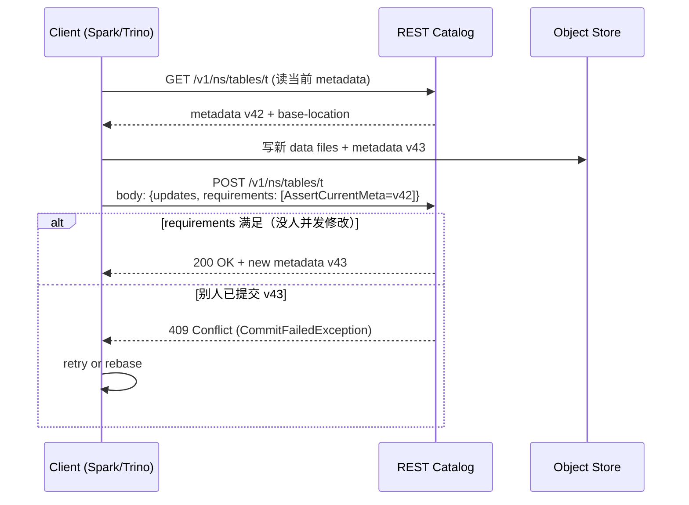

# Iceberg REST Catalog

!!! warning "先分清 · 本页讲协议，不讲实现"
    Iceberg REST Catalog 有**两层**极易被揉在一起：

    1. **协议层**（本页主体）· Apache Iceberg 维护的 **spec** · 定义 HTTP API · 不是可运行的产品
    2. **实现层**（本页附表引用）· Polaris / Nessie / UC / Gravitino / Glue 等**各自的服务端实现** · 能力、成熟度、兼容度参差

    **读者最容易的误读**：把某实现的能力当成协议已稳定提供的能力（"Polaris 支持 X 所以 REST 协议支持 X"）。本页的兼容矩阵段（§机制 6）专门拆这种混淆。

!!! tip "一句话定位"
    Iceberg 官方定义的 **HTTP/REST 层 Catalog 协议**。把"表在哪里、哪个 snapshot 是当前的、怎么 commit"标准化为一套 API——任何实现遵守协议即可互通。**在新建 Iceberg 项目里正在成为默认协议**（但不等于整个 Lakehouse 世界的"事实标准"——Glue / Unity 商业版 / HMS 在各自语境下仍是主流）。

!!! abstract "TL;DR"
    - **协议层事实**：HTTP/REST + JSON · 引擎端用同一个 `RESTCatalog` 客户端
    - 解决**引擎 × Catalog 矩阵爆炸**（以前每个引擎 × 每个 Catalog 各自实现）
    - **CAS 提交**规范化——所有实现都做同一套并发冲突检测
    - 协议层支持：**namespaces / tables / views / snapshot commit / config**
    - **权限 / 多租户**协议留给实现方（OAuth + Bearer token 是常规选择）
    - **实现方（各自产品，各自成熟度）**：Apache Polaris · Nessie · Gravitino · Snowflake Open Catalog · Databricks UC · AWS Glue（走自家 API 而非 REST）
    - **语境声明**：新建 Iceberg 项目里是默认；Databricks / AWS 栈里常共存其他 Catalog；Hadoop 时代栈很多仍跑 HMS

## 1. 它解决什么 · Catalog 混战时代

早期 Iceberg 每家 Catalog 自己一套实现：
- HiveCatalog（接 HMS）
- GlueCatalog（接 AWS Glue）
- JDBCCatalog（自己用 MySQL/PG）
- NessieCatalog（接 Nessie）
- HadoopCatalog（file-based）

引擎端的挑战：
- **Spark Iceberg 扩展**要适配 N 种 Catalog 实现 → 代码膨胀
- **Trino Iceberg Connector** 同样要一一适配
- **跨云**（A 云用 Glue、B 云用自建）→ 两份代码
- **想自建 Catalog 服务** → 没有标准 API 可遵循

**REST Catalog 的价值**：一份协议，任意实现，引擎端只认协议。

### 对比 HMS 的优势

| 维度 | Hive Metastore | Iceberg REST Catalog |
|---|---|---|
| 协议 | Thrift（老、贵） | HTTP/REST + JSON |
| 多租户 | 弱 | 内建（OAuth） |
| 扩展性 | 锁定 Hive schema | 协议可演进 |
| 云原生 | 自部署 thrift server | 容器化 friendly |
| Commit 语义 | 表锁 | CAS 返回 409 冲突重试 |
| 生态 | 逐渐淘汰 | 所有主流引擎都支持 |

### 工业现状（2024-2026）

- **Snowflake** 2024-08 开源 **Apache Polaris** 作为参考实现（2026-Q2 仍孵化 · 1.3.0-incubating）
- **Databricks** 2024-06 把 **Unity Catalog** 核心 OSS（LF AI & Data 沙箱）· 商业版兼容 Iceberg REST
- **Tabular**（Ryan Blue 团队）· **2024-06 被 Databricks 收购** · 原 Tabular 商业服务并入 Databricks；Iceberg 生态权力结构转折事件——Ryan Blue 等核心作者转向 Databricks，Iceberg REST spec 演进话语权重心位移
- **Nessie** 既有自有 API 也暴露 Iceberg REST（Git-like 能力是差异化）
- **Apache Polaris / Unity / Nessie / Gravitino** 的 Iceberg REST 兼容度参差——见下"兼容度矩阵"段

REST Catalog 已成**Iceberg 生态的新默认**；**Iceberg 协议本身仍在 Apache 主导下中立演进**，但 Databricks/Snowflake 的商业推动加速了 spec 能力（OAuth2 · Vended Credentials · Scan Planning · Multi-table Commit）。

## 2. 协议深挖

### 端点总览

| 类别 | 示例 | 作用 |
|---|---|---|
| Config | `GET /v1/config` | 客户端初始化、协议能力协商 |
| Namespace | `GET/POST/DELETE /v1/namespaces` | 数据库级 |
| Table | `GET/POST/DELETE /v1/{ns}/tables/{t}` | 表 CRUD |
| Rename | `POST /v1/tables/rename` | 改名 |
| **Commit** | `POST /v1/{ns}/tables/{t}` | 原子提交新 metadata |
| Update | `POST /v1/{ns}/tables/{t}/metrics` | 统计上报 |
| View | `GET/POST/DELETE /v1/{ns}/views/{v}` | View 管理 |
| Transaction | `POST /v1/transactions/commit` | 多表事务 |

### 提交流程（CAS 语义）



**关键**：`requirements` 字段是 CAS 的核心——提交时告诉服务端"我基于 v42 算的这次改动，请确保当前还是 v42"。

### 请求 / 响应示例

**创建表**：

```http
POST /v1/namespaces/db/tables
Content-Type: application/json

{
  "name": "orders",
  "schema": {...},
  "partition-spec": [{"name": "days_ts", "transform": "day", "source-id": 5}],
  "properties": {"format-version": "2"}
}
```

**Commit**（写入）：

```http
POST /v1/namespaces/db/tables/orders
{
  "requirements": [
    {"type": "assert-ref-snapshot-id", "ref": "main", "snapshot-id": 1234}
  ],
  "updates": [
    {"action": "add-snapshot", "snapshot": {...}},
    {"action": "set-snapshot-ref", "ref-name": "main", "type": "branch", "snapshot-id": 1235}
  ]
}
```

### 协议支持的高级能力

- **Branches / Tags**（Iceberg v2+）
- **View（视图）**（Iceberg View Spec 1.0 · 2023 ratified）
- **Multi-table Transaction**（一个原子提交跨多张表 · spec 2024-2025 演进中）
- **Vended Credentials**（服务端签发临时 S3 token，客户端不持长期 credential）
- **Scan Planning**（spec 1.5+ · 服务端完成剪枝返回 split 计划；详见下"机制 4"）
- **OAuth2**（认证层 · 和 Vended Credentials 的授权分工见"机制 5"）

## 3. 关键机制

### 机制 1 · Vended Credentials

安全机制：客户端**不直接持有**S3 长期 credential。

```
Client --auth--> REST Catalog
REST Catalog --sts--> AWS STS (权限范围限定在此表)
REST Catalog --> Client: 临时 token (TTL = 15 min)
Client --temp token--> S3
```

好处：
- 最小权限（每张表独立 token）
- 审计每次数据访问
- 多租户隔离

### 机制 2 · 多租户隔离

```
Warehouse A  → Namespace A1, A2 ...
Warehouse B  → Namespace B1, B2 ...
```

每个 Warehouse 独立 S3 bucket prefix + 独立 IAM Role。

### 机制 3 · 协议扩展能力

协议**预留扩展点**：
- Custom metadata properties
- 自定义 Request Body 字段（backward-compatible）
- Signal capabilities in `/v1/config`

例：新能力"向量索引"可以作为一类表资产，Catalog 实现支持就行，协议端不改。

### 机制 4 · Scan Planning · 从"客户端规划"到"服务端规划"

**传统 Iceberg 读**：客户端下载 metadata.json → manifest list → 所有相关 manifest，自己做分区剪枝和 split 生成。大表下 **client 要下载 MB 级 Avro 元数据**。

**Scan Planning endpoint**（REST Catalog spec 1.5+）：

```
POST /v1/{prefix}/namespaces/{ns}/tables/{table}/plan
  body: { snapshot-id, filter, case-sensitive, select-fields }
  response: { plan-status, plan-tasks: [...], file-scan-tasks: [...] }
```

服务端完成：
- Manifest 读取和剪枝
- Predicate pushdown 到 file-level stats
- 生成 split 计划（或返回 inline data 用于小表）

**收益**：
- Client 不必下载元数据 → **mobile / edge 场景可行**
- 服务端可用 **Bloom / 额外 index** 做更准剪枝（客户端没有这些）
- 多租户下元数据**本就不该全暴露** → 安全收益
- 为 **SaaS 形态湖仓**（Snowflake / Databricks Managed / S3 Tables）铺路

**风险**：
- 服务端成本上移 · 需要规划能力 scale-out
- Client 和 Server 升级不同步时功能降级路径要设计好

### 机制 5 · OAuth2 + Vended Credentials · 认证 / 授权分工

两个机制**互补但解决不同问题**：

| 机制 | 作用 | 颗粒 |
|---|---|---|
| **OAuth2** | **认证**（"你是谁"）| 客户端身份 · 每个 API 调用 |
| **Vended Credentials** | **授权到存储**（"你能访问哪些 S3 object"）| 每表 / 每次读 · STS 临时 token |

**端到端流程**：

```
1. Client → IdP (OIDC) → access_token (JWT)
2. Client → REST Catalog: Authorization: Bearer <access_token>
3. REST Catalog 校验 token + 决定授权范围（OAuth2 scope）
4. REST Catalog → AWS STS: AssumeRole + Session policy (限定到本表 prefix)
5. REST Catalog → Client: { data-files: [...], credentials: { access_key, secret, session_token, expiry } }
6. Client 用临时 token → S3 直读
```

**关键性质**：

- **Client 从不持长期 credential** · 只有短期 OAuth token 和分钟级 STS token
- **Catalog 能看到每次"谁读了哪张表"** · 审计链完整
- **Scope 缩小**：STS 只给本表 prefix 的 `s3:GetObject` · 越权被阻断

**Trino / Spark 客户端** 对这套流程已有内置支持（`iceberg.rest-auth.type = oauth2` 等配置）。Polaris 的 Credential Vending 2026-01 加了 SigV4 / KMS per-catalog / 位置限制等增强。

### 机制 6 · 各实现的 Iceberg REST 兼容矩阵

!!! warning "时效声明 · 快照时点 2026-Q2"
    **本矩阵是 2026-Q2 快照**——这类信息**季度级变化**。Polaris / UC / Nessie / Gravitino 各自 2026 都有 roadmap 推进；建议：
    - **选型时**以各实现**最新一次 release note** 为准
    - 本手册会尽量季度更新，但**不要把表格当长期稳定事实**
    - 能力边界看**概念类别**（是否支持 View / Multi-table / Vended）而不是"√/×"瞬时截图

| 能力 \ 实现 | Apache Polaris | Unity Catalog OSS | Nessie | Gravitino |
|---|---|---|---|---|
| Tables CRUD | ✅ | ✅ | ✅ | ✅ |
| Namespaces | ✅ | ✅ | ✅ | ✅ |
| Views | ✅ | 部分 | ✅ | 部分 |
| Branches / Tags | ✅ | 部分 | ✅（+ Nessie 跨表分支）| 依底层 |
| Multi-table Transaction | 部分 | ❌ | ✅（原生 Git-like）| ❌ |
| Vended Credentials | ✅（SigV4 · 1.3）| 部分 | 部分 | 依底层 |
| Scan Planning | 2026 roadmap | ❌ | ❌ | ❌ |
| OAuth2 Auth | ✅ | ✅ | ✅ | ✅ |

**解读（概念层，不挂具体版本）**：
- **Polaris** · Iceberg 原生特性覆盖最全 · Snowflake 主力投入
- **Nessie** · 分支 / 多表事务是它的 differentiator · 其他能力和 Polaris 平级
- **UC OSS** · 核心 CRUD 够用 · 高级特性（View / Multi-table）靠 Databricks 商业版
- **Gravitino** · 联邦层 · 自己不是 REST 实现 · 能力上限 = 被联邦的底层 Catalog 能力
- **AWS Glue** · **不是 Iceberg REST 实现** · 走自家 API（GlueCatalog），能力谱系独立（详见 [glue.md](glue.md)）

## 4. 工程细节

### 典型部署

```
Client (Spark/Trino/Flink)
        │ HTTPS
        ↓
Load Balancer
        │
        ↓
REST Catalog Service (Polaris / 自研)
        │
        ├── Metadata DB (Postgres / MySQL / DynamoDB)
        ├── IAM / OAuth
        └── S3 (数据)
```

### 客户端配置

**Spark**：

```scala
spark.conf.set("spark.sql.catalog.my_cat", "org.apache.iceberg.spark.SparkCatalog")
spark.conf.set("spark.sql.catalog.my_cat.type", "rest")
spark.conf.set("spark.sql.catalog.my_cat.uri", "https://catalog.corp/v1")
spark.conf.set("spark.sql.catalog.my_cat.warehouse", "s3://my-lake/warehouse")
spark.conf.set("spark.sql.catalog.my_cat.credential", "client:secret")
```

**Trino**：

```properties
connector.name=iceberg
iceberg.catalog.type=rest
iceberg.rest-catalog.uri=https://catalog.corp/v1
iceberg.rest-catalog.security=OAUTH2
iceberg.rest-catalog.oauth2.credential=client:secret
```

**PyIceberg**：

```python
from pyiceberg.catalog.rest import RestCatalog
catalog = RestCatalog(
    "prod",
    uri="https://catalog.corp/v1",
    warehouse="s3://my-lake/warehouse",
    credential="client:secret",
)
```

### 生产配置建议

- **HA**：REST Catalog 服务至少 3 副本 + Load Balancer
- **Metadata DB**：Postgres 主从 + 定时备份
- **缓存**：客户端 metadata cache TTL 30s-5min（Iceberg 原生支持）
- **限流**：按 client ID 限 commit QPS（避免雪崩）
- **审计**：所有 commit / read 写 audit log

## 5. 性能数字

| 操作 | 典型延迟 |
|---|---|
| Load Table（读当前 metadata） | 5-30ms |
| Commit（CAS 成功） | 10-100ms |
| Commit（冲突重试） | +几十 ms 每次 |
| Namespace list | < 10ms |
| QPS（单 REST 节点） | 1k-5k |
| Metadata DB 规模 | 10k+ tables 健康 |

## 6. 代码示例

### pyiceberg 端到端

```python
from pyiceberg.catalog.rest import RestCatalog
from pyiceberg.schema import Schema
from pyiceberg.types import NestedField, LongType, StringType, TimestampType
import pyarrow as pa

catalog = RestCatalog(
    "prod",
    uri="https://catalog.corp/v1",
    warehouse="s3://my-lake/warehouse",
)

# 建表
schema = Schema(
    NestedField(1, "id", LongType(), required=True),
    NestedField(2, "name", StringType()),
    NestedField(3, "ts", TimestampType()),
)
catalog.create_table("db.users", schema=schema)

# 读表
table = catalog.load_table("db.users")
df = table.scan(row_filter="id > 100").to_pandas()

# 写表
data = pa.Table.from_pydict({"id": [1, 2], "name": ["a", "b"], "ts": [...]})
table.append(data)
```

### Spark 用法

```sql
-- 使用 REST Catalog 的表
CREATE TABLE my_cat.db.orders (
  order_id BIGINT,
  amount   DECIMAL(18,2),
  ts       TIMESTAMP
) USING iceberg
PARTITIONED BY (days(ts));

-- Time Travel
SELECT * FROM my_cat.db.orders VERSION AS OF 123456;
```

### Trino 用法

```sql
SHOW CATALOGS;
USE my_cat.db;
SHOW TABLES;
SELECT * FROM orders WHERE ts >= DATE '2024-12-01';
```

## 7. 陷阱与反模式

- **OAuth 配置错误**：客户端和服务端端点 / scope 不一致 → 403
- **忽略 Vended Credentials**：直接给客户端长期 S3 Key → 权限泄露风险
- **Commit 重试死循环**：冲突率高时 naive retry → CPU 飙；应加 **指数退避** + **rebase**
- **Metadata DB 单点**：REST Service 多副本但 DB 没 HA → 单点故障
- **协议版本错配**：客户端用新协议、服务端旧 → `/v1/config` 协商必做
- **没做审计**：合规查不回"谁改了哪张表"
- **跨 Warehouse 跨账号**：S3 Bucket Policy 没配对 → Access Denied
- **长 Commit 未超时**：客户端挂起 → 资源泄露；服务端 timeout 30s

## 8. 横向对比 · 延伸阅读

- [Catalog 全景对比](../compare/catalog-landscape.md) —— HMS / REST / Nessie / Unity / Polaris / Gravitino
- [Iceberg](../lakehouse/iceberg.md) —— 协议背后的表格式
- [Nessie](nessie.md) / [Polaris](polaris.md) / [Unity Catalog](unity-catalog.md) / [Gravitino](gravitino.md) —— REST 实现方

### 权威阅读

- **[Iceberg REST Catalog Spec](https://iceberg.apache.org/docs/latest/rest-catalog/)** —— 官方协议
- **[OpenAPI 定义](https://github.com/apache/iceberg/blob/main/open-api/rest-catalog-open-api.yaml)** —— 可生成 client
- **[Apache Polaris](https://github.com/apache/polaris)** —— Snowflake 开源参考实现
- **[Tabular Catalog Blog](https://www.tabular.io/blog/)** · **[Databricks Unity Catalog OSS](https://www.unitycatalog.io/)**
- **[Nessie Iceberg REST 集成](https://projectnessie.org/)**

## 相关

- [湖表](../lakehouse/lake-table.md) · [Iceberg](../lakehouse/iceberg.md)
- [Unity Catalog](unity-catalog.md) · [Nessie](nessie.md) · [Polaris](polaris.md) · [Gravitino](gravitino.md)
- [Catalog 全景对比](../compare/catalog-landscape.md)
