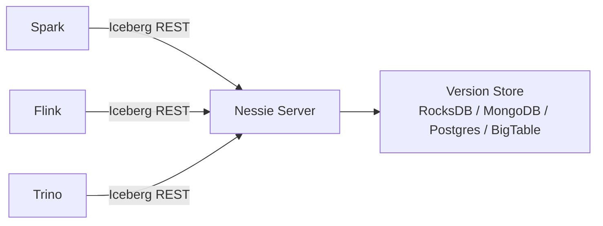

# Project Nessie

!!! tip "一句话定位"
    Git-like 的事务性 Catalog —— 给你的湖仓表加上"分支、提交、合并、标签"，数据从此可以像代码一样协作。

## 它解决什么

主流 Catalog（Hive Metastore、Iceberg REST、Glue）只维护"最新表状态"。但大规模湖仓环境里你真正想要的是：

- 一个 ETL 作业跑挂了，不要让半成品污染正式表
- 每日构建一个"开发分支"，跑通再合并进主分支
- 一次性**跨多张表**原子提交
- 按"标签"锁住一次发布供审计

这些诉求在关系数据库里要靠大事务 + 复杂运维，在湖仓里靠 Nessie 就是一条"branch / commit / merge"指令。

## 架构一览

Nessie 对外暴露 Iceberg REST Catalog 协议（以及自有 REST API），对内把"引用（分支/标签）→ commit → 一组表的元数据"以 Merkle-tree 风格存储。

## 关键模块

| 模块 | 职责 | 关键实现点 |
| --- | --- | --- |
| Reference | 分支 / 标签 / detached HEAD | 和 Git 完全同构 |
| Commit | 一次原子变更（可跨表） | 全局单调递增 commit id |
| Version Store | 底层持久化 | 可插拔：RocksDB / MongoDB / JDBC / BigTable |
| REST API | 引擎集成入口 | 同时支持 Nessie 原生协议与 Iceberg REST Catalog 协议 |
| GC | 回收无引用数据文件 | 类似 `git gc` |

## 和同类对比

- **Hive Metastore** —— 事实标准但只有"最新状态"，没有分支 / 多表事务
- **Iceberg REST Catalog（直接实现）** —— 协议同源，但不提供 Git-like 能力
- **Unity Catalog** —— Databricks 主推，治理/权限更重，语义更接近传统 DB
- **Apache Polaris** —— Snowflake 开源，接近"纯净的 Iceberg REST + 权限"

Nessie 的独特卖点是**Git-like 工作流**。如果团队没有这个诉求，直接 REST Catalog 更轻。

## 在我们场景里的用法

- **ETL 隔离** —— 每个大批作业在独立分支上跑，成功合并、失败丢弃
- **环境分层** —— `dev` / `staging` / `prod` 分支，promote = merge
- **审计** —— 关键发布打 tag，审计时直接 checkout tag

## 陷阱与坑

- **合并冲突语义**需要团队共识；数据合并不是代码合并
- **GC 策略**要和 Iceberg 自身的 `expire_snapshots` 协调，否则会出现"Nessie 以为还在，Iceberg 已经过期"的悬空引用
- **Version Store 选择**影响写入吞吐，小规模 RocksDB 即可，大规模建议 JDBC（Postgres）

## 延伸阅读

- Nessie docs: <https://projectnessie.org/>
- *A Git-like Experience for Data Lakes* —— ProjectNessie 白皮书
- Iceberg REST Catalog spec: <https://iceberg.apache.org/docs/latest/rest-catalog/>
