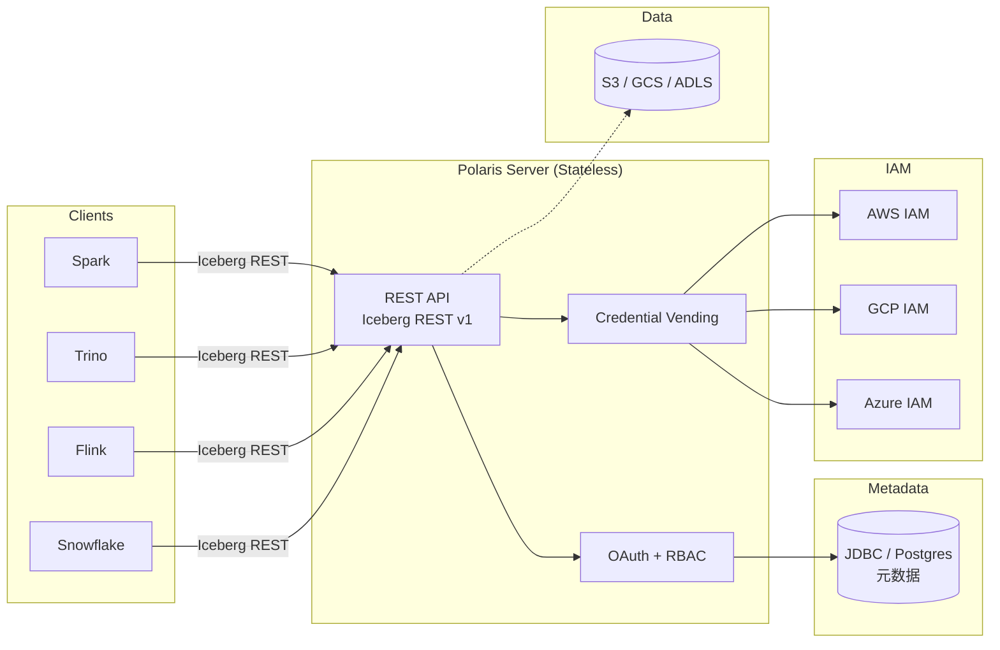

# Apache Polaris

!!! tip "一句话定位"
    **Snowflake 开源的 Iceberg REST Catalog 参考实现**。范围聚焦：**协议纯净 + 权限模型 + 多云凭证代签发**。不做向量、不做模型、不做多模资产——那些交给上层。**2024-08-09 进入 Apache 孵化 · 截至 2026-Q2 仍在孵化**（1.3.0-incubating 2026-01 发布）。与 Unity Catalog OSS 构成 2024-2026 Catalog 生态两大开源选项。

!!! abstract "TL;DR"
    - **定位**：纯净的 Iceberg REST Catalog + RBAC 权限
    - **出身时间线**：Snowflake 2024-06 宣布 Open Catalog → 2024-08-09 捐献 Apache 孵化 → 2026-01 发布 1.3.0-incubating（仍孵化中）
    - **核心能力**：Iceberg REST v1 协议 + Credential Vending（含 2026 新增 SigV4 / KMS per-catalog / 位置限制） + 多云后端 + Generic Table（1.3 GA · 支持非 Iceberg 表元数据）
    - **不做**：向量表 / 模型注册 / 血缘 / Volume（留给上层）
    - **对比 Unity**：Polaris 纯净 + Iceberg-first；Unity 全栈 + 多模资产
    - **对比 Nessie**：Polaris 无 Git-like 分支；Nessie 专做分支工作流
    - **成熟度声明**：**仍孵化期** · 生产采用建议用 Snowflake Open Catalog 托管版本或跟紧上游发版

## 1. 它解决什么

### Snowflake 的战略动机

Snowflake 2023 开始支持 Iceberg Tables，**主动拥抱开放**。2024 更进一步：
- **Snowflake Open Catalog**（商业托管）
- **开源参考实现 Polaris** 贡献 Apache

**信号**：Snowflake 承诺 **"你的 Iceberg 数据不被 Snowflake 锁定"**——通过标准协议 + 开源 Catalog 吸引多引擎生态入驻。

### 如果你只想要：

- 符合 Iceberg REST Catalog 协议的服务端
- 完整的认证（OAuth 2.0）+ 授权（RBAC）
- 跨引擎（Spark / Trino / Flink / Snowflake / 自研）互通
- 多云对象存储（S3 / GCS / ADLS）支持
- **不想要**多模资产、模型注册、复杂治理

→ Polaris 是"最小纯净实现"。

### 对比 Unity Catalog

| 维度 | Polaris | Unity Catalog |
|---|---|---|
| 出身 | Snowflake 2024 开源 | Databricks 2024 开源 |
| 范围 | **纯粹 Iceberg REST + 权限** | 表 / 向量 / 模型 / 文件多模资产 |
| 治理 | 基础 RBAC | 完整（血缘 / 审计 / 行列权限） |
| 商业版 | Snowflake Open Catalog | Databricks Unity |
| 生态倾向 | Snowflake + 开放 | Databricks |
| 成熟度 | 早期（2024）| 相对成熟 |

**典型选择**：
- 已在 Snowflake + 想 Iceberg → Polaris
- 已在 Databricks → Unity
- 都不绑定 → 根据需求（多模资产 / 权限粒度）

## 2. 架构深挖



### 特点

- **无状态 Server**：水平扩展
- **Iceberg REST v1 完整**：遵守官方 OpenAPI 定义
- **三层权限模型**：Catalog → Namespace → Table
- **Credential Vending 是差异化**

## 3. 关键机制

### 机制 1 · 三层 RBAC

```
Principal（身份 / 用户）
  ↓ 被赋予
Principal Role（身份角色）
  ↓ 被赋予
Catalog Role（资源角色）
  ↓ 授权到
Catalog / Namespace / Table
```

典型映射：
- `sales_analyst` (Principal) 有 `analyst` (Principal Role)
- `analyst` 获得 `read_sales_catalog` (Catalog Role)
- `read_sales_catalog` 授权 `SELECT` on `prod.sales.*`

### 机制 2 · Credential Vending（关键差异化）

传统做法：客户端持长期 AWS Key → 泄露风险大。

Polaris 做法：
```
1. Client 用 OAuth token 调 Polaris
2. Polaris 验证权限
3. Polaris 调 AWS STS，申请短期 token（限定仅能读特定 S3 prefix）
4. 返回 Client 短期 token（15 min TTL）
5. Client 用短期 token 直接访问 S3
```

**好处**：
- 客户端无长期凭证
- 权限最小化
- 可审计（每次 vending 都留痕）

### 机制 3 · 多云 Storage 配置

```yaml
catalog:
  name: prod
  type: INTERNAL
  storage:
    type: S3
    allowed_locations:
      - s3://my-lake/prod/*
    roleArn: arn:aws:iam::123:role/polaris-role
    externalId: polaris-ext
```

支持 S3 / GCS / ADLS。**多云混合部署友好**。

### 机制 4 · 纯粹的 Iceberg REST

**不扩展协议**。所有非 Iceberg REST 的功能（如多模资产）**不做**。这个自我约束让：
- 客户端零适配（Iceberg 客户端直接用）
- 未来 Iceberg spec 升级时可快速跟进
- 不重复造轮子

## 4. 工程细节

### 部署（Docker）

```yaml
version: "3"
services:
  polaris:
    image: polaris:latest
    ports: ["8181:8181"]
    environment:
      POLARIS_PERSISTENCE_TYPE: eclipse-link
      POLARIS_PERSISTENCE_URL: jdbc:postgresql://postgres:5432/polaris
      POLARIS_PERSISTENCE_USER: polaris
      POLARIS_PERSISTENCE_PASSWORD: pass
  postgres:
    image: postgres:15
```

### Spark 集成

```scala
spark.conf.set("spark.sql.catalog.polaris", "org.apache.iceberg.spark.SparkCatalog")
spark.conf.set("spark.sql.catalog.polaris.type", "rest")
spark.conf.set("spark.sql.catalog.polaris.uri", "http://polaris:8181/api/catalog")
spark.conf.set("spark.sql.catalog.polaris.warehouse", "prod_warehouse")
spark.conf.set("spark.sql.catalog.polaris.credential", "client-id:client-secret")
spark.conf.set("spark.sql.catalog.polaris.scope", "PRINCIPAL_ROLE:ALL")
```

### Trino 集成

```properties
connector.name=iceberg
iceberg.catalog.type=rest
iceberg.rest-catalog.uri=http://polaris:8181/api/catalog
iceberg.rest-catalog.security=OAUTH2
iceberg.rest-catalog.oauth2.credential=<client-id>:<client-secret>
iceberg.rest-catalog.oauth2.scope=PRINCIPAL_ROLE:ALL
```

### 创建资源

```bash
# Polaris CLI
polaris create catalog prod --default-base-location s3://lake/prod
polaris create namespace prod.sales
polaris create table prod.sales.orders --schema ...

# Principal 和角色
polaris create principal alice
polaris create principal-role analyst
polaris grant principal-role analyst alice

polaris create catalog-role read_only_sales
polaris grant catalog-role read_only_sales principal-role analyst
polaris grant TABLE_READ_DATA on table prod.sales.orders to catalog-role read_only_sales
```

## 5. 性能数字

| 操作 | 基线 |
|---|---|
| Load Table | < 50ms |
| Commit（CAS） | 50-200ms |
| List Namespaces | < 50ms |
| QPS（单节点）| 1k-3k |
| Metadata DB | 10k+ tables 健康 |

### 和 Iceberg REST 协议对标

- 完全兼容 Iceberg REST v1
- 客户端切换 Polaris / Tabular / 自建 REST Catalog 几乎零成本

## 6. 现实检视 · 2026 视角

### 成熟度

- **Snowflake Open Catalog（商业托管）**：Snowflake 客户生产可用 · 基于上游 Polaris 代码但自带商业 SLA
- **Apache Polaris 开源**：2024-08-09 进入 Apache 孵化 · 1.3.0-incubating（2026-01）· **仍孵化中**，朝毕业推进
- 企业自部署案例仍在增加；大多数生产选 Snowflake 托管

### Open Catalog（商业） vs Apache Polaris（OSS）的关系

| 维度 | Snowflake Open Catalog | Apache Polaris |
|---|---|---|
| 代码基础 | 基于上游 Apache Polaris | 社区主干 |
| 同步延迟 | 通常 1-2 个版本 | 实时 |
| 支持 SLA | Snowflake 商业支持 | 社区 |
| 使用门槛 | 一键开通 · 按量计费 | 自部署 · 运维自担 |
| 使用场景 | Snowflake 客户 + 生产重负载 | 自主可控 + OSS 栈 + 实验性 |

**选择原则**：生产重负载选 Open Catalog；自主可控 + 愿意跟上游选 Apache Polaris OSS。

### Polaris vs Unity 选择的微妙

- 如果团队 **Snowflake 重度用户**：Polaris 无缝
- 如果团队 **Databricks 重度用户**：Unity 无缝
- 如果 **中立第三方**：
  - 要多模资产 → Unity
  - 只要 Iceberg 表 → Polaris（更轻 + 更纯净）

### 2024-2026 生态博弈

- Databricks 2024 年收购 Tabular → Iceberg 阵营整合
- Snowflake Polaris vs Databricks Unity 的**Catalog 阵营**对抗
- 最终可能出现**统一开源 Catalog 协议 + 多实现**
- 独立选项：Nessie / Gravitino 中立但生态小

### 风险

- **Apache 孵化期**：API 可能有 breaking change
- **和 Snowflake 绑定感**：虽然开源，但 Snowflake 影响大
- **生态跟进速度**：Unity 加资产类型、Polaris 保守

## 7. 陷阱

- **Credential Vending 没配 IAM**：Polaris 调 STS 权限不够
- **Principal / Role 模型不理解**：三层不匹配业务组织 → 权限混乱
- **JDBC 单点**：Metadata DB 必须 HA
- **把 Polaris 当 Unity 用**：想要多模资产 / 血缘 → Polaris 不是工具
- **以为开源就零成本**：Arctic 风云多变，迁移成本也要算

## 8. 延伸阅读

- **[Apache Polaris 官方](https://polaris.apache.org/)** · **[GitHub](https://github.com/apache/polaris)**
- **[Snowflake Open Catalog 发布博客](https://www.snowflake.com/en/blog/introducing-polaris-catalog/)**
- **[Iceberg REST Catalog spec](https://iceberg.apache.org/docs/latest/rest-catalog/)**

## 相关

- [Iceberg REST Catalog](iceberg-rest-catalog.md) —— Polaris 实现的协议
- [Unity Catalog](unity-catalog.md) —— 主要竞争者
- [Nessie](nessie.md) —— 侧重 Git-like 工作流
- [Catalog 全景对比](../compare/catalog-landscape.md)
- [统一 Catalog 策略](../unified/unified-catalog-strategy.md)
