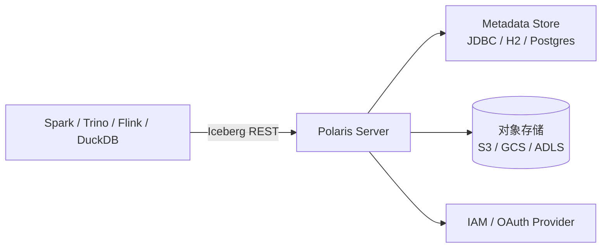

# Apache Polaris

!!! tip "一句话定位"
    Snowflake 开源的**纯净 Iceberg REST Catalog 实现 + 权限模型**。把"表注册中心 + 认证/授权"两件事做好，不做多模资产（Unity Catalog 那种路线），贴近 Iceberg 社区标准。

## 它解决什么

如果你只想要：

- 一个**符合 Iceberg REST Catalog 协议**的服务端
- 配套的**认证（OAuth 2.0）+ 授权（RBAC）**
- **跨引擎互通**（Spark / Trino / Flink / Snowflake / 自研都能接）

Polaris 是"最小实现"。它**不涉足向量、不涉足模型注册、不涉足多模资产** —— 这些由上层或其他系统负责。

## 架构

- **无状态 server**，水平扩展
- 所有表状态靠 Iceberg 的 `metadata.json` 原子切换（Catalog 只做 pointer + 权限）
- 权限模型：Catalog → Namespace → Table 的分层 RBAC

## 关键能力

- 完整 Iceberg REST Catalog v1 协议
- Principal（身份）+ Principal Role（角色）+ Catalog Role（资源级角色）
- Credential vending：客户端通过 Catalog 拿到短时对象存储凭证，**不用**把长期 AWS key 散播
- 多后端存储：S3 / GCS / ADLS / 本地

## 和 Unity / Nessie 怎么选

- 想要**纯净 Iceberg + 权限** → Polaris
- 要**多模资产（表+向量+模型+文件）+ 血缘 + 治理** → Unity Catalog
- 要**Git-like 分支 / 标签 / 跨表事务** → Nessie

Polaris 和 Nessie 可以视作 Iceberg 生态的两个极端：一个强调"协议纯净与权限"，一个强调"工作流能力"。

## 陷阱与坑

- 范围窄：别指望它能管向量或模型；那是 Unity / Gravitino 的活
- JDBC 后端要 HA：Catalog 挂了所有引擎都读不到表
- 项目成熟度：比 Nessie 更年轻，关注协议版本兼容

## 相关

- [Iceberg REST Catalog](iceberg-rest-catalog.md)
- [Unity Catalog](unity-catalog.md)
- [Nessie](nessie.md)
- [统一 Catalog 策略](../unified/unified-catalog-strategy.md)

## 延伸阅读

- Apache Polaris: <https://polaris.apache.org/>
- Snowflake Open Catalog 发布博客（Polaris 的商业托管起源）
