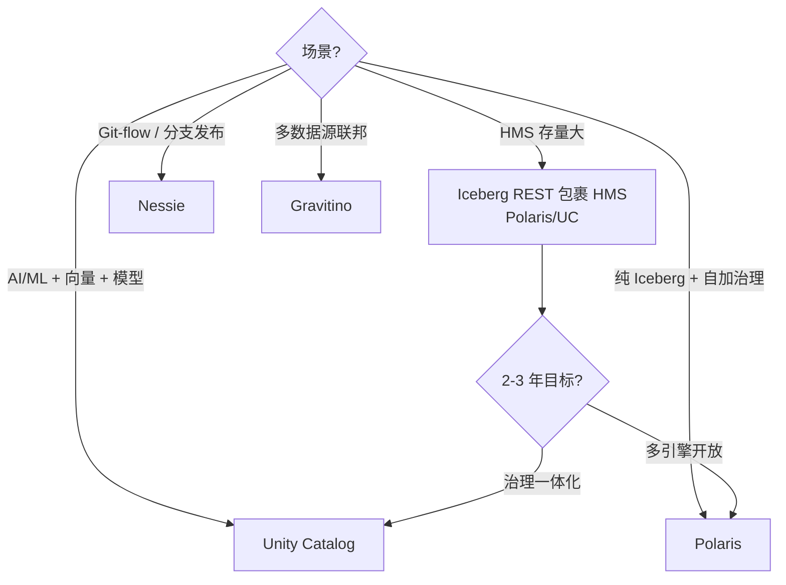
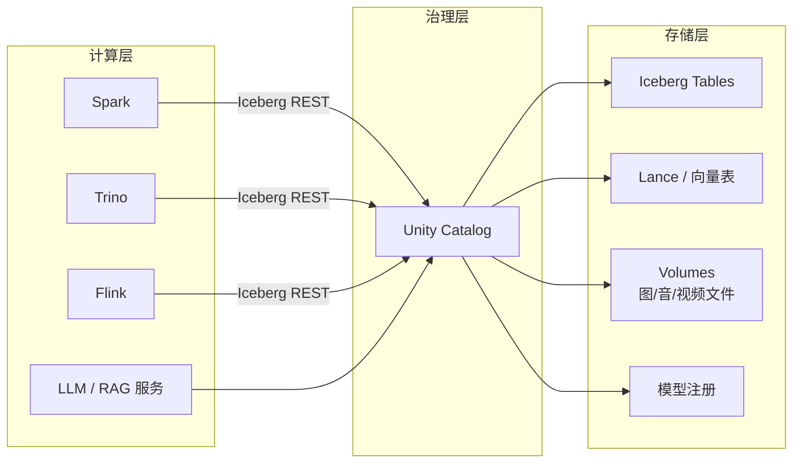
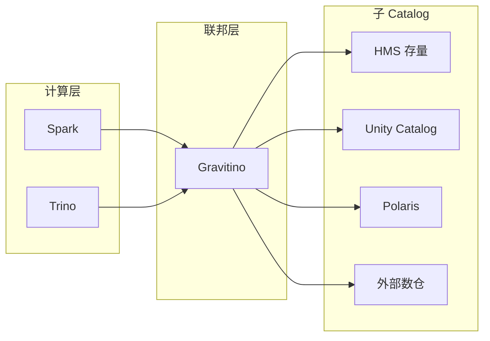
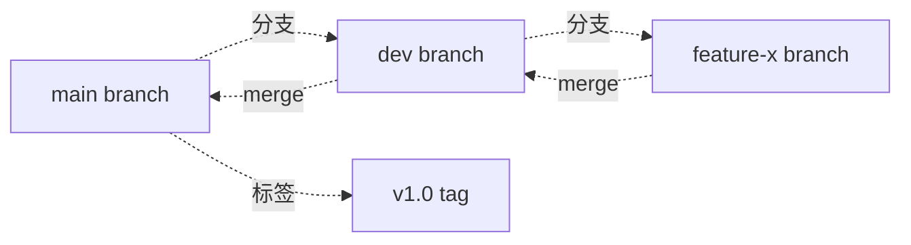

# Catalog 策略 · 选型决策树 · 治理平面升级

!!! tip "一句话定位"
    Catalog 世界的**选型决策 canonical**。一体化湖仓需要**一个 Catalog 统管所有资产类型**：表、向量表、模型、文件 Volume、Function。选型不再是"哪个 Catalog 好" · 而是"**谁能做多模资产 + 治理 + 协议开放三件事**"。

!!! warning "和 catalog/index.md 的分工"
    - **[catalog/index.md](index.md)**：Catalog 世界的**四层结构总览**（协议 / OSS 实现 / 商业托管 / 联邦）· 产品页（Unity / Polaris / Nessie / Gravitino / HMS / Glue）索引
    - **本页**：**选型决策树** + **治理平面升级论** + **部署拓扑** —— 是 `index.md` 的"战略决策" canonical
    - 读这两页的区别：想**理解 Catalog 世界如何组织**去 index · 想**做选型决策**来本页

!!! abstract "TL;DR"
    - **Catalog 从字典表升级成治理平面**：早年只注册表（HMS 够用）· 2026 要管**表 + 向量 + 模型 + Volume + Function**
    - **5 个现代候选**：Unity Catalog · Polaris · Gravitino · Nessie · Iceberg REST Catalog
    - **决策树主分支**：HMS 存量 / ML+AI 主负载 / Git-flow 需求 / 纯净 Iceberg / 多源联邦
    - **最小能力清单**（治理平面）：5 类对象 + 协议开放 + RBAC + 血缘 + 审计 + 扩展
    - **部署拓扑**：治理层 + 存储层 + 计算层三分 · Catalog 作中枢
    - **现阶段综合能力最强**：Unity Catalog OSS · Polaris + 外部治理紧随其后

## 1. 为什么 Catalog 突然重要

早年 Catalog 只是"表注册中心" —— HMS 够用。一体化湖仓时代它的角色**膨胀**到：

1. **多模资产**：表、向量、模型、Volume、Function 的统一命名空间
2. **治理入口**：权限、血缘、审计、脱敏、Tag 策略
3. **协议层**：定义读写、commit、扩展字段的开放标准
4. **多引擎中枢**：所有引擎都绕着它转（Spark / Trino / Flink / DuckDB / 向量库 / 模型库）

**Catalog 从"字典表"升级成了"治理平面"**。这是 2024-2026 湖仓架构最重要的范式变化之一。

### 1.1 为什么传统"表注册中心"不够

HMS 设计时只假设：
- 对象类型 = Table + Partition + Column
- 协议 = Thrift RPC
- 权限 = 外接（Ranger · Sentry）
- 血缘 = 外接（Atlas · DataHub）

一体化湖仓时代要求：
- 对象类型 = Table + **Vector Index + Model + Volume + Function + External Location**
- 协议 = REST + OpenAPI（跨语言 / 云原生）
- 权限 = **内建 RBAC** + 行列级 + Tag 策略
- 血缘 = **内建**跨 ML + BI

**HMS 是"被架构倒逼升级"的**。

## 2. 现代 Catalog 选手对比

| 候选 | 来源 | 强项 | 弱项 |
|---|---|---|---|
| **Unity Catalog**（OSS + 商业）| Databricks → LF AI&Data | **多模资产最全**（Table + Volume + Model + Function + Vector）· 治理能力最强 | OSS 版和商业版能力差距 · 早期生态与 Databricks 紧 |
| **Apache Polaris**（2026-02 TLP）| Snowflake → Apache | 纯 Iceberg REST + RBAC · 协议最"纯净" · 开放性好 | 范围偏窄 · 只管表 · 无向量 / 模型一等公民 |
| **Apache Gravitino**（TLP）| Datastrato → Apache | **多元数据源桥接**（多 HMS / 多 Catalog / 外部系统）· 多引擎统一 | 相对年轻 · 生态铺开中 |
| **Nessie** | Dremio | **Git-like 分支 / 标签 / 跨表事务** · 数据发布流 | 多模资产不是重点 · 主要服务 Iceberg |
| **Iceberg REST Catalog** | Iceberg 社区 | 协议标准本身 · 所有新 Catalog 基线 | 只是协议 · 需选实现（Polaris / Nessie / UC / Gravitino 等都实现它）|
| **AWS Glue** | AWS | Serverless · AWS 生态集成 | 封闭 · 多模资产支持弱 · 跨云不易 |
| **Snowflake Open Catalog** | Snowflake | Polaris 的商业托管版 | 商业锁定 · 但比 Snowflake 内部 catalog 开放 |
| **Hive Metastore**（4.0）| Hadoop 时代 | 生态兼容 · 存量大 | 能力老旧 · 不适合一体化 |

## 3. 选型决策树 · 实操向

### 3.1 主分支 5 条

**1. 有大量 HMS 存量负载？**
→ 先上 **Iceberg REST Catalog**（Polaris 或 UC OSS）**包裹** HMS · 逐步迁移  
→ 过渡期双写 · HMS 作只读兜底

**2. 主要负载是 AI / ML + 向量 + 模型管理？**
→ **Unity Catalog**（OSS 或托管）· 它的 Vector Index / Model artifact 一等公民支持最完整

**3. 强调数据 Git-flow · 分支发布 · 审计？**
→ **Nessie** + 外层治理（权限 / 血缘外接）  
→ 典型场景：合规金融 · 数据契约管控严 · dev/stage/prod 环境通过分支隔离

**4. 想要最"纯净"的 Iceberg 协议 · 自己加治理？**
→ **Polaris**（Snowflake 捐 Apache · 2026-02 TLP）· 纯 Iceberg REST + RBAC

**5. 多元数据源**（多个 HMS / 多个集群 / 外部数仓 / 外部系统）？
→ **Gravitino** 作中间层 · 联邦统一

### 3.2 决策流程图



### 3.3 反向排除：什么情况下**不该选**

- **不该选 HMS**（作为新建）：2026 年新建项目不应再选 HMS 为主 · 只作兼容层
- **不该选 Unity Catalog OSS**：如果无 Databricks 预算且只需要纯 Iceberg · OSS 版可能过重
- **不该选 Nessie**：如果多模资产（向量 / 模型）是主需求 · Nessie 能力有限
- **不该选 Polaris**：如果需要一等 Model / Vector 支持 · Polaris 暂时不覆盖
- **不该选 Glue**：如果需要跨云部署 · AWS Glue 锁定太强

## 4. 最小能力清单 · 治理平面

一个现代 Catalog 至少需要：

| 能力 | 说明 | 2026 各家支持 |
|---|---|---|
| **对象命名空间** | Table / Volume / Vector / Model / Function / External Location | UC 最全 · Polaris 只 Table · Gravitino 跨源 |
| **协议开放** | 至少兼容 Iceberg REST Catalog v1 | 全员支持（除 HMS）|
| **权限** | RBAC + 行列级策略 + Tag 策略 | UC 最全 · Polaris 基础 RBAC · Nessie 弱 |
| **血缘** | 列级 + 跨引擎 | UC 深度 · 其他靠外接 DataHub / Atlas |
| **审计** | Query / Commit / Access 全路径可溯 | UC 深度 · 商业版更强 |
| **扩展** | 多模资产的自定义 metadata schema | UC 已定义 · Polaris 演进中 |
| **多租户** | namespace 隔离 + quota | UC / Gravitino 强 |
| **HA / 备份** | Catalog 本身是关键基础设施 | 各家看具体部署 |

**现阶段能全满足的是 Unity Catalog**；**Polaris + 外部治理**是紧跟的备选。

## 5. 治理平面升级论 · 三个阶段

### 5.1 阶段 1 · 字典时代（2010s）

- HMS · 只注册表
- 权限 / 血缘 / 审计全外接
- 每个系统（Spark / Hive / Presto）看同一份 metadata 但不统一治理

### 5.2 阶段 2 · 协议时代（2020-2023）

- Iceberg REST Catalog 出现 · 引擎可插拔
- 多引擎同读同写 · 但**治理仍外接**
- Unity Catalog 商业版 / Databricks 私有 · 治理一体化但锁定

### 5.3 阶段 3 · 治理平面时代（2024-2026）

- Unity Catalog OSS · Polaris TLP · Gravitino TLP —— **治理一体化 + 开放**
- Catalog **直接管**表 + 向量 + 模型 + Volume
- Catalog 成为 **AI 和 BI 共享的信任中心**
- 对 AI：模型 artifact 作一等公民 · 和数据同一套 RBAC
- 对 BI：跨语义层的血缘可追溯

## 6. 部署拓扑 · 常见模式

### 6.1 单 Catalog 模式



**适合**：新项目 · 团队集中 · 单一技术栈决策。

### 6.2 联邦模式（Gravitino 中间层）



**适合**：多源 · 存量 HMS + 新建 · 跨组织数据共享。

### 6.3 Git-flow 模式（Nessie）



**适合**：数据发布流程严 · 分环境（dev/staging/prod 对应分支）· 合规审计。

## 7. 迁移路径 · HMS → 现代 Catalog

**千万不要"一次性迁移全部"**。推荐路径：

```
阶段 1（0-3 月）：
  - 新负载接新 Catalog（Polaris / UC OSS）
  - 老负载继续 HMS
  - 做 HMS → 新 Catalog 的只读适配（Iceberg REST 包 HMS）

阶段 2（3-12 月）：
  - 关键业务线按重要性排优先级迁移
  - 权限模型映射（GRANT 表盘点 + 转换）
  - 数据血缘补录（外接 DataHub / Atlas 逐步迁入 Catalog 内建）

阶段 3（12+ 月）：
  - HMS 降级为只读归档
  - 所有新写入走新 Catalog
  - 审计 / 合规逐步在新 Catalog 上原生实现
```

### 7.1 迁移三大坑

- **权限映射痛苦**：HMS 的 GRANT 表和 UC / Polaris 的 RBAC 模型不对等 · **提前盘点 GRANT 表**
- **扩展字段要对齐 OSS**：自造 metadata 字段会在升级 Iceberg 协议时冲突 · **不要造字段 · 用官方扩展点**
- **Catalog 本身是单点**：HA / 备份 / 恢复要按数据库级标准来 · 别当无状态服务部署

## 8. 和相关章节的关系

### 8.1 催生需求的上游

- [Lake + Vector 融合架构](../unified/lake-plus-vector.md) —— 向量 / 模型作一等公民是 Catalog 升级的驱动
- [多模数据建模](../unified/multimodal-data-modeling.md) —— 多模表 schema 依赖 Catalog 支持扩展元数据

### 8.2 具体产品

- [Iceberg REST Catalog](iceberg-rest-catalog.md) —— 协议层（所有新 Catalog 基线）
- [Unity Catalog](unity-catalog.md) —— 多模治理最全
- [Polaris](polaris.md) —— 纯 Iceberg + RBAC
- [Gravitino](gravitino.md) —— 多源联邦
- [Nessie](nessie.md) —— Git-like 分支
- [Glue](glue.md) —— AWS 托管
- [Hive Metastore](hive-metastore.md) —— 存量 / 兼容

### 8.3 治理协同

- [数据治理](../ops/data-governance.md) —— 和 Catalog 的治理能力配合
- [安全与权限](../ops/security-permissions.md) —— Catalog RBAC 的落地
- [多租户隔离](../ops/multi-tenancy.md) —— namespace + quota 具体实践

## 9. 陷阱 · 反模式

- **一次性迁移全部** —— 项目必败 · 分阶段
- **自造 metadata 字段** —— 升级 Iceberg 协议时冲突
- **权限模型未提前盘点** —— 迁移时发现 GRANT 表映射不干净
- **Catalog 视为无状态** —— HA / 备份按数据库级标准
- **选 Polaris 但要求一等模型支持** —— 选错 · Polaris 暂不覆盖模型
- **选 Unity Catalog OSS 但预算只够 Polaris 级** —— UC OSS 部署复杂度高
- **Nessie 强塞多模资产** —— Nessie 设计重点不在此 · 用 UC
- **Glue 跨云使用** —— AWS 锁定严 · 跨云需求应避开
- **把血缘外接当长期方案** —— Catalog 治理平面时代 · 血缘应逐步内建

## 10. 延伸阅读

- Apache Polaris: <https://github.com/apache/polaris>
- Apache Gravitino: <https://gravitino.apache.org/>
- Unity Catalog OSS: <https://unitycatalog.io/>
- Nessie: <https://projectnessie.org/>
- Iceberg REST Catalog Spec: <https://iceberg.apache.org/>
- *The Composable Data Stack*（a16z / Databricks 博客系列）
- Databricks UC OSS 发布说明
- Snowflake Open Catalog（Polaris 商业版）blog series
