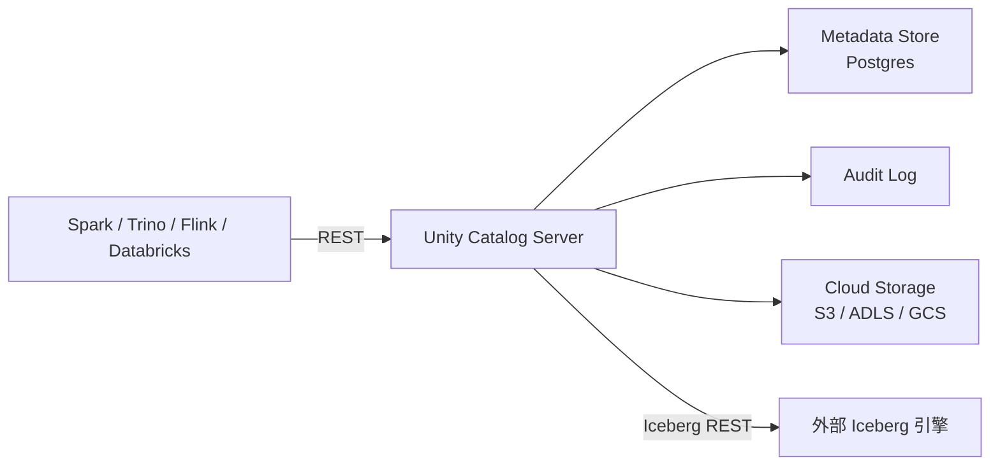

# Unity Catalog

!!! tip "一句话定位"
    Databricks 开源的**多模态数据与 AI 资产统一目录**。不只是"表注册中心"，还管 ML 模型、向量索引、Function、Volume（非结构化文件）。把"数据治理 + 血缘 + 权限"作为一等公民。

## 它解决什么

传统 Catalog 只管结构化表，但现代工作负载还有：

- **非结构化文件**（图像 / 音视频 / PDF）
- **ML 模型**（注册版本、审计）
- **向量索引 / 向量表**
- **UDF / AI Function**

Unity Catalog 把这些统一到一个命名空间 + 权限模型下：`catalog.schema.name` 能指向表，也能指向模型、Volume、索引。

## 架构一览

- 对 Iceberg 兼容：Unity 同时暴露 **Iceberg REST Catalog 协议**，让非 Databricks 引擎也能读
- 权限模型：`GRANT SELECT ON catalog.schema.table TO group`，行列级权限、动态视图

## 关键能力

- 多模资产类型：Table / Volume / Model / Function / Vector Index
- 细粒度权限：row-level、column-level、tag-based policy
- 血缘（Lineage）：列级别血缘，跨引擎
- 审计日志：所有访问可溯源
- 开放协议：Iceberg REST 完整兼容
- Delta Sharing：安全的跨组织数据共享协议

## 和邻居对比

- 对比 **HMS** —— Unity 是 HMS 的现代继任者，治理维度全面升级
- 对比 **Nessie** —— Nessie 强在 Git-like 分支，Unity 强在治理 + 多模资产
- 对比 **Polaris** —— Polaris 更接近"纯净 Iceberg REST + 权限"，Unity 范围更广
- 对比 **Gravitino** —— Gravitino 偏"统一多个元数据源"，Unity 自己就是元数据源

## 在我们场景里的用法

- 作为一体化团队的候选 Catalog：同时管关系表（Iceberg）、向量表、模型、原始文件
- 权限模型合规友好，适合内部多团队共享

## 陷阱与坑

- **开源版 vs Databricks 托管版** —— 部分治理能力仅托管版具备，选型要确认
- **性能**：治理功能越丰富，commit 路径越复杂
- **迁移成本**：从 HMS 切过来需要迁移全部 grants 与血缘历史

## 延伸阅读

- Unity Catalog OSS: <https://www.unitycatalog.io/>
- Databricks 博客：*Unity Catalog – A new architecture for data governance*
