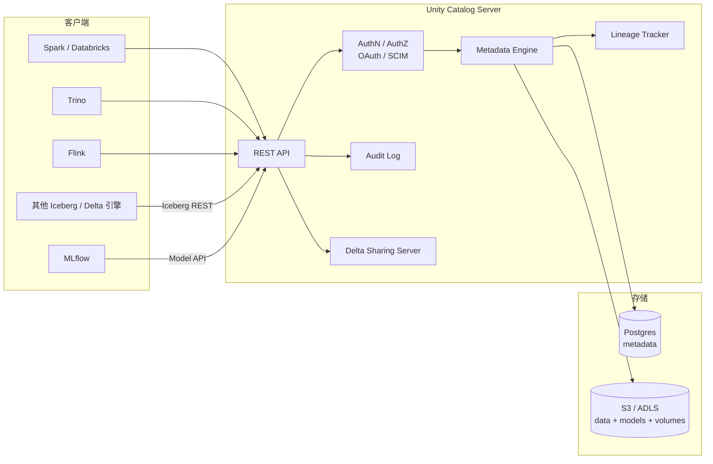

# Unity Catalog

!!! tip "一句话定位"
    Databricks 开源的**多模态数据与 AI 资产统一目录**。不只是"表注册中心"——还管 **ML 模型**、**向量索引**、**Function**、**Volume**（非结构化文件）。把"数据治理 + 血缘 + 权限"作为一等公民，兼容 **Iceberg REST** 让非 Databricks 引擎也能消费。**OSS 版 2024-06 Data+AI Summit 发布 · 提交给 LF AI & Data（沙箱项目）· 仍是 0.x 系列**。

!!! abstract "TL;DR"
    - **三层命名**：`catalog.schema.resource`（资源可以是 table/model/function/volume/index）
    - **六种资产类型**：Table · Volume · ML Model · Function · Vector Index · Delta Share
    - **细粒度权限**：行列级、tag-based、动态视图
    - **列级血缘**（Lineage）：跨引擎追溯
    - **开放协议**：Iceberg REST / Delta Sharing 双向兼容
    - **开源 vs 商业 · 重要区分**：
        - **UC OSS**（2024-06 开源）· LF AI & Data 沙箱项目 · 仍 0.x · 核心 Catalog API + 基础 RBAC
        - **Databricks UC**（商业托管）· 完整功能 · 列级血缘 + 行级过滤 + Delta Sharing 托管 + AI 治理
    - **战略定位**：从"Catalog"升级到"**AI-native 数据治理平面**"
    - **2024-06 Tabular 被 Databricks 收购对 Iceberg/UC 生态的影响**：Iceberg REST spec 话语权向 Databricks 集中；UC 对 Iceberg 的支持进一步深化

## 1. 它解决什么 · 从 HMS 到治理平面

### HMS / 传统 Catalog 只管表

Hive Metastore 的局限：
- 只有 **Table** 一种资产
- 权限模型简陋（GRANT 粗粒度）
- 无血缘、无审计
- 单一协议 Thrift

### AI 时代新增的资产类型

现代数据 + AI 团队面对：

| 资产类型 | 例子 |
|---|---|
| **结构化表** | Iceberg / Delta / Paimon |
| **非结构化文件** | 图像 / 音视频 / PDF / 原始日志 |
| **ML 模型** | SFT 微调版本、Embedding 模型 |
| **向量索引 / 向量表** | 产品 embedding、用户 embedding |
| **Function / UDF / AI Function** | `ai_extract_entity(text)` |
| **Notebook / Dashboard** | 数据产品 |

**没有统一目录**的代价：
- 查权限查 5 个系统
- 审计跨系统跨账号拼不起来
- 血缘断层：SQL → 模型 → 下游业务的链路不可追
- 合规查"谁访问过这个数据"查不动

### Unity Catalog 的命题

把所有这些**用同一套命名空间 + 权限 + 审计**管起来：

```
catalog: prod_ai
  schema: recommender
    table: user_features
    model: recall_model_v3
    index: item_embedding_hnsw
    function: compute_user_tower
    volume: raw_images
```

一条权限语句 `GRANT SELECT ON prod_ai.recommender.user_features TO group_data` 适用所有资产类型。

## 2. 架构深挖



### 核心子系统

| 子系统 | 职责 |
|---|---|
| **API** | REST + OpenAPI 定义 |
| **AuthN** | OAuth / IAM / SCIM 对接 |
| **AuthZ** | RBAC + ABAC + tag-based policy |
| **Metadata Engine** | 三层命名空间管理、commit 协议 |
| **Lineage** | 列级血缘追踪（解析 query plan） |
| **Audit** | 全量访问审计 |
| **Delta Sharing** | 跨组织安全数据共享 |

### 三层命名空间

```
Metastore (租户)
  ├── Catalog (生产/测试/...)
  │     ├── Schema (业务域)
  │     │     ├── Table
  │     │     ├── Model
  │     │     ├── Function
  │     │     ├── Volume
  │     │     ├── Vector Index
  │     │     └── Materialized View
  │     └── Schema
  └── Catalog
```

## 3. 关键机制

### 机制 1 · 权限模型

```sql
-- 租户级
GRANT USE CATALOG ON CATALOG prod TO data_team;

-- Schema 级
GRANT USE SCHEMA ON SCHEMA prod.sales TO analyst_team;

-- Table 级
GRANT SELECT ON TABLE prod.sales.orders TO analyst_team;

-- 列级
GRANT SELECT ON TABLE prod.sales.orders(order_id, amount) TO bi_viewer;

-- 行级（通过行过滤函数）
CREATE FUNCTION row_filter_by_region(region STRING)
  RETURNS BOOLEAN RETURN region = current_user_region();
ALTER TABLE prod.sales.orders SET ROW FILTER row_filter_by_region ON (region);

-- 动态视图（列级脱敏）
CREATE VIEW prod.sales.orders_masked AS
SELECT order_id,
       CASE WHEN is_member('finance') THEN amount ELSE NULL END AS amount
FROM prod.sales.orders;
```

### 机制 2 · 列级血缘（Lineage）

每次 query 通过 UC 执行：
- 解析 query plan
- 提取"读了哪些列 → 写了哪些列"
- 存到 Lineage Store
- UI 展示血缘图

合规价值：
- "A 列影响了下游哪些表？" ← 影响分析
- "这张表的数据来自哪里？" ← 来源追溯

### 机制 3 · Volume（非结构化文件）

```sql
-- 创建 Volume（一个 S3 prefix 下的非结构化资产）
CREATE VOLUME prod.raw.images LOCATION 's3://lake/raw/images/';

-- 授权
GRANT READ VOLUME ON VOLUME prod.raw.images TO ml_team;

-- 读取
SELECT ai_classify_image('/Volumes/prod/raw/images/p001.jpg');
```

这让**非结构化数据**也有统一的权限和命名。

### 机制 4 · Model 注册

```python
# MLflow + UC
with mlflow.start_run():
    mlflow.sklearn.log_model(
        model, "recommender",
        registered_model_name="prod.recommender.recall_v3"
    )

# 授权
spark.sql("""
GRANT EXECUTE ON MODEL prod.recommender.recall_v3 TO serving_team
""")
```

### 机制 5 · Iceberg REST 兼容

UC 同时暴露 **Iceberg REST Catalog 协议**——让非 Databricks 引擎（Trino、Spark OSS、Flink、Starburst）也能读同一份 metadata。

```properties
# Trino
connector.name=iceberg
iceberg.catalog.type=rest
iceberg.rest-catalog.uri=https://uc.corp/api/v1/iceberg-catalog
iceberg.rest-catalog.security=OAUTH2
```

### 机制 6 · Delta Sharing

跨组织数据共享协议：
- Provider 把 table 设为 shared
- Recipient 用 Delta Sharing Client 拉数
- 权限边界 + 审计日志完整

## 4. 工程细节

### 开源版 vs 商业版

| 能力 | OSS 0.2+ | Databricks UC |
|---|---|---|
| Namespace / Schema / Table | ✅ | ✅ |
| Volume | ✅ | ✅ |
| Model | ✅ | ✅ |
| Function | ✅ | ✅ |
| Iceberg REST 兼容 | ✅ | ✅ |
| 基础 GRANT / REVOKE | ✅ | ✅ |
| **列级权限 / 动态视图** | 部分 | ✅ |
| **行级过滤** | 部分 | ✅ |
| **列级血缘** | ⚠️ 实验 | ✅ |
| **Attribute-Based (tag policy)** | ❌ | ✅ |
| **Delta Sharing** | ✅ | ✅ |
| **向量索引资产** | ❌（规划中） | ✅ |

### 部署

```yaml
# docker-compose 最小 OSS 部署
services:
  unitycatalog:
    image: unitycatalog/unitycatalog:latest
    ports:
      - "8080:8080"
    environment:
      DATABASE_URL: "jdbc:postgresql://postgres:5432/uc"
  postgres:
    image: postgres:15
```

### 生产考量

- **HA**：多副本 UC Server + Postgres 主从
- **Metadata DB 备份**：pg_dump 定时
- **SCIM 集成**：从 LDAP / Okta / AzureAD 同步用户
- **审计流水**：日志吐到 Iceberg 表（自己查自己）

## 5. 性能数字

| 操作 | 基线 |
|---|---|
| List tables | < 50ms |
| Get table + lineage | 50-200ms |
| Grant / Revoke | < 100ms |
| Commit（Iceberg REST） | 50-200ms |
| QPS（单节点） | 500-2000 |
| Metadata 规模 | 10k+ catalogs / 100k+ tables |

## 6. 代码示例

### Python SDK

```python
from unitycatalog.client import ApiClient, Configuration, CatalogsApi

config = Configuration(host="http://localhost:8080/api/2.1/unity-catalog")
client = ApiClient(config)
api = CatalogsApi(client)

# 创建 catalog
api.create_catalog(CreateCatalog(name="prod_ai", comment="AI prod"))

# 创建 schema + table
tables_api = TablesApi(client)
tables_api.create_table(CreateTable(
    name="orders",
    catalog_name="prod_ai",
    schema_name="sales",
    table_type="MANAGED",
    data_source_format="DELTA",
    columns=[
        ColumnInfo(name="id", type_text="bigint", type_name="LONG"),
        ...
    ]
))
```

### Spark 用法

```sql
-- 切到 UC catalog
USE CATALOG prod_ai;
USE SCHEMA sales;

-- 常规 DDL
CREATE TABLE orders (
  order_id BIGINT,
  amount   DECIMAL(18,2)
) USING delta;

-- 授权
GRANT SELECT ON orders TO `data_analysts`;

-- 查血缘
SELECT * FROM system.access.column_lineage
WHERE source_table_full_name = 'prod_ai.sales.orders';
```

## 7. 陷阱与反模式

- **OSS 版被当商业版用**：高级治理功能不全 → 先确认需求匹配
- **迁移 HMS 时不做权限审计**：GRANT 陈年逻辑没对齐新权限模型
- **Lineage 延迟**：血缘异步，大规模 query 时有秒级延迟
- **审计日志不归档**：高频访问 UC server，audit log 会膨胀
- **单 Metastore 租户过多**：元数据 DB 压力大 → 按业务线拆 Metastore
- **Delta Sharing 权限弄错**：`SHARE` 对象的访问粒度容易疏忽
- **外部 Iceberg 引擎改表**：外部 commit 可能绕开 UC 的血缘 → 保证所有写都经 UC
- **把 UC 当 BI 层**：它是治理层，不替代 BI 工具的语义层

## 8. 横向对比 · 延伸阅读

- **[Catalog 全景对比](../compare/catalog-landscape.md)** —— HMS / REST / Nessie / Unity / Polaris / Gravitino
- [Iceberg REST Catalog](iceberg-rest-catalog.md) —— Unity 兼容的协议
- [Nessie](nessie.md) —— Git-like 替代品
- [Polaris](polaris.md) —— Snowflake 开源对标

### 权威阅读

- **[Unity Catalog OSS](https://www.unitycatalog.io/)** · **[GitHub](https://github.com/unitycatalog/unitycatalog)**
- **[Databricks Unity Catalog 文档](https://docs.databricks.com/en/data-governance/unity-catalog/index.html)**
- **[Delta Sharing 协议](https://delta.io/sharing/)**
- **[Uniform (Unity Iceberg 互通)](https://docs.databricks.com/en/delta/uniform.html)**
- Databricks 博客：*Unity Catalog – A new architecture for data governance*

## 相关

- [Iceberg REST Catalog](iceberg-rest-catalog.md) · [Nessie](nessie.md) · [Polaris](polaris.md) · [Gravitino](gravitino.md) · [HMS](hive-metastore.md)
- [数据治理](../ops/data-governance.md) · [安全与权限](../ops/security-permissions.md)
