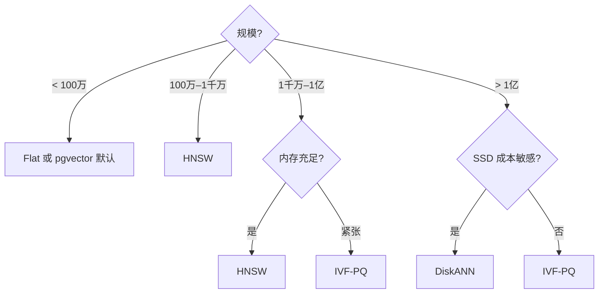

# ANN 索引对比：HNSW / IVF-PQ / DiskANN / Flat

!!! tip "读完能回答的选型问题"
    "我现在有 X 千万 / X 亿向量、Y GB 内存预算、Z ms 延迟目标" —— 我应该选哪个 ANN 索引？

## 对比维度总表

| 维度 | Flat | HNSW | IVF-PQ | DiskANN |
| --- | --- | --- | --- | --- |
| **本质** | 暴力扫描 | 分层图 | 倒排桶 + 乘积量化 | 磁盘友好图（Vamana）|
| **Recall 上限** | 100% | 极高（99%+）| 中高（95–99%）| 高（99%+）|
| **内存占用** | 全量 float32 | 全量 float32 + 图结构（×1.2–1.5）| 压缩后约原向量 5–20% | 小（主力在 SSD）|
| **查询延迟** | 与 N 线性 | 毫秒级 | 毫秒级 | 毫秒级（受 SSD IO 限）|
| **构建速度** | 零 | 中慢（O(N log N)）| 中（k-means）| 慢 |
| **增量写入** | 任意 | 增量加点友好 | 不友好（批建最佳）| 不友好 |
| **删除** | 易 | 需标记 + 周期重建 | 标记 + 周期重建 | 标记 + 周期重建 |
| **硬件倾向** | 内存 | 内存 | 内存（量化后） | SSD |

## 每位选手的关键差异

### Flat（暴力）

没有索引，一次查询扫全量。**Recall 100%** 是基线，适合：

- 规模 **< 100 万**，延迟要求不苛刻
- 评估 / benchmark 时作为 ground truth
- 极小的实验场景

一旦上到千万级就必须换。

### HNSW

**高 recall + 查询稳定**的首选。内存占用大，但质量和延迟的 trade-off 面调参空间最丰富。

**甜区**：
- 规模 **< 亿级**
- 内存预算宽裕
- 需要增量写（例如近实时入库）
- 对 recall 要求高（95%+）

### IVF-PQ

**规模大 + 内存紧张**时最现实的选项。压缩代价换容量，调参精细。

**甜区**：
- 规模 **亿级 / 十亿级**
- 内存预算有限
- 批建为主，增量可以接受周期性 reindex
- recall 目标 95%–99% 可谈

### DiskANN

**"把绝大部分放 SSD"**。内存只放少量图元数据，延迟仍能到毫秒级。是"巨量向量 + 低成本"的解。

**甜区**：
- 规模 **十亿级**
- 成本敏感
- NVMe SSD 充足
- 能接受较长构建时间

## 用法决策树

## 典型 OSS 支持

| 索引 | Faiss | Milvus | LanceDB | Qdrant | pgvector |
| --- | --- | --- | --- | --- | --- |
| Flat | ✅ | ✅ | ✅ | ✅ | ✅ |
| HNSW | ✅ | ✅ | ✅ | ✅（默认）| ✅（0.5+）|
| IVF-PQ | ✅ | ✅ | ✅（默认）| 部分 | ❌ |
| DiskANN | ✅ | ✅ | 计划中 | ❌ | ❌ |

## 评估与调参指南

- **recall 目标先定**：没有"精准"的检索，只有"够不够用"。给下游应用明确 recall@K 目标
- **调参路径**：HNSW 先动 `ef`，IVF-PQ 先动 `nprobe`，都是"recall ↔ 延迟"的最直接开关
- **Benchmark 用自家数据**：公开数据集（SIFT / GloVe）得到的相对顺序未必复现到你的分布
- **监控三件事**：p99 延迟、recall（定期人工标注或 LLM 判分）、索引大小

## 相关

- 概念页：[HNSW](../retrieval/hnsw.md) · [IVF-PQ](../retrieval/ivf-pq.md)
- [向量数据库](../retrieval/vector-database.md)

## 延伸阅读

- ANN-Benchmarks: <https://ann-benchmarks.com/>
- *DiskANN: Fast Accurate Billion-point Nearest Neighbor Search on a Single Node* (NeurIPS 2019)
- *Efficient and robust ANN search using HNSW* (Malkov & Yashunin, 2016)
