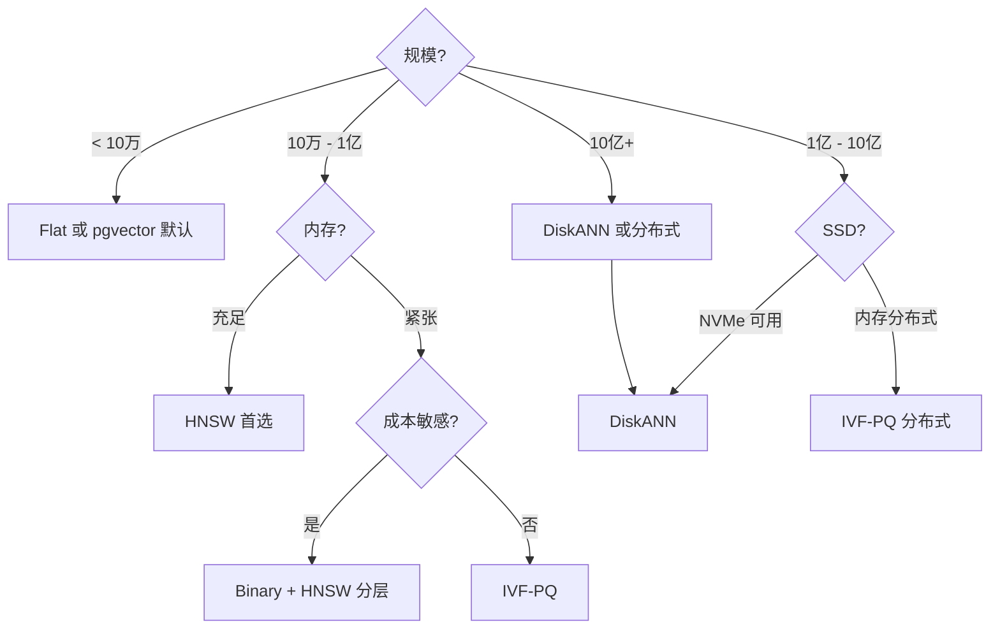

# ANN 索引对比 · HNSW / IVF-PQ / DiskANN / Flat / Binary

!!! tip "读完能回答的选型问题"
    "我现在有 X 千万 / X 亿向量、Y GB 内存预算、Z ms 延迟目标" —— 我应该选哪个 ANN 索引？**2024-2026 年量化技术（Binary / FP8）的成熟**改变了传统"HNSW vs IVF-PQ vs DiskANN"的三选一。

!!! abstract "TL;DR"
    - **Flat**：暴力扫描，**只用于 benchmark 或 < 10 万向量**
    - **HNSW**：< 1 亿规模的稳妥首选，**recall 高 · 延迟稳 · 内存重**
    - **IVF-PQ**：1 亿-10 亿规模，**压缩省内存 · 精度略降**
    - **DiskANN**：10 亿+ 或成本敏感，**NVMe 必备 · 延迟略高**
    - **Binary Embedding**（2024+ 新）：**极致压缩 32×**，配合分层检索使用
    - **2026 实务**：很多团队组合用——Binary 粗召回 + HNSW 精排 + Rerank

## 对比维度总表

| 维度 | Flat | HNSW | IVF-PQ | DiskANN | Binary |
|---|---|---|---|---|---|
| **本质** | 暴力扫描 | 分层图 | 倒排桶 + 乘积量化 | 磁盘友好图（Vamana） | 1-bit 量化 + Hamming |
| **Recall 上限** | 100% | 99%+ | 95-99% | 95-99% | 90-95% |
| **内存占用** | 全量 float32 | 向量 + 图（×1.2-1.5）| 量化后 5-20% | 10-15% + SSD | **~3%** |
| **存储** | 内存 | 内存 | 内存 | SSD + 少量内存 | 内存 |
| **查询延迟** | O(N) 与规模线性 | **最快** < 10ms | 5-20ms | 2-10ms（NVMe）| 极快（bitwise） |
| **构建速度** | 零 | 中-慢（O(N log N)）| 中（k-means）| **慢** | 快 |
| **增量写入** | 任意 | ✅ 友好 | ⚠️ 不友好 | ⚠️ 不友好 | ✅ |
| **删除** | 易 | 需标记 + 周期重建 | 标记 + 周期重建 | 标记 + 周期重建 | 易 |
| **硬件倾向** | 内存 | 内存 | 内存（量化后）| **NVMe SSD** | 内存 |
| **规模甜点** | < 10万 | 1M - 100M | 100M - 10B | 100M - 10B+ | **任意**（组合）|
| **成熟度** | 最高 | 最高 | 最高 | 2024+ 工业级 | 2024+ 快速成熟 |

## 2024-2026 新变化

### Binary Embedding 规模化

- **Qdrant 2024** 原生支持 binary quantization
- **Milvus 2.4+** 支持
- **Lucene / OpenSearch** 加入 1-bit scalar quantization
- **典型做法**：Binary 粗召回 10000 个 → float32 精排 1000 个 → Rerank

### DiskANN 工业化

- **Milvus DiskANN 索引**（2.4+）成熟
- **Microsoft Bing / Azure AI Search** 大规模生产
- **FreshDiskANN** 变种支持增量

### HNSW 仍是中位数首选

- 1M-100M 规模**几乎没有实质挑战者**
- 主流向量库都默认 HNSW
- 配 filter-aware（Qdrant）或 metadata pre-filter（主流）

---

## 每位选手的关键差异

### Flat（暴力基线）

没有索引，一次查询扫全量。**Recall 100%** 是基线。

**适合**：
- 规模 **< 10 万**，延迟要求不苛刻
- 评估 / benchmark 时作为 ground truth
- 极小的实验场景（Notebook）

一旦上到百万级延迟就崩。

### HNSW（< 1 亿首选）

**高 recall + 查询稳定**的首选。基于"小世界网络 + 分层"，**2016 年 Malkov 的关键贡献**让向量检索真正走进工业。

**甜区**：
- 规模 **1M - 100M**
- 内存预算宽裕
- 需要增量写（例如近实时入库）
- recall 95%+ 刚需

**劣势**：
- 内存占用大（向量 + 图，基本 = 原向量 × 1.3-1.5）
- 删除不友好（图结构难维护）
- 十亿规模要分布式

详见 [HNSW](../retrieval/hnsw.md)。

### IVF-PQ（规模大 + 内存紧 首选）

**压缩代价换容量**。IVF 倒排桶 + PQ 乘积量化，典型 16-64× 压缩。

**甜区**：
- 规模 **100M - 10B**
- 内存预算有限
- 批建为主，增量可以接受周期性 reindex
- recall 95-99% 可谈

**劣势**：
- 精度略低于 HNSW
- 增量插入要 retrain 或重建
- 参数调优复杂（nlist / nprobe / M / nbits）

详见 [IVF-PQ](../retrieval/ivf-pq.md)。

### DiskANN（十亿级 + 成本敏感）

**"把绝大部分放 SSD"**。Microsoft 2019 提出，Vamana 图结构 + 磁盘友好布局。

**甜区**：
- 规模 **10 亿+**
- NVMe SSD 充足（**SATA SSD 完全不可行**）
- 成本敏感（NVMe 比 RAM 便宜 10×）
- 能接受较长构建时间

**劣势**：
- **硬依赖 NVMe**（I/O 不够性能崩）
- 构建慢
- 增量弱（FreshDiskANN 改善但成本高）
- 少量 RAM 仍然要（PQ 压缩版本）

详见 [DiskANN](../retrieval/diskann.md)。

### Binary Embedding（2024+ 新选项）

**1-bit 量化 + Hamming 距离**。**极致压缩**：float32 → 1 bit → 32×。

**实用模式**：
```
1. Binary 粗召回 10000 个（内存极小 + 极快）
2. INT8 或 float32 精排 100-1000 个
3. Rerank top 10
```

**甜区**：
- **大规模 + 成本极致敏感**
- 对精度容忍度高（< 5-10% recall 下降）
- 可以做分层检索（Binary → Full → Rerank）

**劣势**：
- **单独用精度损失显著**（5-10%）
- 领域分布漂移时损失更大
- 不是所有系统都支持

详见 [Quantization](../retrieval/quantization.md) · [Sparse Retrieval](../retrieval/sparse-retrieval.md)。

---

## 决策树

### 速查表（规模 + 预算 → 索引）

| 规模 | 内存预算 | 推荐 |
|---|---|---|
| **< 100 万** | 不紧 | **Flat**（暴力 · recall = 1.0）|
| **100 万 – 1 千万** | 充足 | **HNSW** |
| **1 千万 – 1 亿** | 紧 | **IVF-PQ** 或 **HNSW + 量化** |
| **1 亿 – 10 亿** | SSD 足 | **DiskANN** |
| **> 10 亿** | 成本敏感 | **DiskANN** 或**分片 HNSW** |

详细决策树：



## 典型 OSS 支持矩阵

| 索引 | Faiss | Milvus 2.4+ | LanceDB | Qdrant | pgvector 0.7+ |
|---|---|---|---|---|---|
| Flat | ✅ | ✅ | ✅ | ✅ | ✅ |
| HNSW | ✅ | ✅ | ✅ | ✅（默认） | ✅ |
| IVF | ✅ | ✅ | ✅ | ⚠️ 部分 | ✅ |
| IVF-PQ | ✅ | ✅ | ✅（默认） | 部分 | ❌ |
| DiskANN | ✅ | ✅（可选） | 计划中 | ❌ | ❌ |
| **Binary Quantization** | ✅ | ✅ 2.4+ | 2024+ | ✅ 原生 | ⚠️ |
| INT8 Scalar | ✅ | ✅ | ✅ | ✅ | ⚠️ |

## 性能数字（参考）

基于 [ANN-Benchmarks](https://ann-benchmarks.com/) 与典型工业测试：

### 百万级（1M × 128d）

| 索引 | 构建 | 查询 p99 (recall@10 = 99%) | 内存 |
|---|---|---|---|
| Flat | 0 | 50ms | 512 MB |
| HNSW | 2-5 min | **0.2-0.5 ms** | ~700 MB |
| IVF-PQ | 2-3 min | 2-5 ms | 20-50 MB |

### 亿级（100M × 768d）

| 索引 | 内存 | p99 延迟 | Recall@10 |
|---|---|---|---|
| Flat | 300 GB | 20s（不可行）| 100% |
| HNSW | 360 GB | 10-50 ms | 99% |
| IVF-PQ | 30-60 GB | 30-100 ms | 95-99% |
| DiskANN | 30 GB + 300 GB SSD | 5-15 ms | 99% |
| Binary + HNSW 精排 | 10 GB + 300 GB | 20-50 ms | 95% |

### 十亿级（1B × 768d）

| 索引 | 可行性 |
|---|---|
| HNSW 单机 | ❌（3 TB 内存） |
| HNSW 分布式 | ✅ 成本极高 |
| IVF-PQ | ✅ 200-300 GB 内存 |
| **DiskANN** | ✅ 30 GB + 1-3 TB NVMe |
| Binary 分层 | ✅ 100 GB 内存 + float32 on disk |

---

## 评估与调参指南

### 1. 先定 Recall 目标

- **Chat 搜索**：recall@10 95% 够用
- **推荐召回**：recall@50 90% 够用（下游 rerank 补偿）
- **合规 / 法律检索**：99%+
- **去重 / 聚类**：95%

**没有目标的"调参"是盲调**。

### 2. 核心参数

| 索引 | 主调参数 | 作用 |
|---|---|---|
| HNSW | `M` / `efConstruction` / **`efSearch`** | efSearch 是最直接的"recall vs 延迟" |
| IVF-PQ | `nlist` / **`nprobe`** / `M` / `nbits` | nprobe 直接控制 recall |
| DiskANN | `R` / `L_build` / **`L_search`** / `α` | L_search 在线调 |
| Binary | 量化位数（1/2/4）· 精排候选数 | 精排候选决定最终精度 |

### 3. Benchmark 的坑

- 公开数据集（SIFT / GloVe / DEEP）**分布规整**
- 自家数据 embedding 分布可能**不均匀**（长尾 / 聚簇）
- **自家数据 benchmark 比公开数据重要 10×**

### 4. 监控三件事

- **p50 / p99 延迟**
- **recall**（人工标注或 LLM 判分，定期）
- **索引规模 / 内存 / 磁盘占用增长曲线**

---

## 现实检视 · 2026 视角

### 工业主流

- **HNSW 仍是默认选项**（< 1 亿 95% 团队用 HNSW）
- **IVF-PQ 在大规模 + 内存约束场景稳定**
- **DiskANN 从学术到工业**（Milvus / Microsoft 大规模生产）
- **Binary Embedding 开始进入主流**（Qdrant / Milvus 原生）

### 组合越来越多

单一索引已经不是主流：
- **多级索引**：Binary 粗召回 → HNSW 精排 → Rerank
- **IVF + HNSW 混合**（SCANN / ScaNN 思路）
- **多副本 + 不同参数**：延迟敏感路径高 recall、批处理路径低成本

### 新技术

- **Matryoshka Embedding**（2023-2024）：弹性维度，**不改变 ANN 索引但改变向量长度**
- **FP8 向量**：H100+ 硬件优化
- **量化的量化**（QAT 训练期量化）：精度损失更小

### 别做的事

- **不看规模就选**：10 万用 DiskANN / 10 亿用 HNSW 都是错
- **只看公开 benchmark**：自家数据才是最终 gate
- **过度追新**：HNSW + IVF-PQ 够大多数场景，Binary / FP8 是锦上添花
- **一上来就分布式**：先单机调好参数
- **不做 recall 测试**：一年后发现业务效果退化

---

## 按场景推荐

| 场景 | 推荐 |
|---|---|
| **小团队 MVP** | HNSW（pgvector / LanceDB） |
| **RAG 企业知识库** | HNSW + Rerank |
| **推荐召回（亿级）** | IVF-PQ 或 **HNSW 分布式** |
| **十亿级搜索** | **DiskANN** |
| **成本极敏感 + 大规模** | Binary 分层 + Rerank |
| **实时大屏向量** | HNSW（内存）|
| **合规 / 法律（高 recall）** | HNSW + ef=200+ |

---

## 相关 · 延伸阅读

### 系统页

- [HNSW](../retrieval/hnsw.md) · [IVF-PQ](../retrieval/ivf-pq.md) · [DiskANN](../retrieval/diskann.md) · [向量数据库](../retrieval/vector-database.md)

### 相关对比

- [向量数据库对比](vector-db-comparison.md) · [Embedding 模型横比](embedding-models.md) · [稀疏检索对比](sparse-retrieval.md)
- [Quantization](../retrieval/quantization.md) · [Sparse Retrieval](../retrieval/sparse-retrieval.md) —— Binary / Matryoshka / ColBERT 等新范式

### 权威阅读

- **[ANN-Benchmarks](https://ann-benchmarks.com/)** —— 最权威的算法层对比
- **[VectorDBBench](https://github.com/zilliztech/VectorDBBench)** —— 系统层对比
- **[Malkov & Yashunin (HNSW, 2016)](https://arxiv.org/abs/1603.09320)** —— HNSW 论文
- **[Jégou et al. (PQ, TPAMI 2011)](https://hal.inria.fr/inria-00514462v2/document)** —— PQ 原论文
- **[DiskANN (NeurIPS 2019)](https://www.microsoft.com/en-us/research/publication/diskann-fast-accurate-billion-point-nearest-neighbor-search-on-a-single-node/)**
- **[Binary Embedding Benchmarks (HF)](https://huggingface.co/blog/embedding-quantization)**
