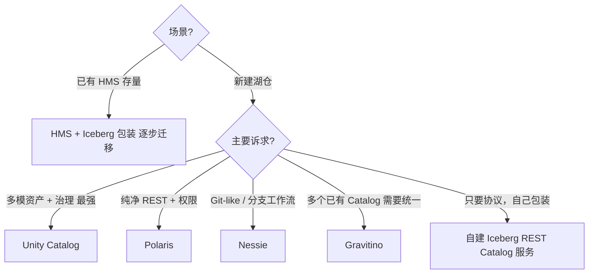

# Catalog 全景对比

!!! tip "读完能回答的选型问题"
    **2026 年我在搭湖仓，应该选哪个 Catalog？** 各个选手的定位、适用场景、和迁移路径到底是什么？

## 对比维度总表

| 维度 | HMS | Iceberg REST | Nessie | Unity Catalog | Polaris | Gravitino |
| --- | --- | --- | --- | --- | --- | --- |
| **定位** | 传统注册中心 | 协议标准 | Git-like | 多模资产 + 治理 | 纯净 REST + 权限 | 多元数据源桥接 |
| **多模资产** | ❌ | ❌ | 部分 | ✅（最全） | ❌ | 部分 |
| **协议** | Thrift | REST | 自有 + REST | 自有 + REST | REST | 适配多种 |
| **分支 / 标签** | ❌ | ❌ | ✅ | 限定 | ❌ | ❌ |
| **权限 / RBAC** | 靠 Ranger | 实现决定 | 实现决定 | ✅（最强） | ✅ | 部分 |
| **血缘 / 审计** | ❌ | ❌ | 部分 | ✅ | 审计 | ✅ |
| **跨引擎开放** | ✅ | ✅（协议即互通）| ✅（同时提供 REST）| ✅（兼容 REST）| ✅ | ✅ |
| **成熟度** | 最高 | 协议成熟 | 中高 | 中 | 新 | 新 |
| **生态锚点** | Hadoop 全家桶 | Iceberg 社区 | Dremio / Iceberg | Databricks / LF | Snowflake | Datastrato |

## 每位选手的甜区

### HMS —— 历史兼容，不新建

"你已经在跑"才是它存在的理由。新项目别再选。

### Iceberg REST Catalog —— 协议本身

不是一个"系统"，是**协议**。所有其他选手都最好兼容它。

### Nessie —— Git-like 工作流

- 多数据集原子提交、分支发布、审计回放
- 小众但有力：对"数据也该像代码一样演进"的团队特别合适

### Unity Catalog —— 多模资产 + 治理最强

- 同时管 Table / Vector / Model / Volume / Function
- 权限最细、血缘最全
- 对 AI / BI 一体化主线团队最友好

### Polaris —— 纯净 REST + 权限

- 范围窄但干净
- 想要"只要表注册 + 权限"、最小复杂度

### Gravitino —— 多元数据源桥接

- 你已有多个 HMS / 多个集群 / 多个 Catalog，想要一个中间层统一
- 偏"联邦治理"

## 决策树

## 混用 / 迁移

**HMS → Iceberg REST 组合**：过渡期最自然的路线——Iceberg 表注册到 HMS，同时对新引擎暴露 REST 协议。

**Nessie ↔ Unity**：并非互斥。Nessie 做分支工作流；Unity 做治理。部分团队在 Nessie 之上再套治理服务。

**跨 Catalog 读**：Iceberg REST 协议让"A Catalog 建的表 B Catalog 读"变可能——前提两边都实现 REST。

## 我们团队的推荐

一体化路线（BI + AI + 多模资产）推荐：

1. **首选**：Unity Catalog（开源版 + 兼容 Iceberg REST）
2. **备选**：Polaris + 外挂治理（如果不想上 Unity 的重度治理）
3. **特殊需求**：Nessie 做数据 Git-flow（只在流程上重视分支时）

## 相关

- 各系统页：[Hive Metastore](../catalog/hive-metastore.md) · [Iceberg REST Catalog](../catalog/iceberg-rest-catalog.md) · [Nessie](../catalog/nessie.md) · [Unity Catalog](../catalog/unity-catalog.md) · [Polaris](../catalog/polaris.md)
- [统一 Catalog 策略](../unified/unified-catalog-strategy.md)

## 延伸阅读

- 各家官方 docs
- *The Open Table Format Ecosystem*（Onehouse / Tabular 系列博客）
