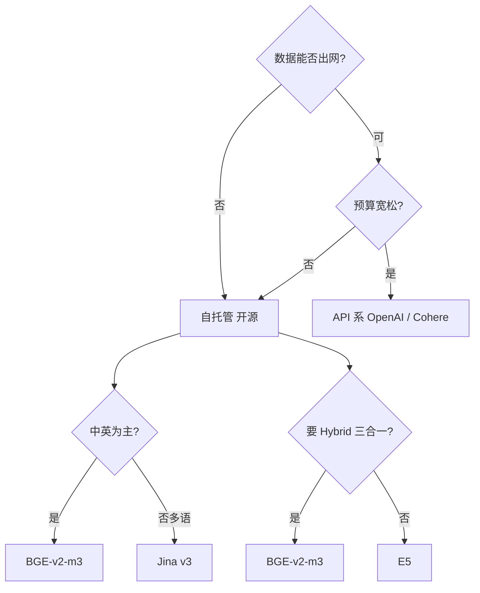

# Embedding 模型横比

!!! tip "读完能回答的选型问题"
    我做中英文 / 多模检索 / RAG，应该选 BGE、E5、Jina、OpenAI 还是 Cohere？要看规模、成本、语言支持、开源 vs API。

## 对比维度总表

| 维度 | BGE-v2-m3 | E5-large-v2 | Jina-v3 | OpenAI text-embed-3 | Cohere embed v3 |
| --- | --- | --- | --- | --- | --- |
| **开源 / API** | 开源 | 开源 | 开源 + 托管 | API only | API only |
| **语种** | 多语（中英强）| 多语 | 100+ 种 | 100+ 种 | 100+ 种 |
| **维度** | 1024 | 1024 | 1024（Matryoshka）| 1536 / 3072（可截）| 1024 |
| **max tokens** | 8192 | 512（经 fine-tune 可扩）| 8192 | 8191 | 512 |
| **检索精度（MTEB）** | 顶级（zh/en）| 较强 | 顶级（多语）| 顶级 | 顶级 |
| **稀疏 + Dense + ColBERT 三合一** | ✅（m3 特色）| ❌ | 部分 | ❌ | ❌ |
| **Rerank 配套** | BGE-reranker 系列 | 需外挂 | Jina reranker | 需外挂 | Cohere rerank |
| **延迟（单条）** | ~20ms（GPU）| ~20ms（GPU）| ~15ms / API 网络 | API 网络（50–200ms）| API 网络 |
| **成本** | 自托管 GPU 成本 | 自托管 | 自托管 或 API | API 按 token 付 | API 按 token 付 |
| **商用许可** | MIT | MIT | Apache 2.0 | 合规自查 | 合规自查 |

## 每位选手的关键差异

### BGE（BAAI General Embedding）

由北京智源研究院开源，中英文检索上几乎是默认选项。**v2-m3** 是一个同时产出 **Dense / Sparse / ColBERT-style** 三种表示的模型，一个模型能喂 Hybrid Search 的全部三路。

- **甜区**：中英混合、开源 + 自托管、搭配 BGE Reranker
- **坑**：模型 2GB+，部署要 GPU

### E5（Microsoft）

Microsoft 开源，多语言 + 通用检索强。对**零样本场景**和**指令跟随**做得早。MTEB 早期领先，现在被 BGE / Jina 追平。

- **甜区**：通用场景、学术实验
- **坑**：对中文不如 BGE 精细；长文超过 512 tokens 需 fine-tune 版本

### Jina Embeddings

Jina AI（初创公司）开源。**v3 支持 100+ 语言 + Matryoshka + 8K 上下文**，商业友好。

- **甜区**：多语言、长文、需要维度可裁（Matryoshka）
- **坑**：中文相对 BGE 略弱；托管 API 生态在建

### OpenAI text-embedding-3-*

- **small**（1536 维）/ **large**（3072 维，可截到更低）
- 闭源 API 付费；精度一流
- **甜区**：团队不想自建 GPU 栈 + 预算合适 + 不敏感
- **坑**：数据出口 / 合规 / 成本

### Cohere embed v3

Canadian 公司，商用云服务。**对 RAG 场景专门优化**，和 Cohere Rerank 组合成熟。

- **甜区**：企业级 API + RAG 全家桶
- **坑**：闭源 API、合规、成本

## 选型决策树

## 多模场景

上表都偏**文本 embedding**。多模场景主力是 **CLIP / SigLIP / Jina-CLIP**，见 [多模 Embedding](../retrieval/multimodal-embedding.md)。

通常一个多模表**同时有两种**：
- **CLIP / SigLIP** 做跨模态（图⇄文）
- **BGE / Jina** 做长文精细

## 实操经验

- **benchmark 别信官方**：用自家数据跑 golden set
- **先跑"精排（rerank）+ 中档 embedding"**：比"顶级 embedding 不 rerank"质量更高、成本更低
- **中英混排业务强烈推荐 BGE-v2-m3**
- **模型切换有成本**：见 [Embedding 流水线](../ml-infra/embedding-pipelines.md) 的模型版本治理

## 相关

- [Embedding](../retrieval/embedding.md)
- [多模 Embedding](../retrieval/multimodal-embedding.md)
- [Rerank](../retrieval/rerank.md)
- [Embedding 流水线](../ml-infra/embedding-pipelines.md)

## 延伸阅读

- MTEB 榜单: <https://huggingface.co/spaces/mteb/leaderboard>
- 各模型官方 paper / 技术博客
- *Massive Text Embedding Benchmark (MTEB)* 原始论文
