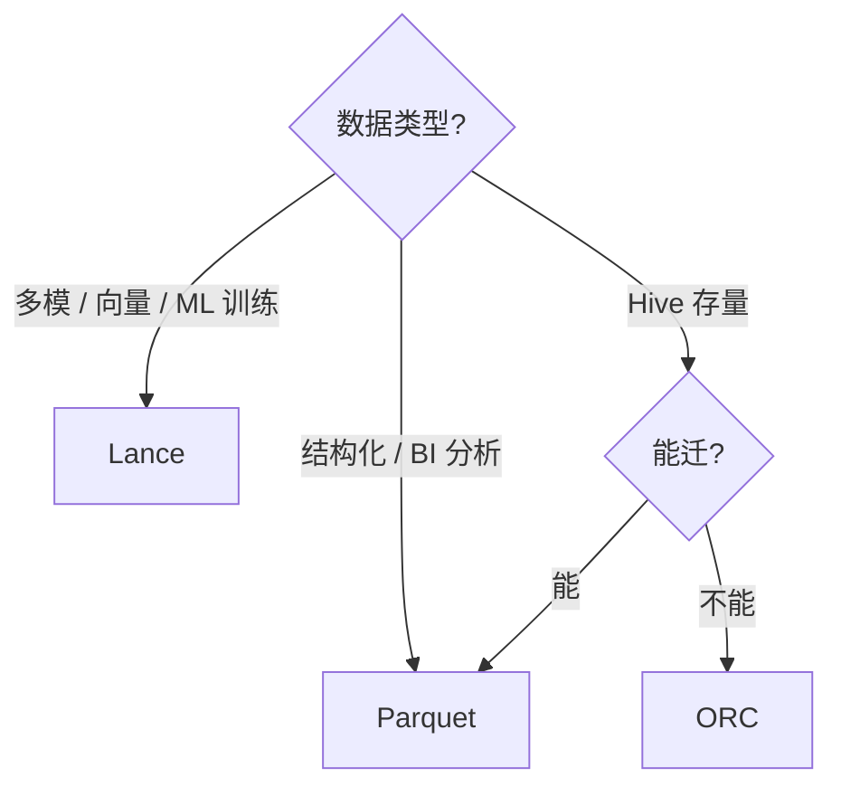

# Parquet vs ORC vs Lance

!!! tip "读完能回答的选型问题"
    新建一张湖上的表，数据文件用什么格式？BI 事实表、ML 训练集、多模向量表各该选谁？

## 对比维度总表

| 维度 | Parquet | ORC | Lance |
| --- | --- | --- | --- |
| **生态覆盖** | 最广（所有引擎、所有云）| Hive / Spark 强，其他弱 | 新，生态在建 |
| **列式压缩** | ✅（Snappy/Zstd/Gzip）| ✅（ZLIB/Snappy）| ✅（Zstd + 自定义） |
| **嵌套类型** | Dremel levels | 定义/重复级别（等价）| 嵌套 + 向量类型一等 |
| **统计/谓词下推** | ✅（Footer + Page Index）| ✅（更细粒度）| ✅ + 向量索引 |
| **随机访问** | 弱（Page 级解压）| 弱 | **一等公民** |
| **更新/删除** | 无（外部 delete file）| 无 | Fragment 级原子替换 |
| **向量索引内建** | ❌（靠 Puffin 侧车）| ❌ | ✅ HNSW / IVF-PQ |
| **版本 / Manifest** | 无（外部如 Iceberg）| 无 | 自带 |
| **最佳场景** | 通用 OLAP / BI | Hive 兼容 | 多模 / 向量 / ML 训练 |
| **主要表格式支持** | Iceberg 默认 / Paimon / Delta / Hudi | Iceberg 可选 / Hive | Iceberg（实验）/ LanceDB |

## 每位选手的关键差异

### Parquet —— "通用默认"

设计时代：Hadoop 时代末期（2013），为批分析优化。今天：

- **所有现代引擎一等公民**：Spark、Trino、Flink、DuckDB、Polars、Arrow、Iceberg/Delta/Paimon/Hudi
- **Page Index + Bloom Filter** 近年补齐了点查下推能力
- **谓词下推、列剪裁、字典压缩**做到位，BI / ETL 99% 够用

**几乎没有"不选 Parquet 的理由"——除非你有特殊诉求**。

### ORC —— "Hive 的孩子"

同时期另一个选手，Hive 生态偏爱：

- 统计信息更细（stride 级）
- ZSTD / ZLIB 压缩能压更狠
- 但 Hadoop 外的生态支持明显弱
- Iceberg / Paimon 也支持，但默认是 Parquet

**新项目没理由选 ORC**，除非强兼容 Hive 遗产。

### Lance —— "为多模 + 随机访问重写"

设计时代：2022+，为向量 / ML / 多模。特点：

- **Fragment + per-row random access**：训练时打乱取行不贵
- **向量索引原生**：ANN 索引作为 Fragment 的一部分，不是外挂
- **零拷贝更新**：Fragment 级原子替换
- **自带 manifest / version** —— 可以当轻量"湖表"使
- 数据文件体积通常比 Parquet 更紧

**不是 Parquet 的替代，是补充**。

## 决策树

## 混用策略

一家多模数据湖常见混用：

| 表类型 | 选什么 |
| --- | --- |
| 订单 / 账单 / 用户 | Parquet |
| 日志 / 埋点 | Parquet |
| 图片 / 视频 asset + 向量 | Lance |
| 训练集（大规模 shuffle）| Lance |
| 老 Hive 表（过渡期）| ORC → 迁 Parquet |

Iceberg 本身支持在**同一表的不同分区**用不同格式（实验），这对大规模迁移很有价值。

## 陷阱

- **"Parquet 压缩永远最优"** —— 对低基数列 ORC 压缩有时更狠，但 Parquet ZSTD 已非常接近
- **"Lance 可以完全替代 Parquet"** —— 至少当前版本生态不足以替代 BI / ETL 侧
- **"ORC 还很现代"** —— 新项目慎选
- **Parquet 版本**：v2 和 v3（新）差异大，某些老 reader 不兼容

## 相关

- [Parquet](../foundations/parquet.md)
- [ORC](../foundations/orc.md)
- [Lance Format](../foundations/lance-format.md)
- [列式 vs 行式](../foundations/columnar-vs-row.md)

## 延伸阅读

- *Column-Oriented Storage Techniques*（综述）
- Parquet / ORC / Lance 各自官方 spec
- *Performance of Parquet vs ORC*（独立测评）
