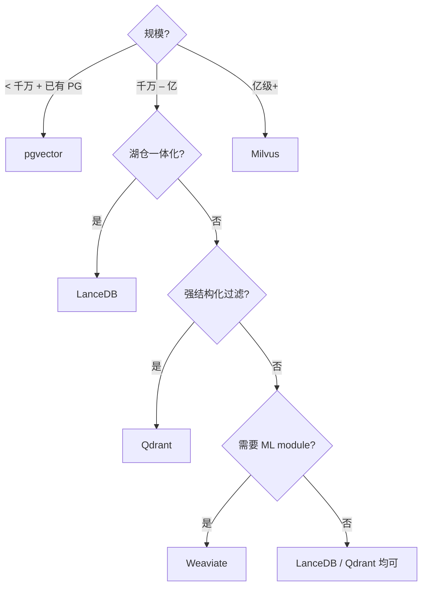

# 向量数据库横向对比

!!! tip "读完能回答的选型问题"
    **分布式 vs 嵌入式、独立服务 vs 湖原生、配不配 PG** —— 我的团队应该拿哪个作为主向量库？

## 对比维度总表

| 维度 | Milvus | LanceDB | Qdrant | Weaviate | pgvector |
| --- | --- | --- | --- | --- | --- |
| **部署形态** | 分布式服务 | 嵌入式 + 云 | 单机 / 集群 | 单机 / 集群 | PG 扩展 |
| **存储底座** | 对象存储 + MQ | 对象存储（Lance） | 本地 / 云存储 | 本地 | PG 表 |
| **规模上限** | 百亿级 | 亿级 | 亿级 | 亿级 | 千万级 |
| **索引** | HNSW / IVF-PQ / DiskANN / GPU | IVF-PQ（默认）/ HNSW | HNSW（默认） | HNSW | HNSW / IVF |
| **Hybrid Search** | 原生 | 原生 | 原生 | 原生 | 借助 tsvector |
| **过滤语义** | Pre-filter | Pre-filter | Filter-aware（边注解） | Pre-filter | WHERE 原生 |
| **多模资产** | 支持 | 一等公民 | 支持 | schema + modules | 需自己建模 |
| **运维复杂度** | 高（多组件） | 低（嵌入式） | 中 | 中 | 低（跟 PG）|
| **与湖仓集成** | 外部同步 | **湖原生** | 外部同步 | 外部同步 | 外部同步 |
| **社区活跃度** | 高 | 快速上升 | 高 | 高 | 稳 |

## 每位选手关键差异

### Milvus

**大规模分布式检索的主力**。Coordinator + Data/Query/Index 多组件架构专为亿级以上设计。代价是运维复杂度高。

**甜区**：
- 向量规模 **亿级+**
- QPS 高、需要多副本
- 有独立向量检索团队能运维分布式系统

### LanceDB

**湖原生向量库**。数据和索引都以 Lance 格式落对象存储，嵌入式形态运行，无独立数据平面。对"多模数据湖"路线最友好。

**甜区**：
- 以湖仓为事实源
- 多模原始资产 + 向量 + 元数据一表搞定
- 希望最少独立系统
- 中等规模（千万到亿）

### Qdrant

**Rust 实现的单机 / 集群向量库**。强在 **filter-aware 图搜索** —— 元数据过滤不再是"先检索再丢弃"而是参与图遍历本身。

**甜区**：
- 需要强结构化过滤（复杂谓词）
- 中等规模
- Rust 栈亲近

### Weaviate

**自带向量化器 + reranker 模块**。开箱即用对 ML 场景友好，schema 也偏 OOP。

**甜区**：
- 团队不想自己维护 embedding 流水线
- 需要开箱即用的 hybrid + module 链路
- 业务 schema 偏图 / 对象

### pgvector

**PostgreSQL 扩展**。当向量规模小、结构化数据是主线时，这是**最小系统成本**的选择。

**甜区**：
- 向量规模 **< 千万**
- 已经在用 PG 做主数据
- 不想引入独立向量系统

## 决策树

## 我们场景的推荐

团队主线是多模一体化湖仓。**首选 LanceDB**（和湖最贴合），**备选 Milvus**（大规模独立方案）。两者可以并存：

- 热的、交互式高 QPS 场景 → Milvus
- 离线批 + 多模事实表 → LanceDB / Iceberg + Puffin

详见 [Lake + Vector 融合架构](../unified/lake-plus-vector.md)。

## 相关

- 系统页：[Milvus](../retrieval/milvus.md) · [LanceDB](../retrieval/lancedb.md)
- [向量数据库](../retrieval/vector-database.md)
- [ANN 索引对比](ann-index-comparison.md)

## 延伸阅读

- *Benchmarking Vector Databases* 类独立测评（各有立场，交叉对照）
- 各家官方 docs 与公开 benchmark
