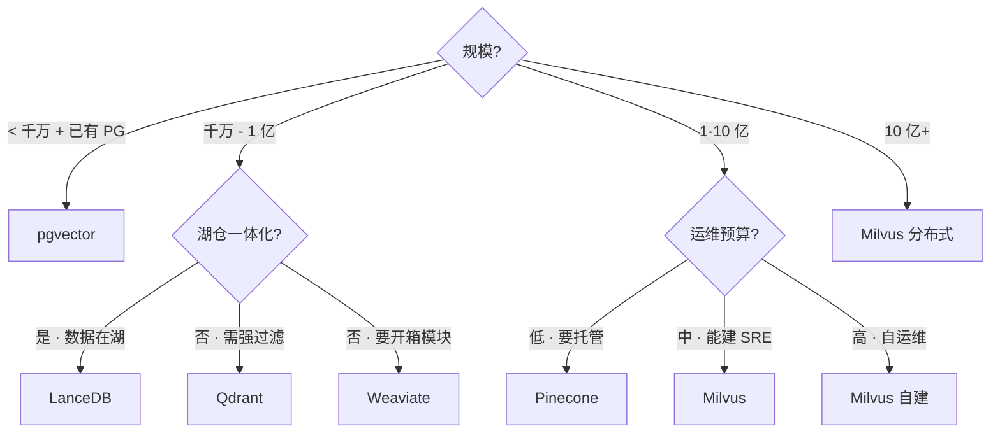

# 向量数据库横向对比

!!! tip "读完能回答的选型问题"
    **分布式 vs 嵌入式、独立服务 vs 湖原生、要不要走商业托管** —— 我的团队主向量库该选哪个？**2024-2026 年市场格局有重要变化**：LanceDB 湖原生崛起、Milvus 生产化成熟、Pinecone 定位被云厂商挤压、pgvector 日益"够用"。

!!! abstract "TL;DR"
    - **Milvus** = 分布式 · 亿-百亿规模 · 运维最重
    - **LanceDB** = 嵌入式 + 湖原生 · 中等规模 · 运维最轻
    - **Qdrant** = Rust 实现 · filter-aware 过滤强 · 中等规模
    - **Weaviate** = 开箱 hybrid + 模块化 · OOP schema · 中等规模
    - **pgvector** = PG 扩展 · < 千万规模 · 复用 SQL 栈最省事
    - **Pinecone** = 商业 Serverless · 零运维 · 锁定较深
    - **2026 共识**：**中小规模优先 pgvector 或 LanceDB**；大规模 Milvus；商业托管看 Pinecone

## 对比维度总表

| 维度 | Milvus | LanceDB | Qdrant | Weaviate | pgvector | Pinecone |
|---|---|---|---|---|---|---|
| **部署形态** | 分布式服务 | 嵌入式 + 云 | 单机 / 集群 | 单机 / 集群 | PG 扩展 | **仅 Serverless** |
| **存储底座** | 对象存储 + MQ | 对象存储（Lance） | 本地 / 云 | 本地 | PG 表 | 云托管 |
| **规模上限** | **百亿级** | 亿级 | 亿级 | 亿级 | 千万级 | 十亿级（托管） |
| **索引** | HNSW / IVF-PQ / DiskANN / GPU | IVF-PQ / HNSW | HNSW | HNSW | HNSW / IVF | 闭源（Serverless） |
| **Hybrid Search** | 原生 2.4+ | 原生 2024+ | 原生 | 原生 | tsvector 组合 | 2024+ 近期加 |
| **过滤语义** | Pre-filter | Pre-filter | **Filter-aware**（在图中）| Pre-filter | WHERE 原生 | Pre-filter |
| **多模资产** | 支持 | **一等公民（图/文/音共存）**| 支持 | schema + modules | 需自建 | 有限 |
| **运维复杂度** | 🔴 高（多组件）| 🟢 低（嵌入式） | 🟡 中 | 🟡 中 | 🟢 低（跟 PG）| 零（托管）|
| **与湖仓集成** | 外部同步 | **湖原生** | 外部同步 | 外部同步 | 外部同步 | 外部同步 |
| **开源 / 商业** | 开源（Zilliz 商业）| 开源（LanceDB Inc 商业）| 开源 + 商业 | 开源 + 商业 | 开源 | 闭源 |
| **一致性** | 最终一致 | 强一致（单进程）| 可配 | 最终一致 | PG 强一致 | 最终一致 |
| **中文生态** | 🔥🔥🔥 Zilliz 中国团队 | 🔥 | 🔥 | 🔥 | 🔥🔥 | ⚠️（部分出境）|

## 2024-2026 市场变化

### LanceDB 湖原生路线成立

- Lance format 在 2024 逐步成熟
- 内建 hybrid 检索（2024）
- 被多个湖仓项目采用（Dagster / Modal 等）
- **"向量和原始数据同一份存储"**的理念被验证

### Milvus 2.4+ 生产化成熟

- Hybrid Search 原生支持（Dense + Sparse + RRF）
- 存算分离架构稳定
- Zilliz Cloud 商业化成熟
- **DiskANN 索引工业级可用**

### Pinecone 定位被挤压

- 云厂商（AWS OpenSearch / Azure AI Search / GCP Vertex AI Search）都内置向量
- 中小客户**转向更轻的 pgvector / LanceDB**
- 大客户仍采用 Pinecone 的图**减少中**
- **Pinecone 增长放缓但仍盈利**（聚焦高 QPS 低运维场景）

### pgvector 性能追赶

- HNSW 支持（0.5+）
- 量化支持（0.7+）
- 数千万向量在 PG 里跑得动
- "能用 PG 就别换向量库"的工程共识

---

## 每位选手关键差异

### Milvus（大规模 · 运维最重）

**定位**：**亿-百亿级** 向量检索的工业主力。Zilliz 2019 开源，已上 Linux Foundation。

**优势**：
- **规模最大**：百亿向量 + 高并发
- **索引最丰富**：HNSW · IVF-PQ · DiskANN · GPU · Flat
- **Hybrid 2.4+ 成熟**
- 中文社区活跃、**Zilliz 有中国团队** 支持
- **Milvus Lite**（嵌入式版本，2024+）给中小规模选项

**边界**：
- **运维重**：Coordinator + Data / Query / Index 多组件 + Kafka/Pulsar
- **学习曲线陡**
- 小规模（< 1M）用 Milvus 是 overkill

**典型甜区**：
- 向量 > 1 亿
- QPS > 1000
- 有独立 SRE 能运维

### LanceDB（湖原生 · 运维最轻）

**定位**：Lance format 创始团队做的向量库，**嵌入式 + 湖原生**。

**优势**：
- **零服务**：就是个 Python/Rust 库（也有云版）
- **数据 + 索引 in 对象存储**（S3 / GCS / OSS）
- **多模一等公民**：图像 / 文本 / 音频 + embedding 共存一表
- **Git-like 版本**：Lance format 原生 time travel
- 适合 Notebook / 快速原型 / 一体化湖仓

**边界**：
- **规模上限亿级**（远不如 Milvus）
- 分布式能力仍在完善
- 生态相对 Milvus 小
- **适合读多写少**；高频 upsert 场景不如 Qdrant / Milvus

**典型甜区**：
- 数据本就在湖里
- 多模场景（图 / 文 / 音一表）
- 中等规模（千万-亿）
- 运维预算紧

### Qdrant（Filter-Aware 之王）

**定位**：Rust 实现、**filter-aware 图搜索**差异化。

**优势**：
- **元数据过滤在图遍历中**（不是 pre-filter 或 post-filter）
- 查询"向量相似 + 复杂过滤"组合延迟表现好
- Rust 性能 + 内存效率
- 部署相对简单

**边界**：
- 规模上限亿级
- 社区比 Milvus 小
- 多模不如 LanceDB 原生

**典型甜区**：
- 结构化过滤强（multi-tenant / 复杂 WHERE）
- 中等规模 + 要 Rust 亲和
- 不需要分布式到百亿

### Weaviate（模块化 + OOP schema）

**定位**：开箱即用 hybrid + 内建模块（embedding 生成 / reranker）。

**优势**：
- **自带 embedding 生成模块**（不用自己搭）
- Hybrid + Rerank 一键
- Schema 偏 OOP（类 GraphQL 风格）
- GraphQL / REST 双 API

**边界**：
- 模块化**锁住你**（某些能力要付费模块）
- 中文社区相对小
- 规模上限亿级

**典型甜区**：
- 团队不想自己管 embedding 流水线
- 要开箱 hybrid + module
- 中等规模

### pgvector（最小系统成本）

**定位**：PostgreSQL 扩展。**"能用 PG 就别换向量库"**的代表。

**优势**：
- **零新系统**：复用 PG 生态 / 权限 / 备份 / 监控
- **SQL + 向量 一条 query**（JOIN / filter / sort 随便来）
- 事务一致
- HNSW（0.5+）+ 量化（0.7+）性能追赶中

**边界**：
- 规模上限 **千万级**（超了 PG 本身会吃力）
- 纯向量检索速度不如专业库
- HNSW 参数调优相对粗糙

**典型甜区**：
- < 千万向量
- 已深度用 PG
- 需要结构化 + 向量联合查询
- 不想引入新系统

### Pinecone（商业 Serverless）

**定位**：**闭源商业 Serverless**。

**优势**：
- **零运维**：纯 API
- 免费层可用
- 文档 / 工具链完善
- 10 亿级规模生产验证

**边界**：
- **闭源锁定**：Pod 架构、索引参数不透明
- **数据出境**：中国团队合规要评估
- **定价按 Pod 时间**：中型规模贵
- 生态被云厂商原生向量服务挤压

**典型甜区**：
- 海外团队 + 不想管运维
- 快速验证 → MVP
- 预算充足、锁定容忍高

---

## 决策树

## 按场景推荐

| 场景 | 首选 | 备选 |
|---|---|---|
| **RAG + 知识库问答** | LanceDB 或 pgvector | Qdrant |
| **推荐系统召回（亿级）** | **Milvus** | LanceDB 分布式路线 |
| **多模检索（图 / 文 / 音）** | **LanceDB** | Milvus + 外部 metadata |
| **已有 PG 栈 + 中小规模** | **pgvector** | — |
| **海外 SaaS + 零运维** | **Pinecone** | Zilliz Cloud |
| **中国合规 + 大规模** | **Milvus / Zilliz Cloud** | 国产向量库 |
| **复杂 metadata filter** | **Qdrant** | Milvus expr filter |
| **开箱 embedding + hybrid** | Weaviate | — |

---

## 性能数字（公开 benchmark 参考）

!!! warning "数据来源"
    [VectorDBBench](https://github.com/zilliztech/VectorDBBench) 等公开测试（Zilliz 主导，**有立场**）。自家数据 POC 才是真相。

### 100M × 768d HNSW 典型 p99 延迟

| 系统 | 单实例 p99 |
|---|---|
| Milvus | 10-50ms |
| LanceDB | 20-80ms |
| Qdrant | 10-40ms |
| Weaviate | 15-50ms |
| pgvector | 50-200ms（PG 本身开销） |
| Pinecone Serverless | 20-100ms（含网络）|

### 单实例 QPS（1M × 768d HNSW）

| 系统 | QPS |
|---|---|
| Milvus | 5k-20k |
| LanceDB 嵌入式 | 10k+ |
| Qdrant | 5k-15k |
| Weaviate | 3k-10k |
| pgvector | 1k-5k |

### 百亿级的现实

- 只有 **Milvus / 自建 FAISS / 特殊集群** 能支撑
- 其他都要分片 / 多实例
- 成本考量：量化（IVF-PQ / DiskANN）必选

---

## 现实检视

### 2026 共识演进

- **"先上 pgvector"成为主流起步建议**（开源 + 已在 PG）
- **LanceDB 在多模场景稳步采用**（湖原生价值凸显）
- **Milvus 仍是大规模首选**，无实质挑战者
- **Pinecone 增长放缓**但在海外 SaaS 仍有稳定客户
- **云厂商原生向量服务**（OpenSearch / Vertex / Azure）蚕食专业向量库的中低端市场

### 选型常见错误

- **盲目上 Milvus 做 MVP**：千万数据以下纯属 overkill
- **pgvector 塞亿级**：PG 本身扛不住
- **"试试看所有"**：benchmark 耗时、团队精力分散
- **只看公开 benchmark**：自家业务分布不同
- **忽视运维成本**：Milvus 运维人力 = 2-3 商业 Pinecone 订阅
- **Catalog 外包**：向量库里重建一套用户 ID / 权限 / 分类，不和湖打通

### 争议问题

- **向量库会被湖原生取代吗**？中小规模是；大规模暂未。
- **Pinecone 会被挤出吗**？短期不会，长期**市场增长放缓**。
- **OpenSearch 等通用方案会替代专业向量库吗**？低端场景已经在替代。

### 2026+ 趋势

- **Iceberg + Puffin 向量索引**逐步成熟 → 真正的"湖原生向量"
- **Lance format 纳入更多引擎**（Trino / Spark / DuckDB）
- **pgvector 的规模上限继续扩**（0.8+ 期待）
- **GPU 向量索引**商业化（Milvus / RAPIDS RAFT）

---

## 我们场景的推荐

团队主线是**多模一体化湖仓**。结合上述分析：

- **首选 LanceDB**（湖原生 · 多模一等 · 低运维）
- **备选 Milvus**（大规模独立方案 · 热查询高 QPS）
- **两者可共存**：
  - LanceDB 做"湖上原始多模资产 + 离线批检索 + 训练数据"
  - Milvus 做"在线高 QPS 推荐 / 搜索召回"
  - 数据血缘：湖 → 双写向量库（增量）

详见 [Lake + Vector 融合架构](../unified/lake-plus-vector.md) · [ADR-0003](../adr/0003-lancedb-for-multimodal-vectors.md)。

---

## 相关 · 延伸阅读

### 系统深度页

- [Milvus](../retrieval/milvus.md) · [LanceDB](../retrieval/lancedb.md) · [Qdrant](../retrieval/qdrant.md) · [Weaviate](../retrieval/weaviate.md) · [pgvector](../retrieval/pgvector.md)

### 相关对比

- [ANN 索引对比](ann-index-comparison.md) · [稀疏检索对比](sparse-retrieval.md) · [Rerank 模型横比](rerank-models.md)
- [Quantization](../retrieval/quantization.md) · [Sparse Retrieval](../retrieval/sparse-retrieval.md) · [HNSW](../retrieval/hnsw.md) · [IVF-PQ](../retrieval/ivf-pq.md) · [DiskANN](../retrieval/diskann.md)

### 权威阅读

- **[VectorDBBench](https://github.com/zilliztech/VectorDBBench)** —— Zilliz 跨系统测试
- **[ANN-Benchmarks](https://ann-benchmarks.com/)** —— 算法层 benchmark
- **[Pinecone Learn](https://www.pinecone.io/learn/)** —— 向量检索科普
- 各家官方 docs + 公开 benchmark（交叉对照、注意立场）
