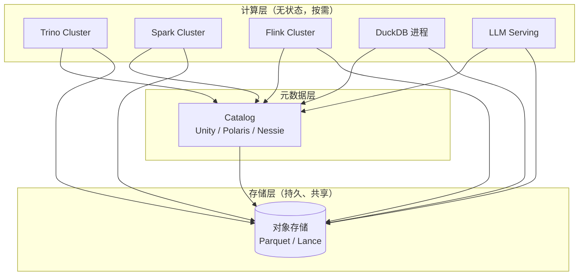

# 存算分离（Compute-Storage Separation）

!!! tip "一句话理解"
    **存储在对象存储 / 分布式文件系统，计算在独立的无状态集群**，两者通过网络连接。不是"存和算不在一台机"，而是**存储成为独立、持久、共享的层**，计算按需弹起。现代湖仓的**基础架构原语**。

!!! abstract "TL;DR"
    - 反义词是"存算一体"（Hadoop / HDFS data locality 时代）
    - 好处：**计算弹性 + 多引擎共享 + 成本控制**
    - 代价：网络带宽成为约束，算力必须"自带缓存"
    - 湖仓 = 存算分离的标准模板
    - Neon / Snowflake 把 OLTP 也做成存算分离

## 从 Hadoop 到今天

### Hadoop 时代：存算一体

- DataNode = 存储 + 计算
- MapReduce 任务调度到**数据所在节点**（data locality）
- 扩容要同时扩 CPU 和磁盘
- 容量 / 计算瓶颈互锁

### 今天：存算分离

- 存储是对象存储（S3 / GCS / OSS），或专用分布式存储（Ceph / JuiceFS / Alluxio）
- 计算是无状态 / 轻状态集群
- 计算可以：**随时弹起、按查询付费、被多个引擎读同一份数据**

## 为什么这件事对湖仓至关重要

1. **多引擎共享**：同一张 Iceberg 表，Spark / Trino / Flink / DuckDB 同时读 —— 没有存算分离这不可能
2. **弹性扩算力**：上午 BI 仪表盘高峰 → 开大 Trino 集群；夜里 ETL → 开大 Spark 集群；数据不动
3. **成本可控**：存储 GB 单价远低于"存+算一起"的单位，且 S3 内置多级分层（Standard / IA / Glacier）
4. **版本与快照**：对象存储原生不可变 + 版本，与 Iceberg Snapshot 契合
5. **容灾简单**：S3 跨区复制；计算集群挂了重启即可

## 架构图

## 网络成为新约束

存算分离最大代价：**数据要过网络**。

- S3 → EC2 带宽：典型 100Gbps；vs 本地 NVMe 几十 GB/s
- 跨区域：延迟跳到几十 ms，带宽降级
- 冷数据访问要拉 → IO 成本高

**应对**：

1. **缓存层**：本地 SSD / Alluxio / Apache Gluten 缓存热数据
2. **列剪裁 + 谓词下推**：只拉真正需要的字节（见 [谓词下推](../query-engines/predicate-pushdown.md)）
3. **并行度**：大量小请求并发拉，聚合带宽
4. **同区部署**：计算和存储在同一个 region / AZ
5. **智能预读**：查询一开始就异步预取 footer / manifest

## 除了湖仓，这思路还出现在

- **Snowflake**：虚拟仓库（计算）+ 数据存储，按秒计费
- **BigQuery**：slot（计算）+ Capacitor（存储），完全分离
- **Databricks**：同样模型
- **StarRocks / Doris 新架构**：compute-storage-separation 模式
- **Neon**（serverless Postgres）：Pageserver（存储）+ Compute（无状态 Postgres），OLTP 也这么做
- **ClickHouse Cloud**：SharedMergeTree 在 S3 上

## 和"存算一体"还会有用武之地吗

**有**。极低延迟点查、强一致事务仍倾向存算一体（传统 OLTP DB）。

但大数据 / OLAP / AI 世界，存算分离是主流了。

## 陷阱

- **跨区域 access** = 带宽费爆
- **没开多级缓存** = 每次查询都拉对象存储
- **计算节点太小 + 查询太重** → 网络打满
- **元数据请求过多**（小文件、多分区）→ 对象存储 API 费用起飞

## 相关

- [对象存储](object-storage.md)
- [湖表](../lakehouse/lake-table.md)
- [列式 vs 行式](columnar-vs-row.md)
- [成本优化](../ops/cost-optimization.md)

## 延伸阅读

- *Building An Elastic Query Engine on Disaggregated Storage* (Snowflake, NSDI 2020)
- *Neon: Serverless Postgres*（架构博客）
- *Apache Iceberg: The Definitive Guide*（Ryan Blue 等，2024）
