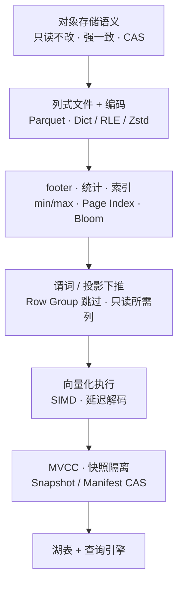

# 基础

湖仓与多模检索系统的共同"石头地基"。先把这一节过掉，再读后面 Snapshot、ANN、向量化执行就不会卡壳。

!!! info "和 `lakehouse/` 的分界"
    **这一节是物理存储 + 通用计算原理**——对象存储、列式文件（Parquet / ORC / Lance）、编码、向量化、MVCC——都是**格式无关 / 引擎无关**的底层。

    **[湖表](../lakehouse/lake-table.md) 及其构件**（Snapshot / Manifest / Time Travel / Iceberg / Paimon）是**建在这些物理文件之上的逻辑协议层**，因此归到 `lakehouse/`。

    **Lance 是灰色地带**：既是列式文件格式（本节讨论），又自带 fragment 级事务（也有湖表属性）。从"文件格式"视角读 [Lance Format](lance-format.md)；从"湖表底座"视角参见 [湖表](../lakehouse/lake-table.md) 的数据文件层段。

## 一条主线 · 湖仓的性能与一致性因果链

这一节的核心页面**不是平行词条**，而是同一条因果链的不同层。理解这条链之后，上层内容（Iceberg commit 流程 / Trino pruning / StarRocks MV 加速 / Snapshot 时间旅行）会自然串起来。

**湖仓"快且一致"不是某一层的魔法**——而是每层都能多剪一点数据、少抖一点一致性。上层引擎的优化经常是在这条链里换一个环节的实现（换编码、换索引、换下推时机、换 MVCC 粒度）。

### 主线推荐阅读顺序（4–6 小时建立心智模型）

1. [对象存储](object-storage.md) —— 湖仓地基的语义
2. [存算分离](compute-storage-separation.md) —— 这个架构为什么能成立
3. [Parquet](parquet.md) · [压缩与编码](compression-encoding.md) —— 文件内部怎么组织
4. [列式 vs 行式](columnar-vs-row.md) —— 为什么 OLAP 选列式
5. [谓词下推](predicate-pushdown.md) —— footer / 统计怎么变成"扫少"
6. [向量化执行](vectorized-execution.md) —— 扫进来的 batch 怎么算快
7. [MVCC](mvcc.md) · [一致性模型](consistency-models.md) —— 湖表 commit 的思想源头

赶时间只读前三条（约 2 小时）也能建立最小可用心智模型；做架构评审 / 深度选型时再回来补完整 7 条。

---

## 主线之外 · 特定场景的前置

- [OLTP vs OLAP](oltp-vs-olap.md) —— 两种负载的物理底层为什么相反
- [事件时间 · Watermark · 乱序](event-time-watermark.md) —— 流处理时间维度（做流式入湖 / 实时湖仓时读）
- [ORC](orc.md) · [Lance Format](lance-format.md) —— Parquet 之外的两种列式格式（选型对比时读）
- [Arrow · FlightSQL · ADBC](arrow-ecosystem.md) —— 内存交换与传输公共层

> 想看"湖仓怎么来的"或"现代数据栈十大环节"这类**历史与生态视角**？移到了 [研究前沿 · 演进史](../frontier/data-systems-evolution.md) 与 [Modern Data Stack 全景](../frontier/modern-data-stack.md)。
