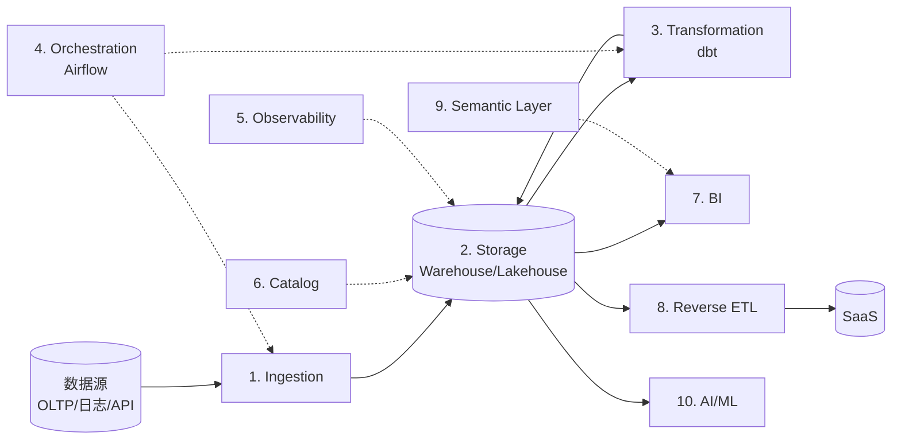

# Modern Data Stack · 现代数据栈全景

!!! tip "一句话理解"
    **2018+ 兴起的云原生、模块化、可插拔的数据工程栈**。典型组成：**Ingestion**（Airbyte/Fivetran）→ **Storage**（Iceberg / Snowflake / BigQuery）→ **Transformation**（dbt）→ **Orchestration**（Airflow / Dagster）→ **BI**（Looker / Superset）→ **Reverse ETL**（Census / Hightouch）。每一层都有多个可替换的工具。

!!! abstract "TL;DR"
    - **核心范式**：ELT 替代 ETL（先进仓库再 Transform）
    - **十大环节**：Ingestion · Storage · Transformation · Orchestration · Observability · Catalog · BI · Reverse ETL · Semantic Layer · AI/ML
    - **核心事实**：**dbt 是 T 层的事实标准**（占到 70%+ 项目）
    - **湖仓版 MDS**：把 Snowflake/BigQuery 换成 Iceberg/Paimon + Trino
    - **趋势**：向 **AI-native / LLM-in-the-stack** 演化

## 1. 为什么需要这个全景

### 没有全景图的困境

新团队上手常遇到：
- "我们到底需要多少工具？"
- "Airbyte 和 Fivetran 解决的是同一个问题吗？"
- "dbt 是 ETL 工具吗？"
- "Reverse ETL 和传统 ETL 什么关系？"
- "为什么还需要 Looker 之外的 Semantic Layer？"

这些问题的根源：**MDS 是一个"十环节生态"**，不是一个产品。

### 典型错乱场景

- "我们买了 Fivetran 但还要不要 dbt？"
- "数仓选 Snowflake 之后为啥还要 Catalog？"
- "写了一堆 Airflow DAG 为啥还要 dbt？"

答：**每个工具解决不同环节**，不是互相替代。

## 2. 十大环节



### 1 · Ingestion（数据接入）

**解决**：把业务系统 / SaaS / API 数据搬到仓库/湖。

| 工具 | 特点 |
|---|---|
| **Fivetran** | 商业 SaaS、连接器 400+、省运维 |
| **Airbyte** | 开源、社区连接器丰富 |
| **Meltano** | 开源、Python 生态 |
| **Stitch** | Talend 收购 |
| **自建 Flink CDC** | 高频场景（CDC 入湖） |

**典型架构**：每个源一个 sync job，目标写仓库的 **raw schema**。

### 2 · Storage（数据底座）

**解决**：数据存哪里。

| 类型 | 代表 | 定位 |
|---|---|---|
| **云数仓** | Snowflake / BigQuery / Redshift | 省心、闭源、贵 |
| **湖仓** | Iceberg / Delta / Paimon | 开放、多引擎 |
| **混合** | Databricks（都支持）| 两家通吃 |

### 3 · Transformation（数据转换）

**解决**：ELT 里的 T——从 raw 变成业务可用。

| 工具 | 特点 |
|---|---|
| **dbt** | **事实标准**，SQL + Jinja |
| **Dataform** | Google 收购、SQL-first |
| **SQLMesh** | 新秀，强类型 + 版本化 |
| **传统 ETL**（Informatica / Talend） | 老派 |

**dbt 模型组织**（业界共识）：

```
models/
  staging/    # 1:1 源表清洗（rename column / type）
  intermediate/
              # 业务逻辑中间层
  marts/      # 面向消费的最终表
    core/
    finance/
    marketing/
```

### 4 · Orchestration（调度）

**解决**：作业依赖、重跑、告警、可观测。

| 工具 | 定位 |
|---|---|
| **Airflow** | 老牌 + 生态 |
| **Dagster** | 数据资产为中心，现代 |
| **Prefect** | Python-first |
| **DolphinScheduler** | 国产开源 |
| **Argo Workflows** | K8s-native |

### 5 · Observability（数据可观测性）

**解决**：数据质量、血缘、SLA 监控。

| 工具 | 特点 |
|---|---|
| **Monte Carlo** | 商业 SaaS |
| **Great Expectations** | 开源、Python |
| **dbt tests** | dbt 内置 |
| **Soda** | 开源 + 商业 |
| **Elementary** | dbt-native |

### 6 · Catalog（数据目录 / 治理）

**解决**：谁拥有哪张表、列含义、权限、血缘。

| 工具 | 定位 |
|---|---|
| **DataHub** | 开源，LinkedIn |
| **OpenMetadata** | 开源 |
| **Atlan** / **Alation** / **Collibra** | 商业 |
| **Unity Catalog** | Databricks |
| **Apache Gravitino** | 多源统一 |

### 7 · BI（可视化）

**解决**：让业务看数。

| 工具 | 定位 |
|---|---|
| **Looker** | Google 收购、LookML 语义层 |
| **Tableau** | 老牌 |
| **Power BI** | Microsoft |
| **Superset** | 开源 |
| **Metabase** | 开源、易用 |
| **Evidence** | dbt-native，code-first |

### 8 · Reverse ETL（反向 ETL）

**解决**：把仓库数据**推回到业务系统**（Salesforce / HubSpot / Braze）。

| 工具 | 特点 |
|---|---|
| **Census** | 主流 SaaS |
| **Hightouch** | 竞品 |
| **自建 Airflow** | 不推荐 |

业务场景："把仓库算出来的 CLV 推回 CRM 让销售看到"。

### 9 · Semantic Layer（语义层）

**解决**：**指标定义一处、多工具共用**。

| 工具 | 定位 |
|---|---|
| **dbt Semantic Layer** | dbt 内建 |
| **Cube** | 独立，API-first |
| **LookML**（Looker） | 闭源生态 |
| **MetricFlow** | dbt 收购 |

价值："GMV 的定义一处写，Superset / Tableau / API 全用"。

### 10 · AI / ML / RAG（2023+ 新增）

**解决**：仓库上的 AI 工作流。

| 工具 | 定位 |
|---|---|
| **Feature Store** | Feast / Tecton / Hopsworks |
| **MLflow** | 实验 + Model Registry |
| **Ray** | 分布式 ML / Training |
| **LangChain / LlamaIndex** | RAG |
| **dbt Python Models** | SQL 里跑 Python |

## 3. 典型 MDS 组合（2024-2025）

### 组合 A · 全 SaaS（创业公司常见）

```
Fivetran → Snowflake → dbt → Looker
            └─ Census →  Salesforce
```

- 省运维、月成本 $5k-50k
- 数据在 Snowflake（lock-in）

### 组合 B · 开源湖仓（大厂 / 成本敏感）

```
Flink CDC / Airbyte → Iceberg (S3)
                         ↓
                        dbt → Trino → Superset
                         ↓
                       DataHub / Unity Catalog
```

- 自运维、月成本更低
- 数据可出湖

### 组合 C · Databricks 一体化

```
Auto Loader → Delta → dbt / Notebook → Dashboard
                ↓
              Unity Catalog
                ↓
              MLflow + Model Serving
```

- 一站式体验
- 绑定 Databricks

### 组合 D · AI-native（前沿）

```
数据源 → Paimon (实时入湖)
         ↓
Iceberg + Lance + MCP
         ↓
Trino / Spark / Agent
         ↓
BI / RAG / Chat-to-Insight
```

## 4. 选型心法

### 按团队规模

| 规模 | 推荐 |
|---|---|
| < 10 人 · 快启动 | Snowflake + dbt + Fivetran + Metabase |
| 10-50 · 成本敏感 | Iceberg + Trino + dbt + Airbyte + Superset |
| 50+ · 规模大 | Databricks 或自建湖仓 + DataHub + Airflow |
| 央/大企 · 合规 | 自建湖仓 + Unity / Nessie + 自建 Catalog |

### 按数据量

| 量级 | 栈 |
|---|---|
| < 100 GB | Postgres + dbt + Metabase（够用）|
| TB 级 | 云数仓 / DuckDB |
| PB 级 | 湖仓必选 |

### 不要的模式

- **Ingestion 自建**：除非真的特殊，Fivetran/Airbyte 买省心
- **BI 自研** : 除非你是 Netflix，买 Tableau / 用 Superset
- **ETL 工具不要和 dbt 共存**：SQL 层应该**只有 dbt**（运维简化）
- **Orchestration 和 dbt 混淆**：dbt 做 T，Orchestration 做"跑什么时候跑"

## 5. 湖仓版 MDS 的特色

传统 MDS 基于云数仓（Snowflake/BigQuery）设计。湖仓版 MDS 有几个差异：

| 环节 | 传统 MDS | 湖仓 MDS |
|---|---|---|
| Storage | Snowflake / BigQuery | Iceberg / Paimon on S3 |
| Catalog | 数仓自带 | **独立 Catalog（Unity / Nessie）** |
| Transform | dbt-snowflake | dbt-trino / dbt-spark |
| BI | 直连 Snowflake | 接 Trino / StarRocks 加速副本 |
| Real-time | Snowpipe / BigQuery Subscriptions | **Flink + Paimon** |
| ML | Snowflake ML Functions | **Spark + MLflow + Feast** |

湖仓版的**关键优势**：避免数据锁定、多引擎消费、成本友好。

## 6. AI-Native 演化（2024+）

### 新增主题

- **Text-to-SQL**（Vanna / LlamaIndex / dbt Copilot）
- **AI Functions in SQL**（`ai_classify_sentiment(text)`）
- **MCP（Model Context Protocol）** 连接 LLM 和工具
- **Agentic Pipelines**（Agent 自己决定 ETL 步骤）
- **Semantic Search on Data**（"找描述类似'超级 VIP'的用户群"）

详见：
- [Text-to-SQL 场景](../scenarios/business-scenarios.md#text-to-sql-semantic-sql)
- [Agentic Workflows](../scenarios/agentic-workflows.md)
- [MCP · Model Context Protocol](../ai-workloads/mcp.md)

## 7. 典型反模式

- **工具越多越好**：每加一个工具 = 集成成本 + 运维 + SLA
- **dbt 用在 raw 层**：staging 清洗够用、别写 ELT 到极致
- **Orchestration 包 SQL**：SQL 归 dbt、调度归 Airflow / Dagster
- **BI 工具连 OLTP**：大忌
- **不做数据治理就铺工具**：3 年后变数据沼泽

## 8. 延伸阅读

- **[dbt documentation](https://docs.getdbt.com/)** —— 事实标准
- **[Modern Data Stack Handbook (2024)](https://www.moderndatastack.xyz/)**
- **[The Data-Centric AI Stack (Andrej Karpathy)](https://karpathy.ai/)** —— 演讲
- *The Analytics Engineer: A Career Guide* (Benn Stancil et al.)
- **[Future Data podcast / a16z 数据栈系列](https://future.com/)**
- **[dbt Labs Coalesce 会议](https://coalesce.getdbt.com/)**

## 相关

- [三代数据系统演进史](data-systems-evolution.md)
- [湖表](../lakehouse/lake-table.md) · [业务场景全景](../scenarios/business-scenarios.md)
- [BI on Lake](../scenarios/bi-on-lake.md)
