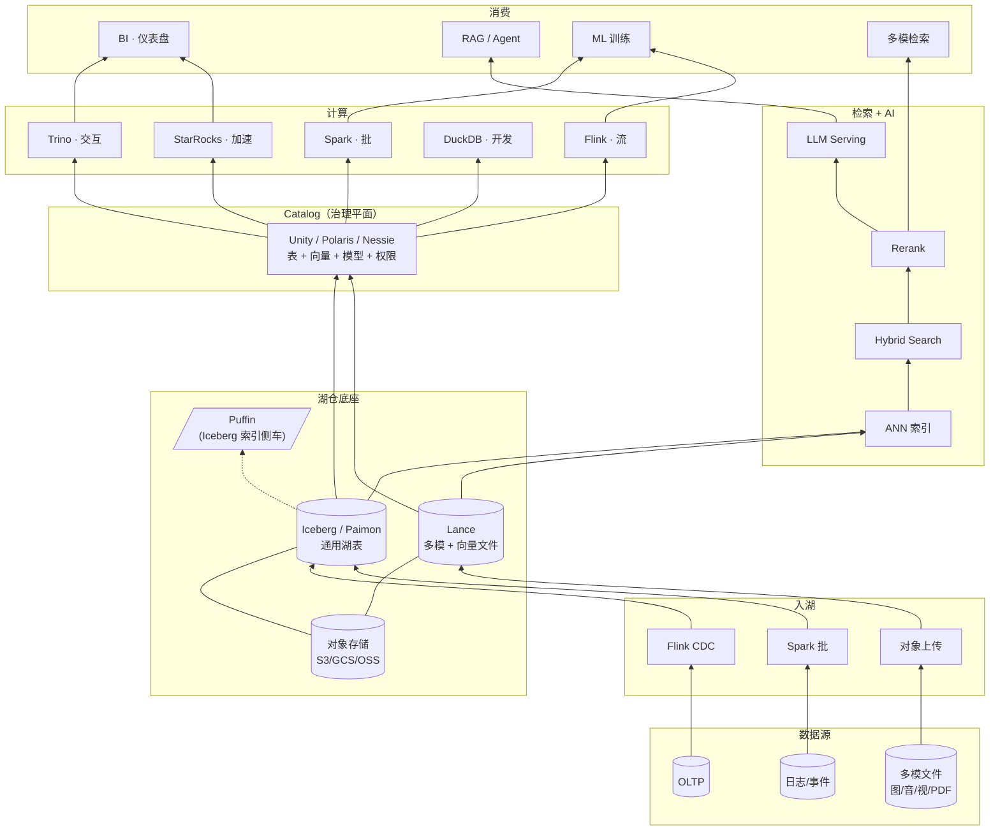

# 多模一体化湖仓手册

面向数据湖上**多模检索 + 多模分析**（BI 与 AI 一体化）的工程手册。
目标：任一工程师 **30 秒内**找到一个概念、一个系统、一种对比、一条学习路径。

---

## 整体架构视图

{ loading=lazy }
{ loading=lazy }

一张图串起本手册所有章节 —— 自底向上：**数据源 → 入湖 → 湖仓底座 → Catalog 治理平面 → 计算与检索 → 消费**。

Mermaid 版本（可编辑、便于 diff 数据流）

---

## 按角色进入

-   :material-database-cog: **数据工程师**
    ---
    湖表、入湖、Compaction、性能调优
    [→ 阅读清单](roles/data-engineer.md)

-   :material-robot: **ML / AI 工程师**
    ---
    向量检索、Embedding、RAG、多模管线、Agent
    [→ 阅读清单](roles/ml-engineer.md)

-   :material-cog-outline: **平台 / 基础设施**
    ---
    Catalog、治理、成本、可观测性、迁移
    [→ 阅读清单](roles/platform-engineer.md)

-   :material-chart-bar: **BI / 数据分析师**
    ---
    SQL、OLAP 建模、物化视图、加速
    [→ 阅读清单](roles/bi-analyst.md)

---

## 按用途进入

-   :material-book-open-variant: **查一个概念**
    ---
    [基础](foundations/index.md) · [湖仓](lakehouse/index.md) · [检索](retrieval/index.md) · [AI 负载](ai-workloads/index.md) · [BI 负载](bi-workloads/index.md) · [一体化](unified/index.md) · [术语表](glossary.md)

-   :material-compare-horizontal: **比较两样东西**
    ---
    [全部对比](compare/index.md) · [四大表格式](compare/iceberg-vs-paimon-vs-hudi-vs-delta.md) · [向量数据库](compare/vector-db-comparison.md) · [ANN 索引](compare/ann-index-comparison.md) · [Catalog 全景](compare/catalog-landscape.md)

-   :material-map-marker-path: **按路径学**
    ---
    [一周入门](learning-paths/week-1-newcomer.md) · [一月 AI](learning-paths/month-1-ai-track.md) · [一月 BI](learning-paths/month-1-bi-track.md) · [一季度资深](learning-paths/quarter-advanced.md)

-   :material-help-circle: **具体问题速答**
    ---
    [FAQ](faq.md) · 小文件怎么治、选哪个向量库、模型换代怎么办、一张表多种向量怎么建……

-   :material-source-branch: **团队技术决策**
    ---
    [ADR](adr/index.md) · 0001 站点框架、0002 Iceberg、0003 LanceDB、0004 Catalog、0005 引擎组合

-   :material-flash: **参考查询**
    ---
    [Iceberg §维护运维](lakehouse/iceberg.md) · [ANN 索引对比](compare/ann-index-comparison.md) · [向量数据库 §多引擎 SQL](retrieval/vector-database.md) · [Embedding 选型](retrieval/embedding.md)

!!! tip "或者，直接按你手头的具体事"
    - **选表格式** → [四大表格式对比](compare/iceberg-vs-paimon-vs-hudi-vs-delta.md) · [ADR-0002](adr/0002-iceberg-as-primary-table-format.md)
    - **查询慢定位** → [性能调优](ops/performance-tuning.md) · [20 反模式](ops/anti-patterns.md) · [量级数字](benchmarks.md)
    - **已有数仓做 RAG** → [RAG](ai-workloads/rag.md) · [RAG on Lake 场景](scenarios/rag-on-lake.md) · [Embedding 流水线](ml-infra/embedding-pipelines.md)
    - **平台权限 / 多租户** → [安全与权限](ops/security-permissions.md) · [统一 Catalog 策略](catalog/strategy.md) · [多租户隔离](ops/multi-tenancy.md)
    - **小文件治理** → [Compaction](lakehouse/compaction.md) · [FAQ](faq.md)
    - **选向量库** → [向量数据库对比](compare/vector-db-comparison.md) · [ADR-0003](adr/0003-lancedb-for-multimodal-vectors.md)

---

## 推荐主线：一体化架构

> 这是**本手册的推荐主线**，不是普适最优。纯 BI / 纯 OLTP / 纯 Classical ML 训练团队可以跳过整块；同时做"湖仓 + 向量检索 + 多模"的团队才需要把这里读透。

-   **[Lake + Vector 融合架构](unified/lake-plus-vector.md)**
    ---
    把向量检索做成湖的原住民的三种范式

-   **[多模数据建模](unified/multimodal-data-modeling.md)**
    ---
    一张湖表承载图 / 文 / 音 / 视 + 多种向量

-   **[跨模态查询](retrieval/cross-modal-queries.md)**
    ---
    一条 SQL 同时做结构化过滤 + 向量相似度

-   **[Compute Pushdown](query-engines/compute-pushdown.md)**
    ---
    把计算、UDF、模型推理下沉到湖

-   **[统一 Catalog 策略](catalog/strategy.md)**
    ---
    从"表注册中心"升级到"治理平面"

-   **[案例拆解](cases/studies.md)**
    ---
    Databricks / Snowflake / Netflix / LinkedIn / Uber / Pinterest

---

## 领域地图

| 方向 | 说明 | 入口 |
| --- | --- | --- |
| 基础 | 对象存储、文件格式、向量化执行、MVCC、一致性、谓词下推、存算分离 | [foundations](foundations/index.md) |
| 湖仓表格式 | 湖表 / Snapshot / Manifest / Schema & Partition Evolution / Compaction | [lakehouse](lakehouse/index.md) |
| 元数据 Catalog | Hive / REST / Nessie / Unity / Polaris / Gravitino | [catalog](catalog/index.md) |
| 查询引擎 | Trino / Spark / Flink / DuckDB / StarRocks / ClickHouse / Doris | [query-engines](query-engines/index.md) |
| **数据管线** | 入湖、多模预处理（图/视/音/文档）、编排 | [pipelines](pipelines/index.md) |
| 多模检索 | 向量 DB、ANN、Hybrid、Rerank、Embedding、多模对齐、评估 | [retrieval](retrieval/index.md) |
| AI 负载 | RAG / Agent / Prompt / Feature Store / 微调数据 | [ai-workloads](ai-workloads/index.md) |
| **ML 基础设施** | Model Registry / Serving / Training / GPU | [ml-infra](ml-infra/index.md) |
| BI 负载 | OLAP 建模 / 物化视图 / 查询加速 | [bi-workloads](bi-workloads/index.md) |
| **一体化架构** ⭐ | 湖 + 向量融合、多模建模（跨章组合视角）| [unified](unified/index.md) |
| **工业案例** | Netflix / LinkedIn / Uber / 六家横比 | [cases](cases/index.md) |
| 运维与生产 | 可观测性 / 性能 / 成本 / 安全 / 治理 / 迁移 / 排障 | [ops](ops/index.md) |

---

## 精选主题

### 工程底座深化
- [**MCP · Model Context Protocol**](ai-workloads/mcp.md) — Anthropic 2024 开放协议
- [**MLOps 生命周期**](ml-infra/mlops-lifecycle.md) — 数据 → 训练 → 评估 → 上线 → 监控闭环
- [**语义层 · Semantic Layer**](bi-workloads/semantic-layer.md) — dbt / Cube 指标中台
- [**LLM Gateway**](ai-workloads/llm-gateway.md) — LiteLLM / Portkey / Helicone 统一代理
- [**SLA · SLO · DRE**](ops/sla-slo.md) — 数据产品可靠性工程
- [**TCO 模型**](ops/tco-model.md) — 自建 vs 云 vs SaaS 真实成本

### 业务闭环（带问题进来先看）
- [**E2E 业务场景全景**](scenarios/business-scenarios.md) — Top 10 + 前沿 + 决策矩阵
- [推荐系统深挖](scenarios/recommender-systems.md) · [欺诈检测](scenarios/fraud-detection.md) · [CDP 分群](scenarios/cdp-segmentation.md) · [Agentic 工作流](scenarios/agentic-workflows.md) · [Text-to-SQL 平台](scenarios/text-to-sql-platform.md)

### 选型决策（工业最常查）
- [**量级数字总汇**](benchmarks.md) — 湖仓 / 检索 / LLM 各场景量级参考
- [**湖仓 20 反模式**](ops/anti-patterns.md) — 上线前自查清单
- [Feature Store 横比](compare/feature-store-comparison.md) · [OLAP 加速副本](compare/olap-accelerator-comparison.md) · [流处理引擎](compare/streaming-engines.md) · [Rerank 模型](compare/rerank-models.md) · [稀疏检索](compare/sparse-retrieval.md) · [调度系统](compare/orchestrators.md)

### 深度案例
- [**Netflix**](cases/netflix.md) · [**LinkedIn**](cases/linkedin.md) · [**Uber**](cases/uber.md) — 工业数据平台完整拆解

### 2024-2026 新方向（各机制章 §前沿 / 深度页）
- [**RAG §4 高级范式**](ai-workloads/rag.md) — Contextual Retrieval / CRAG / Self-RAG / Agentic RAG / GraphRAG
- [**LLM Inference**](ai-workloads/llm-inference.md) — vLLM / SGLang / TRT-LLM / Dynamo / speculative
- [**Embedding · Matryoshka + Quantization**](retrieval/embedding.md) · [Quantization · Binary / SQ / PQ](retrieval/quantization.md) · [Sparse · SPLADE / BM42](retrieval/sparse-retrieval.md)
- [**AI 合规**](ops/compliance.md) — EU AI Act / NIST AI RMF / 中国生成式 AI 管理办法
- [**Guardrails + Red Teaming**](ai-workloads/guardrails.md) — 工程护栏 + 对抗测试
- [**Iceberg v3**](lakehouse/iceberg-v3.md) — spec 2025-06 ratified · 引擎 rolling out
- [**Vendor Landscape**](vendor-landscape.md) — 客观厂商对比

---

## 跨向导航

- **[横向对比 `compare/`](compare/index.md)** — 16 大选型决策
- **[场景指南 `scenarios/`](scenarios/index.md)** — 10 个业务深挖 + 4 个架构视角
- **[学习路径 `learning-paths/`](learning-paths/index.md)** — 4 条时间脚手架
- **[按技术栈索引](index-by-technology.md)** — AWS / GCP / Azure / Databricks / Snowflake / 开源 / 国产化
- **[ADR `adr/`](adr/index.md)** — 团队技术决策记录
- **[FAQ](faq.md)** — 跨目录速答
- **[术语表](glossary.md)** — 字母序兜底索引 · **[Changelog](changelog.md)** · **[贡献指南](contributing.md)**

---

## 参与贡献

见 [贡献指南](contributing.md)。一句话流程：**开 Issue 认领 → 按模板写页 → PR → CI 绿 + review 合格 → 自动发布**。
