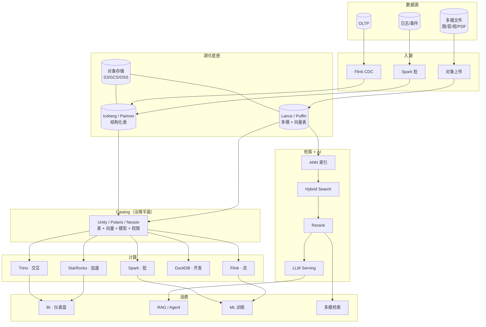

# 多模一体化湖仓 · Wiki

面向数据湖上**多模检索 + 多模分析**（BI + AI 一体化）的团队知识库。
目标：任一工程师 **30 秒内**找到一个概念、一个系统、一种对比、一条学习路径。

---

## 整体架构视图

一张图串起本 Wiki 所有章节 —— 顺着"数据源 → 入湖 → 底座 → Catalog → 计算 → 检索/AI → 消费"读下去。

---

## 按角色进入

-   :material-database-cog: **数据工程师**
    ---
    湖表、入湖、Compaction、性能调优
    [→ 阅读清单](roles/data-engineer.md)

-   :material-robot: **ML / AI 工程师**
    ---
    向量检索、Embedding、RAG、多模管线、Agent
    [→ 阅读清单](roles/ml-engineer.md)

-   :material-cog-outline: **平台 / 基础设施**
    ---
    Catalog、治理、成本、可观测性、迁移
    [→ 阅读清单](roles/platform-engineer.md)

-   :material-chart-bar: **BI / 数据分析师**
    ---
    SQL、OLAP 建模、物化视图、加速
    [→ 阅读清单](roles/bi-analyst.md)

---

## 按用途进入

-   :material-book-open-variant: **查一个概念**
    ---
    [基础](foundations/index.md) · [湖仓](lakehouse/index.md) · [检索](retrieval/index.md) · [AI 负载](ai-workloads/index.md) · [BI 负载](bi-workloads/index.md) · [一体化](unified/index.md) · [术语表](glossary.md)

-   :material-compare-horizontal: **比较两样东西**
    ---
    [全部对比](compare/index.md) · [四大表格式](compare/iceberg-vs-paimon-vs-hudi-vs-delta.md) · [向量数据库](compare/vector-db-comparison.md) · [ANN 索引](compare/ann-index-comparison.md) · [Catalog 全景](compare/catalog-landscape.md)

-   :material-map-marker-path: **按路径学**
    ---
    [一周入门](learning-paths/week-1-newcomer.md) · [一月 AI](learning-paths/month-1-ai-track.md) · [一月 BI](learning-paths/month-1-bi-track.md) · [一季度资深](learning-paths/quarter-advanced.md)

-   :material-help-circle: **具体问题速答**
    ---
    [FAQ](faq.md) · 小文件怎么治、选哪个向量库、模型换代怎么办、一张表多种向量怎么建……

-   :material-source-branch: **团队技术决策**
    ---
    [ADR](adr/index.md) · 0001 Wiki 选型、0002 Iceberg、0003 LanceDB、0004 Catalog、0005 引擎组合

-   :material-flash: **速查单**
    ---
    [Iceberg](cheatsheets/iceberg.md) · [ANN 参数](cheatsheets/ann-params.md) · [向量 SQL](cheatsheets/sql-vector.md) · [Embedding](cheatsheets/embedding-quickpick.md)

---

## 团队主线：一体化架构

-   **[Lake + Vector 融合架构](unified/lake-plus-vector.md)**
    ---
    把向量检索做成湖的原住民的三种范式

-   **[多模数据建模](unified/multimodal-data-modeling.md)**
    ---
    一张湖表承载图 / 文 / 音 / 视 + 多种向量

-   **[跨模态查询](unified/cross-modal-queries.md)**
    ---
    一条 SQL 同时做结构化过滤 + 向量相似度

-   **[Compute Pushdown](unified/compute-pushdown.md)**
    ---
    把计算、UDF、模型推理下沉到湖

-   **[统一 Catalog 策略](unified/unified-catalog-strategy.md)**
    ---
    从"表注册中心"升级到"治理平面"

-   **[案例拆解](unified/case-studies.md)**
    ---
    Databricks / Snowflake / Netflix / LinkedIn / Uber / Pinterest

---

## 领域地图

| 方向 | 说明 | 入口 |
| --- | --- | --- |
| 基础 | 对象存储、文件格式、向量化执行、MVCC、一致性、谓词下推、存算分离 | [foundations](foundations/index.md) |
| 湖仓表格式 | 湖表 / Snapshot / Manifest / Schema & Partition Evolution / Compaction | [lakehouse](lakehouse/index.md) |
| 元数据 Catalog | Hive / REST / Nessie / Unity / Polaris / Gravitino | [catalog](catalog/index.md) |
| 查询引擎 | Trino / Spark / Flink / DuckDB / StarRocks / ClickHouse / Doris | [query-engines](query-engines/index.md) |
| **数据管线** | 入湖、多模预处理（图/视/音/文档）、编排 | [pipelines](pipelines/index.md) |
| 多模检索 | 向量 DB、ANN、Hybrid、Rerank、Embedding、多模对齐、评估 | [retrieval](retrieval/index.md) |
| AI 负载 | RAG / Agent / Prompt / Feature Store / 微调数据 | [ai-workloads](ai-workloads/index.md) |
| **ML 基础设施** | Model Registry / Serving / Training / GPU | [ml-infra](ml-infra/index.md) |
| BI 负载 | OLAP 建模 / 物化视图 / 查询加速 | [bi-workloads](bi-workloads/index.md) |
| **一体化架构** ⭐ | 湖 + 向量融合、多模建模、统一 Catalog、跨模态查询、案例 | [unified](unified/index.md) |
| 运维与生产 | 可观测性 / 性能 / 成本 / 安全 / 治理 / 迁移 / 排障 | [ops](ops/index.md) |
| 研究前沿 | 论文笔记、Benchmark | [frontier](frontier/index.md) |

---

## 跨向视图

- **[横向对比 `compare/`](compare/index.md)** —— 7 大选型决策
- **[场景指南 `scenarios/`](scenarios/index.md)** —— 6 条端到端叙事
- **[学习路径 `learning-paths/`](learning-paths/index.md)** —— 4 条时间脚手架
- **[速查单 `cheatsheets/`](cheatsheets/index.md)** —— 4 张一页式参数速查
- **[ADR `adr/`](adr/index.md)** —— 5 条团队技术决策记录
- **[FAQ](faq.md)** —— 25+ 条跨目录速答
- **[Changelog](changelog.md)** —— Wiki 变更记录
- **[术语表](glossary.md)** —— 字母序兜底索引

---

## 参与贡献

见 [贡献指南](contributing.md)。一句话流程：**开 Issue 认领 → 按模板写页 → PR → CI 绿 + review 合格 → 自动发布**。
