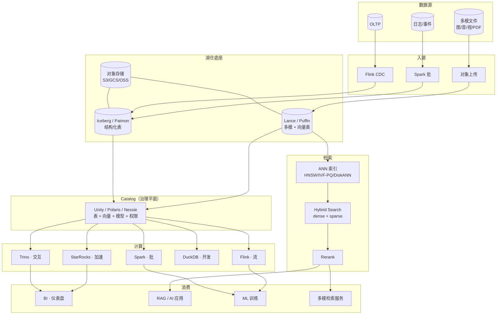

# 多模一体化湖仓 · Wiki

面向数据湖上**多模检索 + 多模分析**（BI + AI 一体化）的团队知识库。
目标：任一工程师 **30 秒内**找到一个概念、一个系统、一种对比、一条学习路径。

---

## 整体架构视图

一张图串起本 Wiki 所有章节 —— 顺着"数据源 → 入湖 → 底座 → Catalog → 计算 → 检索 → 消费"读下去。

---

## 三种心智入口

-   :material-book-open-variant: **我要查一个概念**

    ---

    直接到对应领域或用术语表：
    [基础](foundations/index.md) · [湖仓](lakehouse/index.md) · [检索](retrieval/index.md) · [AI](ai-workloads/index.md) · [BI](bi-workloads/index.md) · [一体化](unified/index.md) · [术语表](glossary.md)

-   :material-compare-horizontal: **我要比较两样东西**

    ---

    去 [横向对比](compare/index.md)，例如：
    [DB 引擎 vs 湖表](compare/db-engine-vs-lake-table.md) ·
    [四大表格式](compare/iceberg-vs-paimon-vs-hudi-vs-delta.md) ·
    [Catalog 全景](compare/catalog-landscape.md) ·
    [ANN 索引](compare/ann-index-comparison.md) ·
    [向量数据库](compare/vector-db-comparison.md)

-   :material-map-marker-path: **我是新人给我一条路**

    ---

    去 [学习路径](learning-paths/index.md)：
    [一周上手](learning-paths/week-1-newcomer.md) ·
    [一月 AI](learning-paths/month-1-ai-track.md) ·
    [一月 BI](learning-paths/month-1-bi-track.md)

-   :material-help-circle: **我有一个具体问题**

    ---

    去 [FAQ](faq.md)：小文件怎么治、选哪个向量库、模型换代怎么办、一张表多种向量怎么建……

-   :material-source-branch: **我想知道团队怎么做选择**

    ---

    去 [ADR](adr/index.md) 看技术决策记录 —— 为什么选 Iceberg、为什么选 LanceDB、以及团队每次重要架构选择的依据。

-   :material-hexagon-multiple: **团队主线**

    ---

    [Lake + Vector 融合架构](unified/lake-plus-vector.md) ·
    [多模数据建模](unified/multimodal-data-modeling.md) ·
    [统一 Catalog 策略](unified/unified-catalog-strategy.md) ·
    [跨模态查询](unified/cross-modal-queries.md) ·
    [案例拆解](unified/case-studies.md)

---

## 领域地图

| 方向 | 说明 | 入口 |
| --- | --- | --- |
| 基础 | 对象存储、文件格式（Parquet/ORC/Lance）、向量化执行、MVCC、一致性 | [foundations](foundations/index.md) |
| 湖仓表格式 | 湖表 / Snapshot / Manifest / Schema/Partition Evolution / Compaction | [lakehouse](lakehouse/index.md) |
| 元数据 Catalog | Hive / REST / Nessie / Unity / Polaris / Gravitino | [catalog](catalog/index.md) |
| 查询引擎 | Trino / Spark / Flink / DuckDB / StarRocks / ClickHouse / Doris | [query-engines](query-engines/index.md) |
| 多模检索 | 向量 DB、ANN、Hybrid、Rerank、Embedding、多模对齐、检索评估 | [retrieval](retrieval/index.md) |
| AI 负载 | RAG / Feature Store / Embedding Pipeline / Semantic Cache | [ai-workloads](ai-workloads/index.md) |
| BI 负载 | OLAP 建模 / 物化视图 / 查询加速 | [bi-workloads](bi-workloads/index.md) |
| **一体化架构** ⭐ | 湖 + 向量融合、多模建模、统一 Catalog、跨模态查询、案例 | [unified](unified/index.md) |
| 运维与生产 | 可观测性 / 性能 / 成本 / 安全 / 治理 | [ops](ops/index.md) |
| 研究前沿 | 论文笔记、趋势 | [frontier](frontier/index.md) |

---

## 跨向视图

- **[横向对比 `compare/`](compare/index.md)** —— 同层对象的硬比
- **[场景指南 `scenarios/`](scenarios/index.md)** —— 端到端叙事（BI on Lake、RAG on Lake、多模检索、流式入湖、离线训练、特征服务）
- **[学习路径 `learning-paths/`](learning-paths/index.md)** —— 时间维度的认知脚手架
- **[ADR `adr/`](adr/index.md)** —— 团队技术决策记录
- **[FAQ `faq.md`](faq.md)** —— 常见问题速答
- **[术语表 `glossary.md`](glossary.md)** —— 字母序兜底索引

---

## 参与贡献

见 [贡献指南](contributing.md)。一句话流程：**开 Issue 认领 → 按模板写页 → PR → CI 绿 + review 合格 → 自动发布**。
