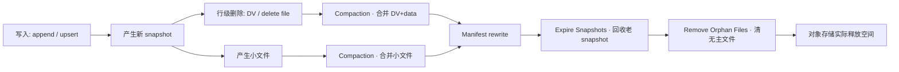

# Compaction（合并）

!!! tip "一句话理解"
    把湖表里**过多的小文件 + 过多的 delete/log 文件**重写成更紧凑的大文件。不 compaction 的湖表几个月内会烂——查询变慢、元数据膨胀、成本失控。**不是可选项，是必修课**。

!!! abstract "TL;DR"
    - **三个对象要管**：data files（小文件合并）、delete files / DV（MoR 合并）、manifest（manifest 合并）
    - **四种策略**：bin-pack / sort / z-order / clustering（**Liquid Clustering 是 Delta 专属命名**；Iceberg 1.5+ 提供等价能力为 Sort Order + clustering rewrite）
    - **触发器**：小文件数阈值 / delta 比例 / 时间窗 —— 生产通常组合
    - **成本**：没做 compaction 查询成本 3-10× · 做 compaction 自身成本 5-15% 总 IO
    - **各家命令不同**但理念一致：Iceberg `rewrite_data_files` · Delta `OPTIMIZE` · Paimon `full-compaction` · Hudi `run_compaction`

## 1. 为什么会产生小文件

湖表的写入方式决定了小文件是必然——这个问题的根因在 [湖表](lake-table.md) 的"写入路径"小节有完整解释。简要复述：

- **流式 upsert** —— 每个 commit 都落一个新文件
- **多 writer 并发** —— 每个 writer 自己写文件
- **分区粒度细** —— 每个分区每个 commit 一个文件
- **delete 文件** —— row-level delete 在 MoR 下一直累加
- **高频 commit** —— Paimon 秒级 commit、每次产生新 L0 文件

几百万小文件会发生什么：

- 查询要打开 N 个文件句柄（IO 放大）
- 元数据扫描（LIST / HEAD）比数据扫描还贵
- Parquet 每个文件的 footer 固定成本摊不开（百 KB 级 footer × 百万文件 = 百 GB 纯元数据开销）
- 存储系统（S3）API 调用收费线性上升

## 2. 三类 Compaction 对象

### 2.1 Data File Compaction

把若干**小文件合并成一个大文件**——最常见的 compaction 类型。

```sql
-- Iceberg
CALL system.rewrite_data_files(
  table => 'db.events',
  options => map(
    'target-file-size-bytes', '536870912',   -- 512MB
    'min-file-size-bytes',    '67108864'     -- < 64MB 算小
  )
);

-- Delta
OPTIMIZE db.events;

-- Paimon (L0 自动 compaction；手动触发全量 full-compaction)
CALL sys.compact('db.events');

-- Hudi
CALL run_compaction(op => 'run', table => 'db.events');
```

### 2.2 Delete / DV Compaction（MoR 表）

MoR 表要周期合并 **base + delete files / DV** 成新 base，丢弃已合并的 delete 载体。否则每次读都要做昂贵的运行时 merge。

```sql
-- Iceberg · 重写位置删除文件
CALL system.rewrite_position_delete_files('db.events');

-- Iceberg v3+ · 重写 DV (Puffin deletion-vector-v1 blob)
-- 当 DV 文件过多时同样需要合并到 data file 重写

-- Paimon · full-compaction 会消化 DV
CALL sys.compact('db.events');

-- Hudi
CALL run_compaction(op => 'run', table => 'db.events');
```

### 2.3 Manifest Compaction

Manifest 本身也会多—— Iceberg 每次 commit 产生一个 Manifest，长期不合并会让 planning 变慢。

```sql
-- Iceberg
CALL system.rewrite_manifests('db.events');
```

**判据**：`SELECT COUNT(*) FROM db.events.manifests > 10000` 就该跑了。

## 3. 四种策略矩阵

| 策略 | 做法 | 保留排序？ | 适合 |
|---|---|---|---|
| **Bin-pack** | 把小文件**按大小凑到目标** | ❌ | 默认：快速消除小文件 |
| **Sort** | 合并时按指定列**重新排序** | ✅ | 查询常按某列过滤（如 `ts`、`user_id`）|
| **Z-order** | 合并时按 **Z 序曲线**（space-filling curve · 把多维点交织成一维）聚集 | ✅（Z 曲线）| 多列过滤（如 `region + ts`），让靠近的多维点物理相邻 → 改善 file pruning |
| **Clustering / Liquid Clustering** | Delta 特有 · 自适应多维聚簇 | ✅ | 替代传统分区 + Z-order |

```sql
-- Iceberg 用 sort 策略
CALL system.rewrite_data_files(
  table => 'db.events',
  strategy => 'sort',
  sort_order => 'region ASC, ts DESC',
  options => map('target-file-size-bytes', '536870912')
);

-- Iceberg z-order
CALL system.rewrite_data_files(
  table => 'db.events',
  strategy => 'sort',
  sort_order => 'zorder(region, ts)'
);

-- Delta z-order
OPTIMIZE db.events ZORDER BY (region, ts);

-- Delta Liquid Clustering
ALTER TABLE db.events CLUSTER BY (region, ts);
OPTIMIZE db.events;
```

**选型**：

- **不知道怎么选** → bin-pack（最稳，消除小文件问题）
- **BI 仪表盘查询稳定按某列过滤** → sort
- **多列过滤、维度组合查询** → z-order
- **Databricks 栈、不想管分区** → Liquid Clustering

## 4. 调度策略

| 触发条件 | 说明 | 适合场景 |
| --- | --- | --- |
| 小文件数 > 阈值 | 最常见 | 大多数批/流 |
| delta / base 比 > X% | MoR 合并 | 高频 upsert |
| 分区内 max 文件大小 < Y | 追求查询稳定 | BI 仪表盘 |
| 时间窗（每天 / 每小时） | 最简单 | 稳定流入湖 |

生产上通常是"**时间窗 + 阈值**组合"，避开业务高峰。Paimon / Flink 场景常起**独立 compaction 作业**和写作业分离（避免抢资源）。

## 5. 成本估算

### 成本公式

```
单次 compaction 成本 ≈ 
  输入文件总大小（读 IO）
  + 输出文件总大小（写 IO）
  + 计算资源（CPU·h 的 shuffle / sort 成本）
  + 对象存储 API 调用（LIST / GET / PUT 计费）
```

### 经验数字

| 指标 | 典型值 |
|---|---|
| 没 compaction 的查询成本增幅 | **3-10×** |
| Compaction 自身占总 IO 成本 | 5-15% |
| Compaction 频率（稳定批场景） | 每天 1 次 |
| Compaction 频率（高频流场景） | 每 10-30 分钟（独立作业） |
| 单次重写 1TB 耗时（Spark 集群）| 10-60 min |

## 6. 跨格式命令对比

| 操作 | Iceberg | Delta | Paimon | Hudi |
|---|---|---|---|---|
| 数据文件合并 | `rewrite_data_files` | `OPTIMIZE` | `sys.compact` | `run_compaction` |
| 排序合并 | `strategy => 'sort'` | `ZORDER BY` | —（bucket 内排序）| clustering |
| Z-order | `sort_order => 'zorder(...)'` | `ZORDER BY` | — | clustering |
| Liquid Clustering | —（用 sort 代替）| `CLUSTER BY` + `OPTIMIZE` | — | — |
| 删除文件合并 | `rewrite_position_delete_files` | 自动（OPTIMIZE 一起）| `full-compaction` | 同 compaction |
| Manifest 合并 | `rewrite_manifests` | 自动（checkpoint）| 自动 | 自动 |
| 移除孤儿 | `remove_orphan_files` | `VACUUM` | `expire_snapshots` | `run_clean` |

## 7. 陷阱

- **和写入竞争**：并发 commit 冲突，需要 Catalog 层 CAS 与重试策略；大表 compaction 失败率和并发度挂钩
- **压缩时 IO 打爆**：大表 rewrite 一次是几 TB IO，要**限流 + 分批分区** 跑
- **失败后 orphan 文件**：compact 中途崩留下孤儿 → 靠 `remove_orphan_files` / `VACUUM` 清理
- **排序丢失**：bin-pack 不保证排序；查询依赖 Z-order 时要用 sort-compaction 否则白跑
- **Manifest 膨胀被忽略**：只合并 data file 不合并 manifest → 最终 planning 还是慢
- **MoR 不跑 delete compaction**：delete 文件堆积 → 查询合并时间线性增长 → 用户感知"越来越慢"
- **不做配置审计**：target-file-size 设 1GB 但分区小只有 100MB → 永远达不到目标
- **compaction 和 streaming 写作业放一起**：资源竞争 → 两边都慢 → 推荐独立 compaction job

## 8. 和运维的关系

大规模湖表的 **Compaction 其实就是"运维的主要开销"**。Databricks / Tabular（已于 2024-06 并入 Databricks）/ Onehouse 等商业平台把它做成"自动托管"是有原因的——自己搞要持续维护若干 Spark/Flink 作业、监控、告警、失败重试。

**最小可用运维闭环**（Airflow / Dagster）：

```python
@dag(schedule="@daily")
def lake_maintenance():
    rewrite_data = SparkSubmit(task_id="rewrite_data_files", ...)
    rewrite_deletes = SparkSubmit(task_id="rewrite_position_deletes", ...)
    rewrite_manifests = SparkSubmit(task_id="rewrite_manifests", ...)
    expire = SparkSubmit(task_id="expire_snapshots", ...)
    orphan = SparkSubmit(task_id="remove_orphan_files", ...)
    rewrite_data >> rewrite_deletes >> rewrite_manifests >> expire >> orphan
```

## 9. 生产维护生命周期 · 表从写入到回收的闭环

表格式"跑得动"和"跑得稳"是两回事。湖表上生产后，**运维语义分散在多个机制里**——这里统一成一条主轴方便建 runbook：

### 全链路视图



### 六个动作 · 各自负责什么

| 动作 | 频率 | 负责消除 | 命令（Iceberg） | 对应阅读 |
|---|---|---|---|---|
| **Compaction · data** | 小时-天 | 小文件 | `rewrite_data_files` | 本页 §3-7 |
| **Compaction · deletes/DV** | 小时-天 | MoR 读放大 | `rewrite_position_deletes` | [Delete Files](delete-files.md) |
| **Manifest Rewrite** | 天 | manifest 膨胀 | `rewrite_manifests` | [Manifest](manifest.md) |
| **Expire Snapshots** | 天 | 老 snapshot 元数据 | `expire_snapshots` | [Snapshot](snapshot.md) · [Time Travel](time-travel.md) |
| **Remove Orphan Files** | 周 | 写失败留下的孤儿 | `remove_orphan_files` | [Snapshot](snapshot.md) |
| **Tag Retention 审计** | 季度 | 过期 tag | `ALTER TABLE ... DROP TAG` | [Branching & Tagging](branching-tagging.md) |

**关键依赖关系**：`rewrite_data_files` → 产生新 snapshot，**老 snapshot 还在**；必须 `expire_snapshots` 才释放指向老数据的元数据；然后 `remove_orphan_files` 才真正删文件。**顺序错了会泄漏存储**。

### 流式表 vs 批式表 · 节奏差异

| 节奏维度 | 批式表（日终写）| 流式表（持续 CDC 入湖）|
|---|---|---|
| snapshot 频率 | 低（天级）| 高（分钟级）· 必须配 retention 上限 |
| compaction 触发 | 手动 / 每日 | **自动 + 持续**（Paimon dedicated compaction job；Iceberg 1.10 支持自动）|
| DV 堆积 | 缓慢 | 快 · 必须高频 compact |
| expire 频率 | 低（周）| 高（小时-天级）· 配合流消费者的 consumer-id 最小位点 |
| 孤儿清理 | 月 | 周（失败重试留下的孤儿多）|

**流式表的额外陷阱**：
- `expire_snapshots` 不能比最老的流消费者 consumer-id 还激进（见 [Streaming Upsert / CDC](streaming-upsert-cdc.md)）
- 压缩和写入作业抢资源 → 用**独立 compaction job**
- Watermark 未推进的 snapshot 不能 expire（否则流式重启丢数）

### 成本账单分解（典型 10-50TB 湖表）

- Compaction 计算：占 5-15% 总 IO → 放 Spot 实例省钱
- Manifest rewrite：GB 级操作，成本小
- Expire：扫元数据，分钟级
- Remove orphan：扫对象存储 LIST，**最贵**——配 `older-than` 避免全扫

### 监控指标（建 dashboard 必选）

- `SELECT file_size_in_bytes FROM db.tbl.files` 分布直方图 · 识别小文件分布
- Manifest 数量 + 平均大小
- 最老 snapshot 年龄 · delete 文件占比 · DV 覆盖率
- Compaction 作业成功率 + 耗时趋势
- 孤儿文件比例（定期 `remove_orphan_files --dry-run` 采样）

## 10. 相关

- [Streaming Upsert / CDC](streaming-upsert-cdc.md) —— 小文件的主要来源
- [Delete Files](delete-files.md) —— MoR compaction 的第二个主题
- [Manifest](manifest.md) —— manifest 合并也是 compaction 的一环
- [Snapshot](snapshot.md) —— expire / vacuum 是 compaction 的配套
- [性能调优](../ops/performance-tuning.md) · [成本优化](../ops/cost-optimization.md)

## 11. 延伸阅读

- **[Iceberg Maintenance](https://iceberg.apache.org/docs/latest/maintenance/)**
- **[Delta OPTIMIZE · Liquid Clustering](https://docs.delta.io/latest/optimizations-oss.html)**
- **[Paimon Compaction](https://paimon.apache.org/docs/master/maintenance/dedicated-compaction/)**
- **[Hudi Clustering and Compaction](https://hudi.apache.org/docs/clustering)**
- *The Hidden Costs of a Data Lake* — Onehouse / Tabular 博客系列
