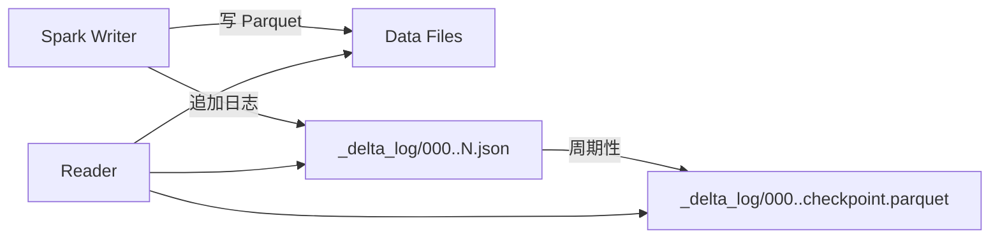

# Delta Lake

!!! tip "一句话定位"
    Databricks 主推、被 Linux Foundation 治理的湖表格式。和 Spark 绑定最深、工具链最成熟；协议形态接近 Iceberg 但生态边界不同。

## 它解决什么

Delta 解决的问题和 Iceberg 一致——给对象存储上的表加上 ACID、Schema Evolution、Time Travel。差异化在：

- **`_delta_log/` 事务日志**为核心元数据载体，JSON 日志 + 定期 checkpoint Parquet
- **深度绑定 Spark 生态**（DataFrame API、SQL、Structured Streaming）
- **Delta Universal Format（UniForm）** —— 一个表同时被 Iceberg / Hudi 读取器识别（Databricks 主推，降低"选谁"的焦虑）
- **Deletion Vectors** —— 行级删除的高效机制

## 架构一览

读取时从最新 checkpoint 开始回放 JSON 日志就能得到当前表状态。简单、可靠，但日志膨胀会影响元数据读延迟。

## 关键能力

- ACID 事务（对象存储层面原子 rename / 外部 lock）
- Schema Evolution（需开启属性）
- Time Travel（`VERSION AS OF` / `TIMESTAMP AS OF`）
- Change Data Feed（变更流输出）
- Deletion Vectors（不重写数据文件的删除）
- UniForm（多协议兼容）
- Liquid Clustering（替代分区 + Z-order 的新布局）

## 和邻居对比

- 对比 **Iceberg** —— Iceberg 协议更中立、Catalog 生态更丰富；Delta 与 Spark 一体化体验更好
- 对比 **Paimon / Hudi** —— Delta 批分析偏向，流式 upsert 不是主线

详见 [Iceberg vs Paimon vs Hudi vs Delta](../compare/iceberg-vs-paimon-vs-hudi-vs-delta.md)。

## 陷阱与坑

- **开源版本 vs Databricks 内部版本**：某些性能特性只在商业版有，选型时留意
- **多 writer** 依赖外部 lock（HMS / DynamoDB），纯对象存储 CAS 并非全场景可行
- **`_delta_log/` 膨胀** —— 大量小事务会让日志读取慢；要配置定期 checkpoint

## 延伸阅读

- Delta Protocol: <https://github.com/delta-io/delta/blob/master/PROTOCOL.md>
- *Delta Lake: High-Performance ACID Table Storage over Cloud Object Stores* (VLDB 2020)
