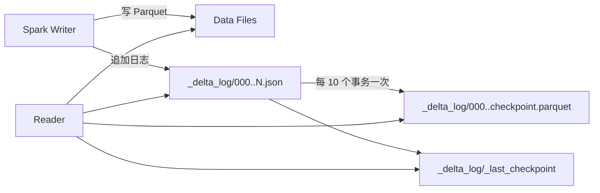

# Delta Lake

!!! tip "一句话定位"
    **Databricks 主推**、Linux Foundation 治理的湖表格式。与 Spark / Databricks Runtime 绑定最深，工具链体验最好。核心载体是 **`_delta_log/` JSON 事务日志**。**Uniform** 2024 后可被 Iceberg 读取器识别——这是 Databricks 拥抱开放生态的重要一步。

!!! abstract "TL;DR"
    - **_delta_log/ JSON 日志 + 定期 Parquet Checkpoint** 是元数据核心
    - **Databricks 深度集成**：Photon 引擎专为 Delta 优化
    - **Deletion Vectors**（Delta 2.3+ read · 2.4+ write · 2023 引入 · 3.0 GA）：行级删除不重写数据文件 · 与 Iceberg V3 spec 无关
    - **Liquid Clustering**（Delta 3.2+ preview · 3.3 GA · 2024）：Z-order 的现代化继承 · Delta 自有特性
    - **Uniform** (2024)：一张 Delta 表可被 Iceberg 读取器读取
    - **和 Iceberg 的关系**：技术重合度高，差异化主要在生态（Databricks 生态 vs 开放多引擎）

## 1. 它解决的问题 · 与 Iceberg 的差异化

Delta 解决的核心问题和 Iceberg 一致——给对象存储上的表加上 ACID、Schema Evolution、Time Travel。

**差异化不在技术能力**而在：

| 维度 | Delta Lake | Iceberg |
|---|---|---|
| 出身 | Databricks 2019 开源 | Netflix 2018 开源 |
| 治理 | Linux Foundation | Apache Software Foundation |
| 生态 | **Spark + Databricks 优先** | **多引擎**（Spark/Flink/Trino/DuckDB 等） |
| 最佳引擎 | Databricks Photon | 无偏好 |
| Catalog | Unity Catalog 最深 | Iceberg REST / Nessie / Polaris |
| 开源程度 | 协议开放但优化多在商业版 | 协议 + 参考实现都完整开源 |
| 商业化主导 | Databricks（主导）| Tabular（已被 Databricks 收购）+ 多家 |

**关键 2024 事件**：Databricks 收购 Tabular（Ryan Blue 团队，Iceberg 创始人）→ Delta 与 Iceberg 的未来融合成为趋势。

## 2. 架构深挖



### `_delta_log/` 结构

```
_delta_log/
  00000000000000000000.json        (commit 0)
  00000000000000000001.json        (commit 1)
  ...
  00000000000000000010.json        (commit 10)
  00000000000000000010.checkpoint.parquet  (checkpoint at commit 10)
  _last_checkpoint                          (指向最新 checkpoint)
```

读取时：
1. 读 `_last_checkpoint`
2. 读最新 checkpoint Parquet（完整表状态）
3. 读后续增量 JSON 事务回放

### Action 类型（每条 JSON 事务包含）

- `metaData` —— schema / partition / properties
- `add` —— 新增 data file
- `remove` —— 标记 data file 废弃
- `protocol` —— 协议版本
- `commitInfo` —— commit 元信息
- `cdc` —— Change Data Feed

## 3. 关键机制

### 机制 1 · ACID via _delta_log

提交原子性：**PUT 新 JSON 文件到 `_delta_log/`** 的**命名空间是否已存在**的判定。云存储支持 `PutIfAbsent`（S3 Conditional PUT、Azure Blob IfMatch）→ 原生原子 CAS。

**版本线**：

- **Delta < 3.2（2024-08 前 S3 无 Conditional PUT 时代）** · Delta OSS 在 S3 上必须挂 **DynamoDB LogStore** 做 CAS（`spark.databricks.delta.logStore.class = io.delta.storage.S3DynamoDBLogStore`）。Azure Blob / GCS 早有原生 conditional 原语，这问题仅 S3 独有
- **Delta 3.2+（2024-08 后 S3 If-None-Match GA）** · 可直接在 S3 上原子提交，不再需要 DynamoDB 外挂
- 老栈 **升级 Delta 到 3.2+** 后可考虑拆掉 DynamoDB 依赖（但要评估 migration 窗口的并发写兼容性）

### 机制 2 · Deletion Vectors（v3+）

行级删除**不重写 data file**：

```
原 data file: [row_0, row_1, row_2, row_3]
Deletion Vector: [0, 2]  ← 标记 row_0 和 row_2 删除
读时跳过被标记的行
```

和 Iceberg 的 **Position Delete File** 机制等价。

### 机制 3 · Change Data Feed

类似 Iceberg 的 `table.changes(start, end)`：

```sql
SELECT * FROM table_changes('db.orders', 1000, 1100);
-- 返回第 1000-1100 commit 之间变更的行，含 _change_type (insert/update/delete)
```

下游 CDC 消费的基础。

### 机制 4 · Liquid Clustering（v3.1+）

**Z-order 的演进**：
- 不需要预先定义分区
- **多维聚簇 + 自适应重聚簇**（底层曲线 Databricks 未完全公开，社区推测是 Hilbert-like，但官方从未 claim 使用 Hilbert curve）
- 支持**在线增量重聚簇**（OPTIMIZE；无需全表重写）

实际效果接近 Iceberg 的 **Sort Order + Clustering**。

### 机制 5 · UniForm（2024+）· 单向 read-only 互操作

**一张 Delta 表可被 Iceberg / Hudi 读取器识别**——这是 **Delta 3.0（2023-06）引入 Iceberg 方向 + Delta 3.2（2024）加 Hudi 方向** 的 UniForm 能力。关键性质：**单向 · Delta 写、他家读**。

做法：commit Delta 时**自动异步生成** Iceberg metadata.json + manifest list（或 Hudi metadata），但 Parquet 数据只存一份。他家 reader 直接读这份共享数据 + UniForm 派生元数据。

**严格边界**：

- ✅ **Iceberg / Hudi 引擎读** Delta UniForm 表：Trino / Flink / Snowflake / Iceberg reader 都可以
- ❌ **Iceberg / Hudi 引擎不能写**回 UniForm 表。所有写必须通过 Delta API
- ❌ **不是真双向**。真双向（任何格式写 / 任何格式读）走 **[Apache XTable](https://github.com/apache/incubator-xtable)**（2024-03 进入 Apache 孵化，原 OneTable）路径——它做**元数据翻译层**，不绑定某个格式做"主写者"

**意义**：多引擎消费端场景下，选 Delta 不再是"完全锁定读者"；但**写侧仍锁 Delta 生态**。这符合 Databricks "写保持差异化、读开放生态" 的策略。需要真双向时考虑 Apache XTable。

### 机制 6 · CRC Checksum 文件

Delta 每次 commit 除了 JSON 日志外还写一份 **`.crc` 文件**：

```
_delta_log/
  00000000000000000042.json         ← commit 42 事务日志
  00000000000000000042.crc          ← 对应的 checksum + 统计摘要
```

CRC 文件包含：
- 整张表的 **tableSizeBytes / numFiles / numRecords**
- JSON 事务日志的校验和
- 使查询 planner **跳过扫日志回放**就能拿到表级统计

是 Delta 的性能优化点——读表大小 / 行数时不用扫完整日志。

### 机制 7 · Row Tracking（v3）

和 Iceberg v3 Row Lineage 一致的思路。Delta 3+ 引入：

- **`_metadata.row_id`**：每行的稳定 ID（跨 merge / update 保持不变）
- **`_metadata.row_commit_version`**：该行最近一次被修改的 commit 版本

```sql
SELECT order_id, _metadata.row_id, _metadata.row_commit_version
FROM db.orders;
```

用途：**增量物化视图刷新** + **精确 CDC 消费**。必须建表时 `delta.enableRowTracking = true`。

## 4. 工程细节

### 关键配置

| 参数 | 建议 |
|---|---|
| `delta.enableDeletionVectors` | `true`（v3+） |
| `delta.enableChangeDataFeed` | `true`（流消费下游需要）|
| `delta.logRetentionDuration` | 30 天（default）|
| `delta.deletedFileRetentionDuration` | 7 天 |
| `delta.checkpointInterval` | 10 commits（Spark 实现默认；Delta 协议不强制）|
| `delta.feature.liquidClustering` | `supported`（v3.1+） |

### 运维命令

```sql
-- 合并小文件
OPTIMIZE db.orders;

-- Z-order
OPTIMIZE db.orders ZORDER BY (user_id, ts);

-- Liquid Clustering
ALTER TABLE db.orders CLUSTER BY (user_id);

-- Vacuum 清理过期
VACUUM db.orders RETAIN 168 HOURS;  -- 7 天

-- Restore
RESTORE TABLE db.orders TO VERSION AS OF 42;
```

## 5. 性能数字

### Databricks 官方数据

- **Photon + Delta**：TPC-DS 100 相比开源 Spark + Parquet 快 3-10×
- **Liquid Clustering** 相比传统分区快 2-5×
- **Deletion Vectors** 比 CoW 删除快 10×+

### 开源栈

开源 Spark + Delta：
- 性能比 Iceberg **大多数场景相当**
- 个别场景（Photon 独家优化）差一截

## 6. 代码示例

### Spark 写入

```python
df.write.format("delta") \
    .mode("overwrite") \
    .partitionBy("dt") \
    .option("overwriteSchema", "true") \
    .save("s3://lake/delta/orders")

# MERGE
from delta.tables import DeltaTable
target = DeltaTable.forPath(spark, "s3://lake/delta/orders")
target.alias("t").merge(
    updates.alias("s"),
    "t.order_id = s.order_id"
).whenMatchedUpdateAll() \
 .whenNotMatchedInsertAll() \
 .execute()
```

### Time Travel

```sql
SELECT * FROM delta.`s3://lake/delta/orders` VERSION AS OF 42;
SELECT * FROM delta.`s3://lake/delta/orders` TIMESTAMP AS OF '2024-12-01';
```

### Change Data Feed

```sql
SELECT * FROM table_changes('db.orders', 1000, 1100)
WHERE _change_type IN ('update_postimage', 'insert');
```

## 7. 现实检视 · Delta vs Iceberg 选型

### 选 Delta 的典型理由

- **已经在 Databricks** 或强倾向采用 Databricks 平台
- 团队 Spark 经验深、想要最佳 Photon 性能
- **Unity Catalog + Delta + MLflow** 一体化价值大

### 选 Iceberg 的典型理由

- **多引擎**消费（Trino / Flink / DuckDB / Starburst / Snowflake 同时读）
- **Catalog 自主可控**（REST / Nessie / Polaris）
- 需要**完全开放**的生态承诺

### 2026 融合趋势

- Databricks 收购 Tabular 后，**Delta 和 Iceberg 协议靠拢**是大趋势
- **Uniform** 已让两者互读
- 未来可能出现**真正的统一协议**（或 Iceberg 成为主导）

**实务建议**：
- 新项目**优先 Iceberg**（除非你确定要绑 Databricks）
- 已有 Delta 栈**别强行换**，等 Uniform 生态成熟
- **关注 2025-2026 年 Databricks 的 Iceberg 兼容路线图**

## 8. 陷阱与反模式

- **开源版当商业版用**：Photon + 某些 Liquid 功能仅 Databricks Runtime
- **`_delta_log/` 膨胀**：高频小事务 → 配 checkpoint 频率
- **VACUUM 时间太短**：Time Travel 失效
- **开源多 Writer 锁不配**：脏提交
- **从 Delta 迁 Iceberg 盲目**：用 Uniform 先双读再切

## 9. 横向对比 · 延伸阅读

- [Iceberg vs Paimon vs Hudi vs Delta](../compare/iceberg-vs-paimon-vs-hudi-vs-delta.md)
- [Iceberg](iceberg.md)（最直接竞争者）
- [Unity Catalog](../catalog/unity-catalog.md)

### 权威阅读

- **[Delta Protocol](https://github.com/delta-io/delta/blob/master/PROTOCOL.md)**
- **[*Delta Lake: High-Performance ACID Table Storage over Cloud Object Stores* (VLDB 2020)](http://www.vldb.org/pvldb/vol13/p3411-armbrust.pdf)**
- **[Delta Uniform 博客](https://docs.databricks.com/en/delta/uniform.html)**
- **[案例拆解（含 Databricks Lakehouse）](../unified/case-studies.md)**

## 相关

- [湖表](lake-table.md) · [Iceberg](iceberg.md) · [Paimon](paimon.md) · [Hudi](hudi.md)
- [Unity Catalog](../catalog/unity-catalog.md)
- [Spark](../query-engines/spark.md)
