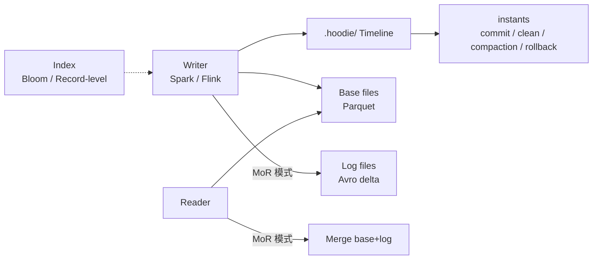

# Apache Hudi

!!! tip "一句话定位"
    湖表格式的**最早登场者**（2017 Uber 开源）。核心差异化：**CoW / MoR 双表类型** + **Timeline 事件模型** + **原生 Incremental Query**。Spark 生态最深、流式 upsert 历史最长。**2024-2025 年在多引擎 / 新场景上被 Iceberg 和 Paimon 超越，但在 Spark 栈 + 主键 upsert 场景仍有价值**。

!!! warning "1.0.x 升级风险 · 必读"
    - **1.0.1 ComplexKeyGenerator regression**：单字段 record key + 多字段 partition 的配置存在 regression · 已用此配置的存量表**避免升 1.0.1**
    - **1.0.2 Flink auto-upgrade**：Flink writer + 表自动 upgrade 写入旧表（`hoodie.write.table.version=6`）有已知 issue（GH #13753）
    - **存量升级原则**：先在测试表验证 KeyGenerator 配置兼容 · 再灰度生产表 · 0.x → 1.0 必须跨 minor 验证

!!! abstract "TL;DR"
    - **两种表类型**：CoW（读快写慢）· MoR（写快读合并）
    - **三种查询**：Snapshot / Read-Optimized / **Incremental**（Hudi 特色）
    - **Timeline 为中心**：commit / clean / compaction / rollback 事件流
    - **索引丰富**：Bloom / Record-level / HBase-backed
    - **选型辩证**：Spark 批 + 主键 upsert 重 → 看 Hudi；多引擎 / Flink 流 → Iceberg 或 Paimon
    - **生态相对单一**：对比 Iceberg 多引擎，Hudi 在 Trino / Flink 支持不完整

## 1. 业务痛点 · Hudi 的历史意义

Uber 2016 年面对：
- **MySQL CDC 入湖** 每小时一批、业务等不起
- **订单状态更新** 需要实时 upsert
- **下游想知道"哪些行变了"** 用于增量处理

Hudi 的贡献：
- **把 upsert 语义带到 HDFS**（2016 年之前湖表只能 append）
- **增量查询**（"自上次 commit 后新增了什么"）
- **Bloom Filter + Partition pruning** 加速主键定位

**历史价值**：
- 证明了湖表可以做 ACID + upsert
- 启发了后来的 Iceberg / Delta / Paimon
- 在 Uber 自家是**主力湖表**至今

## 2. 架构深挖



### Timeline · Hudi 的心脏

Hudi 把所有表状态变化记录在 `.hoodie/` 下：

```
.hoodie/
  20240101000000.commit          ← 提交事件
  20240101010000.clean            ← 清理事件
  20240101020000.compaction       ← 合并事件
  20240101030000.rollback         ← 回滚事件
  ...
```

每个 instant 有 `requested / inflight / completed` 三态。通过**回放 timeline**得到当前表状态。

### CoW vs MoR（核心选型）

| | Copy-on-Write | Merge-on-Read |
|---|---|---|
| 写 | 重写整个 data file | 追加 delta log（Avro） |
| 读 | 直接读 Parquet | 读 Parquet + Merge log |
| 写放大 | 大 | 小 |
| 读延迟 | 低 | 高（除非走 Read-Optimized 查询） |
| 适合 | 批写、读 QPS 高 | 高频流写、读可接受合并 |

### 三种查询类型（Hudi 特色）

| 查询类型 | 语义 | 用例 |
|---|---|---|
| **Snapshot** | 读当前最新视图 | 常规 OLAP 查询 |
| **Read-Optimized** | MoR 表只读 Parquet 不合并 log | 快速但数据略旧 |
| **Incremental** | "两次 commit 之间新增 / 变更的行" | CDC 下游消费、增量 ETL |

**Incremental Query 是 Hudi 早期差异化的杀手锏**——下游作业只消费增量不用全扫。

### Metadata Table · Hudi 1.0 的主元数据载体

Hudi 1.0 把几乎所有**元数据 + 索引**都收敛到 **Metadata Table**（`.hoodie/metadata/`）——这是 Hudi 在"Manifest/Metadata"这条演进路线上的终局。Metadata Table 本身是一张 **Hudi MoR 内部表**，不同索引作为**不同 partition**存在：

```
.hoodie/metadata/  （Hudi MoR 子表）
  partition=files              ← 分区 → 文件清单（消除 S3 LIST）
  partition=column_stats       ← 每列 min/max/null_count
  partition=bloom_filters      ← per-file Bloom
  partition=partition_stats    ← 分区聚合统计
  partition=record_index       ← 主键 → file group 直查（1.0 GA）
  partition=secondary_index    ← 非主键列索引（1.0+）
  partition=expr_index         ← 表达式索引（1.0+）
```

**和 Iceberg Manifest 的本质差异**：

| 维度 | Iceberg Manifest | Hudi Metadata Table |
|---|---|---|
| 存储形式 | Avro 文件（Manifest List → Manifest → Data） | **Hudi 自表**（MoR 模式） |
| 更新方式 | 每次 commit 写新 Manifest | 作为 Hudi 表**随主表一起提交** |
| 查询代价 | 读 Avro + min/max 剪枝 | 读子表，走 HFile 索引 |
| 事务性 | 和主表一致（同一 metadata.json 指针）| 和主表 1:1 绑定（instant 同步）|

换句话说：**Hudi 把元数据本身做成了一张 Hudi 表**——元数据的管理直接复用表格式能力。这比 Iceberg 的纯 Avro 文件更灵活（可 MoR / 有索引），但也更重。

### 七类索引 · 承载在 Metadata Table 上

| Metadata Table 索引 | 机制 | 用途 |
|---|---|---|
| **Files** | 每分区的 file list | 消除 S3 LIST |
| **Column Stats** | 列级 min/max/null_count | File pruning |
| **Bloom Filter** | per-file Bloom | 主键点查 |
| **Partition Stats** | 分区级聚合统计 | 分区剪枝 |
| **Record-level Index**（RLI，0.14+ 引入 / 1.0 成熟） | 主键 → file group 映射 | **大表主键 upsert 首选** |
| **Secondary Index**（1.0+） | 非主键列索引 | 非 PK 字段查询加速 |
| **Expression Index**（1.0+） | 函数表达式索引（如 `year(ts)`） | 派生字段查询加速 |

此外还有历史外部索引（写表配置，不在 Metadata Table 里）：**HBase Index**（外部 HBase）、**Simple Index**（小表直接扫）。新项目优先用 Metadata Table 内置索引。

## 3. 关键机制

### 机制 1 · 写入路径（CoW）

```
1. Writer 收到一批 records
2. 查索引，定位每 record 对应哪个 file group（旧）
3. 读旧 file → merge 新记录 → 写新 file
4. 更新 Timeline 新 commit
5. Cleaner 清理旧版本（按保留策略）
```

### 机制 2 · Compaction（MoR）

- MoR 写后：log 文件堆积
- 定期（或自动）Compaction 把 log 合并到 base parquet
- 独立作业或 inline（随写执行）

### 机制 3 · Multi-Writer

Hudi 支持多 writer 并发（加锁）：
- **Zookeeper** 或 **HiveMetastore** 或 **DynamoDB** 做 lock provider
- 乐观锁策略

相比 **Iceberg 的 CAS 语义**，Hudi 的锁**需要外部依赖**——这是运维负担。Hudi 1.0 起提供 **Non-Blocking Concurrency Control (NBCC)** + 基于文件系统的 lock provider，**降低外部依赖**（仍推荐在高并发场景用 ZK / DynamoDB）。

### 机制 4 · Clustering

把小文件合并 + 重新排序（类似 Z-order）：

```sql
CALL run_clustering(table => 'hudi_db.orders');
```

## 4. 工程细节

### 关键配置

| 参数 | 含义 | 建议 |
|---|---|---|
| `hoodie.datasource.write.table.type` | CoW / MoR | CDC 场景 MoR |
| `hoodie.index.type` | 索引类型 | RECORD_INDEX（1.0+） |
| `hoodie.cleaner.policy` | 清理策略 | `KEEP_LATEST_COMMITS` |
| `hoodie.cleaner.commits.retained` | 保留几个 commit | 10-50 |
| `hoodie.compact.inline` | 同步 compact | 流场景 false |
| `hoodie.write.lock.provider` | 多 writer 锁 | ZK / DynamoDB |

### 运维命令

```sql
-- Spark SQL
CALL run_compaction(op => 'run', table => 'hudi_db.orders');
CALL run_clustering(op => 'run', table => 'hudi_db.orders');
CALL run_clean(table => 'hudi_db.orders');
```

## 5. 性能数字

基于 Uber 公开数据点：

| 操作 | 规模 | 典型 |
|---|---|---|
| CoW 写入吞吐 | 单 Spark 作业 | 50-200 MB/s |
| MoR 写入吞吐 | 单作业 | 200-500 MB/s |
| Bloom Index 主键查找 | 10 亿主键 | 分钟级完成批 upsert |
| Record-level Index | 同上 | 数倍提升 |
| 增量查询 | - | 秒级（取决于两 commit 间数据量） |
| 表规模 | Uber 生产 | PB 级 |

## 6. 代码示例

### Spark 写入

```python
df.write.format("hudi") \
    .option("hoodie.table.name", "orders") \
    .option("hoodie.datasource.write.recordkey.field", "order_id") \
    .option("hoodie.datasource.write.precombine.field", "update_ts") \
    .option("hoodie.datasource.write.table.type", "MERGE_ON_READ") \
    .mode("append") \
    .save("s3://lake/hudi/orders")
```

### Incremental Query

```python
incremental = spark.read.format("hudi") \
    .option("hoodie.datasource.query.type", "incremental") \
    .option("hoodie.datasource.read.begin.instanttime", "20240101") \
    .load("s3://lake/hudi/orders")
```

### Flink SQL

```sql
CREATE TABLE hudi_orders (
  order_id BIGINT, status STRING, ts TIMESTAMP,
  PRIMARY KEY (order_id) NOT ENFORCED
) WITH (
  'connector' = 'hudi',
  'path' = 's3://lake/hudi/orders',
  'table.type' = 'MERGE_ON_READ',
  'write.tasks' = '4'
);
```

## 7. 现实检视 · Hudi 的当前定位（2026）

### 仍有价值的场景

- **Uber / 字节内部**主力湖表（历史投入大）
- **Spark + 主键 upsert 重**的场景
- **Incremental Query** 对下游 CDC 消费很友好

### 被超越的场景

- **Multi-engine 场景**：Iceberg 在 Trino / Flink / DuckDB / Snowflake 支持都更完整
- **Flink 流处理**：Paimon 原生为 Flink 设计，体验更好
- **新项目起步**：Iceberg 生态 + Paimon 流一体是更主流选择

### 社区活跃度

- Hudi 社区仍活跃，2024 发布 1.0
- 但**Iceberg / Paimon 的 PR 增速更快**
- Onehouse（商业化）是 Hudi 主推动方

### 团队决策

**选 Hudi 的典型理由**：
- 已经在 Hudi 上有生产系统
- Uber 等公司的实际参考案例
- Spark + 主键场景的最成熟方案之一

**不选 Hudi 的典型理由**：
- 团队多引擎（需要 Trino / Presto 深度集成）
- 新起步项目（Iceberg 生态更广）
- 流场景为主（Paimon 更原生）

## 8. 陷阱与反模式

- **CoW 用于高频 upsert**：写放大爆炸 → 应该 MoR
- **MoR 不跑 Compaction**：log 堆积 → 读极慢
- **多 Writer 无锁**：数据损坏
- **索引选型错**：大表用 Bloom Filter 主键集中 → 性能崩
- **Timeline 不 Clean**：文件无限增长
- **和 Iceberg 混用**：同一业务两套格式 → 运维灾难

## 9. 横向对比 · 延伸阅读

- [Iceberg vs Paimon vs Hudi vs Delta](../compare/iceberg-vs-paimon-vs-hudi-vs-delta.md) —— 四表格式选型
- [Paimon](paimon.md) —— 流场景竞争者
- [Iceberg](iceberg.md) —— 多引擎竞争者

### 权威阅读

- **[Hudi 官方文档](https://hudi.apache.org/)**
- **[*Hoodie: Incremental Processing on Hadoop*（Uber 原始博客, 2017）](https://www.uber.com/blog/hoodie/)**
- **[Onehouse 技术博客](https://www.onehouse.ai/blog)** —— Hudi 商业化主要推动方
- **[案例 · Uber 数据平台](../unified/case-uber.md)** —— Hudi 最大生产验证

## 相关

- [湖表](lake-table.md) · [Iceberg](iceberg.md) · [Paimon](paimon.md) · [Delta Lake](delta-lake.md)
- [案例 · Uber](../unified/case-uber.md)
