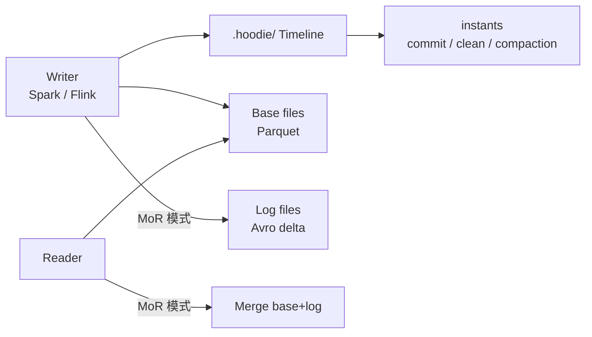

# Apache Hudi

!!! tip "一句话定位"
    湖表格式的"早期选手"，把**流式 upsert** 在湖上做通的先驱。核心差异化是**CoW / MoR 两种表类型** 和**Timeline 事件模型**。

## 它解决什么

Hudi 最早面对的问题和 Paimon 类似 —— **CDC 持续入湖，湖上需要准实时 upsert**。Hudi 给出的答案是两种表：

- **CoW（Copy-on-Write）** —— 每次写入重写包含受影响 key 的整个数据文件。读性能好（无合并），写放大大
- **MoR（Merge-on-Read）** —— 写 delta log（Avro），读时合并。写快读慢，适合高吞吐写入场景

## 架构一览

**Timeline** 是 Hudi 的心脏：`commit` / `clean` / `compaction` / `rollback` 等事件按时间线排列，所有表状态由时间线回放决定。

## 关键能力

- **两种表类型** CoW / MoR 可按工作负载选
- **三种查询类型**：Snapshot / Read-Optimized / Incremental（增量查询是 Hudi 特色）
- **多种索引**：Bloom / Simple / HBase / Record-level
- **Clustering / Compaction** 作为一等公民
- **多 writer 支持**：需要外部 lock provider（Zookeeper / Hive Metastore / DynamoDB）

## 和邻居对比

- 对比 **Iceberg** —— Hudi 流式 upsert 原生、增量查询语义更强；Iceberg 批分析 + 多引擎兼容更好
- 对比 **Paimon** —— 定位最相近；Paimon 更 Flink 中心，Hudi 更 Spark 中心
- 对比 **Delta** —— Delta 和 Spark 绑定更深

见对比页 [Iceberg vs Paimon vs Hudi vs Delta](../compare/iceberg-vs-paimon-vs-hudi-vs-delta.md)。

## 陷阱与坑

- **多 writer 配置复杂**：不同 lock provider 有坑，社区推荐 DynamoDB / ZK
- **文件索引选型**：大表用 Bloom 常常不够，Record-level Index 配置复杂度高
- **MoR 合并**：compaction 跟不上时读延迟飙升

## 延伸阅读

- Hudi docs: <https://hudi.apache.org/>
- *Hoodie: Incremental Processing on Hadoop*（Uber 原始博客）
