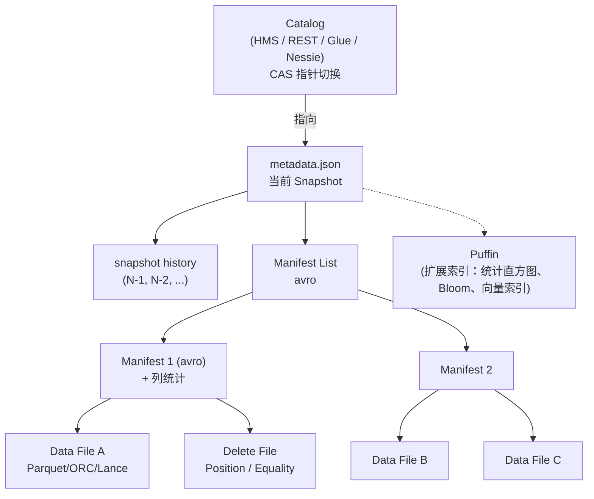

# Apache Iceberg

!!! tip "一句话定位"
    **最完整、最"协议化"的开源湖表格式**。定义了一套与引擎无关的表规范，让 Spark / Flink / Trino / DuckDB / StarRocks / 商业引擎都按同一本 spec 读写同一张表。**它的核心不是"一个系统"，而是"一本 spec"**。

!!! abstract "TL;DR"
    - 三层元数据：`metadata.json` → `Manifest List` → `Manifest` → Data / Delete File
    - 写入**不会**修改历史：全 snapshot 化、Time Travel 免费
    - 提交靠 **Catalog 的 CAS** 或 **S3 Conditional PUT**（v2 spec 原生支持）
    - **列 ID 机制**让 schema 演化不破历史
    - **Hidden Partitioning**：表不暴露分区列，SQL 自动利用分区裁剪
    - **Puffin 扩展索引**：未来放向量索引 / bloom / theta sketch
    - **REST Catalog**：协议化的 catalog 接入，解耦引擎与元数据实现

## 1. 它解决什么 · 没有 Iceberg 的世界

在 Iceberg 出现前（Hive 时代），"一张表"约等于"一个目录 + HMS 里一条记录"。业界日常面对的是：

| 问题 | 典型代价 |
|---|---|
| `LIST` 开销随分区数线性增长 | 10 万分区扫描要 30-90s |
| Schema 演化靠用户自觉（改列名破数据） | 某公司 2019：改列名后历史数据全错位，3 天恢复 |
| 没有 Snapshot = 没有 Time Travel | 回滚只能从冷备份捞，RTO 小时级 |
| 原子提交靠不住（HDFS rename / S3 fake rename） | 并发写脏读成常态 |
| HMS 是单点瓶颈 | 百万分区时 HMS 拖垮整个 ETL 栈 |
| 多引擎读写不一致 | Spark 写 / Hive 读 = 半生不熟的一堆 bug |

Netflix 主导的 Iceberg 就是对这些痛点的**协议化重写**。核心突破：

> **把"表是什么"从 Hive 的"目录 + HMS 两个不可靠的真相源"变成"一个 metadata.json 指针 + 元数据文件树的单一协议"**。

## 2. 架构深挖



### 每一层的职责

| 层 | 文件 | 职责 |
|---|---|---|
| **Catalog** | 外部（HMS / REST / Glue / Nessie / Polaris） | 维护"表 → 当前 metadata.json"的指针，**唯一需要 CAS 的地方** |
| **Metadata** | `v<N>.metadata.json` | 表的**规格书**：schema、partition spec、sort order、所有历史 snapshot |
| **Manifest List** | `snap-<id>-<hash>.avro` | 索引 manifest，**一级目录** |
| **Manifest** | `<hash>.avro` | 记录一批数据文件的路径、分区值、**列级统计**（min/max/null_count/nan_count/counts） |
| **Data File** | Parquet / ORC / Lance | 真实列式数据 |
| **Delete File** | Parquet | MoR 模式的行级删除 |
| **Puffin** | 可选扩展文件 | 放 sketch / bloom / 未来的向量索引 |

### 提交流程（spec v2）

```mermaid
sequenceDiagram
  participant W as 写入方
  participant C as Catalog
  participant S as Object Store
  W->>S: 1. 写 Data File (新 Parquet)
  W->>S: 2. 写 Manifest (avro)
  W->>S: 3. 写 Manifest List (avro)
  W->>S: 4. 写 metadata.json (新 Snapshot)
  W->>C: 5. CAS: set table pointer to v<N+1>
  alt CAS 成功
    C-->>W: OK
  else CAS 失败 (并发冲突)
    C-->>W: Reject; W 重试 (或 abort)
  end
```

关键：**写入所有新文件都是幂等追加**，提交只在**最后一步 CAS**。失败可以直接重试、旧文件作为垃圾由 `expire_snapshots` 清理。

### Snapshot Ancestry

每个 Snapshot 记录 `parent_id`。形成一棵**祖先树**：

- 线性主干：常规追加
- 回滚：指针切回旧 Snapshot（树的旧分支）
- 分支 / 标签（v2+）：打 tag 或 branch，支持 Git-like 工作流

## 3. 关键机制

### 机制 1 · Schema Evolution（列 ID）

| 操作 | 做法 | 代价 |
|---|---|---|
| 加列 | metadata 加 ID | 0 数据重写 |
| 删列 | metadata 标记 deleted | 0 |
| 改名 | metadata 改 name, ID 不变 | 0 |
| 扩展类型（int → long） | metadata 改 type | 0 |
| 缩窄类型 | ❌ 不允许 | — |

**反例**：直接 `ALTER TABLE ... RENAME COLUMN` 在 Hive 时代意味着"老 Parquet 文件还是旧名字，查询对不上"。Iceberg 用列 ID 解决。

### 机制 2 · Partition Evolution

- 旧数据按旧分区写；新数据按新分区写
- 查询会**分别按各自分区裁剪**
- 真正强的地方：**不需要重写历史**

```sql
-- 旧表按 days(ts) 分区，新策略改成 hours(ts)
ALTER TABLE sales REPLACE PARTITION FIELD days(ts) WITH hours(ts);
```

### 机制 3 · Row-Level Delete（v2 引入）

两种 Delete File：

| 类型 | 内容 | 场景 |
|---|---|---|
| **Position Delete** | `(file_path, row_position)` | GDPR 删除、精确删几行 |
| **Equality Delete** | `WHERE key = V` 条件 | CDC / upsert |

读时合并（MoR）：数据文件行 − Delete File 指向的行 = 当前有效行。

### 机制 4 · Hidden Partitioning

传统 Hive：`PARTITIONED BY (dt)`，查询要写 `WHERE dt = '2024-01-01'` 才能利用。

Iceberg：`PARTITIONED BY (days(ts))`——**表不暴露 dt 列**，查询写 `WHERE ts >= '2024-01-01'` 引擎自动走分区。

好处：
- SQL 对**业务**友好（没有人造列）
- 演化分区策略不破 SQL 兼容

### 机制 5 · Puffin 索引

Puffin 是 Iceberg 独立的**辅助索引文件格式**（二进制）。当前放：
- Apache DataSketches（Theta / HLL 精确去重）
- 位图索引
- 统计直方图

未来：**向量索引**（Iceberg + Lance / 自研）是一体化架构的重要选项。

## 4. 工程细节

### 关键配置

| 参数 | 默认 | 建议 | 说明 |
|---|---|---|---|
| `write.target-file-size-bytes` | 512MB | 256-512MB | 单数据文件目标大小 |
| `write.delete.mode` | `copy-on-write` | 流场景 `merge-on-read` | MoR 写快读合并 |
| `write.parquet.compression-codec` | gzip | `zstd` | 压缩率好 + 快 |
| `format-version` | 2 | 2 | v1 别用了 |
| `history.expire.min-snapshots-to-keep` | 1 | 100+ | 保留历史数 |
| `history.expire.max-snapshot-age-ms` | 5 天 | 7-30 天 | 过期时间 |

### 运维命令

```sql
-- 合并小文件（日常必跑）
CALL system.rewrite_data_files('db.sales');

-- 清理过期快照（metadata 膨胀时跑）
CALL system.expire_snapshots('db.sales', TIMESTAMP '2024-01-01');

-- 合并 manifest（manifest 过多时跑）
CALL system.rewrite_manifests('db.sales');

-- 清理孤儿文件（写失败产生的垃圾）
CALL system.remove_orphan_files('db.sales');
```

### Catalog 选型

| Catalog | CAS 可靠性 | 生态 | 推荐场景 |
|---|---|---|---|
| **REST Catalog** | 强（协议标准） | 2024+ 成为事实标准 | 新建项目首选 |
| **Nessie** | 强 + Git-like 分支 | 开源，支持多引擎 | 要做数据分支实验时 |
| **HMS** | 中 | 兼容老系统 | 已有 Hive 栈迁移 |
| **AWS Glue** | 强 | AWS 绑定 | 纯 AWS 栈 |
| **Hadoop / File-based** | 弱（S3 Conditional PUT 可以救） | — | 测试 / POC |
| **Unity / Polaris** | 强 | 商业 / 新晋 | 特定生态 |

详见 [Catalog 全景对比](../compare/catalog-landscape.md)。

## 5. 性能数字

| 场景 | 规模 | 基线 |
|---|---|---|
| Planning（百万文件） | 10M data files | Iceberg ~数百 ms vs Hive LIST 数分钟 |
| 提交延迟 | 单次 CAS | 50-500ms |
| 写吞吐（Spark 批）| 集群 | GB/s 级 |
| 扫描吞吐（Parquet）| 单 executor | 100+ MB/s |
| metadata.json 大小 | 10k snapshots | 几 MB（需 expire） |
| 单表规模 | PB 级 | Netflix 某表 > 10 PB |

**Netflix 数据点**（引自 [Netflix Tech Blog · 2022](https://netflixtechblog.com/incremental-processing-using-netflix-maestro-and-apache-iceberg-b8ba072ddeeb) 及 Iceberg Summit 2022 演讲，**2024+ 实际规模未公开更新**）：
- 全司 Iceberg 表 > 10 万张
- 最大表 PB 级、数十亿 data files
- Planning 从 Hive 的分钟级降到 Iceberg 的秒级

## 6. 代码示例

### 建表 + 写入（PySpark + Iceberg）

```python
spark.sql("""
CREATE TABLE iceberg.db.events (
  event_id BIGINT,
  user_id  BIGINT,
  event    STRING,
  ts       TIMESTAMP
) USING iceberg
PARTITIONED BY (days(ts))
TBLPROPERTIES (
  'write.target-file-size-bytes' = '268435456',
  'format-version' = '2'
)
""")

df.writeTo("iceberg.db.events").append()
```

### REST Catalog 连接（Python pyiceberg）

```python
from pyiceberg.catalog.rest import RestCatalog
catalog = RestCatalog(
    "rest_catalog",
    uri="https://catalog.mycorp.internal",
    warehouse="s3://data-lake/warehouse",
    credential="client-id:client-secret",
)

table = catalog.load_table("db.events")
df = table.scan(row_filter="ts >= '2024-01-01'").to_pandas()
```

### 时间旅行 + 回滚

```sql
-- 按 snapshot_id
SELECT * FROM events VERSION AS OF 1234567890;

-- 按时间
SELECT * FROM events TIMESTAMP AS OF '2024-12-01 00:00:00';

-- 回滚（危险！）
CALL system.rollback_to_snapshot('db.events', 1234567890);
```

### Branch / Tag（v2+ 数据 Git-like）

```sql
-- 打标签
ALTER TABLE events CREATE TAG `release-2024-12-01` AS OF VERSION 1234;

-- 开发分支
ALTER TABLE events CREATE BRANCH `feature-xyz` AS OF VERSION 1234;

-- 分支上改完合并
CALL system.fast_forward('db.events', 'main', 'feature-xyz');
```

## 7. 陷阱与反模式

- **写入不配 compaction** → 小文件炸 → 查询崩 → 必须定时 `rewrite_data_files`
- **`expire_snapshots` 从不跑** → metadata.json 膨胀到几 MB → 每次查询加载慢
- **MoR 模式但不 compact delete files** → Delete File 堆积 → 查询合并慢
- **Catalog 混用**（部分 Spark 用 HMS、部分 Trino 用 Glue）→ 脏提交 / 找不到表
- **高基数分区**（`PARTITIONED BY (user_id)`）→ 百万分区 → 即使 Iceberg 也炸
- **版本 v1 依然在用** → 没 MoR、没 row-level delete → 升 v2
- **直接手改 Parquet 文件** → metadata 不一致 → 查询结果错
- **多 writer 无协调**（两个 Spark 都写 branch=main）→ 频繁 CAS 冲突 → 应该用**分区隔离**或 **Paimon changelog**

## 8. 横向对比 · 延伸阅读

- [Iceberg vs Paimon vs Hudi vs Delta](../compare/iceberg-vs-paimon-vs-hudi-vs-delta.md)
- [Puffin vs Lance](../compare/puffin-vs-lance.md) —— 向量下沉到湖的两条路
- [Catalog 全景对比](../compare/catalog-landscape.md)

### 权威阅读

**一手规范**

- **[Iceberg Table Spec (v2)](https://iceberg.apache.org/spec/)** —— 规范主页
- **[REST Catalog OpenAPI Spec](https://github.com/apache/iceberg/blob/main/open-api/rest-catalog-open-api.yaml)** —— 跨引擎互操作的接口真相
- **[Iceberg v3 spec（草案）](https://iceberg.apache.org/spec/#version-3)** —— Deletion Vectors / Variant / Row Lineage

**原始文献与演讲**

- **[*Apache Iceberg · An Architectural Look Under the Covers*（Ryan Blue, 2018 提案）](https://iceberg.apache.org/terms/)** —— 设计动机
- **[*Netflix · Incremental Processing with Maestro + Iceberg* (2022)](https://netflixtechblog.com/incremental-processing-using-netflix-maestro-and-apache-iceberg-b8ba072ddeeb)**
- **[Apple · Iceberg at Scale (Subsurface 2021)](https://www.dremio.com/resources/webinars/subsurface-live-summer-2021/)**

**工程博客 / 长期更新**

- [Netflix Iceberg 系列](https://netflixtechblog.com/tagged/iceberg)
- [Tabular 博客（Ryan Blue 团队）](https://www.tabular.io/blog/) · 2024 被 Databricks 收购
- [Dremio Subsurface · Iceberg Track](https://www.dremio.com/subsurface/)
- 《Data Engineering with Apache Iceberg》(O'Reilly · Tomer Shiran / Jason Hughes / Alex Merced, 2024)

## 相关

- [湖表](lake-table.md) · [Snapshot](snapshot.md) · [Manifest](manifest.md) · [Puffin](puffin.md)
- [对象存储](../foundations/object-storage.md) · [Catalog](../catalog/index.md)
- ADR：[选择 Iceberg 作为主表格式](../adr/0002-iceberg-as-primary-table-format.md)
