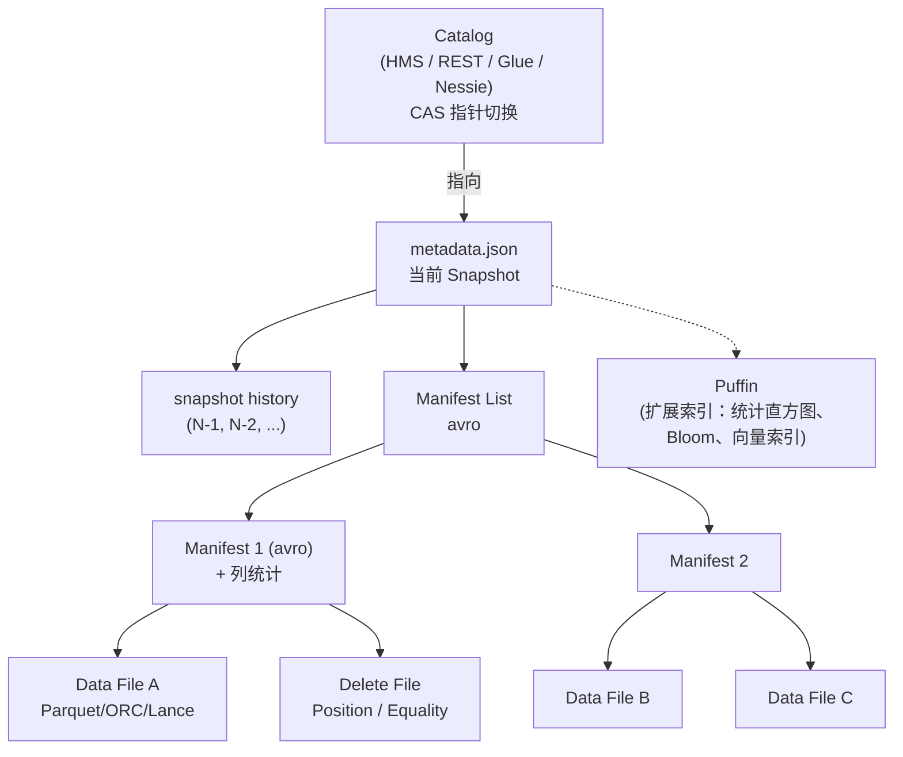

# Apache Iceberg

!!! tip "一句话定位"
    **最完整、最"协议化"的开源湖表格式**。定义了一套与引擎无关的表规范，让 Spark / Flink / Trino / DuckDB / StarRocks / 商业引擎都按同一本 spec 读写同一张表。**它的核心不是"一个系统"，而是"一本 spec"**。

!!! abstract "TL;DR"
    - 三层元数据：`metadata.json` → `Manifest List` → `Manifest` → Data / Delete File
    - 写入**不会**修改历史：全 snapshot 化、Time Travel 免费
    - 提交靠 **Catalog 的 CAS** 或 **S3 Conditional PUT**（catalog 实现层选择，spec 不标准化提交协议）
    - **列 ID 机制**让 schema 演化不破历史
    - **Hidden Partitioning**：表不暴露分区列，SQL 自动利用分区裁剪
    - **Puffin 扩展索引**：当前官方 blob 仅 `theta sketch` + `deletion-vector`（v3）；向量索引 / bloom 是社区 proposal
    - **REST Catalog**：协议化的 catalog 接入，解耦引擎与元数据实现

## 1. 它解决什么 · 没有 Iceberg 的世界

在 Iceberg 出现前（Hive 时代），"一张表"约等于"一个目录 + HMS 里一条记录"。业界日常面对的是：

| 问题 | 典型代价 |
|---|---|
| `LIST` 开销随分区数线性增长 | 10 万分区扫描要 30-90s |
| Schema 演化靠用户自觉（改列名破数据） | 某公司 2019：改列名后历史数据全错位，3 天恢复 |
| 没有 Snapshot = 没有 Time Travel | 回滚只能从冷备份捞，RTO 小时级 |
| 原子提交靠不住（HDFS rename / S3 fake rename） | 并发写脏读成常态 |
| HMS 是单点瓶颈 | 百万分区时 HMS 拖垮整个 ETL 栈 |
| 多引擎读写不一致 | Spark 写 / Hive 读 = 半生不熟的一堆 bug |

Netflix 主导的 Iceberg 就是对这些痛点的**协议化重写**。核心突破：

> **把"表是什么"从 Hive 的"目录 + HMS 两个不可靠的真相源"变成"一个 metadata.json 指针 + 元数据文件树的单一协议"**。

## 2. 架构深挖



### 每一层的职责

| 层 | 文件 | 职责 |
|---|---|---|
| **Catalog** | 外部（HMS / REST / Glue / Nessie / Polaris） | 维护"表 → 当前 metadata.json"的指针，**唯一需要 CAS 的地方** |
| **Metadata** | `v<N>.metadata.json` | 表的**规格书**：schema、partition spec、sort order、所有历史 snapshot |
| **Manifest List** | `snap-<id>-<hash>.avro` | 索引 manifest，**一级目录** |
| **Manifest** | `<hash>.avro` | 记录一批数据文件的路径、分区值、**列级统计**（min/max/null_count/nan_count/counts） |
| **Data File** | Parquet / ORC / Lance | 真实列式数据 |
| **Delete File** | Parquet | MoR 模式的行级删除 |
| **Puffin** | 可选扩展文件 | 放 sketch / bloom / 未来的向量索引 |

### 提交流程（spec v2）

```mermaid
sequenceDiagram
  participant W as 写入方
  participant C as Catalog
  participant S as Object Store
  W->>S: 1. 写 Data File (新 Parquet)
  W->>S: 2. 写 Manifest (avro)
  W->>S: 3. 写 Manifest List (avro)
  W->>S: 4. 写 metadata.json (新 Snapshot)
  W->>C: 5. CAS: set table pointer to v<N+1>
  alt CAS 成功
    C-->>W: OK
  else CAS 失败 (并发冲突)
    C-->>W: Reject; W 重试 (或 abort)
  end
```

关键：**写入所有新文件都是幂等追加**，提交只在**最后一步 CAS**。失败可以直接重试、旧文件作为垃圾由 `expire_snapshots` 清理。

### Snapshot Ancestry

每个 Snapshot 记录 `parent_id`。形成一棵**祖先树**：

- 线性主干：常规追加
- 回滚：指针切回旧 Snapshot（树的旧分支）
- 分支 / 标签（v2+）：打 tag 或 branch，支持 Git-like 工作流

## 3. 关键机制

### 机制 1 · Schema Evolution（列 ID）

| 操作 | 做法 | 代价 |
|---|---|---|
| 加列 | metadata 加 ID | 0 数据重写 |
| 删列 | metadata 标记 deleted | 0 |
| 改名 | metadata 改 name, ID 不变 | 0 |
| 扩展类型（int → long） | metadata 改 type | 0 |
| 缩窄类型 | ❌ 不允许 | — |

**反例**：直接 `ALTER TABLE ... RENAME COLUMN` 在 Hive 时代意味着"老 Parquet 文件还是旧名字，查询对不上"。Iceberg 用列 ID 解决。

### 机制 2 · Partition Evolution

- 旧数据按旧分区写；新数据按新分区写
- 查询会**分别按各自分区裁剪**
- 真正强的地方：**不需要重写历史**

```sql
-- 旧表按 days(ts) 分区，新策略改成 hours(ts)
ALTER TABLE sales REPLACE PARTITION FIELD days(ts) WITH hours(ts);
```

### 机制 3 · Row-Level Delete（v2 引入）

两种 Delete File：

| 类型 | 内容 | 场景 |
|---|---|---|
| **Position Delete** | `(file_path, row_position)` | GDPR 删除、精确删几行 |
| **Equality Delete** | `WHERE key = V` 条件 | CDC / upsert |

读时合并（MoR）：数据文件行 − Delete File 指向的行 = 当前有效行。

### 机制 4 · Hidden Partitioning

传统 Hive：`PARTITIONED BY (dt)`，查询要写 `WHERE dt = '2024-01-01'` 才能利用。

Iceberg：`PARTITIONED BY (days(ts))`——**表不暴露 dt 列**，查询写 `WHERE ts >= '2024-01-01'` 引擎自动走分区。

好处：
- SQL 对**业务**友好（没有人造列）
- 演化分区策略不破 SQL 兼容

### 机制 5 · Puffin 索引

Puffin 是 Iceberg 独立的**辅助索引文件格式**（二进制）。**官方 blob 类型目前只有两种**（按 [Puffin spec](https://iceberg.apache.org/puffin-spec/)）：
- `apache-datasketches-theta-v1` —— NDV 精确去重（Trino / Spark 已消费）
- `deletion-vector-v1` —— v3 引入的行级删除载体，取代 v2 的 position-delete file

**Bloom Filter / HNSW / 位图索引等是社区 proposal，尚未被 Puffin spec 接纳**。"湖上跑向量"的完整落地仍需等 blob type 标准化或走 Lance 那条路径。详见 [Puffin](puffin.md)。

### 机制 6 · v3 spec · 2025-06 ratified · 引擎侧 rolling out

v3 是 Iceberg 近几年最大一波能力补强。**spec 本身于 2025-06 正式 ratified**（Apache Iceberg project vote 通过）；引擎侧按"草案先行 · spec 定稿后稳定"的节奏 rolling out：

- Iceberg **1.8.0**（2025-02）**预览** Binary Deletion Vectors + Variant（基于 v3 草案 · spec 未最终定稿）
- **2025-06** · v3 spec 正式 ratified（关键分水岭）
- **1.9.0**（2025-04）扩展 Row Lineage + Default Values + Multi-arg Transforms（过渡期）
- **1.10.0**（2025-09）v3 定稿后首个稳定版本 · DV "ready for prime time"
- **Spark 4.0+** 是目前 V3 支持最完整的引擎；Trino / Flink / DuckDB 仍在追赶

!!! warning "timeline 理解"
    1.8.0 的 "引入" 是基于 **v3 草案** · 定稿前可能有 spec 变动。生产环境**优先用 1.10.0+**（v3 定稿后的版本）· 避免踩 spec 变更坑。

| 新能力 | 说明 |
|---|---|
| **Binary Deletion Vectors** | 以 Puffin blob 形式取代 v2 的 position-delete file，读更快 |
| **Row Lineage** | Manifest 引入 `first-row-id` · `last-updated-sequence-number`，行级血缘可追溯 |
| **Variant 类型** | 半结构化 JSON 的高性能存储（借鉴 Spark Variant） |
| **Geometry / Geography** | GeoParquet 对齐，地理空间类型原生支持 |
| **Nanosecond Timestamp(tz)** | 纳秒精度时间戳 |
| **Default Values** | 加列时指定默认值，旧行不读 null |
| **Multi-arg Partition Transforms** | 组合转换（如 `bucket(N, truncate(col))`）|
| **Encryption Keys** | 表级密钥元数据，为端到端加密铺路 |

**选型指引**：新项目可直接上 v3（Spark 4.0+ 栈尤其推荐 · Iceberg 1.10.0+ 是 spec 定稿后的首个稳定版本）；混合引擎环境先确认**消费侧 reader 都已升级**——老 reader 读 v3 表会失败。v2 / v3 长期共存（2025-2027）是现实 · 不是短期过渡。v3 的生态成熟度/跨厂商采用趋势见 [frontier/Iceberg v3 预览](../frontier/iceberg-v3-preview.md)。

### 机制 7 · View Spec · 跨引擎共享视图（2023 spec v1）

**Iceberg View Spec 1.0**（2023 正式发布、2024 广泛实现）把 View 从"每个引擎自家概念"变成**跨引擎共享**的对象：

```json
{
  "view-uuid": "...",
  "format-version": 1,
  "current-version-id": 2,
  "versions": [
    {
      "version-id": 2,
      "representations": [
        { "type": "sql", "sql": "SELECT ...", "dialect": "spark" },
        { "type": "sql", "sql": "SELECT ...", "dialect": "trino" }
      ],
      "schema-id": 0,
      "default-namespace": ["db"]
    }
  ],
  "schemas": [...]
}
```

**关键特性**：

- **多方言表示**：同一 View 可存多套 SQL（Spark / Trino / Flink 方言），读者选自己会的
- **版本化**：View 也有 snapshot history，可回滚/审计 View 定义变更
- **Schema 独立演化**：View 的 schema 和底层表独立版本化
- **REST Catalog 协议原生支持**：`GET /v1/views/...`

**2026 状态**：Spark 3.5+ / Trino / Snowflake / Dremio 都已读写；**它把"业务语义层"变成了和表同级别的一等元数据对象**——这是 BI 语义层（dbt、Cube、Malloy）上湖的关键协议支撑。

### 机制 8 · Materialized View · 主要是 connector 层能力（非 spec 标准化）

**重要区分**：

- **Iceberg spec 本身 · 截至 2026-Q2 没有 MV spec**（社区有讨论但未形成标准）
- **Trino Iceberg connector** 有较成熟的 MV 管理能力（397+ 逐步完善、479 加 `GRACE PERIOD`）——但这是**引擎层功能**
- **跨引擎一致性**：Trino 建的 MV 被 Spark / Flink 读取时"就是一张 Iceberg 表"，但 freshness 判定与刷新语义**不自动共享**

核心思路（按 Trino 实现）：

- MV = **一个 view 定义**（Iceberg View Spec） + **一张 storage table**（普通 Iceberg 表）+ **freshness 元数据**
- `REFRESH MATERIALIZED VIEW` 触发时对比源表 snapshot id，**增量或全量重算**
- 查询 MV 时 connector 判 stale，超过 `GRACE PERIOD` 可 fallback 到源表执行

**相比 Paimon / Delta**：
- Paimon `aggregation` merge engine 做"类 MV"，**天然基于流式 CDC**（更实时）
- Delta Materialized View 是 Databricks Runtime 能力（未进开源 protocol）
- Iceberg MV 的**跨引擎标准化**仍是**未完成事项**

**对 AI 场景启发**：MV 是**离线 ETL → 在线特征仓**这条路径的标准载体。Embedding 表 / 特征表做成 MV，订阅源表 snapshot，就是湖上 Feature Store 的雏形。

### 机制 9 · REST Catalog Scan Planning（spec 1.5+）

**传统 Iceberg 读**：引擎自己读 metadata.json → manifest list → manifest → 生成 split 计划。**客户端要下载大量 Avro**。

**Scan Planning endpoint**（REST Catalog spec 1.5+ 引入）：

```
POST /v1/{prefix}/namespaces/{ns}/tables/{table}/plan
  body: { snapshot-id, filter, case-sensitive }
  response: { plan-tasks: [...] }  // 服务端已完成剪枝和 split
```

**意义**：

- **Client-server 架构**：metadata 可以不给客户端看（只给 split 计划）
- **服务端统一剪枝**：服务端可以用 Bloom / Index 等客户端没有的信息做更精准剪枝
- **协议化多租户**：SaaS 形态湖仓（Snowflake Iceberg / Databricks Managed）可以只暴露 REST 接口
- **混合计划**：服务端给小表直接返回 inline data，大表返回 split

这是 Iceberg 从"纯存储格式"演进到"存算分离协议"的关键一步。

### 机制 10 · Managed Iceberg Tables · Catalog-as-a-Service

2024-2025 多家云厂把 Iceberg 包成**托管产品**：

| 产品 | 方式 | 2026 状态 |
|---|---|---|
| **Snowflake Managed Iceberg Tables** | Snowflake 既是 Catalog 又是主写 | GA |
| **AWS S3 Tables** (2024-12) | S3 原生 Iceberg 托管（内置维护）| GA |
| **Google BigQuery Iceberg** | BigQuery 作为读者 + 写者 | GA |
| **Databricks Managed Iceberg** (Uniform + Unity) | Delta 主写 + Iceberg 读 | GA |
| **Apache Polaris** (原 Snowflake Polaris) | 中立开源 REST Catalog | 2024-07 开源，孵化中 |

**关键观察**：**Iceberg 从"表格式"进化为"云厂商的统一 Catalog 协议"**。选 Iceberg 越来越像选 "HTTP"——它不是最好，而是所有人都支持。Catalog 端细节见 [catalog/Apache Polaris](../catalog/polaris.md) · [catalog/Unity Catalog](../catalog/unity-catalog.md) · [catalog/Iceberg REST Catalog](../catalog/iceberg-rest-catalog.md)。

### 机制 11 · Encryption · 表级加密（v3）

v3 spec 为**端到端加密**铺路：

- **Envelope encryption**：表级 DEK（data encryption key）+ 外部 KMS 管理 KEK（key encryption key）
- **Parquet Modular Encryption** 对齐：列级加密 + per-file DEK
- **Manifest 里记录** per-file 的加密 metadata
- **RBAC 分层**：部分列只给部分 role（和 Column Masking 衔接）

**2026 状态**：spec 定义好，主流引擎正在实现；金融/合规场景值得关注。

### 关键配置

| 参数 | 默认 | 建议 | 说明 |
|---|---|---|---|
| `write.target-file-size-bytes` | 512MB | 256-512MB | 单数据文件目标大小 |
| `write.delete.mode` | `copy-on-write` | 流场景 `merge-on-read` | MoR 写快读合并 |
| `write.parquet.compression-codec` | gzip | `zstd` | 压缩率好 + 快 |
| `format-version` | 2 | 2 | v1 别用了 |
| `history.expire.min-snapshots-to-keep` | 1 | 100+ | 保留历史数 |
| `history.expire.max-snapshot-age-ms` | 5 天 | 7-30 天 | 过期时间 |

### 运维命令

```sql
-- 合并小文件（日常必跑）
CALL system.rewrite_data_files('db.sales');

-- 清理过期快照（metadata 膨胀时跑）
CALL system.expire_snapshots('db.sales', TIMESTAMP '2024-01-01');

-- 合并 manifest（manifest 过多时跑）
CALL system.rewrite_manifests('db.sales');

-- 清理孤儿文件（写失败产生的垃圾）
CALL system.remove_orphan_files('db.sales');
```

### Catalog 选型

| Catalog | CAS 可靠性 | 生态 | 推荐场景 |
|---|---|---|---|
| **REST Catalog** | 强（协议标准） | 2024+ 成为事实标准 | 新建项目首选 |
| **Nessie** | 强 + Git-like 分支 | 开源，支持多引擎 | 要做数据分支实验时 |
| **HMS** | 中 | 兼容老系统 | 已有 Hive 栈迁移 |
| **AWS Glue** | 强 | AWS 绑定 | 纯 AWS 栈 |
| **Hadoop / File-based** | 弱（S3 Conditional PUT 可以救） | — | 测试 / POC |
| **Unity / Polaris** | 强 | 商业 / 新晋 | 特定生态 |

详见 [Catalog 全景对比](../compare/catalog-landscape.md)。

## 5. 性能数字

| 场景 | 规模 | 基线 |
|---|---|---|
| Planning（百万文件） | 10M data files | Iceberg ~数百 ms vs Hive LIST 数分钟 |
| 提交延迟 | 单次 CAS | 50-500ms |
| 写吞吐（Spark 批）| 集群 | GB/s 级 |
| 扫描吞吐（Parquet）| 单 executor | 100+ MB/s |
| metadata.json 大小 | 10k snapshots | 几 MB（需 expire） |
| 单表规模 | PB 级 | Netflix 某表 > 10 PB |

**Netflix 数据点**（引自 [Netflix Tech Blog · 2022](https://netflixtechblog.com/incremental-processing-using-netflix-maestro-and-apache-iceberg-b8ba072ddeeb) 及 Iceberg Summit 2022 演讲，**2024+ 实际规模未公开更新**）：
- 全司 Iceberg 表 > 10 万张
- 最大表 PB 级、数十亿 data files
- Planning 从 Hive 的分钟级降到 Iceberg 的秒级

## 6. 代码示例

### 建表 + 写入（PySpark + Iceberg）

```python
spark.sql("""
CREATE TABLE iceberg.db.events (
  event_id BIGINT,
  user_id  BIGINT,
  event    STRING,
  ts       TIMESTAMP
) USING iceberg
PARTITIONED BY (days(ts))
TBLPROPERTIES (
  'write.target-file-size-bytes' = '268435456',
  'format-version' = '2'
)
""")

df.writeTo("iceberg.db.events").append()
```

### REST Catalog 连接（Python pyiceberg）

```python
from pyiceberg.catalog.rest import RestCatalog
catalog = RestCatalog(
    "rest_catalog",
    uri="https://catalog.mycorp.internal",
    warehouse="s3://data-lake/warehouse",
    credential="client-id:client-secret",
)

table = catalog.load_table("db.events")
df = table.scan(row_filter="ts >= '2024-01-01'").to_pandas()
```

### 时间旅行 + 回滚

```sql
-- 按 snapshot_id
SELECT * FROM events VERSION AS OF 1234567890;

-- 按时间
SELECT * FROM events TIMESTAMP AS OF '2024-12-01 00:00:00';

-- 回滚（危险！）
CALL system.rollback_to_snapshot('db.events', 1234567890);
```

### Branch / Tag（v2+ 数据 Git-like）

```sql
-- 打标签
ALTER TABLE events CREATE TAG `release-2024-12-01` AS OF VERSION 1234;

-- 开发分支
ALTER TABLE events CREATE BRANCH `feature-xyz` AS OF VERSION 1234;

-- 分支上改完合并
CALL system.fast_forward('db.events', 'main', 'feature-xyz');
```

## 7. 陷阱与反模式

- **写入不配 compaction** → 小文件炸 → 查询崩 → 必须定时 `rewrite_data_files`
- **`expire_snapshots` 从不跑** → metadata.json 膨胀到几 MB → 每次查询加载慢
- **MoR 模式但不 compact delete files** → Delete File 堆积 → 查询合并慢
- **Catalog 混用**（部分 Spark 用 HMS、部分 Trino 用 Glue）→ 脏提交 / 找不到表
- **高基数分区**（`PARTITIONED BY (user_id)`）→ 百万分区 → 即使 Iceberg 也炸
- **版本 v1 依然在用** → 没 MoR、没 row-level delete → 升 v2
- **直接手改 Parquet 文件** → metadata 不一致 → 查询结果错
- **多 writer 无协调**（两个 Spark 都写 branch=main）→ 频繁 CAS 冲突 → 应该用**分区隔离**或 **Paimon changelog**

## 8. 横向对比 · 延伸阅读

- [Iceberg vs Paimon vs Hudi vs Delta](../compare/iceberg-vs-paimon-vs-hudi-vs-delta.md)
- [Puffin vs Lance](../compare/puffin-vs-lance.md) —— 向量下沉到湖的两条路
- [Catalog 全景对比](../compare/catalog-landscape.md)

### 权威阅读

**一手规范**

- **[Iceberg Table Spec (v2)](https://iceberg.apache.org/spec/)** —— 规范主页
- **[REST Catalog OpenAPI Spec](https://github.com/apache/iceberg/blob/main/open-api/rest-catalog-open-api.yaml)** —— 跨引擎互操作的接口真相
- **[Iceberg v3 spec（草案）](https://iceberg.apache.org/spec/#version-3)** —— Binary Deletion Vectors · Row Lineage · Variant · geometry / geography · nanosecond timestamp(tz) · default values · multi-arg partition transforms · encryption keys

**原始文献与演讲**

- **[*Apache Iceberg · An Architectural Look Under the Covers*（Ryan Blue, 2018 提案）](https://iceberg.apache.org/terms/)** —— 设计动机
- **[*Netflix · Incremental Processing with Maestro + Iceberg* (2022)](https://netflixtechblog.com/incremental-processing-using-netflix-maestro-and-apache-iceberg-b8ba072ddeeb)**
- **[Apple · Iceberg at Scale (Subsurface 2021)](https://www.dremio.com/resources/webinars/subsurface-live-summer-2021/)**

**工程博客 / 长期更新**

- [Netflix Iceberg 系列](https://netflixtechblog.com/tagged/iceberg)
- [Tabular 博客（Ryan Blue 团队）](https://www.tabular.io/blog/) · 2024 被 Databricks 收购
- [Dremio Subsurface · Iceberg Track](https://www.dremio.com/subsurface/)
- 《Data Engineering with Apache Iceberg》(O'Reilly · Tomer Shiran / Jason Hughes / Alex Merced, 2024)

## 相关

- [湖表](lake-table.md) · [Snapshot](snapshot.md) · [Manifest](manifest.md) · [Puffin](puffin.md)
- [对象存储](../foundations/object-storage.md) · [Catalog](../catalog/index.md)
- ADR：[选择 Iceberg 作为主表格式](../adr/0002-iceberg-as-primary-table-format.md)
