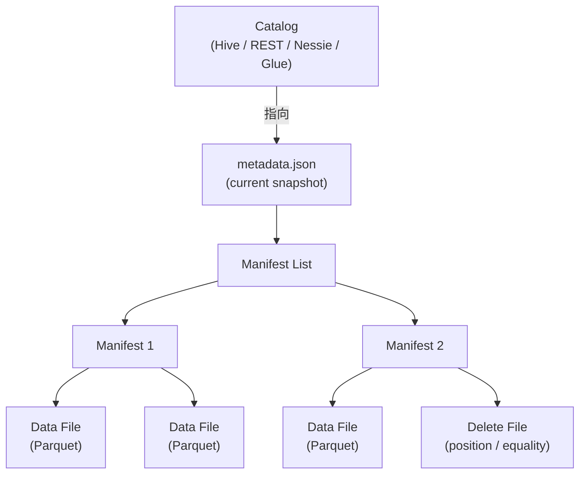

# Apache Iceberg

!!! tip "一句话定位"
    最完整、最"协议化"的开源湖表格式；定义了一套**与引擎无关**的表规范，让 Spark / Flink / Trino / DuckDB / StarRocks / 各家商业引擎都能按同一本 spec 读写同一张表。

## 它解决什么

在 Iceberg 出现之前，Hive 表的元数据"约等于目录"：分区 = 目录、表 = 一堆文件 + Hive Metastore 的一个条目。这带来一堆问题：

- `LIST` 开销随分区数线性增长
- Schema / Partition 演化靠用户自觉
- 没有 Snapshot，无法时间旅行
- 原子提交靠不住（HDFS rename 勉强，S3 更糟）

Iceberg 把"一张表是什么"彻底**协议化**，靠元数据文件代替目录扫描。

## 架构一览

- **Catalog** —— 维护"表 → current metadata.json"的指针，是唯一需要 CAS 的地方
- **metadata.json** —— 表的规格书：schema、partition spec、sort order、所有历史 snapshot
- **Manifest List** —— 索引 manifest 的"二级目录"
- **Manifest** —— 真正记录每个数据文件的位置和统计的文件
- **Data File + Delete File** —— 真实数据；delete file 支持 Merge-on-Read 的行级删除

## 关键模块

| 模块 | 职责 | 关键实现点 |
| --- | --- | --- |
| Schema Evolution | 加列 / 删列 / 改类型 / 重命名 | 列用 **ID** 而不是名字标识，重命名不破数据 |
| Partition Evolution | 改分区策略不改历史 | hidden partitioning —— 表不暴露分区列 |
| Row-level Delete | CoW / MoR 两种 | Position Delete（精确行）+ Equality Delete（按 key） |
| Puffin Index | 辅助索引文件 | 统计直方图、bloom filter、未来可放向量索引 |
| REST Catalog | 协议标准化 | 解耦引擎与元数据实现 |

## 和同类对比

对比见 [Iceberg vs Paimon vs Hudi vs Delta](../compare/index.md)（待补）。快结论：

- **对比 Delta** —— Iceberg 协议更中立、Catalog 生态更丰富；Delta 与 Spark 更紧耦合
- **对比 Hudi** —— Hudi 流式 upsert 更原生，Iceberg 在批分析 + 多引擎兼容更强
- **对比 Paimon** —— Paimon 天生流式 + LSM，Iceberg 偏批 + 明细

## 在我们场景里的用法

- 作为**统一事实表格式**的首选，承载 BI 负载（OLAP 明细）与 AI 训练数据准备
- 配合 Nessie / REST Catalog 提供 Git-like 分支能力
- 通过 Puffin 未来放向量索引，是 [一体化架构](../unified/index.md) 的候选路径

## 陷阱与坑

- **小文件爆炸** —— Streaming 写入必须配合定期 Compaction（`rewrite_data_files`）
- **元数据膨胀** —— 大表 snapshot 过多时 `metadata.json` 可达 MB 级，读取有成本；需要 `expire_snapshots`
- **Catalog 抉择** —— 不同 Catalog 对 CAS 语义的支持有差异，跨引擎写入务必选可靠 Catalog

## 延伸阅读

- Iceberg spec v2: <https://iceberg.apache.org/spec/>
- *Iceberg: A modern table format for big data* (Ryan Blue, 2018)
- Iceberg REST Catalog: <https://iceberg.apache.org/docs/latest/rest-catalog/>
